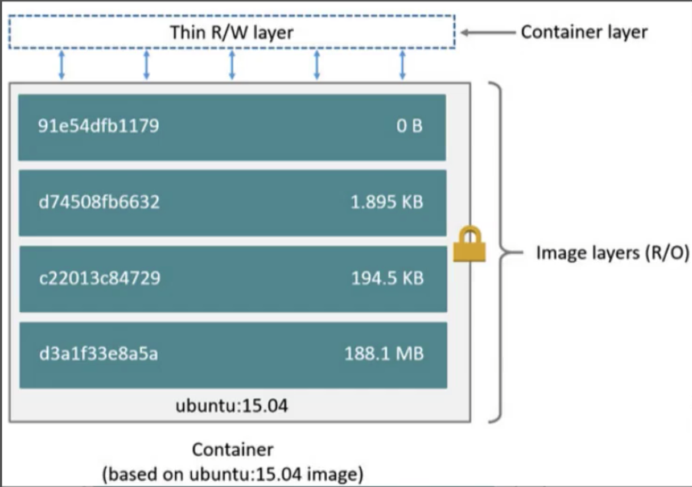

# Docker

### 1.Docker简介

**1）什么是Docker？**

Docker 是由 Go 语言开发的操作系统层层面的虚拟化技术。

Docker 对进程进行独立于宿主和其它进程的隔离，将其称为容器。并且在容器的基础上，进行了进一步的封装，从文件系统、网络互联到进程隔离等等，极大的简化了容器的创建和维护。

解决了软件的运行环境和配置的复杂操作。

**2）Docker的特点？**

- **轻量**：在一台机器上运行的多个 Docker 容器可以共享这台机器的操作系统内核；它们能够迅速启动，只需占用很少的计算和内存资源。镜像是通过文件系统层进行构造的，并共享一些公共文件。这样就能尽量降低磁盘用量，并能更快地下载镜像。
- **标准**：Docker 容器基于开放式标准，能够在所有主流 Linux 版本、Microsoft Windows 以及包括 VM、裸机服务器和云在内的任何基础设施上运行。
- **安全**：Docker 赋予应用的隔离性不仅限于彼此隔离，还独立于底层的基础设施。Docker 默认提供最强的隔离，因此应用出现问题，也只是单个容器的问题，而不会波及到整台机器。

**3）为什么要使用Docker？**

- **一致的运行环境**：Docker 的镜像提供了除内核外完整的运行时环境，确保了应用运行环境一致性，从而不会再出现 “这段代码在我机器上没问题啊” 这类问题。

- **更快速的启动时间**：可以做到秒级、甚至毫秒级的启动时间。大大的节约了开发、测试、部署的时间。

- **隔离性**：避免公用的服务器，资源会容易受到其他用户的影响。

- **弹性伸缩**，快速扩展：善于处理集中爆发的服务器使用压力；

- **迁移方便**：可以很轻易的将在一个平台上运行的应用，迁移到另一个平台上，而不用担心运行环境的变化导致应用无法正常运行的情况。

- **持续交付和部署**：使用 Docker 可以通过定制应用镜像来实现持续集成、持续交付、部署。

### 2.Docker  VS 传统虚拟化

简单来说： **容器和虚拟机具有相似的资源隔离和分配优势，但功能有所不同，因为容器虚拟化的是操作系统，而不是硬件，因此容器更容易移植，效率也更高。**

传统虚拟机技术是**虚拟出一套硬件后，在其上运行一个完整操作系统，在该系统上再运行所需应用进程**

而容器内的应用进程直接运行于宿主的内核，容器内没有自己的内核，而且也没有进行硬件虚拟。

因此容器要比传统虚拟机更为轻便.

- **容器是一个应用层抽象，用于将代码和依赖资源打包在一起。**多个容器可以在同一台机器上运行，共享操作系统内核，但各自作为独立的进程在用户空间中运行 。与虚拟机相比， **容器占用的空间较少**（容器镜像大小通常只有几十兆），**瞬间就能完成启动** 。
- **虚拟机 (VM) 是一个物理硬件层抽象，用于将一台服务器变成多台服务器。** 管理程序允许多个 VM 在一台机器上运行。每个VM都包含一整套操作系统、一个或多个应用、必要的二进制文件和库资源，因此 **占用大量空间** 。而且 VM **启动也十分缓慢** 。

**虚拟机更擅长于彻底隔离整个运行环境**。例如，云服务提供商通常采用虚拟机技术隔离不同的用户。

而 **Docker通常用于隔离不同的应用** ，例如前端，后端以及数据库。

### 3.Docker基本概念

Docker 主要的概念就是：**镜像、容器、仓库**。

Docker 使用客户端-服务器 (C/S) 架构模式，使用远程API来管理和创建Docker容器。

Docker 容器通过 Docker 镜像来创建。

**容器**与**镜像**的关系类似于面向对象编程中的**对象**与**类**。

Docker 的架构由 **Clients、Hosts、Registries** 三大部分组成。Docker 客户端通过命令行或者其他工具使用 Docker SDK 与 Docker 的守护进程通信；Host 是一个物理或者虚拟的机器用于执行 Docker 守护进程和容器；Docker 仓库用来保存镜像，可以理解为代码控制中的代码仓库。

**1）镜像**

Docker 镜像是一个特殊的**文件系统**，是一个**只读**的**多层文件系统**。除了提供容器运行时所需的程序、库、资源、配置等文件外，还包含了一些为运行时准备的一些配置参数（如匿名卷、环境变量、用户等）。镜像不包含任何动态数据，其内容在构建之后也不会被改变。

因为镜像包含操作系统完整的 `root` 文件系统，其体积往往是庞大的，因此在 Docker 设计时，就充分利用 [Union FS](https://en.wikipedia.org/wiki/Union_mount) 的技术，将其设计为分层存储的架构。

镜像构建时，会一层层构建，**前一层是后一层的基础**。每一层构建完就不会再发生改变，后一层上的任何改变只发生在自己这一层。分层存储的特征还使得**镜像的复用、定制**变的更为容易。

**2）容器**

镜像（`Image`）和容器（`Container`）的关系，就像是面向对象程序设计中的 `类` 和 `实例` 一样，**镜像是静态的定义，容器是镜像运行时的实体**。

容器的实质是**进程**，但与直接在宿主执行的进程不同，容器进程运行于属于自己的独立的 [命名空间](https://en.wikipedia.org/wiki/Linux_namespaces)。因此容器可以拥有自己的 `root` 文件系统、自己的网络配置、自己的进程空间，甚至自己的用户 ID 空间。容器内的进程是运行在一个隔离的环境里，使用起来，就好像是在一个独立于宿主的系统下操作一样。

每一个容器运行时，是**以镜像为基础层**，在其上创建一个当前容器的存储层为 **容器存储层（支持读写）**。**容器存储层的生存周期和容器一样**，容器消亡时，容器存储层也随之消亡。因此，**任何保存于容器存储层的信息都会随容器删除而丢失**。容器不应该向其存储层内写入任何数据，**容器存储层要保持无状态化**。

所有的文件写入操作，都应该使用**数据卷（Volume）、或者绑定宿主目录**，在这些位置的读写会跳过容器存储层，直接对宿主（或网络存储）发生读写，其性能和稳定性更高。数据卷的生存周期独立于容器，容器消亡，数据卷不会消亡。

**3）仓库**

Docker Registry 提供一个集中的存储、分发镜像的服务，一个 **Docker Registry** 中可以包含多个 **仓库**（`Repository`）；每个仓库可以包含多个 **标签**（`Tag`）；每个标签对应一个镜像。

通常，一个仓库会包含同一个软件不同版本的镜像，而标签就常用于对应该软件的各个版本。我们可以通过 `<仓库名>:<标签>` 的格式来指定具体是这个软件哪个版本的镜像。如果不给出标签，将以 `latest` 作为默认标签。

### 4.Docker常用命令

下面的命令都是以 **docker** 开头执行的。

**1）容器相关的命令，容器只有id**

- **run**：下载（pull）+ 创建（create）+ 运行（start）
  - **--name**：设置容器的名称。
  - **--rm**：表示这是一个临时容器，运行完之后就将其进行删除。
  - **-p 主机端口:容器内端口**：指定容器在主机上以及容器内部的端口号。
- **ps**：查看当前正在运行的容器。
  - **-a**：查看所有容器，不论是运行的还是没有运行的。
  - **-s**：显示容器运行所占的空间。
- **stop 容器id**：停止一个正在运行的容器。
- **logs 容器id**：查看容器的运行日志。
- **inspect 容器id**：查看容器的配置信息。
- **exec 容器id** ：进入容器
  - **-it**：在当前终端下执行
  - **bash**：在命令行中执行容器交互
- **volume**：目录挂载相关命令
  - **ls**：查看所有的挂载目录

**2）镜像相关的命令，镜像是说镜像名**

- **pull**：从远程仓库拉取镜像。
- **images**：列出本机的所有镜像。
- **search**：查看远程仓库的镜像信息。
- **rmi 镜像名称**：删除镜像。
- **history 镜像名称**：查看镜像的层次结构。
- **inspect 镜像分层id**：查看镜像分层所对应的存储信息。

### 5.Docker镜像构建

通过编写对应的 Dockerfile 文件，然后使用 `docker build -t 镜像名  镜像目录` 来打包一个镜像。

然后使用 `docker run -p 端口 镜像名称` 执行对应的镜像将其变为一个容器。

Dockerfile的主要参数：

- copy：复制文件，将从构建上下文目录中 `<源路径>` 的文件/目录复制到新的一层的镜像内的 `<目标路径>` 位置。
- add：该指令和 `COPY` 的格式和性质基本一致。但是在 `COPY` 基础上增加了一些功能，比如源路径可以是url或者压缩包。

### 6.Docker镜像文件结构

镜像是**一堆分层的文件系统整合在一起的特殊文件系统，这些文件是只读的**。

**1）基于镜像A创建镜像B时是否会拷贝镜像A中的所有文件？**

没有拷贝，只是引用，并且删除镜像A只会删除对应的引用，镜像B还是继续存在的。

这是因为镜像的存储结构是**分层**的，每个层就是 Dockerfile 中的一个指令，多个镜像间可以共享基础层来节约宿主机的存储空间。

可以通过 history 来查看对应的镜像层次结构，然后使用 inspect 来查看对应的镜像层次所对应的存储信息。然后从 GraphDrive 中就可以看到对应的存储结构：

- LowerDir：下级镜像对应的差异化存储目录。
- MergedDir：将所有层次的镜像合并为容器之后所对应的合并存储目录。
- UpperDir：上级镜像对应的差异化存储目录。
- WorkDir：工作目录。

**2）基于镜像创建容器时是否会拷贝镜像中所有的文件到容器中？**

不会，镜像是由多层的镜像文件来组成的，每个层代表镜像Dockerfile中的一条指令，容器中只保存多层镜像中文件的引用。

每个镜像都是通过分层结构来存储与其他镜像的差异内容，这些层都是属于只读层，只有将镜像创建为容器将这些层进行合并之后才会基于这些层在上层创建一个对应的读写层供容器进行使用。

**3）容器和镜像在结构上有什么区别？**

下图就是容器和镜像的文件结构图，容器（container）的定义和镜像（image）几乎一模一样，也是一堆层的统一视角，唯一区别在于容器的最上面那一层是**可读可写**的。

将镜像创建为容器之后会将镜像中的内容合并到 MergedDir 目录中去，然后在容器的上层创建对应的**读写层**，所有在容器中进行的文件操作都是在容器的读写层中进行。

因此：**容器 = 镜像 + 可读层**

一个运行态容器（running container）被定义为**一个可读写的统一文件系统加上隔离的进程空间和包含其中的进程**。

正是文件系统隔离技术使得Docker成为了一个前途无量的技术。

一个容器中的进程可能会对文件进行修改、删除、创建，这些改变都将作用于可读写层（read-write layer）。

