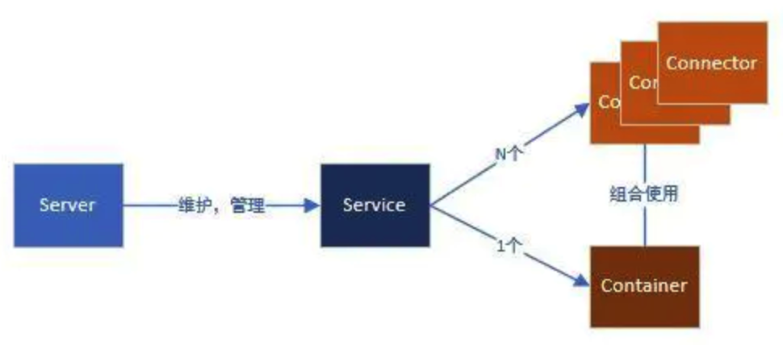
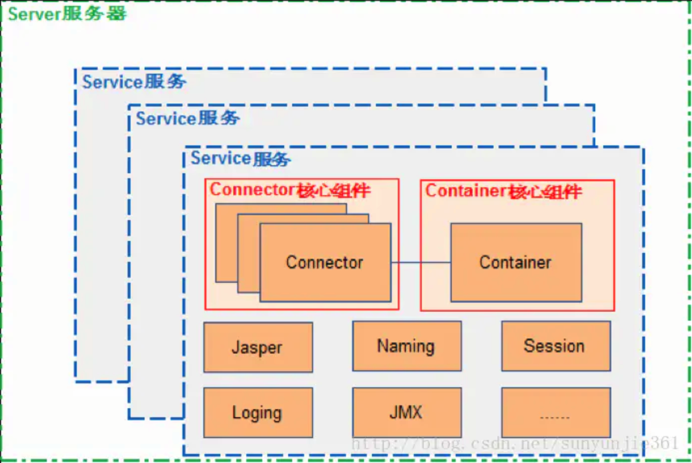
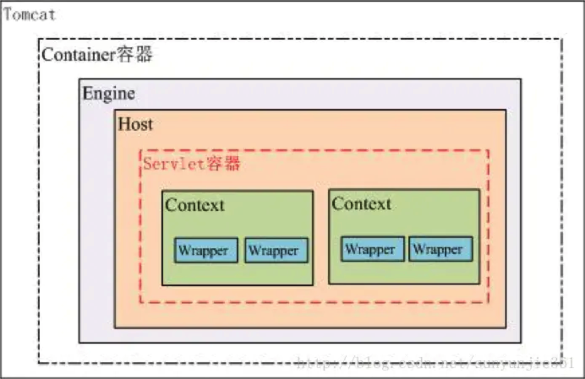
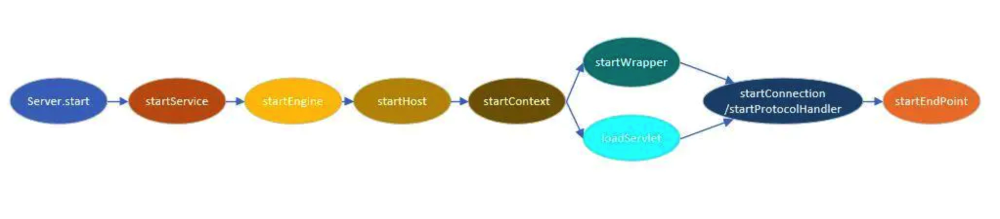

# 基础

### ==1.什么是单例模式？为什么要用单例模式?手写几种线程安全的单例模式?==

**1）什么是单例模式**

单例模式是一种常用的软件设计模式，属于创建型模式的一种。在应用这个模式时，单例对象的类必须保证只有一个实例存在。

首先我们要先了解下单例的四大原则：

1. 构造函数私有化。
2. 以静态方法或者枚举返回实例。
3. 确保实例只有一个，尤其是多线程环境。
4. 确保反序列转换时不会重新构建对象。

**2）使用单例模式可以带来下面几个好处**

- 对于频繁使用的对象，可以省略创建对象所花费的时间（这对于那些重量级对象而言，是非常可观的一笔系统开销）
- 由于 new 操作的次数减少，因而对系统内存的使用频率也会降低，这将减轻 GC 压力，缩短 GC 停顿时间。

**3）Java程序初始化顺序**

1. 父类的静态代码块
2. 子类的静态代码块
3. 父类的普通代码块
4. 父类的构造方法
5. 子类的普通代码块
6. 子类的构造方法

**4）Java中实现的单例模式**

- 懒汉式
- 饿汉式
- 静态内部类
- 枚举

以下是几种单例模式的实现：

**懒汉式(双重检查加锁版本、线程安全版本)**

懒汉式在第一次调用 getInstance 的时候进行实例化

```java
public class Singleton{
    // 单例实体对象，volatile保证当uniqueInstance变量初始化成Singleton实例时，多个线程可以正确的处理uniqueInstance变量
    private volatile static Singleton uniqueInstance;
    // 构造函数私有化，不可被外部访问
    private Singleton(){}
    public static Singleton getInstance(){
        // 检查实例，如果不存在就进入同步代码块
        if(uniqueInstance == null){
            // 只有第一次执行才会彻底执行这里的代码
            synchronized(Singleton.class){
                // 进入同步代码块之后再检查一次，如果仍为null，才创建实例
                if(uniqueInstance == null){
                    uniqueInstance = new Singleton();
                }
            }
        }
        return uniqueInstance;
    }
}
```

**懒汉式为什么要加锁？**

加锁是为了保证在多线程环境下我们还是只能得到该类的一个实例。

**锁加在方法为什么不可以？**

锁加在 getinstance 方法上的话，会导致每次调用 getInstance() 方法时都被 synchronized 关键字锁住了，会引起线程阻塞，影响程序的性能。

为了在多线程环境下，不影响程序的性能，不让线程每次调用 getInstance() 方法时都加锁，而只是在实例未被创建时再加锁，在加锁处理里面还需要判断一次实例是否已存在。这样就可以比较高效率的实现在多线程环境下的单例模式。


**静态内部类方式**

静态内部实现的单例是**懒加载的且线程安全（这也是他的优点）**。

只有通过显式调用 getInstance 方法时，才会显式装载 SingletonHolder 类，从而实例化 instance（只有第一次使用这个单例的实例的时候才加载，同时不会有线程安全问题）。

静态内部类的优点是：**外部类加载时并不需要立即加载内部类，内部类不被加载则不去初始化INSTANCE，故而不占内存**。即当SingleTon第一次被加载时，并不需要去加载SingleTonHoler，只有当getInstance()方法第一次被调用时，才会去初始化INSTANCE,第一次调用getInstance()方法会导致虚拟机加载SingleTonHoler类，**这种方法不仅能确保线程安全，也能保证单例的唯一性，同时也延迟了单例的实例化**。

那么，静态内部类又是如何实现线程安全的呢？首先，我们先了解下类的加载时机。

类加载时机：

JAVA虚拟机在有且仅有的5种场景下会对类进行初始化。

1. 遇到new、getstatic、setstatic或者invokestatic这4个字节码指令时，对应的java代码场景为：new一个关键字或者一个实例化对象时、读取或设置一个静态字段时(final修饰、已在编译期把结果放入常量池的除外)、调用一个类的静态方法时。
2. 使用java.lang.reflect包的方法对类进行反射调用的时候，如果类没进行初始化，需要先调用其初始化方法进行初始化。
3. 当初始化一个类时，如果其父类还未进行初始化，会先触发其父类的初始化。
4. 当虚拟机启动时，用户需要指定一个要执行的主类(包含main()方法的类)，虚拟机会先初始化这个类。
5. 当使用JDK 1.7等动态语言支持时，如果一个java.lang.invoke.MethodHandle实例最后的解析结果REF_getStatic、REF_putStatic、REF_invokeStatic的方法句柄，并且这个方法句柄所对应的类没有进行过初始化，则需要先触发其初始化。、

这5种情况被称为是类的主动引用，注意，这里《虚拟机规范》中使用的限定词是"有且仅有"，那么，除此之外的所有引用类都不会对类进行初始化，称为被动引用。静态内部类就属于被动引用的行列。

我们再回头看下getInstance()方法，调用的是SingleTonHoler.INSTANCE，取的是SingleTonHoler里的INSTANCE对象，跟上面那个DCL方法不同的是，getInstance()方法并没有多次去new对象，故不管多少个线程去调用getInstance()方法，取的都是同一个INSTANCE对象，而不用去重新创建。

当getInstance()方法被调用时，SingleTonHoler才在SingleTon的运行时常量池里，把符号引用替换为直接引用，这时静态对象INSTANCE也真正被创建，然后再被getInstance()方法返回出去，这点同饿汉模式。那么INSTANCE在创建过程中又是如何保证线程安全的呢？在《深入理解JAVA虚拟机》中，有这么一句话:

 虚拟机会保证一个类的<clinit>()方法在多线程环境中被正确地加锁、同步，如果多个线程同时去初始化一个类，那么只会有一个线程去执行这个类的<clinit>()方法，其他线程都需要阻塞等待，直到活动线程执行<clinit>()方法完毕。如果在一个类的<clinit>()方法中有耗时很长的操作，就可能造成多个进程阻塞(需要注意的是，其他线程虽然会被阻塞，但如果执行<clinit>()方法后，其他线程唤醒之后不会再次进入<clinit>()方法。同一个加载器下，一个类型只会初始化一次。)，在实际应用中，这种阻塞往往是很隐蔽的。

故而，可以看出INSTANCE在创建过程中是线程安全的，所以说静态内部类形式的单例可保证线程安全，也能保证单例的唯一性，同时也延迟了单例的实例化。

```java
public class Singleton{
    // 静态内部类中来创建单例对象
    private static class SingletonHolder{
        // 定义为静态常量，不可被修改
        private static final Singleton INSTANCE = new Singleton();
    }
    private Single(){}
    // 注意这里有final
    public static final Singleton getInstance(){
        // 只有通过显式调用 getInstance 方法时，才会显式装载 SingletonHolder 类，从而实例化 instance
        return SingletonHolder.INSTANCE;
    }
}
```

**饿汉式**

在类初始化时，已经自行实例化。

```java
public class Singleton{
    // 类加载时直接初始化实例
    private static final Singleton INSTANCE = new Singleton();
    private Singleton(){}
    // 直接返回初始化之后的实例对象
    public static Singleton getInstance(){
        return INSTANCE;
    }
}
```

**枚举方式**

创建枚举默认就是线程安全的，所以不需要担心 double checked locking，而且还能防止反序列化导致重新创建新的对象。保证只有一个实例（即使使用反射机制也无法多次实例化一个枚举量）。

```java
public class Singleton{
    public static void main(String[] args){
        Single single = Single.SINGLE;
        single.print();
    }
    // 枚举对象
    enum Single{
        SINGLE;
        private Single(){}
        public void print(){
            System.out.println("Hello World");
        }
    }
}
```

总结：一般情况下直接使用**饿汉式**就好了，如果明确要求要**懒加载（lazy initialization）**会倾向于使用**静态内部类**，如果涉及到**反序列化**创建对象时会试着使用**枚举**方式来实现单例。

手写单例模式的话需要掌握懒汉式、饿汉式、静态内部类三种。

### ==2.Java 反射机制介绍？==

**JAVA反射（Reflection）**：在运行状态中，对于任意一个类，都能够知道这个类的所有**属性和方法**；对于任意一个对象，都能够调用它的任意一个方法和属性；这种动态获取的信息以及动态调用对象的方法的功能称为java语言的反射机制。

Java的反射机制是java被称为动态语言的一个关键性质。

那么反射机制所能实现的功能有：

1.    只要给定类的全名，即可通过反射获取类的所有信息。
2.    反射可以在程序运行时获取任意一个对象所属的类对象。
3.    在运行时可以获取到类中所有属性对象，并对其操作（包括私有属性）。
4.    在运行时可以获取到类中、父类中所有方法，并调用。

反射机制的主要应用：

- **JDBC数据库的连接**。
- **Spring框架**。

### ==3.类装载器介绍？双亲委派机制？破坏双亲委派机制？==

**1）类装载器介绍**

**ClassLoader类装载器**就是寻找类的字节码文件并构造出类在  JVM 内部表示的对象组件。

主要工作由ClassLoader及其子类负责，ClassLoader是一个重要的 Java运行时系统组件，它负责在运行时查找和装入 Class 字节码文件。

在 JAVA中 java 虚拟机把一个类装入到 java 虚拟机当中需要经过以下的步骤：

1. **装载**：查找和导入Class文件。

2. **链接**：执行校验，准备和解析步骤。其中校验主要是检查载入class文件数据的正确性，而准备工作就是给类的静态变量来分配存储空间，解析则是将符号引用来转变成直接引用。

3. **初始化**：对类的静态变量、静态代码块执行初始化工作。

类文件被装载并解析之后，在 java 虚拟机内将拥有一个对应的 java.lang.class 类描述对象。该类的对象实例则拥有指向这个类描述对象的引用。而类描述对象又拥有指向关联 ClassLoader 的引用。

**2）全盘负责、双亲委派机制**

JVM装载类时使用**全盘负责委托机制**

**全盘负责**：当一个ClassLoader装载一个类的时候，除非显式的使用另一个ClassLoader，否则该类所依赖即引用的类也由这个ClassLoader来载入。

**双亲委派机制**：先委托父装载器寻找目标类，只有在找不到的情况下才从自己的类路径中查找并装载目标类。

为什么使用双亲委派机制：一个是**安全性**，另一个就是**性能**；（避免**重复加载**和**避免核心类被篡改**）

JVM在运行时会产生三个装载器字节码文件：**根装载器、ExtClassLoader（扩展类装载器）和AppClassLoader（系统类装载器）**。

- **根装载器**：不是ClassLoader的子类，由于他是使用C++来编写的，因此在JAVA中看不到他。根装载器来**装载jre的核心类库**，如jre目标下的rt.jar、charsets.jar等。
- **ExtClassLoader**：是ClassLoader的子类，负责装载 **jre 扩展目录ext中的jar类包**。
- **AppClassLoader**：是ClassLoader的子类，负责**装载 classpath 路径**下的类。

这三个装载器之间存在着父子层级的关系：根装载器是ExtClassLoader的父装载器，而ExtClassLoader是AppClassLoader的父装载器。

在默认情况下**使用AppClassLoader装载应用程序的类**。

**3）破坏双亲委派场景**

- **JDBC破坏双亲委派模型**

**原因**：**因为类加载器受到加载范围的限制，在某些情况下父类加载器无法加载到需要的文件，这时候就需要委托子类加载器去加载class文件。**

**具体介绍**：在某些情况下父类加载器需要委托子类加载器去加载class文件。比如 JDBC 数据库连接驱动，本身只是一个接口，并没有具体的实现，具体的实现是由不同数据库类型去实现的。例如，MySQL的mysql-connector-.jar中的Driver类具体实现的。 原生的JDBC中的类是放在rt.jar包的，是由启动类加载器进行类加载的，在JDBC中的Driver类中需要动态去加载不同数据库类型的Driver类，而mysql-connector-.jar中的Driver类是用户自己写的代码，那启动类加载器（Boot strap classloader）肯定是不能进行加载的，既然是自己编写的代码，那就需要由应用程序启动类（appclassloader）去进行类加载。这个时候就需要启动类加载器来委托子类来加载Driver实现，从而破坏了双亲委派。

**实现：**

在JDBC 4.0之后实际上我们不需要再调用Class.forName来加载驱动程序了，我们只需要把驱动的jar包放到工程的类加载路径里，那么驱动就会被自动加载。

这个自动加载采用的技术叫做**SPI**，数据库驱动厂商也都做了更新。可以看一下jar包里面的META-INF/services目录，里面有一个java.sql.Driver的文件，文件里面包含了驱动的全路径名。

引入线程**上下文类加载器(Thread Context ClassLoader)**。有了这个东西之后，程序就可以把原本需要由启动类加载器进行加载的类，由应用程序类加载器去进行加载了。在 sun.misc.Launcher 初始化的时候，**会获取AppClassLoader，然后将其设置为上下文类加载器**，所以**线程上下文类加载器默认情况下就是系统加载器**。

- **Tomcat破坏双亲委派模型**

**每个Tomcat的webappClassLoader加载自己的目录下的class文件，不会传递给父类加载器。**

Tomcat类加载器：


**4）能不能自己写个类叫java.lang.System？**

**答案：**不可以
**解释：**为了不让我们写System类，类加载采用委托机制。根装载器会首先将 java 写的 System类进行加载，自己写的System类根本没有机会得到加载。

### 4.Java当中的class对象是什么？有几种获取的方法？

**Class**其实就是类的类型，比如字符串类型就是String，整形类型就是Integer，String和Integer类型就是Class。

Class对象的常用方法介绍：

- getName()    获得类中完整名称
- getDeclaredFields()    获得类中的所有属性
- getDeclaredMethods()     获得类中所有的方法
- getConstructors()     获得类构造方法
- newInstance()     实例化类对象，注：newInstance()方法为实例化空参数的类对象时使用。

获取Class对象的有三种方法：

1、利用Class类**forName()**静态方法传入一个类的全路径来返回相对应的类的Class对象。

2、将实例化的类对象转型为Object对象，然后通过Object对象的getClass()方法来返回对应类的Class对象。

3、通过类的class属性返回类的Class对象。

在java反射机制中我们就是使用第一种方式来获取对应的class对象，并使用 newInstance() 方法来得到对应类的类对象，这样便间接的通过代码的方法获取到了对应类的对象。

### ==5.Object类有哪些方法?==

Object类是一个特殊的类，是所有类的父类。它主要提供了以下11个方法：

```java
public final native Class<?> getClass();//native方法，用于返回当前运行时对象的Class对象，使用了final关键字修饰，故不允许子类重写。

public native int hashCode(); //native方法，用于返回对象的哈希码，主要使用在哈希表中，比如JDK中的HashMap。 

public boolean equals(Object obj);//用于比较2个对象的内存地址是否相等，String类对该方法进行了重写用户比较字符串的值是否相等。

protected native Object clone() throws CloneNotSupportedException;//naitive方法，用于创建并返回当前对象的一份拷贝。一般情况下，对于任何对象 x，表达式 x.clone() != x 为true，x.clone().getClass() == x.getClass() 为true。Object本身没有实现Cloneable接口，所以不重写clone方法并且进行调用的话会发生 CloneNotSupportedException异常。

public String toString();//返回类的名字@实例的哈希码的16进制的字符串。建议Object所有的子类都重写这个方法。

public final native void notify();//native方法，并且不能重写。唤醒一个在此对象监视器上等待的线程(监视器相当于就是锁的概念)。如果有多个线程在等待只会任意唤醒一个。

public final native void notifyAll();//native方法，并且不能重写。跟notify一样，唯一的区别就是会唤醒在此对象监视器上等待的所有线程，而不是一个线程。

public final native void wait(long timeout) throws InterruptedException;//native方法，并且不能重写。暂停线程的执行。注意：sleep方法没有释放锁，而wait方法释放了锁 。timeout是等待时间。

public final void wait(long timeout, int nanos) throws InterruptedException;//多了nanos参数，这个参数表示额外时间（以毫微秒为单位，范围是 0-999999）。 所以超时的时间还需要加上nanos毫秒。

public final void wait() throws InterruptedException;//跟之前的2个wait方法一样，只不过该方法一直等待，没有超时时间这个概念

protected void finalize() throws Throwable { }//实例被垃圾回收器回收的时候触发的操作
```

### ==6.hashCode与equals的关系 （你重写过 hashcode 和 equals 么，为什么重写equals时必须重写hashCode方法？）==

**hashCode()** 的作用是获取哈希码，也称为散列码；它实际上是返回一个int整数。这个哈希码的作用是确定该对象在哈希表中的索引位置。hashCode() 定义在JDK的Object.java中，这就意味着Java中的任何类都包含有hashCode() 函数。另外需要注意的是： Object 的 hashcode 方法是**本地方法**，也就是用 c 语言或 c++ 实现的，该方法通常用来将 对象的内存地址 转换为整数之后返回。

HashSet 中保存数据的时候会首先调用 **hashCode** 方法获取对象 hashcode 值，然后和已经保存的数据的 hashcode 进行比较，假如出现重复的话就得继续调用 **equals** 方法来检查 hashcode 相同的两个对象是否内存地址也一致，如何继续相同则证明两个对象是同一个对象，因此 hashSet 就不会让其加入。如果不同的话就证明是 hashcode 出现冲突，则散列到其他位置即可。这样就大大减少了调用 equals 的次数，也就大大提高了执行速度。

hashCode()与equals()的相关关系：

1. 两个**对象相等**，则**hashcode一定也是相同**的；
2. 两个**对象相等**,对两个对象分别调用**equals方法都返回true**；
3. 两个对象hashcode相等，**不一定对象相同**；
4. 因此，**equals方法被覆盖过，则hashCode方法也必须被覆盖**，这样才能正确判断两个对象是否相等；
5. hashCode()的默认行为是对**堆**上的对象产生独特值。如果没有重写hashCode()，则**该class的两个对象无论如何都不会相等**（即使这两个对象指向相同的数据）

一句话总结：**保证可以正确判断两个对象是否相等**

### 7.==与equals的关系？

- == : 它的作用是判断两个对象的**地址是不是相等**。即**判断两个对象是不是同一个对象**。(**基本数据类型 == 比较的是值**，**引用数据类型 == 比较的是内存地址**)

- equals() : 它的作用也是**判断两个对象是否相等**。但它一般有两种使用情况：
  - 类**没有覆盖equals()**方法。则通过equals()比较该类的两个对象时，等价于通过“==”比较这两个对象（底层调用 == ）。 
  - 类**覆盖了equals()**方法。一般，我们都**覆盖equals()方法来比较两个对象的内容相等**（例如String）；若它们的内容相等， 则返回true(即认为这两个对象相等)。**覆盖了 equals 方法之后还需要覆盖 hashcode 方法**，具体内容查看上面的问题。

### 8.重载和重写的区别?

**重载**： 发生在同一个类中，**方法名必须相同，参数类型不同、个数不同、顺序不同，方法返回值和访问修饰符可以不同**，发生在编译时。

**重写**： 发生在父子类中，**方法名、参数列表必须相同，返回值范围小于等于父类，抛出的异常范围小于等于父类， 访问修饰符范围大于等于父类（两同两小一大）**；如果父类方法访问修饰符为 private 则子类就不能重写该方法。

### 9.String 和 StringBuffer、StringBuilder 的区别是什么？String 为什 么是不可变的？

- **可变**：String为不可变类型，因为 String 类使用 **final关键字修饰的字符数组保存字符串**；StringBuffer、StringBuilder为可变类型，也是使用字符数组，但没有 final 关键字修饰。
- **线程安全**：String、StringBuffer 是线程安全的，String是不可变类型所以线程安全，StringBuffer对方法添加了**同步锁**所以是线程安全的。；StringBuilder 是线程不安全的。
- **性能**：String每次改变都会产生一个新的 String 对象，性能较低；StringBuffer、StringBuilder直接对对象本身进行操作，因此性能高。

### ==10.自动装箱与拆箱==

**装箱**：将基本类型用它们对应的引用类型包装起来； 

**拆箱**：将包装类型转换为基本数据类型；

```java
  byte           Byte
  char           Character
  short          Short
  int            Integer
  long           Long
  float          Float
  double         Double
  boolean        Boolean
  void           Void
```

注意事项：

- **int 和Integer在进行比较的时候**，Integer会进行**拆箱**，转为int值与int进行比较。
- **Integer与Integer比较的时候**，由于**直接赋值**的时候会进行**自动的装箱**，需要注意两个问题，一个是**-128<= x<=127**的整数，将会直接缓存在**IntegerCache**中，当赋值在这个区间的时候，**不会创建新的Integer对象，而是从缓存中获取已经创建好的Integer对象**。二是当大于这个范围的时候，直接**new Integer来创建Integer对象**。

### ==11.关于 final 关键字的一些总结==

final关键字主要用在三个地方：**变量、方法、类**。

1. 对于一个**final变量**，如果是**基本数据类型**的变量，则其**数值一旦在初始化之后便不能更改**；如果是**引用类型**的变量，则在对其**初始化之后便不能再让其指向另一个对象**。
2. 当用final修饰一个**类**时，表明**这个类不能被继承**。final类中的所有成员方法都会被隐式地指定为final方法。
3. 使用final**方法**的原因有两个。第一个原因是把方法锁定，**以防任何继承类修改它的含义**；第二个原因是效率。 在早期的Java实现版本中，会将final方法转为内嵌调用。但是如果方法过于庞大，可能看不到内嵌调用带来的任何性能提升（现在的Java版本已经不需要使用final方法进行这些优化了）。**类中所有的private方法都隐式地指定为fianl**。

### 12.Java 中的异常处理

Java异常类层次结构图：


在 Java 中，所有的异常都有一个共同的祖先java.lang包中的 **Throwable类**。

Throwable： 有两个重要的子类： **Exception（异常）** 和 **Error（错误）** ，二者都是 Java 异常处理的重要子类，各自都包含大量子类。

**Error（错误）**:是程序无法处理的错误，表示运行应用程序中较严重问题。大多数错误与代码编写者执行的操作无关，而表示代码运行时 JVM（Java 虚拟机）出现的问题。例如，Java虚拟机运行错误（Virtual MachineError），当 JVM 不再有继续执行操作所需的内存资源时，将出现 OutOfMemoryError。这些异常发生时，Java虚拟机（JVM）一 般会选择线程终止。

这些错误表示故障发生于虚拟机自身、或者发生在虚拟机试图执行应用时，如Java虚拟机运行错误（Virtual MachineError）、类定义错误（NoClassDefFoundError）等。这些错误是不可查的，因为它们在应用程序的控制和 处理能力之 外，而且绝大多数是程序运行时不允许出现的状况。对于设计合理的应用程序来说，即使确实发生了错误，本质上也不应该试图去处理它所引起的异常状况。在 Java中，错误通过Error的子类描述。

**Exception（异常）**:是程序本身可以处理的异常。Exception 类有一个重要的子类RuntimeException。 **RuntimeException 异常**由Java虚拟机抛出。NullPointerException（要访问的变量没有引用任何对象时，抛出该 异常）、ArithmeticException（算术运算异常，一个整数除以0时，抛出该异常）和 ArrayIndexOutOfBoundsException （下标越界异常）。

异常和错误的区别：**异常能被程序本身可以处理，错误是无法处理**。

### 13.获取用键盘输入常用的的两种方法?

方法1：通过 Scanner

```java
Scanner input = new Scanner(System.in); 
String s = input.nextLine(); 
input.close();
```

方法2：通过 BufferedReader

```java
BufferedReader input = new BufferedReader(new InputStreamReader(System.in)); 
String s = input.readLine();
```

### 14.接口和抽象类的区别是什么?

1. 接口的方法默认是 **public**，所有方法在接口中不能有实现(Java 8 开始接口方法可以有**默认实现**），抽象类可以有非抽象的方法;
2. 接口中的实例变量默认是 **final** 类型的常量，而抽象类中则不一定；
3. 一个类可以**实现多个接口**，但最多只能**继承一个抽象类**（单继承多实现）；
4. 一个类实现接口的话要实现接口的**所有方法**，而抽象类不一定；
5. 接口不能用 new 实例化，但可以**声明**，但是必须引用一个实现该接口的对象。
6. 从**设计层面**来说，抽象是**对类的抽象**，是一种模板设计，接口是**行为的抽象**，是一种行为的规范。

备注:在JDK8中，接口也可以定义静态方法，可以直接用接口名调用。实现类和实现是不可以调用的。如果同时实现两个接口，接口中定义了一样的默认方法，必须重写，不然会报错。

**异常处理总结:**

- **try 块**：用于捕获异常。其后可接零个或多个catch块，如果没有catch块，则必须跟一个finally块。
- **catch 块**：用于处理try捕获到的异常。 
- **finally 块**：无论是否捕获或处理异常，finally块里的语句都会被执行。当在try块或catch块中遇到return语句时，finally语句块将在方法**返回之前**被执行。

**在以下4种特殊情况下，finally块不会被执行：**

1. 在finally语句块中发生了异常。
2. 在前面的代码中用了System.exit()退出程序。
3. 程序所在的线程死亡。
4. 关闭CPU。

### ==15.什么是泛型？为什么要使用泛型？泛型中的逆变与协变？==

**泛型的本质是为了参数化类型（在不创建新的类型的情况下，通过泛型指定的不同类型来控制形参具体限制的类型）**。

泛型的好处是**使用时不必对类型进行强制转换，它通过编译器对类型进行检查**；

使用泛型意义和作用有：

- **类型的参数化**，就是可以把类型像方法的参数那样传递。这一点意义非凡。
- 泛型使编译器可以**在编译期间对类型进行检查以提高类型安全，减少运行时由于对象类型不匹配引发的异常**。

在编译之后程序会采取**去泛型化**的措施。

也就是说Java中的泛型，只在编译阶段有效。在编译过程中，正确检验泛型结果后，会将泛型的相关信息**擦除**，并且在对象进入和离开方法的边界处添加类型检查和类型转换的方法。也就是说，泛型信息不会进入到运行时阶段。

泛型有三种使用方式，分别为：泛型类、泛型接口、泛型方法。

**逆变与协变用来描述类型转换（type transformation）后的继承关系**

其定义：如果A、B表示类型，f(⋅)表示类型转换，≤表示继承关系（比如，A≤B表示A是由B派生出来的子类）
 f(⋅)是**逆变（contravariant）**的，当A≤B时有f(B)≤f(A)成立；
 f(⋅)是**协变（covariant）**的，当A≤B时有f(A)≤f(B)成立；
 f(⋅)是**不变（invariant）**的，当A≤B时上述两个式子均不成立，即f(A)与f(B)相互之间没有继承关系。

Java中**数组是协变的，泛型是不变的**。

Java泛型是不变的，可有时需要实现协变，在两个类型之间建立某种类型的向上转型关系，怎么办呢？

```java
public class GenericsAndCovariance {
    public static void main(String[] args) {
        List<? extends Fruit> flist = new ArrayList<Apple>();
        flist.add(new Apple());  // 编译错误
        flist.add(new Fruit());  // 编译错误
        flist.add(new Object());  // 编译错误
    }
}
```

<? extends T>称为**子类通配符**，使用通配符可以将ArrayList<Apple>向上转型了，也就实现了协变。

但是List<? extends Fruit>也可以合法的指向一个List<Orange>，显然往里面放Apple、Fruit、Object都是非法的。编译器不知道List<? extends Fruit>所持有的具体类型是什么，所以一旦执行这种类型的向上转型，你就将丢失掉向其中传递任何对象的能力。

我们还可以走另外一条路，就是逆变。

```java
public class SuperTypeWildcards {
    static void writeTo(List<? super Apple> apples) {
        apples.add(new Apple());
        apples.add(new Jonathan());
        apples.add(new Fruit());  // 编译错误
    }
}
```

我们重用了关键字super指出泛型的下界为Apple，<？ super T>称为**超类通配符**，代表一个具体类型，而这个类型是Apple的超类。这样编译器就知道向其中添加Apple或Apple的子类型（例如Jonathan）是安全的了。但是，既然Apple是下界，那么可以知道向这样的List中添加Fruit是不安全的。

那么总结下：什么使用extends，什么时候使用super。

《Effective Java》给出精炼的描述：**producer-extends, consumer-super（PECS）**。

说直白点就是，从数据流来看，==extends是限制数据来源的（**生产者**），而super是限制数据流入的（**消费者**）==

例如上面SuperTypeWildcards类里，使用<? super Apple>就是限制add方法传入的类型必须是Apple及其子类型。

仿照上面的代码，我写了个ExtendTypeWildcards类，可以看出<? extends Apple>限制了get方法返回的类型必须是Apple及其父类型。

```csharp
public class ExtendTypeWildcards {
    static void readFrom(List<? extends Apple> apples) {
        Apple apple = apples.get(0);
        Jonathan jonathan = apples.get(0);  // 编译错误
        Fruit fruit = apples.get(0);
    }
}
```

### 16.32位JDK和64位JDK的区别？

32位的JDK限制了程序的最大寻址空间仅为 2^32 即4GB。但是64位的JDK程序的最大寻址空间可以到2^64即64TB。

### ==17.Java的三大特征、五大原则==

**面向对象三大特征：**

**(1)封装(Encapsulation)**

所谓封装，也就是把客观事物封装成抽象的类，并且类可以把自己的数据和方法只让可信的类或者对象操作，对不可信的进行信息隐藏。封装是面向对象的特征之一，是对象和类概念的主要特性。简单的说，一个类就是一个封装了数据以及操作这些数据的代码的逻辑实体。在一个对象内部，某些代码或某些数据可以是私有的，不能被外界访问。通过这种方式，对象对内部数据提供了不同级别的保护，以防止程序中无关的部分意外的改变或错误的使用了对象的私有部分。

封装隐藏了类的内部实现机制，可以在不影响使用的情况下改变类的内部结构，同时也保护了数据。对外界而已它的内部细节是隐藏的，暴露给外界的只是它的访问方法。

**(2)继承(Inheritance)**

继承是指这样一种能力：它可以使用现有类的所有功能，并在无需重新编写原来的类的情况下对这些功能进行扩展。通过继承创建的新类称为“子类”或“派生类”，被继承的类称为“基类”、“父类”或“超类”。继承的过程，就是从一般到特殊的过程。要实现继承，可以通过“继承”（Inheritance）和“组合”（Composition）来实现。继承概念的实现方式有二类：实现继承与接口继承。实现继承是指直接使用基类的属性和方法而无需额外编码的能力；接口继承是指仅使用属性和方法的名称、但是子类必须提供实现的能力；

继承是为了重用父类代码。两个类若存在IS-A的关系就可以使用继承。同时继承也为实现多态做了铺垫。

**(3)多态(Polymorphism)**

所谓多态就是指程序中定义的引用变量所指向的具体类型和通过该引用变量发出的方法调用**在编程时并不确定，而是在程序运行期间才确定，即一个引用变量倒底会指向哪个类的实例对象，该引用变量发出的方法调用到底是哪个类中实现的方法，必须在由程序运行期间才能决定**。因为在程序运行时才确定具体的类，这样，不用修改源程序代码，就可以让引用变量绑定到各种不同的类实现上，从而导致该引用调用的具体方法随之改变，即不修改程序代码就可以改变程序运行时所绑定的具体代码，让程序可以选择多个运行状态，这就是多态性。

最常见的多态就是**将子类传入父类参数中，运行时调用父类方法时通过传入的子类决定具体的内部结构或行为**。

**多态实现条件**

在刚刚开始就提到了继承在为多态的实现做了准备。子类Child继承父类Father，我们可以编写一个指向子类的父类类型引用，该引用既可以处理父类Father对象，也可以处理子类Child对象，当相同的消息发送给子类或者父类对象时，该对象就会根据自己所属的引用而执行不同的行为，这就是多态。

即多态性就是相同的消息使得不同的类做出不同的响应。

Java实现多态有三个必要条件：**继承、重写、向上转型**。

- **继承**：在多态中必须存在有继承关系的子类和父类。
- **重写**：子类对父类中某些方法进行重新定义，在调用这些方法时就会调用子类的方法。
- **向上转型**：在多态中需要将子类的引用赋给父类对象，只有这样该引用才能够具备技能调用父类的方法和子类的方法。

只有满足了上述三个条件，我们才能够在同一个继承结构中使用统一的逻辑实现代码处理不同的对象，从而达到执行不同的行为。

对于Java而言，它多态的实现机制遵循一个原则：当超类对象引用变量引用子类对象时，被引用对象的类型而不是引用变量的类型决定了调用谁的成员方法，但是这个被调用的方法必须是在超类中定义过的，也就是说被子类覆盖的方法。

基于继承的实现机制主要表现在父类和继承该父类的一个或多个子类对某些方法的重写，多个子类对同一方法的重写可以表现出不同的行为。

在接口的多态中，指向接口的引用必须是指定这实现了该接口的一个类的实例程序，在运行时，根据对象引用的实际类型来执行对应的方法。

**多态实现形式**

在Java中有两种形式可以实现多态。继承和接口。

**面向对象五大原则：**

**(1)单一职责原则（Single-Resposibility Principle）**

**•一个类应该仅有一个引起它变化的原因**

职员类例子： 比如在职员类里，将工程师、销售人员、销售经理这些情况都放在职员类里考虑，其结果将会非常混乱，在这个假设下，职员类里的每个方法都要ifelse判断是哪种情况，从类结构上来说将会十分臃肿，并且上述三种的职员类型，不论哪一种发生需求变化，都会改变职员类！这个是大家所不愿意看到的！

**(2)开放封闭原则（Open-Closed principle）**

**•对扩展是开放的，对更改是封闭的！**

变化来临时，如果不必改动软件实体裁的源代码，就能扩充它的行为，那么这个软件实体设计就是满足开放封闭原则的。如果说我们预测到某种变化，或者某种变化发生了，我们应当创建抽象类来隔离以后发生的同类变化。

**(3)里氏替换原则（Liskov-Substituion Principle）**

**•子类可以替换父类并且出现在父类能够出现的任何地方，贯彻GOF倡导的面向接口编程****

在这个原则中父类应尽可能使用接口或者抽象类来实现！

子类通过实现了父类接口，能够替父类的使用地方！

通过这个原则，我们客户端在使用父类接口的时候，通过子类实现！

意思就是说我们依赖父类接口，在客户端声明一个父类接口，通过其子类来实现

这个时候就要求子类必须能够替换父类所出现的任何地方，这样做的好处就是，在根据新要求扩展父类接口的新子类的时候而不影响当前客户端的使用！

**(4)依赖倒置原则（Dependecy-Inversion Principle）**

**•传统的结构化编程中，最上层的模块通常都要依赖下面的子模块来实现，也称为高层依赖低层！**

所以DIP原则就是要逆转这种依赖关系，让高层模块不要依赖低层模块，所以称之为依赖倒置原则！

**(5)ISP 接口隔离原则(Interface-Segregation Principle)**

**•使用多个专门的接口比使用单个接口要好的多！**

这个我有体会，在我实际编程中，为了减少接口的定义，将许多类似的方法都放在一个接口中，最后发现，维护和实现接口的时候花了太多精力，而接口所定义的操作相当于对客户端的一种承诺，这种承诺当然是越少越好，越精练越好，过多的承诺带来的就是你的大量精力和时间去维护！

### ==18.java修饰符==

| 修饰符      | 当前类 | 同一包内 | 子孙类(同一包) | 子孙类(不同包) | 其他包 |
| :---------- | :----- | :------- | :------------- | :------------- | :----- |
| `public`    | Y      | Y        | Y              | Y              | Y      |
| `protected` | Y      | Y        | Y              | Y              | N      |
| `default`   | Y      | Y        | Y              | N              | N      |
| `private`   | Y      | N        | N              | N              | N      |

**声明为私有访问类型的变量只能通过类中公共的 getter 方法被外部类访问。**

### ==19.Tomcat运行过程==

Tomcat 最重要的是两个组件是：**Connector（连接器**） 和 **Container（容器/集装箱）**，Connector 组件是可以被替换，这样可以提供给服务器设计者更多的选择，因为这个组件是如此重要，不仅跟服务器的设计的本身，而且和不同的应用场景也十分相关，所以一个 Container 可以选择对应多个 Connector。

多个 Connector 和一个 Container 就组成一个 **Service**，有了 Service 就可以对外提供服务了，但是 **Service** 还要一个生存的环境， **Service** 就提供了这样一个环境。所以整个 Tomcat 的生命周期由 **Server** 控制。



#### Server

Server 要完成的任务很简单，就是要能够提供一个接口让其它程序能够访问到 Service 集合，同时要维护它所包含的所有 Service 的生命周期，包括**如何初始化**、**如何结束服务**、**如何找到别人要访问的 Service**。还有一些次要的任务，如记录Service运行日志，维护Session等等。Server包含的组件结构如下：



#### Service

Service 是在 Connector 和 Container 外面多包一层，把它们组装在一起，向外面提供服务，一个 Service 可以设置多个 Connector，但是只能有一个 Container 容器。

#### Container

Container本意是集装箱的意思，是一个接口，定义了下属的各种容器，重要的是Wrapper、Host、Engine、Context等



**Engine(引擎)**

负责处理来自相关联的service的所有请求，处理后，将结果返回给service，而connector是作为service与engine的中间媒介出现的。
 一个engine下可以配置一个默认主机，每个虚拟主机都有一个域名。当engine获得一个请求时，它把该请求匹配到虚拟主机(host)上，然后把请求交给该主机来处理。
 Engine有一个默认主机，当请求无法匹配到任何一个虚拟主机时，将交给默认host来处理。Engine以线程的方式启动Host。

**Host**

代表一个虚拟主机，每个虚拟主机和某个网络域名（Domain Name）相匹配。
 每个虚拟主机下都可以部署一个或多个web应用，每个web应用对应于一个context，有一个context path。
 当Host获得一个请求时，将把该请求匹配到某个Context上，然后把该请求交给该Context来处理匹配的方法是“最长匹配”，所以一个path==””的Context将成为该Host的默认Context所有无法和其它Context的路径名匹配的请求都将最终和该默认Context匹配。

**Context**

一个Context对应于一个Web应用，一个Web应用由一个或者多个Servlet组成Context在创建的时候将根据配置文件`$CATALINA_HOME/conf/web.xml`和`$ WEBAPP_HOME/WEB-INF/web.xml`载入Servlet类。当Context获得请求时，将在自己的映射表(mapping table)中寻找相匹配的Servlet类，如果找到，则执行该类，获得请求的回应，并返回。

**Wrapper**

Wrapper 代表一个 Servlet，它负责管理一个 Servlet，包括的 Servlet 的装载、初始化、执行以及资源回收。Wrapper 是最底层的容器，它没有子容器了，所以调用它的 addChild 将会报错。
 Wrapper 的实现类是 StandardWrapper，StandardWrapper 还实现了拥有一个 Servlet 初始化信息的 ServletConfig，由此看出 StandardWrapper 将直接和 Servlet 的各种信息打交道。

**Connector**

Connector将在某个指定的端口上来监听客户的请求，把从socket传递过来的数据，封装成Request，传递给Engine来处理，并从Engine处获得响应并返回给客户。

Tomcat通常会用到两种Connector：

> 1. Http Connector 在端口8080处侦听来自客户browser的http请求。 AJP Connector
> 2. 在端口8009处侦听来自其它WebServer(Apache)的servlet/jsp代理请求。

**Lifecycle**

现实生活中大部分的事物都有生命周期，就像人的生老病死一样。

在编程中也有很多对象是具有生命周期的，从初始化、运行、回收等 会经历几个不同的阶段。 在tomcat中容器相关的好多组建都实现了Lifecycle接口，当tomcat启动时，其依赖的下层组件会全部进行初始化。 并且可以***对每个组件生命周期中的事件添加监听器\***。

例如当服务器启动的时候，tomcat需要去调用servlet的init方法和初始化容器等一系列操作，而停止的时候，也需要调用servlet的destory方法。而这些都是通过org.apache.catalina.Lifecycle接口来实现的。由这个类来制定各个组件生命周期的规范。

**LifecycleListener**

在Lifecycle的介绍中提到，Lifecycle会对每个组件生命周期中的事件添加监听器，也就是addLifecycleListener(LifecycleListener listener)方法，而LifecycleListener就是上面提到的监听器。

**LifecycleEvent**

顾名思义，就是当有监听事件发生的时候，LifecycleEvent会存储时间类型和数据

#### tomcat 的启动过程

tomcat的启动的起点是Server.start()方法，在这里它会依次启动`Container`和 `Connector`相关组件，最后到达EndPoint（Tomcat启动的Socket管理者），完成整个启动过程。如下图是个简易过程：



#### Tomcat Server处理一个http请求的过程

假设来自客户的请求为：
http://localhost:8080/wsota/wsota_index.jsp

1) 请求被发送到本机端口8080，被在那里侦听的Coyote HTTP/1.1 **Connector**获得

2) **Connector**把该请求交给它所在的**Service**的**Engine**来处理，并等待来自**Engine**的回应

3) **Engine**获得请求localhost/wsota/wsota_index.jsp，匹配它所拥有的所有虚拟主机**Host**

4) **Engine**匹配到名为localhost的**Host**（即使匹配不到也把请求交给该Host处理，因为该Host被定义为该Engine的默认主机）

5) localhost **Host**获得请求/wsota/wsota_index.jsp，匹配它所拥有的所有**Context**

6) **Host**匹配到路径为/wsota的**Context**（如果匹配不到就把该请求交给路径名为””的Context去处理）

7) path=”/wsota”的**Context**获得请求/wsota_index.jsp，在它的**mapping table**中寻找对应的**servlet**

8) **Context** 匹配到URL PATTERN为.jsp的servlet，对应于**JspServlet**类

9) 构造**HttpServletRequest**对象和**HttpServletResponse**对象，作为参数调用**JspServlet**的**doGet**或**doPost**方法

10)**Context**把执行完了之后的**HttpServletResponse**对象返回给**Host**

11)**Host**把**HttpServletResponse**对象返回给**Engine**

12)**Engine**把**HttpServletResponse**对象返回给**Connector**

13)**Connector**把**HttpServletResponse**对象返回给客户browser

### ==20.Servlet介绍==

**servlet就是一个Java接口**


servlet接口定义的是**一套处理网络请求的规范**，所有实现servlet的类，都需要实现它那五个方法，其中最主要的是两个生命周期方法 **init()**和**destroy()**，还有一个处理请求的**service()**，也就是说，所有实现servlet接口的类，或者说，所有想要处理网络请求的类，都需要回答这三个问题：

- 你初始化时要做什么
- 你销毁时要做什么
- 你接受到请求时要做什么

servlet部署在容器中（Tomcat），然后Tomcat负责和客户端进行交互。

### ==21.静态内部类和普通内部类的区别？==

**static 静态修饰符**

在程序中任何变量或者代码都是在编译时由系统自动分配内存来存储的。 static修饰表示静态的，在类加载时JVM会把它放到**方法区**，被本类以及本类中所有实例所公用。在编译后所分配的内存会在一直存在，直到程序退出内存才会释放这个空间。如果一个被所有实例公用的方法被申明为static，那么就可以节省空间了，不用每个实例初始化的时候都被分配到内存。

**内部类**

定义在一个类内部的类叫**内部类**，包含内部类的类称为外部类。内部类可以声明public、protected、private等访问限制，可以声明 为abstract的供其他内部类或外部类继承与扩展，或者声明为static、final的，也可以实现特定的接口。外部类按常规的类访问方式使用内部类，唯一的差别是外部类可以访问内部类的所有方法与属性，包括私有方法与属性。

**静态类**

- 只能在内部类中定义静态类。

- 静态内部类与外层类绑定，即使没有创建外层类的对象，它一样存在。
- 静态类的方法可以是静态的方法也可以是非静态的方法，静态的方法可以在外层通过静态类调用，而非静态的方法必须要创建类的对象之后才能调用。
- 只能引用外部类的static成员变量（也就是类变量）。
- 如果一个内部类不是被定义成静态内部类，那么在定义成员变量或者成员方法的时候，是不能够被定义成静态的。

**总结**

- **是否能拥有静态成员**

  静态内部类可以有静态成员(方法，属性)，而非静态内部类则不能有静态成员(方法，属性)。

- **访问外部类的成员**

  静态内部类只能够访问外部类的静态成员,而非静态内部类则可以访问外部类的所有成员(方法，属性)。

- **静态内部类和非静态内部类在创建时有区别**

假设类A有静态内部类B和非静态内部类C，创建B和C的区别为：

```java
A a=new A(); 
A.B b=new A.B(); 
A.C c=a.new C();
```

### 22.java创建对象的方式？

- 使用**new关键字**

这是我们最常见的也是最简单的创建对象的方式，通过这种方式我们还可以调用任意的构造函数（无参的和有参的）。

- 使用**反射机制**

运用反射手段，调用 **Java.lang.Class** 或者 **java.lang.reflect.Constructor** 类的 **newInstance()** 实例方法。

- 使用**clone方法**

无论何时我们调用一个对象的 **clone方法**，jvm就会创建一个新的对象，将前面对象的内容全部拷贝进去。用clone方法创建对象并不会调用任何构造函数。clone是**浅拷贝**的。覆盖Object中的clone方法， 实现**深拷贝**。

如果想要深拷贝一个对象， 这个对象必须要实现Cloneable接口，实现clone方法，并且在clone方法内部，把该对象引用的其他对象也要clone一份 ， 这就要求这个被引用的对象必须也要实现Cloneable接口并且实现clone方法。

- 使用**反序列化**

当我们序列化和反序列化一个对象，jvm会给我们创建一个单独的对象。在反序列化时，jvm创建对象**并不会调用任何构造函数**。

通过序列化来实现**深拷贝**。

### 23.java深拷贝和浅拷贝

Java中有三种类型的对象拷贝：浅拷贝(Shallow Copy)、深拷贝(Deep Copy)、延迟拷贝(Lazy Copy)。

- 浅拷贝：按位拷贝对象，它会创建一个新对象，这个对象有着原始对象属性值的一份精确拷贝。
  - 如果属性是**基本类型**，拷贝的就是基本类型的值；如果属性是**内存地址（引用类型）**，拷贝的就是**内存地址** ，因此如果其中一个对象改变了这个地址，就会影响到另一个对象。
- 深拷贝：深拷贝会拷贝**所有的属性**,并拷贝属性指向的动态分配的**内存**。当对象和它所引用的对象一起拷贝时即发生深拷贝。深拷贝相比于浅拷贝速度较慢并且花销较大。
- 延迟拷贝
  - 延迟拷贝是浅拷贝和深拷贝的一个组合，实际上很少会使用。这个以前几乎都没听说过，后来看书才知道有这么一种拷贝！
  - 当最开始拷贝一个对象时，会使用速度较快的浅拷贝，还会使用一个计数器来记录有多少对象共享这个数据。当程序想要修改原始的对象时，它会决定数据是否被共享（通过检查计数器）并根据需要进行深拷贝。
  - 延迟拷贝从外面看起来就是深拷贝，但是只要有可能它就会利用浅拷贝的速度。当原始对象中的引用不经常改变的时候可以使用延迟拷贝。由于存在计数器，效率下降很高，但只是常量级的开销。而且, 在某些情况下, 循环引用会导致一些问题。

如何选择拷贝方式：

- 如果对象的属性全是基本类型的，那么可以使用浅拷贝。

- 如果对象有引用属性，那就要基于具体的需求来选择浅拷贝还是深拷贝。

- 意思是如果对象引用任何时候都不会被改变，那么没必要使用深拷贝，只需要使用浅拷贝就行了。如果对象引用经常改变，那么就要使用深拷贝。没有一成不变的规则，一切都取决于具体需求。

**数组**除了默认实现了**clone()** 方法之外，还提供了**Arrays.copyOf** 方法用于拷贝，这两者都是**浅拷贝**。

**集合**的拷贝也是我们平时经常会遇到的，一般情况下，我们都是用浅拷贝来实现，即通过**构造函数**或者**clone**方法。

###  ==24.Stackoverflow & OOM及其错误排查方式==

Stackoverflow：调用栈深度超过限制，经常在**递归运算**时会遇到。排查是进行对应的代码检查即可。

OOM：Out of memory，当JVM分配内存时不够才会抛出异常。错误排查可以按照不同的错误执行不同的检查，主要分为：

- **java.lang.OutOfMemoryError:Java heap space**：新建对象时 JVM内存不足，解决方式：new创建时控制

- **java.lang.OutOfMemoryError:GC overhead limit exceedec**：GC回收时间过长时会抛出该异常。过长的定义是，超过98%的时间用来做GC并且回收了不到2%的堆内存，连续多次GC都只回收了不到2%的极端情况下才会抛出。解决方式：避免恶性循环，浪费CPU性能。
- **java.lang.OutOfMemoryError:Direct buffer memory**：写NIO程序时经常使用ByteBuffer来读取或者写入数据，这是一种基于通道（channel）与缓冲区（buffer）的I/O方式，他可以使用Native函数库直接分配堆外内存，然后通过一个存储在Java堆里面的DirectByteBuffer对象作为这块内存的引用操作，这样能在一些场景中显著提高性能，因为避免了在Java堆和Native堆中来回复制数据。ByteBuffer.allocate(caoability)第一种方式是分配JVM堆内存，属于GC管辖范围，由于需要拷贝所以速度相对较慢
  ByteBuffer.allocateDirect(caoability) 第2种方式是分配OS本地内存，不属于GC管辖范围，由于不需要内存拷贝所以速度相对较快。
  但如果不断分配本地内存，堆内存很少使用，那么JVM就不需要执行GC，DirectByteBuffer对象们就不会被回收，这时候堆内存充足，但本地内存可能已经使用光了，再次尝试分配本地内存就会出现OOM
- **java.lang.OutOfMemoryError:unable to create new native thread**： 导致原因：1.你的应用创建了太多线程，一个应用进程创建多个线程，超过系统承载极限2、你的服务器不允许你的应用程序创建这么多线程，linux系统默认允许单个进程可以创建的线程数是1024个
- **java.lang.OutOfMemoryError:Metaspce**：Java 8 之后的版本使用metaspace 来替代永久代。metaspace 是方法区在HotSpot中的实现，它与永久代最大的区别在于：metaspace并不在虚拟机内存中而是使用本地内存。存储信息如下：虚拟机加载的类信息、常量池、静态变量、即时编译后的代码。

### ==25.java中静态属性、静态方法的继承问题==

java中静态属性和静态方法可以**被继承**，但是没有被重写(overwrite)而是**被隐藏**，也就是**不能被重写**。

原因：

- 静态方法和属性是属于**类**的，调用的时候直接通过**类名.方法名**完成，不需要继承机制就可以调用。如果子类里面定义了静态方法和属性，那么这时候父类的静态方法或属性称之为"隐藏"。如果你想要调用父类的静态方法和属性，直接通过**父类名.方法**或**父类名.变量名**完成，至于是否继承一说，子类是有继承静态方法和属性，但是跟实例方法和属性不太一样，存在"隐藏"的这种情况。

- 多态之所以能够实现依赖于继承、接口和重写、重载（继承和重写最为关键）。有了继承和重写就可以实现**父类的引用指向不同子类的对象**。重写的功能是："重写"后子类的优先级要高于父类的优先级，但是“隐藏”是没有这个优先级之分的。

- **静态属性**、**静态方法**和**非静态的属性**都可以被继承和隐藏而不能被重写，因此不能实现多态，不能实现父类的引用可以指向不同子类的对象。

- **非静态方法**可以被继承和重写，因此可以实现多态。

### ==26.java父线程如何获取子线程的返回结果？==

1. 主线程等待。
2. Join方法等待。
3. 实现Callable接口和FutureTask
4. 使用线程池

### ==27.java值传递和引用传递==

1. 基本类型：编程语言中内置的最小粒度的数据类型。它包括四大类八种类型：

> 4种整数类型：byte、short、int、long
> 2种浮点数类型：float、double
> 1种字符类型：char
> 1种布尔类型：boolean

1. 引用类型：引用也叫句柄，引用类型，是编程语言中定义的在句柄中存放着实际内容所在地址的地址值的一种数据形式。它主要包括：

> 类
> 接口
> 数组

Java语言本身是不能操作内存的，它的一切都是交给JVM来管理和控制的，因此Java内存区域的划分也就是JVM的区域划分，在说JVM的内存划分之前，我们先来看一下Java程序的执行过程，如下图：


有图可以看出：Java代码被编译器编译成字节码之后，JVM开辟一片内存空间（也叫运行时数据区），通过类加载器加到到运行时数据区来存储程序执行期间需要用到的数据和相关信息，在这个数据区中，它由以下几部分组成：

1. 虚拟机栈

2. 堆

3. 程序计数器

4. 方法区

5. 本地方法栈

> **1. 虚拟机栈**

虚拟机栈是Java方法执行的内存模型，栈中存放着栈帧，每个栈帧分别对应一个被调用的方法，方法的调用过程对应栈帧在虚拟机中入栈到出栈的过程。

栈是线程私有的，也就是线程之间的栈是隔离的；当程序中某个线程开始执行一个方法时就会相应的创建一个栈帧并且入栈（位于栈顶），在方法结束后，栈帧出栈。

下图表示了一个Java栈的模型以及栈帧的组成：


**栈帧**:是用于支持虚拟机进行方法调用和方法执行的数据结构，它是虚拟机运行时数据区中的虚拟机栈的栈元素。 

每个栈帧中包括：

1. **局部变量表**:用来存储方法中的局部变量（非静态变量、函数形参）。当变量为基本数据类型时，直接存储值，当变量为引用类型时，存储的是指向具体对象的引用。
2. **操作数栈**:Java虚拟机的解释执行引擎被称为"基于栈的执行引擎"，其中所指的栈就是指操作数栈。
3. **指向运行时常量池的引用**:存储程序执行时可能用到常量的引用。
4. **方法返回地址**:存储方法执行完成后的返回地址。

> **2. 堆：**

堆是用来存储对象本身和数组的，在JVM中只有一个堆，因此，堆是被所有线程共享的。

> **3. 方法区：**

方法区是一块所有线程共享的内存逻辑区域，在JVM中只有一个方法区，用来存储一些线程可共享的内容，它是线程安全的，多个线程同时访问方法区中同一个内容时，只能有一个线程装载该数据，其它线程只能等待。

方法区可存储的内容有：类的全路径名、类的直接超类的权全限定名、类的访问修饰符、类的类型（类或接口）、类的直接接口全限定名的有序列表、常量池（字段，方法信息，静态变量，类型引用（class））等。

> **4. 本地方法栈：**

本地方法栈的功能和虚拟机栈是基本一致的，并且也是线程私有的，它们的区别在于虚拟机栈是为执行Java方法服务的，而本地方法栈是为执行本地方法服务的。

> **5. 程序计数器：**

线程私有的。
记录着当前线程所执行的字节码的行号指示器，在程序运行过程中，字节码解释器工作时就是通过改变这个计数器的值来选取下一条需要执行的字节码指令，分支、循环、异常处理、线程恢复等基础功能都需要依赖计数器完成。

从上面程序运行图我们可以看到，JVM在程序运行时的内存分配有三个地方：

- 堆
- 栈
- 静态方法区
- 常量区

相应地，每个存储区域都有自己的内存分配策略：

- 堆式：
- 栈式
- 静态

我们已经知道：Java中的数据类型有基本数据类型和引用数据类型，那么这些数据的存储都使用哪一种策略呢？
这里要分以下的情况进行探究：

> **1. 基本数据类型的存储**

------

我们分别来研究一下：

**A.基本数据类型的局部变量**

1. 定义基本数据类型的局部变量以及数据都是直接存储在内存中的栈上，也就是前面说到的**“虚拟机栈”**，数据本身的值就是存储在栈空间里面。


**基本数据类型的数据本身是不会改变的，当局部变量重新赋值时，并不是在内存中改变字面量内容，而是重新在栈中寻找已存在的相同的数据，若栈中不存在，则重新开辟内存存新数据，并且把要重新赋值的局部变量的引用指向新数据所在地址。**

**B. 基本数据类型的成员变量**

成员变量：顾名思义，就是在类体中定义的变量。
看下图：


**基本数据类型的成员变量名和值都存储于堆中，其生命周期和对象的是一致的。**

**C. 基本数据类型的静态变量**

前面提到**方法区**用来存储一些共享数据，因此**基本数据类型的静态变量名以及值存储于方法区的运行时常量池中，静态变量随类加载而加载，随类消失而消失**

> **2. 引用数据类型的存储:**

上面提到：堆是用来存储对象本身和数组，而引用（句柄）存放的是实际内容的地址值

**对于引用数据类型的对象/数组，变量名存在栈中，变量值存储的是对象的地址，并不是对象的实际内容。**

**值传递：**在方法被调用时，实参通过形参把它的内容副本传入方法内部，此时形参接收到的内容是实参值的一个拷贝，因此在方法内对形参的任何操作，都仅仅是对这个副本的操作，不影响原始值的内容。**值传递传递的是真实内容的一个副本，对副本的操作不影响原内容，也就是形参怎么变化，不会影响实参对应的内容。**

**引用传递：**”引用”也就是指向真实内容的地址值，在方法调用时，实参的地址通过方法调用被传递给相应的形参，在方法体内，形参和实参指向同一块内存地址，对形参的操作会影响的真实内容。

但是**引用传递，在Java中并不存在。**

这是因为：**无论是基本类型和是引用类型，在实参传入形参时，都是值传递，也就是说传递的都是一个副本，而不是内容本身。**

因此可见：在Java中所有的参数传递，不管基本类型还是引用类型，都是值传递，或者说是**副本传递**。只是在传递过程中：

**如果是对基本数据类型的数据进行操作，由于原始内容和副本都是存储实际值，并且是在不同的栈区，因此形参的操作，不影响原始内容。**

**如果是对引用类型的数据进行操作，分两种情况，一种是形参和实参保持指向同一个对象地址，则形参的操作，会影响实参指向的对象的内容。一种是形参被改动指向新的对象地址（如重新赋值引用），则形参的操作，不会影响实参指向的对象的内容。**

### ==28.java跨平台实现方式==

在Java平台中，想要把Java文件，编译成二进制文件，需要经过两步编译，前端编译和后端编译：


前端编译主要指与源语言有关但与目标机无关的部分。Java中，我们所熟知的`javac` 的编译就是前端编译。除了这种以外，我们使用的很多IDE，如eclipse，idea等，都内置了前端编译器。主要功能就是把`.java` 代码转换成`.class` 代码。

后端编译主要是将中间代码再翻译成机器语言。Java中，这一步骤就是Java虚拟机来执行的。


所以，我们说的，Java的平台无关性实现主要作用于以上阶段。如下图所示：


Java的平台无关性是建立在Java虚拟机的平台有关性基础之上的，是因为Java虚拟机屏蔽了底层操作系统和硬件的差异。

### ==29.Java浮点数使用原则？==

- 浮点数运算和整数运算相比，只能进行加减乘除这些数值计算，**不能做位运算和移位运算**。

- 在计算机中，浮点数虽然表示的范围大，但是，浮点数有个非常重要的特点，就是**浮点数常常无法精确表示**。

- 由于浮点数存在运算误差，所以比较两个浮点数是否相等常常会出现错误的结果。正确的比较方法是**判断两个浮点数之差的绝对值是否小于一个很小的数**。

```java
// 比较x和y是否相等，先计算其差的绝对值:
double r = Math.abs(x - y);
// 再判断绝对值是否足够小:
if (r < 0.00001) {
    // 可以认为相等
} else {
    // 不相等
}
```

- **浮点数在内存的表示方法和整数比更加复杂**。

- 如果参与运算的两个数其中一个是整型，那么**整型可以自动提升到浮点型**。
- 整数运算在除数为0时会报错，而**浮点数运算在除数为0时，不会报错，但会返回几个特殊值**：
  - `NaN`表示Not a Number
  - `Infinity`表示无穷大
  - `-Infinity`表示负无穷大

- **可以将浮点数强制转型为整数**。在转型时，浮点数的小数部分会被丢掉。如果转型后超过了整型能表示的最大范围，将返回整型的最大值。如果要进行四舍五入，可以对浮点数加上0.5再强制转型。

### ==30.java中字符串拼接的方法==

- +方式
- concat方法：确保两个都是字符串
- StringBuilder、StringBuffer

