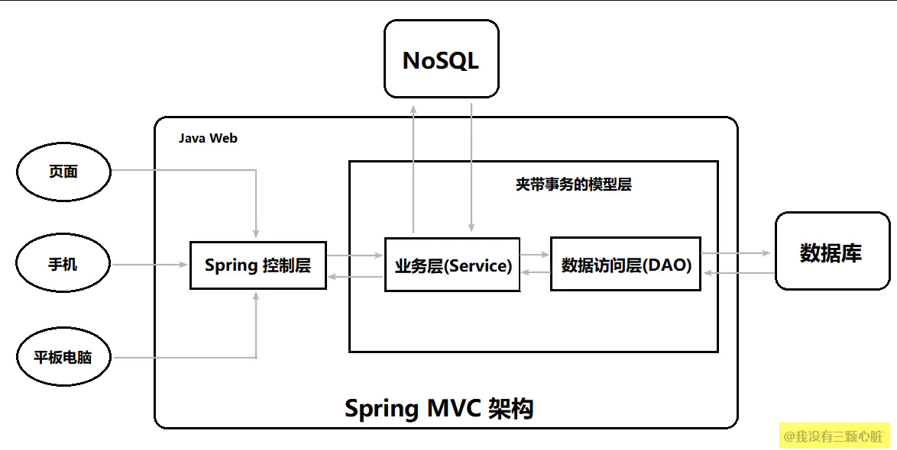
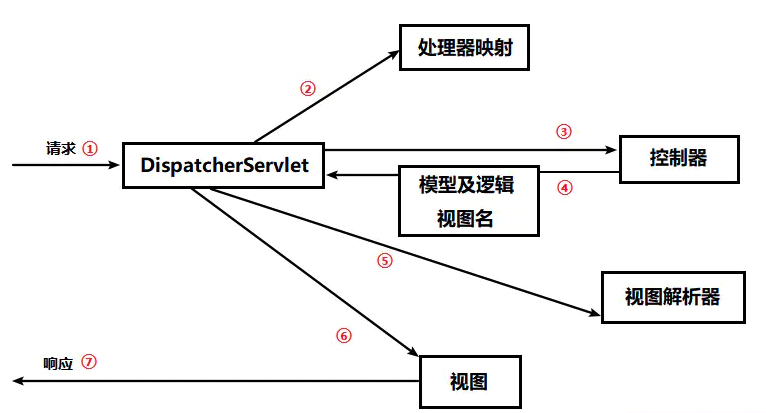

# Spring

### 1.什么是Spring

**Spring是一个轻量级控制反转(IOC)和面向切面(AOP)的容器框架**。主要是为了解决企业应用开发的复杂性而诞生的，框架的主要优势之一就是其分层结构，分层结构允许使用者使用哪一个组件。同时也为J2EE开发提供了集成的框架。


Spring的核心模块：

- **核心容器(SpringCore)**：提供了Spring框架的基本功能，核心容器的主要组件是BeanFactory，他是工厂模式的实现。Bean Factory使用控制反转的模式将应用程序的配置和依赖性规范与实际的应用程序代码相分开。
- **应用上下文(SpringContext)**：是一个配置文件，向Spring模块提供上下文信息。Spring上下文包含了一些企业服务，例如：JNDI、EJB、电子邮件、国际化、校验、调度等功能。
- **AOP模块(Spring AOP)** ：通过配置管理特性，Spring AOP模块直接将面向切面的编程功能集成到了Spring框架当中。所以，可以很容易的使Spring框架管理的任何对象都可以支持AOP。Spring的AOP模块为基于Spring的应用程序中的对象提供了事物管理功能，通过使用Spring AOP不用依赖EJB组件就可以将声明性事物管理集成到应用程序当中。
- **JDBC和DAO模块(Spring DAO)**：JDBC、DAO的抽象层提供了有意义的异常层次结构,可用该结构来管理异常处理和不同数据库供应商所抛出的异常信息。异常层次结构简化了错误处理,并且极大的降低了需要编写的异常处理代码数量。例如打开和关闭连接等等。SpringDAO的面向切面，JDBC的异常遵从通用的DAO异常层次结构。
- **对象实体映射（SpringORM）**:Spring框架插入了若干个ORM框架，从而提供了ORM对象的关系工具。其中包括JDO、Hibernate… …所有这些都遵从Spring的通用事物和DAO异常层次结构。
- **Web模块(Spring Web)**：Web上下文模块建立在应用程序上下文模块之上,为基于Web的应用程序提供了上下文，所以Spring框架支持与Struts的集成。Web模块还简化了处理多部分请求以及将请求参数绑定到预对象的操作。
- **MVC模块(Spring WebMVC)**：Spring的MVC是一个全功能的构建Web应用程序的MVC的实现。通过策略接口,MVC框架变成为高度可配置的。MVC容纳了大量视图技术。模型来由JavaBean来构成，存放与Map当中。而视图是一个接口，负责实现模型。控制器是一个逻辑代码，是Control的实现。

Spring 的核心是**控制反转（IoC）和面向切面（AOP）**。

IoC 不是一种技术，只是一种思想，一个重要的面向对象编程的法则，它能指导我们如何设计出松耦合、更优良的程序。

AOP即**Aspect-Oriented programming**的缩写，中文意思是面向切面（或方面）编程。他是一种思想，可在不改变程序源码的情况下为程序添加额外的功能。

### ==2.Spring AOP IOC 实现原理？==

spring核心框架里面，最关键的两个机制，就是 ioc 和 aop。

介绍的时候按照：**是什么？原理是什么？是怎么用的？解决了什么问题，实现的效果是什么样的？**重点是**思想**的介绍。

**1）Spring IOC**

**Spring IOC**: **控制反转也叫依赖注入**。之前使用 xml 表示，目前都是使用**注解**的方式实现。

IOC 概念看似很抽象，但是很容易理解。 说简单点就是将对象交给**容器**管理，你只需要在spring配置文件中配置对应的bean以及设置相关的属性，让spring 容器来生成类的实例对象以及管理对象。

（可以介绍下没有使用 Spring IOC的时候对象之间调用的耦合情况，在使用了Spring IOC 之后这种耦合情况由 **Spring 容器**来负责进行处理，做到了解耦合的效果）

在spring容器启动的时候，spring会把你在配置文件中配置的bean都初始化好，然后在你需要调用的时候，就把它已经初始化好的那些bean分配给你需要调用这些bean的类，然后根据 bean 之间的依赖关系来自动进行依赖的注入，让类与类之间彻底的解耦和。

总的来说就是：**根据注解去实例化对应的bean，管理bean之间的依赖注入，让类与类之间解耦，维护代码的时候可以更加轻松**

**2）Spring IOC的实现原理**

IOC底层利用**java反射机制**，利用反射的技术，会直接根据类来构建对应的对象出来，然后在需要的地方将其进行注入。

**3）Spring AOP** 

**Spring AOP：面向切面编程**。定义一个切面，然后织入一些代码，让所有程序执行到对应切面的时候去执行织入的代码。

比如事务的实现就是基于 AOP 来实现的，也就是 Transacional 注解。

**4）Spring AOP的实现原理**

Spring AOP利用**动态代理技术**，生成代理对象，利用截取消息的方式，对该消息进行装饰，以取代原有对象行为的执行。

**动态代理**：动态的创建一个**代理类**，在创建代理类的**实例对象**，然后在代理类的实例对象里引用自己写的类，所有的方法调用都会先走代理类对象，负责做一些代码上的增强，再去调用自己写的类。

动态代理的实现技术：**cglib动态代理、jdk动态代理**。

**5）cglib、jdk动态代理的区别**

主要的区别是根据 **Spring 生成动态代理类的形式**有关的。

如果需要动态代理的类**实现了某个接口**，那么Spring aop会使用**jdk动态代理**生成一个实现同样接口的一个代理类，然后构造一个实例对象出来。也就是说**jdk动态代理只有在类有接口的时候才会使用**。

假如需要动态代理的类**没有实现接口**，spring aop则会该用**cglib动态代理**来生成该类的一个子类，该子类可以动态的生成字节码，然后重写一些原有的方法，在方法中加入增强的代码。

### ==3.Spring bean？知道 Spring 的 bean 的作用域与生命周期吗?Spring bean 是线程安全的吗？==

**1）Spring bean 介绍**

在 Spring 中，那些组成**应用程序的主体及由 Spring IOC（控制反转） 容器所管理的对象**，被称之为 bean。

Spring中的bean默认都是**单例**的，**基于 BeanFactory 也就是 Spring 容器**的，单例 Bean 在此**容器内只有一个**，Java的单例是基于 JVM，每个 JVM 内只有一个实例。

Spring bean 的生命周期：


**2）Spring bean作用域**

在Spring 容器当中，一共提供了5种作用域类型，在配置文件中，通过属性scope来设置bean的作用域范围。


Spring 容器可以管理 **singleton** 作用域下 bean 的生命周期，在此作用域下，Spring 能够精确地知道bean何时被创建，何时初始化完成，以及何时被销毁。

而对于 **prototype** 作用域的bean，Spring 为每一个 bean 请求创建一个实例。

一般来说下面几种作用域，开发的时候都不会去用，默认都是使用**singleton**。

**3）Spring bean 是线程安全的吗？**

Spring bean 默认来说是**线程不安全**的。（只有使用默认的单例作用域的时候才是不安全的）

因为 bean 会被多线程并发访问，假如bean中有自己的实例变量，但是 bean 中没有相应的并发安全设置，也就导致 bean 是线程不安全的。

但是一般来说很少会在 bean 中放置实例变量，因为 bean 之间是相互调用的，最终都是去访问数据库的。这样多线程其实最后是去并发的访问数据库了，也就不会因为 bean 是线程不安全的影响整体系统的运行。

### ==4.Spring 的事务实现原理是什么？Spring 中的事务传播行为了解吗? TransactionDefinition 接口中哪五个表示隔离级别的常量?==

**1）Spring 事务实现原理**

在方法上添加 Transactional 注解，此时 Spring 就会使用 **AOP**在这个方法执行前首先开启事务，在执行完毕之后会根据方法是否报错来决定是回滚还是提交事务。

**2）Transactional注解会带来什么问题？**

Transactional会导致**事务失效**的问题发生，可能会发生事务失效的场景有如下几个：

1、**@Transactional注解只能应用到public修饰符上，应用在其它修饰符上会失效，但不报错**。可以**使用 AspectJ 取代 Spring AOP** 代理来解决。

2、**默认情况下此注解会对unchecked异常进行回滚，对checked异常不回滚。**（java里面将派生于Error或者RuntimeException（比如空指针，除0）的异常称为unchecked异常，其他继承自java.lang.Exception得异常统称为Checked Exception，如IOException、TimeoutException等。也就是说编译器能检测到的是checked，检测不到的就是unchecked）

3、**同类方法调用，假如被同类其他没有使用 Transactional 注解注释的方法去调用一个注释了 Transactional 注解的方法会导致这个 Transactional 注释失效。**这是由于使用 Spring AOP 代理造成的，因为只有当事务方法被当前类以外的代码调用时，才会由Spring生成的代理对象来管理。可以**使用 AspectJ 取代 Spring AOP** 代理来解决。

4、**事务 propagation（事务传播行为）属性配置出错**。若是错误的配置以下三种 propagation，事务将不会发生回滚：**TransactionDefinition.PROPAGATION_SUPPORTS**：如果当前存在事务，则加入该事务；如果当前没有事务，则以非事务的方式继续运行。** TransactionDefinition.PROPAGATION_NOT_SUPPORTED**：以非事务方式运行，如果当前存在事务，则把当前事务挂起。 **TransactionDefinition.PROPAGATION_NEVER**：以非事务方式运行，如果当前存在事务，则抛出异常。

5、**在 Transaction 注解中使用 try-catch**，catch会将异常进行处理，导致Transactional不会捕获到对应的异常。

6、**数据库引擎设置出错**，数据库引擎 MyISAM不支持事务，只有 InnoDB 是支持事务的。


**3）Spring 事务传播行为**

事务传播行为（为了解决业务层方法之间互相调用的事务问题）： **当事务方法被另一个事务方法调用时，必须指定事务应该如何传播**。

例如：方法可能继续在现有事务中运行，也可能开启一个新事务，并在自己的事务中运行。

在 TransactionDefinition定义中包括了如下几个表示传播行为的常量（以事务方法A来调用方法B来举例）：

**支持当前事务的情况：**

- **TransactionDefinition.PROPAGATION_REQUIRED**： 如果当前存在事务，则加入该事务；如果当前没有事务， 则**创建一个新的事务**。这种情况下只会开启一个事务。
- TransactionDefinition.PROPAGATION_SUPPORTS： 如果当前存在事务，则加入该事务；如果当前没有事务， 则以**非事务**的方式继续运行。 
- TransactionDefinition.PROPAGATION_MANDATORY： 如果当前存在事务，则加入该事务；如果当前没有事务，则**抛出异常**。（mandatory：强制性）

**不支持当前事务的情况：**

- **TransactionDefinition.PROPAGATION_REQUIRES_NEW**： **创建一个新的事务**，如果当前存在事务，则把当前事务挂起。 这样是两个不同的事务，之前互不影响。
- TransactionDefinition.PROPAGATION_NOT_SUPPORTED： 以**非事务方式运行**，如果当前存在事务，则把当前事务挂起。 
- TransactionDefinition.PROPAGATION_NEVER： 以**非事务方式运行**，如果当前存在事务，则**抛出异常**。

**其他情况：**

- **TransactionDefinition.PROPAGATION_NESTED**： 如果当前存在事务，则**创建一个事务作为当前事务的嵌套事务来运行**；如果当前没有事务，则该取值等价于TransactionDefinition.PROPAGATION_REQUIRED。**外层事务回滚会导致外层事务回滚；内层事务回滚不会导致外层事务回滚**。


**4）Spring 事务隔离级别**

TransactionDefinition 接口中定义了**五个**表示隔离级别的常量（后四个分别对应于mysql的事物隔离级别）：

- **TransactionDefinition.ISOLATION_DEFAULT**: 使用后端数据库默认的隔离级别，Mysql 默认采用的 **REPEATABLE_READ** 隔离级别（加锁之后可以实现到SERIALIZABLE级别） Oracle 默认采用的 READ_COMMITTED隔离级别；
- **TransactionDefinition.ISOLATION_READ_UNCOMMITTED**: 最低的隔离级别，**允许读取尚未提交的数据变更**，可能会导致**脏读、幻读或不可重复读** ；
- **TransactionDefinition.ISOLATION_READ_COMMITTED**: **允许读取并发事务已经提交的数据**，可以**阻止脏读，但是幻读或不可重复读仍有可能发生** ；
- **TransactionDefinition.ISOLATION_REPEATABLE_READ**: **对同一字段的多次读取结果都是一致的**，除非数据是被本身事务自己所修改，可以**阻止脏读和不可重复读，但幻读仍有可能发生**。 
- **TransactionDefinition.ISOLATION_SERIALIZABLE**: 最高的隔离级别，完全服从ACID的隔离级别。**所有的事务依次逐个执行，这样事务之间就完全不可能产生干扰**，也就是说，该级别**可以防止脏读、不可重复读以及幻读**。但是这将严重影响程序的性能。通常情况下也不会用到该级别。

### ==5.SpringMVC 原理了解吗?==

**1）SpringMVC介绍**

原先的Web开发模型是MVC模式的：

**M 代表 模型（Model）**
 模型是什么呢？ 模型就是数据，就是 dao,bean

**V 代表 视图（View）**
 视图是什么呢？ 就是网页, JSP，用来展示模型中的数据

**C 代表 控制器（controller)**
 控制器是什么？ 控制器的作用就是把不同的数据(Model)，显示在不同的视图(View)上，Servlet 扮演的就是这样的角色。

为解决持久层中一直未处理好的数据库事务的编程，又为了迎合 NoSQL 的强势崛起，Spring MVC 给出了方案：



**传统的模型层被拆分为了业务层(Service)和数据访问层（DAO,Data Access Object）。** 在 Service 下可以通过 Spring 的声明式事务操作数据访问层，而在业务层上还允许我们访问 NoSQL ，这样就能够满足异军突起的 NoSQL 的使用了，它可以大大提高互联网系统的性能。

也就是说**SpringMVC就是将原先的MVC结构变为了Controller、Service、Dao三层**。

一般来说，controller层是负责接收外部请求的，它的职责就是解析请求参数，根据参数判断要做哪些事件,但是它里面没有逻辑性。

而Service层是负责处理业务逻辑的，主要是解决做什么，怎么做的问题。而dao是只负责和数据库打交到，把数据库的具体实现隔离开来。
这种设计的好处就是**职责分离**，修改各自的部分不会影响其它部分。

比如controller层，一开始你使用的是json格式输入，但是以后想修改为protobuf，只需要修改这一个地方就行了。而service层，比如这个项目你是给A公司做的，现在B公司也要做一套差不多的，但有一些不一样的，你只需要把service层替换一下或继承一下就可以了，不会影响其它的。而Dao层，比如你现在使用的是mysql，将来公司有钱了，要换成oracle，只需要修改这一层就可以了。
想想，如果controller里面即做业务，又调用数据库，所有的东西都在一起，代码会非常混乱的。

**2）SpringMVC的实现原理？（SpringMVC的访问流程？）**

结合自己项目去讲



首先客户端发送过来请求交由**前端控制器 DispatcherServlet** 进行处理，然后 **DispatcherServlet** 找到**处理器映射 RequestMapping**来解析请求，之后会调用对应的 **Controller** 来处理请求，并执行响应的 **Service** 业务逻辑，**Service**中会执行**DAO**来进行数据库数据的访问，执行完之后会返回一个模型试图 **ModelAndView**（或者直接返回一个 json 数据到前端工程中去），然后将其交由对应的**视图解析器**进行解析，然后返回一个**试图**对象，最后**前段控制器**会对试图进行渲染，然后将试图进行返回。

这就是SpringMVC的实现原理，主要就是前端控制器 DispatcherServlet 发挥主要的工作，然后分别调用对应的 Controller、Service、DAO等创建视图，然后对视图进行渲染并返回。这也是 SpringMVC 接受请求所对应的执行过程。

### ==6.Spring Boot？如何启动一个Spring Boot工程？Spring Boot 的核心架构？==

**1）Spring Boot**

Spring Boot 是一个简化Spring项目开发的脚手架工具。

本质就是**整合各种框架**， 比如spring + spring mvc + mybits 的一些框架，但是可以一定程度上简化开发流程。

Spring Boot **内嵌一个 tomcat** 来直接运行代码，方便进行开发测试。

Spring Boot 支持**自动装配**，我们只需要引入一个 start，然后 SpringBoot会自动的为我们在项目中引入相应的依赖以及自动的完成一些相应的配置和定义生成相应的bean，然后自动注入。免去一些手动配置和定义 bean 的操作。


**2）如何启动一个Spring Boot工程**

使用 @SpringBootApplication 注解来指定一个 Springboot 微服务的启动入口。在对应的启动入口的 main 方法中使用SpringApplication.run(ManageCourseApplication.class, args);来启动一个 Springboot 工程。


**3）Spring Boot的核心架构（启动流程）**

首先启动一个 **Spring Boot** 项目之后，**Spring Boot**会启动内置的一个 **tomcat** 服务器。

然后 **tomcat** 会启动 **Spring** 容器来**自动的扫描和装载**由 **Spring Boot **引入配置的一些框架的 **bean** 以及一些自定义的 **bean**。

之后当有请求到来的时候会执行 **Spring MVC** 的 **Controller、Service、DAO** 等来执行对应的流程并返回定义的响应信息。

### 7.常见的Spring中的注解？

- SpringBootApplication：标注一个Springboot项目
- Service：标注业务逻辑
- Controller：标注视图控制器
- RestController：标注这是一个返回json对象的视图控制器
- RequestMapping：指定视图控制器的访问路径
- Getmapping：指定get请求的路径
- PostMapping：指定post请求的路径
- Configuration：指定这是一个配置对象
- FeignClient：指定feign远程调用的路径

### ==8.Spring中都使用到了哪些设计模式？==

主要使用到了**工厂、单例、代理**等设计模式。

- **工厂模式**：Spring IOC核心的设计模式就是使用工厂模式，将所有的 bean 实例都放到了 spring 容器中，这样就不需要自己去创建bean实例了。
- **单例模式**：spring bean 默认的作用域就是单例的。
- **代理模式**：Spring AOP核心的设计模式就是使用代理模式，使用动态代理对象来代理目标对象，来实现一些增强功能的添加。

### ==9.Spring Cloud原理了解吗？==

**1）Spring Cloud介绍**

Spring Cloud 就是用于分布式系统中多个微服务之间管理的一套机制的整合，可以方便的用于构建完整的一套分布式系统。

**2）Spring Cloud原理**

前端请求通过**网关系统Zuul**来将对应的请求转发到对应的**微服务**上，然后该**微服务**为了实现对应的业务可能还需要**调用其他的微服务**来完成。

这里就需要用到**Spring Cloud Eureka 服务注册中心**，这里该微服务就可以进行**服务发现**，然后使用**ribbon+feign**来进行**RPC远程服务调用**，使用的是 **http** 访问。

首先使用**ribbon**来进行**服务端负载均衡**，然后使用**feign**来请求其他的微服务来完成指定的业务，然后将响应内容进行返回。

最后该微服务将响应进行返回。

还有 **hystrix** 可以用于微服务之间的**熔断、隔离、降级**等操作来保证维服务的安全。

### ==10.Spring和Spring Boot的区别？==

总的来说Spring是使用基本的JavaBean代替EJB，通过容器管理JavaBean的配置和声明周期，在此基础上实现了AOP、IOC的Spring核心功能，其他web框架组件在AOP、IOC的基础上工作，将JavaBean交给Spring来管理。

简单来说，Spring是**一个轻量级的控制反转（IoC）和面向切面（AOP）的容器框架**。

Spring Boot不是一门新技术，他是一个创建spring工程的脚手架工具。从本质上来说，Spring Boot就是Spring，它做了一些对Spring Bean的默认配置。

Spring Cloud事实上是一整套基于Spring Boot的微服务解决方案。

### ==11.Spring循环依赖？==

spring对循环依赖的处理有三种情况： 

①**构造器的循环依赖**：这种依赖spring是处理不了的，直接抛出BeanCurrentlylnCreationException异常。 

②**单例模式下的setter循环依赖**：通过“三级缓存”处理循环依赖。 

③**非单例循环依赖**：无法处理。

spring单例对象的初始化大略分为三步：

1. createBeanInstance：实例化，其实也就是调用对象的构造方法实例化对象
2. populateBean：填充属性，这一步主要是多bean的依赖属性进行填充
3. initializeBean：调用spring xml中的init 方法。

从上面讲述的单例bean初始化步骤我们可以知道，循环依赖主要发生在第一、第二步。也就是构造器循环依赖和field循环依赖。 接下来，我们具体看看spring是如何处理三种循环依赖的。

**构造器循环依赖**

this .singletonsCurrentlylnCreation.add(beanName）将当前正要创建的bean 记录在缓存中 Spring 容器将每一个正在创建的bean 标识符放在一个“当前创建bean 池”中， bean 标识符：在创建过程中将一直保持在这个池中，因此如果在创建bean 过程中发现自己已经在“当前 创建bean 池” 里时，将抛出BeanCurrentlylnCreationException 异常表示循环依赖；而对于创建 完毕的bean 将从“ 当前创建bean 池”中清除掉。

**单例模式 setter 循环依赖**

Spring 为了解决单例的循环依赖问题，使用了 **三级缓存** ，递归调用时发现 Bean 还在创建中即为循环依赖

单例模式的 Bean 保存在如下的数据结构中：

```java
/** 一级缓存：用于存放完全初始化好的 bean **/
private final Map<String, Object> singletonObjects = new ConcurrentHashMap<String, Object>(256);

/** 二级缓存：存放原始的 bean 对象（尚未填充属性），用于解决循环依赖 */
private final Map<String, Object> earlySingletonObjects = new HashMap<String, Object>(16);

/** 三级级缓存：存放 bean 工厂对象，用于解决循环依赖 */
private final Map<String, ObjectFactory<?>> singletonFactories = new HashMap<String, ObjectFactory<?>>(16);

/**
bean 的获取过程：先从一级获取，失败再从二级、三级里面获取

创建中状态：是指对象已经 new 出来了但是所有的属性均为 null 等待被 init
*/
```

检测循环依赖的过程如下：

- A 创建过程中需要 B，于是 **A 将自己放到三级缓里面** ，去实例化 B

- B 实例化的时候发现需要 A，于是 B 先查一级缓存，没有，再查二级缓存，还是没有，再查三级缓存，找到了！

- - **然后把三级缓存里面的这个 A 放到二级缓存里面，并删除三级缓存里面的 A**
  - B 顺利初始化完毕，**将自己放到一级缓存里面**（此时B里面的A依然是创建中状态）

- 然后回来接着创建 A，此时 B 已经创建结束，直接从一级缓存里面拿到 B ，然后完成创建，**并将自己放到一级缓存里面**

- 如此一来便解决了循环依赖的问题

一句话：**先让最底层对象完成初始化，通过三级缓存与二级缓存提前曝光创建中的 Bean，让其他 Bean 率先完成初始化。**

**非单例循环依赖**

对于“prototype”作用域bean, Spring 容器无法完成依赖注入，因为Spring 容器不进行缓 存“prototype”作用域的bean ，因此无法提前暴露一个创建中的bean 。


使用**三级缓存**可以保证获取到两个**代理对象**的循环依赖，因为三级缓存可以通过 **getEarlyRefance()** 方法来生成**代理对象**的引用。

所有对象都会将自己的早期对象暴露在三级缓存中；针对代理对象，从三级缓存到二级缓存会经过一次代理。创建完毕之后就会将二级缓存中的数据进行删除，放到一级缓存中。

### ==12.Spring依赖注入的方式？==

- **@Autowired：自动装配**
- **setter 方法注入**
- **构造器注入**
- **静态工厂的方法注入**
- **实例工厂的方法注入**

### ==13.Spring IOC源码分析？==

Spring IOC源码就是**三级缓存**来创建对应的bean实例的过程。

### ==14.Spring Boot源码分析？==

SpringBoot**约定大于配置，配置自动装配**。

springBoot的源码分为：

- SpringBoot**自动装配**
- SpringBoot**启动流程**
  - jar包的启动流程
  - war包的启动流程

SpringBoot 自动装配：装配的是**BeanDefination**bean定义。

那么是如何自动装配的呢？

自动将需要加入的配置以**配置文件**的形式保存，然后通过**SPI**机制来进行加载。