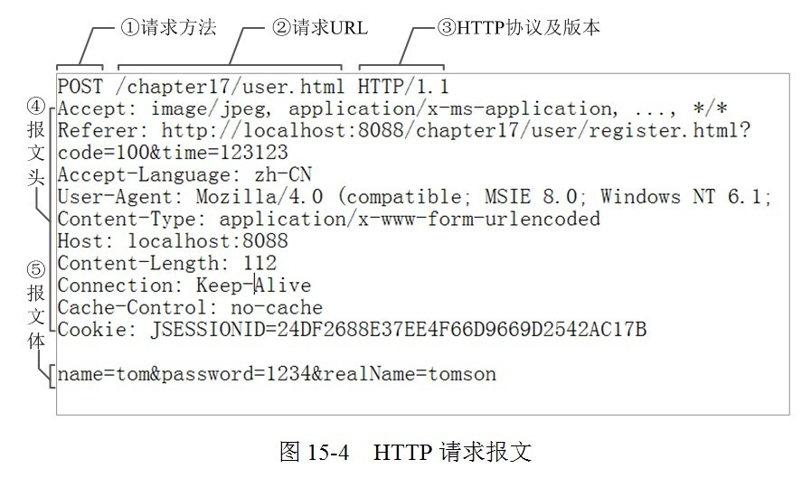

# 计算机网络

## 网络基础

### ==1.7层模型（OSI）==

1、**物理层（比特）**：实现相邻计算机节点之间**比特流**的透明传送，尽可能屏蔽掉具体传输介质和物理设备的差异。

2、**数据链路层（帧）**：网络层交下来的 **IP 数据报组装成帧**，在两个相邻节点间的链路上传送帧。通过**以太网协议**和网卡 **MAC 地址**来实现在两个相邻节点之间来进行帧的传输。

3、**网络层（数据报）**：使用**ip协议**来通过**ip地址**来选择合适的网间路由和交换结点， 确保数据及时传送。

4、**传输层（报文）**：负责向两台主机进程之间的通信提供通用的数据传输服务。

5、**会话层**：不同机器上的用户之间建立及管理会话。

6、**表示层**：信息的语法语义及它们之间的关联。

7、**应用层**：通过应用进程间的交互来完成特定网络应用。

### ==2.4层模型（TCP/IP）==

1、**网际接口层**：负责两个主机之间的比特和帧的传输

2、**网络层**：选择合适的网间路由和交换结点， 确保数据及时传送。

3、**传输层**：负责向两台主机进程之间的通信提供通用的数据传输服务。

4、**应用层**：通过应用进程间的交互来完成特定网络应用。

### 3.模型各层常见协议

7层模型包括：

- 物理层：IEEE802
- 数据链路层：ARP、PPP、PARP
- 网络层：ICMP、IP、RIP、BGP、OSPF
- 传输层：TCP、UDP
- 会话层：
- 表示层：
- 应用层：HTTP、DNS、SMTP、POP3、FTP

四层模型：

- 网际接口层：ARP、PPP、PARP、IEEE802
- 网络层：ICMP、IP
- 传输层：TCP、UDP
- 应用层：HTTP、DNS、SMTP、POP3、FTP

### 4.各层硬件设备

- **物理层**：中继器、集线器
- **数据链路层**：交换机、网桥

- **网络层**：路由器

## TCP/UDP

### ==1.三次握手==


最开始的时候客户端和服务器都是处于CLOSED状态。主动打开连接的为客户端，被动打开连接的是服务器。

- TCP服务器进程先创建传输控制块TCB，时刻准备接受客户进程的连接请求，此时服务器就进入了LISTEN（监听）状态；
- TCP客户进程也是先创建传输控制块TCB，然后向服务器发出连接请求报文，这时报文首部中的同部位SYN=1，同时选择一个初始序列号 seq=x ，此时，TCP客户端进程进入了 SYN-SENT（同步已发送状态）状态。**TCP规定，SYN报文段（SYN=1的报文段）不能携带数据，但需要消耗掉一个序号。**
- TCP服务器收到请求报文后，如果同意连接，则发出确认报文。确认报文中应该 ACK=1，SYN=1，确认号是ack=x+1，同时也要为自己初始化一个序列号 seq=y，此时，TCP服务器进程进入了SYN-RCVD（同步收到）状态。这个报文也不能携带数据，但是同样要消耗一个序号。
- TCP客户进程收到确认后，还要向服务器给出确认。确认报文的ACK=1，ack=y+1，自己的序列号seq=x+1，此时，TCP连接建立，客户端进入ESTABLISHED（已建立连接）状态。TCP规定，**ACK报文段可以携带数据，但是如果不携带数据则不消耗序号**。
- 当服务器收到客户端的确认后也进入ESTABLISHED状态，此后双方就可以开始通信了。

### ==2.为什么需要三次握手？（为什么两次握手不行？）==

**主要防止已经失效的连接请求报文突然又传送到了服务器，从而产生错误。**

如果使用的是两次握手建立连接，假设有这样一种场景，客户端发送了第一个请求连接并且没有丢失，只是因为在网络结点中滞留的时间太长了，由于TCP的客户端迟迟没有收到确认报文，以为服务器没有收到，此时重新向服务器发送这条报文，此后客户端和服务器经过两次握手完成连接，传输数据，然后关闭连接。此时此前滞留的那一次请求连接，网络通畅了到达了服务器，这个报文本该是失效的，但是，两次握手的机制将会让客户端和服务器再次建立连接，这将导致不必要的错误和资源的浪费。

如果采用的是三次握手，就算是那一次失效的报文传送过来了，**服务端接受到了那条失效报文并且回复了确认报文，但是客户端不会再次发出确认**。由于服务器收不到确认，就知道客户端并没有请求连接。

### ==3.TCP连接耗费哪些资源？==

消耗**内核内存（各种数据结构以及分配的缓冲区等）、文件描述符、端口号**等。

一个TCP的连接大约占用**3KB**多的内存，理论上单机的最大 TCP 连接数是 **65535**（端口号限制），但是在实际环境中，受到机器资源、操作系统等的限制，特别是sever端，其最大并发tcp连接数远不能达到理论上限。

### ==4.三次握手每次握手失败情况下的处理措施？==

**第一次握手失败：**

客户端作为主动发起连接方，首先它将发送 SYN 包，于是客户端的连接就会处于 `SYN_SENT` 状态。

客户端在等待服务端回复的 ACK 报文，正常情况下，服务器会在几毫秒内返回 SYN+ACK，但如果客户端长时间没有收到 SYN+ACK 报文，则会**重发 SYN 包**，重发的次数由 **tcp_syn_retries** 参数控制，默认是 **5** 次：

通常，第一次超时重传是在 **1** 秒后，第二次超时重传是在 **2** 秒，第三次超时重传是在 **4** 秒后，第四次超时重传是在 **8** 秒后，第五次是在超时重传 **16** 秒后。没错，**每次超时的时间是上一次的 2 倍**。

当第五次超时重传后，会继续等待 **32** 秒，如果服务端仍然没有回应 ACK，客户端就会**终止三次握手**。

所以，总耗时是 **1+2+4+8+16+32=63** 秒，大约 1 分钟左右。


**第二次握手失败：**

当服务端收到 SYN 包后，服务端会立马回复 SYN+ACK 包，表明确认收到了客户端的序列号，同时也把自己的序列号发给对方。

此时，服务端出现了新连接，状态是 `SYN_RCV`。在这个状态下，Linux 内核就会建立一个**「半连接队列」**来维护**「未完成」**的握手信息，当半连接队列溢出后，服务端就无法再建立新的连接。

SYN 攻击，攻击的是就是这个半连接队列。

我们可以通过该 `netstat -s` 命令给出的统计结果中， 可以得到由于半连接队列已满，引发的失败次数：

输出的数值是**累计值**，表示共有多少个 TCP 连接因为半连接队列溢出而被丢弃。**隔几秒执行几次，如果有上升的趋势，说明当前存在半连接队列溢出的现象**。

要想增大半连接队列，**不能只单纯增大 tcp_max_syn_backlog 的值，还需一同增大 somaxconn 和 backlog，也就是增大 accept 队列。否则，只单纯增大 tcp_max_syn_backlog 是无效的。**

增大 tcp_max_syn_backlog 和 somaxconn 的方法是修改 Linux 内核参数

增大 backlog 的方式，每个 Web 服务都不同，比如 Nginx 增大 backlog 的方法如下


最后，改变了如上这些参数后，要重启 Nginx 服务，因为 SYN 半连接队列和 accept 队列都是在 `listen()` 初始化的。

> 如果 SYN 半连接队列已满，只能丢弃连接吗？

并不是这样，**开启 syncookies 功能就可以在不使用 SYN 半连接队列的情况下成功建立连接**。

syncookies 的工作原理：服务器根据当前状态计算出一个值，放在己方发出的 SYN+ACK 报文中发出，当客户端返回 ACK 报文时，取出该值验证，如果合法，就认为连接建立成功，如下图所示。


开启 syncookies 功能

syncookies 参数主要有以下三个值：

- 0 值，表示关闭该功能；
- 1 值，表示仅当 SYN 半连接队列放不下时，再启用它；
- 2 值，表示无条件开启功能；

那么在应对 SYN 攻击时，只需要设置为 1 即可：


**第三次握手失败:**

> SYN_RCV 状态的优化

当客户端接收到服务器发来的 SYN+ACK 报文后，就会回复 ACK 给服务器，同时客户端连接状态从 SYN_SENT 转换为 ESTABLISHED，表示连接建立成功。

服务器端连接成功建立的时间还要再往后，等到服务端收到客户端的 ACK 后，服务端的连接状态才变为 ESTABLISHED。

如果服务器没有收到 ACK，就会**重发 SYN+ACK 报文**，同时一直处于 SYN_RCV 状态。

当网络繁忙、不稳定时，报文丢失就会变严重，此时应该调大重发次数。反之则可以调小重发次数。**修改重发次数的方法是，调整 tcp_synack_retries 参数**：


**tcp_synack_retries** 的默认重试次数是 **5** 次，与客户端重传 SYN 类似，它的重传会经历 **1、2、4、8、16** 秒，最后一次重传后会继续等待 **32** 秒，如果服务端仍然没有收到 ACK，才会关闭连接，故共需要等待 **63** 秒。

服务器收到 ACK 后连接建立成功，此时，内核会把连接从半连接队列移除，然后创建新的完全的连接，并将其添加到 accept 队列，等待进程调用 accept 函数时把连接取出来。

如果进程不能及时地调用 accept 函数，就会造成 accept 队列（也称全连接队列）溢出，最终导致建立好的 TCP 连接被丢弃。


> accept 队列已满，只能丢弃连接吗？

丢弃连接只是 Linux 的默认行为，我们还可以选择向客户端发送 RST 复位报文，告诉客户端连接已经建立失败。打开这一功能需要将 **tcp_abort_on_overflow** 参数设置为 1。


**tcp_abort_on_overflow** 共有两个值分别是 0 和 1，其分别表示：

- 0 ：如果 accept 队列满了，那么 server 扔掉 client 发过来的 ack ；
- 1 ：如果 accept 队列满了，server 发送一个 `RST` 包给 client，表示废掉这个握手过程和这个连接；

通常情况下，应当把 **tcp_abort_on_overflow** 设置为 0，因为这样更有利于应对突发流量。只有你非常肯定 TCP 全连接队列会长期溢出时，才能设置为 1 以尽快通知客户端。

> 如何调整 accept 队列的长度呢？

accept 队列的长度取决于 **somaxconn** 和 **backlog** 之间的最小值，也就是 **min(somaxconn, backlog)**，其中：

- **somaxconn** 是 Linux 内核的参数，默认值是 128，可以通过 `net.core.somaxconn` 来设置其值；
- **backlog** 是 `listen(int sockfd, int backlog)` 函数中的 backlog 大小；

Tomcat、Nginx、Apache 常见的 Web 服务的 backlog 默认值都是 511。

### 5.TCP三次握手优化


> 客户端的优化

当客户端发起 SYN 包时，可以通过 `tcp_syn_retries` 控制其重传的次数。

> 服务端的优化

当服务端 SYN 半连接队列溢出后，会导致后续连接被丢弃，可以通过 `netstat -s` 观察半连接队列溢出的情况，如果 SYN 半连接队列溢出情况比较严重，可以通过 `tcp_max_syn_backlog、somaxconn、backlog` 参数来调整 SYN 半连接队列的大小。

服务端回复 SYN+ACK 的重传次数由 `tcp_synack_retries` 参数控制。如果遭受 SYN 攻击，应把 `tcp_syncookies` 参数设置为 1，表示仅在 SYN 队列满后开启 syncookie 功能，可以保证正常的连接成功建立。

服务端收到客户端返回的 ACK，会把连接移入 accpet 队列，等待进行调用 accpet() 函数取出连接。

可以通过 `ss -lnt` 查看服务端进程的 accept 队列长度，如果 accept 队列溢出，系统默认丢弃 ACK，如果可以把 `tcp_abort_on_overflow` 设置为 1 ，表示用 RST 通知客户端连接建立失败。

如果 accpet 队列溢出严重，可以通过 listen 函数的 `backlog` 参数和 `somaxconn` 系统参数提高队列大小，accept 队列长度取决于 min(backlog, somaxconn)。

> 绕过三次握手

TCP Fast Open 功能可以绕过三次握手，使得 HTTP 请求减少了 1 个 RTT 的时间，Linux 下可以通过 `tcp_fastopen` 开启该功能，同时必须保证服务端和客户端同时支持。

### ==6.四次挥手==


可以看到，**四次挥手过程只涉及了两种报文，分别是 FIN 和 ACK**：

- FIN 就是结束连接的意思，谁发出 FIN 报文，就表示它将不会再发送任何数据，关闭这一方向上的传输通道；
- ACK 就是确认的意思，用来通知对方：你方的发送通道已经关闭；

四次挥手的过程:

- 当主动方关闭连接时，会发送 FIN 报文，此时发送方的 TCP 连接将从 ESTABLISHED 变成 FIN_WAIT1。
- 当被动方收到 FIN 报文后，内核会自动回复 ACK 报文，连接状态将从 ESTABLISHED 变成 CLOSE_WAIT，表示被动方在等待进程调用 close 函数关闭连接。
- 当主动方收到这个 ACK 后，连接状态由 FIN_WAIT1 变为 FIN_WAIT2，也就是表示**主动方的发送通道就关闭了**。
- 当被动方进入 CLOSE_WAIT 时，被动方还会继续处理数据，等到进程的 read 函数返回 0 后，应用程序就会调用 close 函数，进而触发内核发送 FIN 报文，此时被动方的连接状态变为 LAST_ACK。
- 当主动方收到这个 FIN 报文后，内核会回复 ACK 报文给被动方，同时主动方的连接状态由 FIN_WAIT2 变为 TIME_WAIT，**在 Linux 系统下大约等待 1 分钟后，TIME_WAIT 状态的连接才会彻底关闭**。
- 当被动方收到最后的 ACK 报文后，**被动方的连接就会关闭**。

你可以看到，每个方向都需要**一个 FIN 和一个 ACK**，因此通常被称为**四次挥手**。

这里一点需要注意是：**主动关闭连接的，才有 TIME_WAIT 状态。**

主动关闭方和被动关闭方优化的思路也不同，接下来分别说说如何优化他们。

#### 主动方的优化

关闭连接的方式通常有两种，分别是 **RST 报文关闭**和 **FIN 报文关闭**。

如果进程异常退出了，内核就会发送 RST 报文来关闭，它可以不走四次挥手流程，是一个暴力关闭连接的方式。

安全关闭连接的方式必须通过四次挥手，它由进程调用 `close` 和 `shutdown` 函数发起 FIN 报文（shutdown 参数须传入 SHUT_WR 或者 SHUT_RDWR 才会发送 FIN）。

> 调用 close 函数和 shutdown 函数有什么区别？

调用了 close 函数意味着完全断开连接，**完全断开不仅指无法传输数据，而且也不能发送数据。 此时，调用了 close 函数的一方的连接叫做「孤儿连接」，如果你用 netstat -p 命令，会发现连接对应的进程名为空。**

使用 close 函数关闭连接是不优雅的。于是，就出现了一种优雅关闭连接的 `shutdown` 函数，**它可以控制只关闭一个方向的连接**：


第二个参数决定断开连接的方式，主要有以下三种方式：

- SHUT_RD(0)：**关闭连接的「读」这个方向**，如果接收缓冲区有已接收的数据，则将会被丢弃，并且后续再收到新的数据，会对数据进行 ACK，然后悄悄地丢弃。也就是说，对端还是会接收到 ACK，在这种情况下根本不知道数据已经被丢弃了。
- SHUT_WR(1)：**关闭连接的「写」这个方向**，这就是常被称为「半关闭」的连接。如果发送缓冲区还有未发送的数据，将被立即发送出去，并发送一个 FIN 报文给对端。
- SHUT_RDWR(2)：相当于 SHUT_RD 和 SHUT_WR 操作各一次，**关闭套接字的读和写两个方向**。

close 和 shutdown 函数都可以关闭连接，但这两种方式关闭的连接，不只功能上有差异，控制它们的 Linux 参数也不相同。

> FIN_WAIT1 状态的优化

主动方发送 FIN 报文后，连接就处于 FIN_WAIT1 状态，正常情况下，如果能及时收到被动方的 ACK，则会很快变为 FIN_WAIT2 状态。

但是当迟迟收不到对方返回的 ACK 时，连接就会一直处于 FIN_WAIT1 状态。此时，**内核会定时重发 FIN 报文，其中重发次数由 tcp_orphan_retries 参数控制**（注意，orphan 虽然是孤儿的意思，该参数却不只对孤儿连接有效，事实上，它对所有 FIN_WAIT1 状态下的连接都有效），默认值是 0。


你可能会好奇，这 0 表示几次？**实际上当为 0 时，特指 8 次**，从下面的内核源码可知：


如果 FIN_WAIT1 状态连接很多，我们就需要考虑降低 tcp_orphan_retries 的值，当重传次数超过 tcp_orphan_retries 时，连接就会直接关闭掉。

对于普遍正常情况时，调低 tcp_orphan_retries 就已经可以了。如果遇到恶意攻击，FIN 报文根本无法发送出去，这由 TCP 两个特性导致的：

- 首先，TCP 必须保证报文是有序发送的，FIN 报文也不例外，当发送缓冲区还有数据没有发送时，FIN 报文也不能提前发送。
- 其次，TCP 有流量控制功能，当接收方接收窗口为 0 时，发送方就不能再发送数据。所以，当攻击者下载大文件时，就可以通过接收窗口设为 0 ，这就会使得 FIN 报文都无法发送出去，那么连接会一直处于 FIN_WAIT1 状态。

解决这种问题的方法，是**调整 tcp_max_orphans 参数，它定义了「孤儿连接」的最大数量**：


当进程调用了 `close` 函数关闭连接，此时连接就会是「孤儿连接」，因为它无法再发送和接收数据。Linux 系统为了防止孤儿连接过多，导致系统资源长时间被占用，就提供了 `tcp_max_orphans` 参数。如果孤儿连接数量大于它，新增的孤儿连接将不再走四次挥手，而是直接发送 RST 复位报文强制关闭。

> FIN_WAIT2 状态的优化

当主动方收到 ACK 报文后，会处于 FIN_WAIT2 状态，就表示主动方的发送通道已经关闭，接下来将等待对方发送 FIN 报文，关闭对方的发送通道。

这时，**如果连接是用 shutdown 函数关闭的，连接可以一直处于 FIN_WAIT2 状态，因为它可能还可以发送或接收数据。但对于 close 函数关闭的孤儿连接，由于无法再发送和接收数据，所以这个状态不可以持续太久，而 tcp_fin_timeout 控制了这个状态下连接的持续时长**，默认值是 60 秒：


它意味着对于孤儿连接（调用 close 关闭的连接），如果在 60 秒后还没有收到 FIN 报文，连接就会直接关闭。

这个 60 秒不是随便决定的，它与 TIME_WAIT 状态持续的时间是相同的，后面我们再来说说为什么是 60 秒。

> TIME_WAIT 状态的优化

TIME_WAIT 是主动方四次挥手的最后一个状态，也是最常遇见的状态。

当收到被动方发来的 FIN 报文后，主动方会立刻回复 ACK，表示确认对方的发送通道已经关闭，接着就处于 TIME_WAIT 状态。在 Linux 系统，TIME_WAIT 状态会持续 60 秒后才会进入关闭状态。

TIME_WAIT 状态的连接，在主动方看来确实快已经关闭了。然后，被动方没有收到 ACK 报文前，还是处于 LAST_ACK 状态。如果这个 ACK 报文没有到达被动方，被动方就会重发 FIN 报文。重发次数仍然由前面介绍过的 tcp_orphan_retries 参数控制。

TIME-WAIT 的状态尤其重要，主要是两个原因：

- 防止具有相同「四元组」的「旧」数据包被收到；
- 保证「被动关闭连接」的一方能被正确的关闭，即保证最后的 ACK 能让被动关闭方接收，从而帮助其正常关闭；

*原因一：防止旧连接的数据包*

TIME-WAIT 的一个作用是**防止收到历史数据，从而导致数据错乱的问题。**

假设 TIME-WAIT 没有等待时间或时间过短，被延迟的数据包抵达后会发生什么呢？


接收到历史数据的异常

- 如上图黄色框框服务端在关闭连接之前发送的 `SEQ = 301` 报文，被网络延迟了。
- 这时有相同端口的 TCP 连接被复用后，被延迟的 `SEQ = 301` 抵达了客户端，那么客户端是有可能正常接收这个过期的报文，这就会产生数据错乱等严重的问题。

所以，TCP 就设计出了这么一个机制，经过 `2MSL` 这个时间，**足以让两个方向上的数据包都被丢弃，使得原来连接的数据包在网络中都自然消失，再出现的数据包一定都是新建立连接所产生的。**

*原因二：保证连接正确关闭*

TIME-WAIT 的另外一个作用是**等待足够的时间以确保最后的 ACK 能让被动关闭方接收，从而帮助其正常关闭。**

假设 TIME-WAIT 没有等待时间或时间过短，断开连接会造成什么问题呢？


没有确保正常断开的异常

- 如上图红色框框客户端四次挥手的最后一个 `ACK` 报文如果在网络中被丢失了，此时如果客户端 `TIME-WAIT` 过短或没有，则就直接进入了 `CLOSE` 状态了，那么服务端则会一直处在 `LAST-ACK` 状态。
- 当客户端发起建立连接的 `SYN` 请求报文后，服务端会发送 `RST` 报文给客户端，连接建立的过程就会被终止。

我们再回过头来看看，为什么 TIME_WAIT 状态要保持 60 秒呢？这与孤儿连接 FIN_WAIT2 状态默认保留 60 秒的原理是一样的，**因为这两个状态都需要保持 2MSL 时长。MSL 全称是 Maximum Segment Lifetime，它定义了一个报文在网络中的最长生存时间**（报文每经过一次路由器的转发，IP 头部的 TTL 字段就会减 1，减到 0 时报文就被丢弃，这就限制了报文的最长存活时间）。

为什么是 2 MSL 的时长呢？这其实是相当于**至少允许报文丢失一次**。比如，若 ACK 在一个 MSL 内丢失，这样被动方重发的 FIN 会在第 2 个 MSL 内到达，TIME_WAIT 状态的连接可以应对。

为什么不是 4 或者 8 MSL 的时长呢？你可以想象一个丢包率达到百分之一的糟糕网络，连续两次丢包的概率只有万分之一，这个概率实在是太小了，忽略它比解决它更具性价比。

**因此，TIME_WAIT 和 FIN_WAIT2 状态的最大时长都是 2 MSL，由于在 Linux 系统中，MSL 的值固定为 30 秒，所以它们都是 60 秒。**

虽然 TIME_WAIT 状态有存在的必要，但它毕竟会消耗系统资源。**如果发起连接一方的 TIME_WAIT 状态过多，占满了所有端口资源，则会导致无法创建新连接。**

- **客户端受端口资源限制**：如果客户端 TIME_WAIT 过多，就会导致端口资源被占用，因为端口就65536个，被占满就会导致无法创建新的连接；
- **服务端受系统资源限制**：由于一个四元组表示TCP连接，理论上服务端可以建立很多连接，服务端确实只监听一个端口，但是会把连接扔给处理线程，所以理论上监听的端口可以继续监听。但是线程池处理不了那么多一直不断的连接了。所以当服务端出现大量 TIME_WAIT 时，系统资源被占满时，会导致处理不过来新的连接；

另外，**Linux 提供了 tcp_max_tw_buckets 参数，当 TIME_WAIT 的连接数量超过该参数时，新关闭的连接就不再经历 TIME_WAIT 而直接关闭：**


当服务器的并发连接增多时，相应地，同时处于 TIME_WAIT 状态的连接数量也会变多，此时就应当调大 `tcp_max_tw_buckets` 参数，减少不同连接间数据错乱的概率。

tcp_max_tw_buckets 也不是越大越好，毕竟内存和端口都是有限的。

**有一种方式可以在建立新连接时，复用处于 TIME_WAIT 状态的连接，那就是打开 tcp_tw_reuse 参数。但是需要注意，该参数是只用于客户端（建立连接的发起方），因为是在调用 connect() 时起作用的，而对于服务端（被动连接方）是没有用的。**


tcp_tw_reuse 从协议角度理解是安全可控的，可以复用处于 TIME_WAIT 的端口为新的连接所用。

什么是协议角度理解的安全可控呢？主要有两点：

- 只适用于连接发起方，也就是 C/S 模型中的客户端；
- 对应的 TIME_WAIT 状态的连接创建时间超过 1 秒才可以被复用。

使用这个选项，还有一个前提，需要打开对 TCP 时间戳的支持（对方也要打开 ）：


由于引入了时间戳，它能带来了些好处：

- 我们在前面提到的 2MSL 问题就不复存在了，因为重复的数据包会因为时间戳过期被自然丢弃；
- 同时，它还可以防止序列号绕回，也是因为重复的数据包会由于时间戳过期被自然丢弃；

时间戳是在 TCP 的选项字段里定义的，开启了时间戳功能，在 TCP 报文传输的时候会带上发送报文的时间戳。

我们来看看开启了 tcp_tw_reuse 功能，如果四次挥手中的最后一次 ACK 在网络中丢失了，会发生什么？


四次挥手中的最后一次 ACK 在网络中丢失

上图的流程：

- 四次挥手中的最后一次 ACK 在网络中丢失了，服务端一直处于 LAST_ACK 状态；
- 客户端由于开启了 tcp_tw_reuse 功能，客户端再次发起新连接的时候，会复用超过 1 秒后的 time_wait 状态的连接。**但客户端新发的 SYN 包会被忽略（由于时间戳），因为服务端比较了客户端的上一个报文与 SYN 报文的时间戳，过期的报文就会被服务端丢弃**；
- 服务端 FIN 报文迟迟没有收到四次挥手的最后一次 ACK，于是超时重发了 FIN 报文给客户端；
- **处于 SYN_SENT 状态的客户端，由于收到了 FIN 报文，则会回 RST 给服务端，于是服务端就离开了 LAST_ACK 状态；**
- **最初的客户端 SYN 报文超时重发了（ 1 秒钟后）**，此时就与服务端能正确的三次握手了。

所以大家都会说开启了 tcp_tw_reuse，可以在复用了 time_wait 状态的 1 秒过后成功建立连接，这 1 秒主要是花费在 SYN 包重传。

另外，老版本的 Linux 还提供了 tcp_tw_recycle 参数，但是当开启了它，就有两个坑：

- **Linux 会加快客户端和服务端 TIME_WAIT 状态的时间**，也就是它会使得 TIME_WAIT 状态会小于 60 秒，很容易导致数据错乱；
- 另外，**Linux 会丢弃所有来自远端时间戳小于上次记录的时间戳（由同一个远端发送的）的任何数据包**。就是说要使用该选项，则必须保证数据包的时间戳是单调递增的。那么，问题在于，此处的时间戳并不是我们通常意义上面的绝对时间，而是一个相对时间。很多情况下，我们是没法保证时间戳单调递增的，比如使用了 NAT、LVS 等情况；

所以，不建议设置为 1 ，在 Linux 4.12 版本后，Linux 内核直接取消了这一参数，建议关闭它：


另外，我们可以在程序中设置 socket 选项，来设置调用 close 关闭连接行为。


如果 `l_onoff` 为非 0， 且 `l_linger` 值为 0，**那么调用 close 后，会立该发送一个 RST 标志给对端，该 TCP 连接将跳过四次挥手，也就跳过了 TIME_WAIT 状态，直接关闭。**

但这为跨越 TIME_WAIT 状态提供了一个可能，不过是一个非常危险的行为，不值得提倡。

#### 被动方的优化

当被动方收到 FIN 报文时，内核会自动回复 ACK，同时连接处于 CLOSE_WAIT 状态，顾名思义，它表示等待应用进程调用 close 函数关闭连接。

内核没有权利替代进程去关闭连接，因为如果主动方是通过 shutdown 关闭连接，那么它就是想在半关闭连接上接收数据或发送数据。因此，Linux 并没有限制 CLOSE_WAIT 状态的持续时间。

当然，大多数应用程序并不使用 shutdown 函数关闭连接。所以，**当你用 netstat 命令发现大量 CLOSE_WAIT 状态。就需要排查你的应用程序，因为可能因为应用程序出现了 Bug，read 函数返回 0 时，没有调用 close 函数。**

处于 CLOSE_WAIT 状态时，调用了 close 函数，内核就会发出 FIN 报文关闭发送通道，同时连接进入 LAST_ACK 状态，等待主动方返回 ACK 来确认连接关闭。

如果迟迟收不到这个 ACK，内核就会重发 FIN 报文，重发次数仍然由 tcp_orphan_retries 参数控制，这与主动方重发 FIN 报文的优化策略一致。

还有一点我们需要注意的，**如果被动方迅速调用 close 函数，那么被动方的 ACK 和 FIN 有可能在一个报文中发送，这样看起来，四次挥手会变成三次挥手，这只是一种特殊情况，不用在意。**

> 如果连接双方同时关闭连接，会怎么样？

由于 TCP 是双全工的协议，所以是会出现两方同时关闭连接的现象，也就是同时发送了 FIN 报文。

此时，上面介绍的优化策略仍然适用。两方发送 FIN 报文时，都认为自己是主动方，所以都进入了 FIN_WAIT1 状态，FIN 报文的重发次数仍由 tcp_orphan_retries 参数控制。


同时关闭

接下来，**双方在等待 ACK 报文的过程中，都等来了 FIN 报文。这是一种新情况，所以连接会进入一种叫做 CLOSING 的新状态，它替代了 FIN_WAIT2 状态**。接着，双方内核回复 ACK 确认对方发送通道的关闭后，进入 TIME_WAIT 状态，等待 2MSL 的时间后，连接自动关闭。

#### 小结

针对 TCP 四次挥手的优化，我们需要根据主动方和被动方四次挥手状态变化来调整系统 TCP 内核参数。


四次挥手的优化策略

> 主动方的优化

主动发起 FIN 报文断开连接的一方，如果迟迟没收到对方的 ACK 回复，则会重传 FIN 报文，重传的次数由 `tcp_orphan_retries` 参数决定。

当主动方收到 ACK 报文后，连接就进入 FIN_WAIT2 状态，根据关闭的方式不同，优化的方式也不同：

- 如果这是 close 函数关闭的连接，那么它就是孤儿连接。如果 `tcp_fin_timeout` 秒内没有收到对方的 FIN 报文，连接就直接关闭。同时，为了应对孤儿连接占用太多的资源，`tcp_max_orphans` 定义了最大孤儿连接的数量，超过时连接就会直接释放。
- 反之是 shutdown 函数关闭的连接，则不受此参数限制；

当主动方接收到 FIN 报文，并返回 ACK 后，主动方的连接进入 TIME_WAIT 状态。这一状态会持续 1 分钟，为了防止 TIME_WAIT 状态占用太多的资源，`tcp_max_tw_buckets` 定义了最大数量，超过时连接也会直接释放。

当 TIME_WAIT 状态过多时，还可以通过设置 `tcp_tw_reuse` 和 `tcp_timestamps` 为 1 ，将 TIME_WAIT 状态的端口复用于作为客户端的新连接，注意该参数只适用于客户端。

> 被动方的优化

被动关闭的连接方应对非常简单，它在回复 ACK 后就进入了 CLOSE_WAIT 状态，等待进程调用 close 函数关闭连接。因此，出现大量 CLOSE_WAIT 状态的连接时，应当从应用程序中找问题。

当被动方发送 FIN 报文后，连接就进入 LAST_ACK 状态，在未等到 ACK 时，会在 `tcp_orphan_retries` 参数的控制下重发 FIN 报文。

### ==7.为什么客户端最后还要等待2MSL？==

MSL（Maximum Segment Lifetime），TCP允许不同的实现可以设置不同的MSL值。

第一，**保证客户端发送的最后一个ACK报文能够到达服务器**，因为这个ACK报文可能丢失，站在服务器的角度看来，我已经发送了FIN+ACK报文请求断开了，客户端还没有给我回应，应该是我发送的请求断开报文它没有收到，于是服务器又会重新发送一次，而客户端就能在这个2MSL时间段内收到这个重传的报文，接着给出回应报文，并且会重启2MSL计时器。

第二，**防止类似与“三次握手”中提到了的“已经失效的连接请求报文段”出现在本连接中**。客户端发送完最后一个确认报文后，在这个2MSL时间中，就可以使本连接持续的时间内所产生的所有报文段都从网络中消失。这样新的连接中不会出现旧连接的请求报文。

### 8.TCP,UDP区别


UDP 在传送数据之前不需要先建立连接，远地主机在收到 UDP 报文后，不需要给出任何确认。虽然 UDP 不提供可靠交付，但在某些情况下 UDP 确是一种最有效的工作方式（一般用于即时通信），比如： QQ 语音、 QQ 视频 、直播等等。

TCP 提供面向连接的服务。在传送数据之前必须先建立连接，数据传送结束后要释放连接。 TCP 不提供广播或多播服务。由于 TCP 要提供可靠的，面向连接的传输服务（TCP的可靠体现在TCP在传递数据之前，会有三次握手来建立连接，而且在数据传递时，有确认、窗口、重传、拥塞控制机制，在数据传完后，还会断开连接用来节约系统资源），这一难以避免增加了许多开销，如确认，流量控制，计时器以及连接管理等。这不仅使协议数据单元的首部增大很多，还要占用许多处理机资源。TCP 一般用于文件传输、发送和接收邮件、远程登录等场景。

### ==9.TCP如何保证可靠传输==

- **序号**：TCP 给发送的每一个包进行编号，接收方对数据包进行排序，把有序数据传送给应用层。
- **确认**：TCP 会对发送的每一个包进行对应的确认，让客户端知道这个包已经被服务端正确接收了。
- **校验和**：TCP 校验和（Checksum）是一个端到端的校验和，由发送端计算，然后由接收端验证。其目的是为了发现TCP首部和数据在发送端到接收端之间发生的任何改动。如果接收方检测到校验和有差错，则TCP段会被直接丢弃。
- **流量控制**：TCP 连接的每一方都有固定大小的缓冲空间称为窗口，TCP的接收端只允许发送端发送接收端缓冲区能接纳的数据。当接收方来不及处理发送方的数据，能提示发送方降低发送的速率，防止包丢失。TCP 使用的流量控制协议是可变大小的**滑动窗口协议**。 **流量控制是为了控制发送方发送速率，保证接收方来得及接收。**
- **拥塞控制**：当网络拥塞时，减少数据的发送来保证数据可以被接收。为了进行拥塞控制，TCP 发送方要维持一个 **拥塞窗口(cwnd)** 的状态变量。拥塞控制窗口的大小取决于网络的拥塞程度，并且动态变化。发送方让自己的**发送窗口取为拥塞窗口和接收方的接受窗口中较小的一个**。TCP的拥塞控制采用了四种算法，即 **慢开始** 、 **拥塞避免** 、**快重传** 和 **快恢复**。
- **自动重传**：当收到连续的三次同一报文的确认之后就立马重传对应的该报文。
- **超时重传**：当 TCP 发出一个段后，它启动一个定时器，等待目的端确认收到这个报文段。如果不能及时收到一个确认，将重发这个报文段。

### 10.TCP滑动窗口

TCP 的**滑动窗口包括接收窗口和发送窗口**，主要作用是：**提供TCP的可靠性以及提供TCP的流控特性**，同时滑动窗口机制还体现了TCP面向字节流的设计思路。

TCP header 中有一个 Window Size 字段，它其实是指接收端的窗口，即**接收窗口**。用来告知发送端自己所能接收的数据量，从而达到一部分流控的目的。

对于TCP的接收方，在某一时刻在它的接收缓存内存在3种。**“已接收”，“未接收准备接收”，“未接收并未准备接收”（由于ACK直接由TCP协议栈回复，默认无应用延迟，不存在“已接收未回复ACK”）。其中“未接收准备接收”称之为接收窗口。**

TCP是双工的协议，会话的双方都可以同时接收、发送数据。TCP会话的双方都各自维护一个“发送窗口”和一个“接收窗口”。

“接收窗口”大小取决于应用、系统、硬件的限制（TCP传输速率不能大于应用的数据处理速率）。

“发送窗口”则要求取决于对端通告的“接收窗口”，要求相同。

**发送窗口的大小由拥塞窗口和接收窗口的最小值决定，拥塞窗口的大小由拥塞控制机制决定**。

### ==11.TCP的流量控制和拥塞控制==

**1）什么是流量控制？流量控制的目的？**

如果发送者发送数据过快，接收者来不及接收，那么就会有分组丢失。为了避免分组丢失，**控制发送者的发送速度，使得接收者来得及接收，这就是流量控制**。流量控制根本目的是防止分组丢失，它是构成TCP可靠性的一方面。

**2）如何实现流量控制？**

由**滑动窗口协议**（连续ARQ协议）实现。滑动窗口协议既保证了分组无差错、有序接收，也实现了流量控制。主要的方式就是接收方返回的 ACK 中会包含自己的接收窗口的大小，并且利用大小来控制发送方的数据发送。

**3）流量控制引发的死锁？怎么避免死锁的发生？**

当发送者收到了一个窗口为0的应答，发送者便停止发送，等待接收者的下一个应答。

但是如果这个窗口不为0的应答在传输过程丢失，发送者一直等待下去，而接收者以为发送者已经收到该应答，等待接收新数据，这样双方就相互等待，从而产生死锁。
为了避免流量控制引发的死锁，TCP使用了**持续计时器**。每当发送者收到一个零窗口的应答后就启动该计时器。时间一到便主动发送报文询问接收者的窗口大小。若接收者仍然返回零窗口，则重置该计时器继续等待；若窗口不为0，则表示应答报文丢失了，此时重置发送窗口后开始发送，这样就避免了死锁的产生。

**4）网络拥塞**

网络拥塞（network congestion）是指在分组交换网络中传送分组的数目太多时，由于存储转发节点的资源有限而造成网络传输性能下降的情况。 简单来说就是随着网络流量的增加反而导致网络传输性能的下降，也就是发出去的数据迟迟没有收到对应的确认。

**5）拥塞控制：**

**防止过多的数据注入到网络中，这样可以使网络中的路由器或链路不致过载**。拥塞控制所要做的都有一个前提：**网络能够承受现有的网络负荷**。

拥塞控制是一个**全局性的过程，涉及到所有的主机、路由器，以及与降低网络传输性能有关的所有因素**。

**6）拥塞控制和流量控制的区别：**

- **拥塞控制**：拥塞控制是作用于网络的，它是防止过多的数据注入到网络中，避免出现网络负载过大的情况；常用的方法就是：（ 1 ）慢开始、拥塞避免（ 2 ）快重传、快恢复。

- **流量控制**：流量控制是作用于发送者的，它是控制发送者的发送速度从而使接收者来得及接收，防止分组丢失的。

**7）几种拥塞控制方法**

  慢开始( slow-start )、拥塞避免( congestion avoidance )、快重传( fast retransmit )和快恢复( fast recovery )。

**慢开始和拥塞避免**

发送方维持一个拥塞窗口 cwnd ( congestion window )的状态变量。拥塞窗口的大小取决于网络的拥塞程度，并且动态地在变化。

发送方控制拥塞窗口的原则是：**只要网络没有出现拥塞，拥塞窗口就再增大一些，以便把更多的分组发送出去；但只要网络出现拥塞，拥塞窗口就减小一些，以减少注入到网络中的分组数**。

**慢开始算法**：通常在刚刚开始发送报文段时，先把拥塞窗口 cwnd 设置为一个最大报文段MSS的数值。而在每收到一个对新的报文段的确认后，把拥塞窗口增加至多一个MSS的数值。用这样的方法逐步增大发送方的拥塞窗口 cwnd ，可以使分组注入到网络的速率更加合理。


**每经过一个传输轮次，拥塞窗口 cwnd 就加倍**。一个传输轮次所经历的时间其实就是往返时间RTT。不过“传输轮次”更加强调：把拥塞窗口cwnd所允许发送的报文段都连续发送出去，并收到了对已发送的最后一个字节的确认。

另，慢开始的“慢”并不是指cwnd的增长速率慢，而是指在TCP开始发送报文段时先设置cwnd=1，使得发送方在开始时只发送一个报文段（目的是试探一下网络的拥塞情况），然后再逐渐增大cwnd。

为了防止拥塞窗口cwnd增长过大引起网络拥塞，还需要设置一个**慢开始门限ssthresh**状态变量（如何设置ssthresh）。慢开始门限ssthresh的用法如下：

- 当 cwnd < ssthresh 时，使用上述的慢开始算法。
- 当 cwnd > ssthresh 时，停止使用慢开始算法而改用拥塞避免算法。
- 当 cwnd = ssthresh 时，既可使用慢开始算法，也可使用拥塞控制避免算法。

**拥塞避免算法**：**让拥塞窗口cwnd缓慢地增大，即每经过一个往返时间RTT就把发送方的拥塞窗口cwnd加1**，而不是加倍。这样拥塞窗口cwnd按线性规律缓慢增长，比慢开始算法的拥塞窗口增长速率缓慢得多。

无论在慢开始阶段还是在拥塞避免阶段，**只要发送方判断网络出现拥塞（其根据就是没有收到确认），就要把慢开始门限ssthresh设置为出现拥塞时的发送方窗口值的一半（但不能小于2）**。然后把拥塞窗口cwnd重新设置为1，执行慢开始算法。这样做的目的就是要迅速减少主机发送到网络中的分组数，使得发生拥塞的路由器有足够时间把队列中积压的分组处理完毕。

如下图，用具体数值说明了上述拥塞控制的过程。现在发送窗口的大小和拥塞窗口一样大。


<1>. 当TCP连接进行初始化时，把拥塞窗口cwnd置为1。前面已说过，为了便于理解，图中的窗口单位不使用字节而使用报文段的个数。慢开始门限的初始值设置为16个报文段，即 cwnd = 16 。

<2>. 在执行慢开始算法时，拥塞窗口 cwnd 的初始值为1。以后发送方每收到一个对新报文段的确认ACK，就把拥塞窗口值+1，然后开始下一轮的传输（图中横坐标为传输轮次）。因此拥塞窗口cwnd随着传输轮次按指数规律增长。当拥塞窗口cwnd增长到慢开始门限值ssthresh时（即当cwnd=16时），就改为执行拥塞控制算法，拥塞窗口按线性规律增长。

<3>. 假定拥塞窗口的数值增长到24时，网络出现超时（这很可能就是网络发生拥塞了）。更新后的ssthresh值变为12（即变为出现超时时的拥塞窗口数值24的一半），拥塞窗口再重新设置为1，并执行慢开始算法。当cwnd=ssthresh=12时改为执行拥塞避免算法，拥塞窗口按线性规律增长，每经过一个往返时间增加一个MSS的大小。

强调：“拥塞避免”并非指完全能够避免了拥塞。利用以上的措施要完全避免网络拥塞还是不可能的。“拥塞避免”是说在拥塞避免阶段将拥塞窗口控制为按线性规律增长，**使网络比较不容易出现拥塞。**

**快重传和快恢复**

如果发送方设置的超时计时器时限已到但还没有收到确认，那么很可能是网络出现了拥塞，致使报文段在网络中的某处被丢弃。这时，TCP马上把拥塞窗口 cwnd 减小到1，并执行慢开始算法，同时把慢开始门限值ssthresh减半。这是不使用快重传的情况。

**快重传算法**首先要求接收方每收到一个失序的报文段后就立即发出重复确认（为的是使发送方及早知道有报文段没有到达对方）而不要等到自己发送数据时才进行捎带确认。


接收方收到了M1和M2后都分别发出了确认。现在假定接收方没有收到M3但接着收到了M4。显然，接收方不能确认M4，因为M4是收到的失序报文段。根据可靠传输原理，接收方可以什么都不做，也可以在适当时机发送一次对M2的确认。但按照快重传算法的规定，接收方应及时发送对M2的重复确认，这样做可以让发送方及早知道报文段M3没有到达接收方。发送方接着发送了M5和M6。接收方收到这两个报文后，也还要再次发出对M2的重复确认。这样，发送方共收到了接收方的四个对M2的确认，其中后三个都是重复确认。快重传算法还规定，发送方只要一连收到三个重复确认就应当立即重传对方尚未收到的报文段M3，而不必继续等待M3设置的重传计时器到期。由于发送方尽早重传未被确认的报文段，因此采用快重传后可以使整个网络吞吐量提高约20%。

与快重传配合使用的还有**快恢复算法**，其过程有以下两个要点：

  <1>. 当发送方连续收到三个重复确认，就执行“乘法减小”算法，把慢开始门限ssthresh减半。这是为了预防网络发生拥塞。请注意：接下去不执行慢开始算法。

  <2>. 由于发送方现在认为网络很可能没有发生拥塞，因此与慢开始不同之处是现在不执行慢开始算法（即拥塞窗口cwnd现在不设置为1），而是把cwnd值设置为慢开始门限ssthresh减半后的数值，然后开始执行拥塞避免算法（“加法增大”），使拥塞窗口缓慢地线性增大。

下图给出了快重传和快恢复的示意图，并标明了“TCP Reno版本”。

区别：新的 TCP Reno 版本在快重传之后采用快恢复算法而不是采用慢开始算法。


也有的快重传实现是把开始时的拥塞窗口cwnd值再增大一点，即等于 ssthresh + 3 X MSS 。这样做的理由是：既然发送方收到三个重复的确认，就表明有三个分组已经离开了网络。这三个分组不再消耗网络 的资源而是停留在接收方的缓存中。可见现在网络中并不是堆积了分组而是减少了三个分组。因此可以适当把拥塞窗口扩大了些。

在采用快恢复算法时，慢开始算法只是在TCP连接建立时和网络出现超时时才使用。

采用这样的拥塞控制方法使得TCP的性能有明显的改进。

接收方根据自己的接收能力设定了接收窗口rwnd，并把这个窗口值写入TCP首部中的窗口字段，传送给发送方。因此，接收窗口又称为通知窗口。因此，从接收方对发送方的流量控制的角度考虑，发送方的发送窗口一定不能超过对方给出的接收窗口rwnd 。

发送方窗口的上限值 = Min [ rwnd, cwnd ]

当rwnd < cwnd 时，是接收方的接收能力限制发送方窗口的最大值。

当cwnd < rwnd 时，则是网络的拥塞限制发送方窗口的最大值。

### 12.IP地址与MAC地址的区别?

ip地址标识的是一台主机；mac地址标识的是一块网卡。

IP地址是指互联网协议地址（Internet Protocol Address）IP Address的缩写。IP地址是IP协议提供的一种统一的地 址格式，它为互联网上的每一个网络和每一台主机分配一个逻辑地址，以此来屏蔽物理地址的差异。

MAC 地址又称为物理地址、硬件地址，用来定义网络设备的位置。网卡的物理地址通常是由网卡生产厂家写入网卡 的，具有全球唯一性。MAC地址用于在网络中唯一标示一个网卡，一台电脑会有一或多个网卡，每个网卡都需要有一 个唯一的MAC地址。

## HTTP

### ==1.在浏览器中输入url地址到显示主页的过程==

按照从高层到底层的过程总体来说分为以下几个过程:

1. **应用层：DNS**：将域名转换为ip地址，获取目的服务器的ip地址。

2. **应用层：HTTP**：向对应的ip地址的主机发送一个**http请求**，该请求会被封装为**http请求包**：包含相应的请求**状态行，请求头和请求体**。

3. **传输层：TCP**：将对应的**http数据包**封装为**tcp数据包**，添加对应的tcp头信息：**目的进程端口号，发送进程端口号**。

4. **网络层：IP**：将对应的**tcp数据包**封装为**ip数据包**，添加对应的ip头信息：**目的主机ip，发送主机ip**。

5. **数据链路层：ARP**：将对应的**ip数据包**封装为**以太网数据包**，添加对应的以太网标头：**发送网卡mac地址，目标网卡mac地址**。每个包的长度是1500字节，需要将ip数据包进行切片。然后将对应的以太网数据包发送到**网关**上，进行网关间的**转发**将其发送到**目标网卡**上去。

6. 目标服务器接收到多个**以太网数据包**将其组成完整的**以太网数据包**，然后向上层传输，进行层层拆包，最后获取到**http请求**。然后调用对应的应用程序对其进行处理，返回对应的**http响应**。

7. 然后**http响应**继续执行上述过程将**http响应**封装为**http数据包**，然后继续进行层层装包。

8. 然后目的主机收到包之后在进行层层拆包，获取到对应的**http响应**信息，交由浏览器进行解析渲染展示。


### ==2.HTTP状态码==


常见的状态码及其对应的含义：

- **200：请求成功**（OK）
- **301：永久移动**，请求的资源已被永久的移动到新URI，返回信息会包括新的URI，浏览器会自动定向到新URI。今后任何新的请求都应使用新的URI代替。
- **302：临时移动**，与301类似。但资源只是临时被移动。客户端应继续使用原有URI。
- **400：坏的请求**（Bad Request）
- **401：未授权**（Unauthorized），请求要求用户的身份认证。
- **403：拒绝访问**（Forbidden），服务器理解客户端的请求，但是拒绝访问，一般是因为没有对应的权限。
- **404：请求的资源（网页等）不存在**。
- **500：内部服务器错误**，服务器内部错误，无法完成请求。
- **503：服务不可用**（Service Unavailable），服务器暂时的无法处理客户端的请求。
- **504：网关超时**（Gateway Time-out）充当网关或代理的服务器，未及时从远端服务器获取请求。

### ==3.HTTP是不保存状态的协议,如何保存用户状态?==

**session**和**cookie**都可以用来保存用户的状态信息。

- **Session**：通过**服务端**记录用户的状态。
- **Cookie**：在**浏览器**中保存用户信息，其中保存用户的 Session，在每次网络请求时加上 Session ID。
- **Cookie** 存储在客户端中，而 **Session** 存储在服务器上，相对来说 Session 安全性更高。

分布式系统中需要将 **session** 进行**集中式存储**，可以使用 **Redis** 来进行。

cookie被禁用的话还是可以继续使用 session 的，只不过需要进行额外的处理：

- 将session id 保存在 **LocalStorage** 中，**LocalStorage的令牌发送是可控的，Cookie的发送是不可控的。**
- 在每条url中都加上session字段。

### ==4.HTTP版本介绍，HTTP可以使用UDP吗？==

HTTP 1、2版本都是使用 TCP，但是 HTTP 3中就使用到了 UDP，是由Google提出的基于 UDP 协议的 QUIC 协议，并且使用在了 HTTP/3 上。

HTTP版本总结：

- HTTP/0.9： HTTP协议的最初版本，功能简陋，仅支持请求方式**GET**，并且仅能请求访问**HTML**格式的资源。
- **HTTP/1.0**：增加了请求方式**POST和HEAD**；不再局限于0.9版本的HTML格式，根据**Content-Type**可以支持多种数据格式，即MIME多用途互联网邮件扩展，例如text/html、image/jpeg等；同时也开始支持**cache**，就是当客户端在规定时间内访问统一网站，直接访问cache即可。但是1.0版本的工作方式是每次TCP连接只能发送一个请求，也就是**短连接**，当服务器响应后就会关闭这次连接，下一个请求需要再次建立TCP连接，就是不支持keepalive。

- **HTTP/1.1**： 加入了**长连接**，一个TCP连接可以允许多个HTTP请求； 加入了**管道机制**，一个TCP连接同时允许多个请求同时发送，增加了并发性；新增了请求方式**PUT、PATCH、DELETE**等。但是还存在一些问题，服务端是**按队列顺序**处理请求的，假如一个请求处理时间很长，则会导致后边的请求无法处理，这样就造成了**队头阻塞**的问题；同时HTTP是无状态的连接，因此每次请求都需要添加重复的字段，降低了带宽的利用率。
- **HTTP/2.0**： 增加**双工模式**，支持多路复用，即不仅客户端能够同时发送多个请求，服务端也能同时处理多个请求，解决了**队头堵塞**的问题；HTTP请求和响应中，状态行和请求/响应头都是些信息字段，并没有真正的数据，因此在2.0版本中为**请求和响应中，状态行和请求/响应头都是些信息字段建立一张表，为表中的每个字段建立索引**，客户端和服务端共同使用这个表，他们之间就以索引号来表示信息字段，这样就避免了1.0旧版本的重复繁琐的字段，并以**压缩**的方式传输，提高利用率。另外也增加**服务器推送**的功能，即不经请求服务端主动向客户端发送数据。
- HTTP/3：抛弃 TCP 协议，以全新的视角重新设计 HTTP。其底层支撑是 **QUIC** 协议，该协议基于 **UDP**，有 UDP 特有的优势，同时它又取了 TCP 中的精华，实现了即快又可靠的协议；

当前主流的协议版本还是HTTP/1.1版本。

### ==5.HTTP和HTTPS的区别？什么是HTTPS？==

**1）概念**

- HTTP：超文本传输协议
- HTTPS：超文本传输安全协议
- TLS：传输层安全协议，位于 HTTP 和 TCP 之间的协议，其内部有 TLS握手协议、TLS记录协议
- HTTPS 经由 HTTP 进行通信，但利用 TLS 来保证安全，即 **HTTPS = HTTP + TLS**

**2）端口**

- 端口：HTTP 80；HTTPS：443

**3）安全性**

http存在的问题：

- **容易被监听**：http通信都是明文，数据在客户端与服务器通信过程中，任何一点都可能被劫持。
- **被伪装**：http通信时，无法保证通行双方是合法的，通信方可能是伪装的。
- **被篡改**：hacker中间篡改数据后，接收方并不知道数据已经被更改。

### ==6.HTTPS的连接过程？HTTPS的具体实现==

https连接的过程（在三次握手之上继续进行握手）：


1、客户端发送https的请求。

2、服务器收到后，向客户端发送证书和服务器的公用密钥。

3、客户端收到证书后，使用根证书对服务器发来的证书进行验证，如果证书不可信，那么访问终止

4、客户端随机生成一个对称密钥，使用公钥进行加密，并向服务器发送加密后的对称密钥。

5、服务器收到加密后的对称密钥后使用私有密钥进行解密。

6、這样，双发都有了对称密钥，可以进行加密通信了。

### 7.HTTPS怎么确认收到的公钥就是服务器发来的？

浏览器理论上来说无法确认自己收到的公钥是不是服务器发来的。

因此需要一些第三方的证明：**数字证书+数字签名**

数字证书由 CA 机构进行颁发，**数字证书中保存证书持有者、证书持有者的公钥等信息**，将其发送给浏览器，浏览器从中取出公钥信息。为了防止数字证书被修改则可以使用**数字签名**。

明文和数字签名共同组成了数字证书。

浏览器验证过程：

1、拿到证书，得到明文T，数字签名S。

2、用CA机构的公钥对S解密（由于是浏览器信任的机构，所以浏览器保有它的公钥。详情见下文），得到S’。

3、用证书里说明的hash算法对明文T进行hash得到T’。

4、比较S’是否等于T’，等于则表明证书可信。

**数字加密和数字签名的区别？**

**数字签名**和**数字加密**的过程虽然都使用公开密钥体系，但实现的过程正好相反，使用的密钥对也不同。

**数字签名**使用的是**发送方**的密钥对，**发送方**用自己的**私有密钥**进行加密，**接收方**用发送方的**公开密钥**进行解密，这是一个**一对多**的关系，任何拥有发送方公开密钥的人都可以验证数字签名的正确性。

**数字加密**则使用的是**接收方**的密钥对，这是**多对一**的关系，任何知道接收方**公开密钥**的人都可以向接收方发送加密信息，只有唯一拥有接收方**私有密钥**的人才能对信息解密。

另外，**数字签名**只能采用**非对称密钥加密算法**，它能保证发送信息的**完整性、身份认证和不可否认性**，而**数字加密**采用了**对称密钥加密算法和非对称密钥加密算法相结合**的方法，它能保证发送信息**保密性**。

### ==8.HTTPS为什么安全？==

非对称加密算法（**公钥和私钥**）交换对称密钥 + 数字证书验证身份（**验证公钥是否是伪造的**）+ 利用**对称密钥**加解密后续传输的数据=**安全**

**对称加密**：指的就是加、解密使用的同是一串密钥，所以被称做对称加密。对称加密只有一个密钥作为私钥。常见的对称加密算法：AES，DES。

**非对称加密**：指的是加、解密使用不同的密钥，一把作为公开的公钥，另一把作为私钥。公钥加密的信息，只有私钥才能解密。反之，私钥加密的信息，只有公钥才能解密。 常见的非对称加密算法：RSA。

**对称加密优缺点：**对称加密相比非对称加密算法来说，加解密的效率要高得多、加密速度快。但是缺陷在于对于密钥的管理和分发上比较困难，不是非常安全，密钥管理负担很重。

**非对称加密优缺点：**安全性更高，公钥是公开的，密钥是自己保存的，不需要将私钥给别人。缺点：加密和解密花费时间长、速度慢，只适合对少量数据进行加密。

**对称加密**

鉴于其具有更快的运算速度，对称加密在现代计算机系统中被广泛用于保护信息。例如，美国政府使用高级加密标准（AES）来加密和分类和感信息。AES取代了之前的数据加密标准（DES），后者是在20世纪70年代开发的，一直作为对称加密的标准。

**非对称加密**

非对称加密通常用于大量用户需要同时加密和解密消息或数据的系统中，尤其是在运算速度和计算资源充足的情况下。该系统的一个常用案例就是加密电子邮件，其中公钥可以用于加密消息，私钥可以用于解密。

**混合加密体系**

在许多应用中，对称和非对称加密会一起使用。这种混合系统的典型案例是安全套接字层（SSL）和传输层安全（TLS）加密协议，该协议被用于在因特网内提供安全通信。SSL协议现在被认为是不安全的，应该停止使用。相比之下，TLS协议目前被认为是安全的，并且已被主流的Web浏览器所广泛使用。

### 9.输入 www.baidu.com，怎么变成 https://www.baidu.com 的。浏览器怎么确定用HTTP还是HTTPS

之前的话，服务器既监听 HTTP 的80端口，也监听 HTTPS 的 443 端口，当发往 HTTP 请求会被服务器使用 **302** 重定向跳转到 HTTPS，这会有两个影响：

- 不安全，302 跳转不仅暴露了用户的访问站点，也很容易被中间者劫持。
- 降低访问速度，302 跳转不仅需要一个 RTT，浏览器执行跳转也需要执行时间。

并且由于 302 跳转事实上是由浏览器触发的，服务器无法完全控制，这个需求导致了 **HSTS** 的诞生。

HSTS（HTTP Strict Transport Security）的作用是**强制客户端（如浏览器）使用 HTTPS 与服务器创建连接。**

首次使用 HTTP 访问客户端的时候，服务端会返回一个 HSTS 的 HTTP Header，浏览器获取到 HSTS 头部之后，在一段时间内，用户输入 www.baidu. com 会默认将请求内部跳转成 https:// www.baidu. com。

### 10.转发(Forward)和重定向(Redirect)的区别？

**转发是服务器行为，重定向是客户端行为。**

**转发（Forword）** 通过RequestDispatcher对象的 forward（HttpServletRequest request,HttpServletResponse response） 方法实现的。

**重定向（Redirect）** 是利用服务器返回的状态吗来实现的。客户端浏览器请求服务器的时候，服务器会返回一个状 态码。服务器通过HttpServletRequestResponse 的 setStatus(int status) 方法设置状态码。如果服务器返回301或者 302，则浏览器会到新的网址重新请求该资源。

### ==11.HTTP请求,响应报文格式==

**1）HTTP请求报文格式**

HTTP请求报文主要由**请求行、请求头、请求体**3部分组成。



**常见的HTTP请求头**

- **Accept** ：告诉服务端，客户端接受什么类型的响应。 
- **Accept-Encoding**：浏览器申明自己接收的编码方法，通常指定压缩方法。
- **Accept-Language**：浏览器申明自己接收的语言。
- **Connection**：表明客户端和服务器之间用于传输HTTP数据的TCP连接是否会关闭。**keep-alive** 当一个网页打开完成后，客户端和服务器之间用于传输HTTP数据的TCP连接不会关闭，如果客户端再次访问这个服务器上的网页，会继续使用这一条已经建立的连接；**close** 代表一个Request完成后，客户端和服务器之间用于传输HTTP数据的TCP连接会关闭， 当客户端再次发送Request，需要重新建立TCP连接。
- **Host**：用于指定被请求资源的Internet主机和端口号。
- **User-Agent**：告诉HTTP服务器， 客户端使用的操作系统和浏览器的名称和版本。
- **Cookie** ：客户端的Cookie就是通过这个报文头属性传给服务端的哦！
- **Referer** ：表示这个请求是从哪个URL过来的。
- **Cache-Control** ：对缓存进行控制。

**2）HTTP响应报文格式**

HTTP响应报文主要由**状态行、响应头、响应体**3部分组成。


①报文协议及版本； 
②状态码及状态描述； 
③响应报文头，也是由多个属性组成； 
④响应报文体，即我们真正要的“干货”。 

**常见的HTTP响应头**

- **Cache-Control**：对缓存进行控制。
- **Content-Type**：告诉客户端，资源文件的类型以及字符编码。
- **Content-Encoding**：告诉客户端，服务端发送的资源是采用的编码格式。
- **Date**：服务端发送资源时的服务器时间。
- **Server**：告诉客户端服务器和相对应的版本信息。
- **Connection**：Connection：keep-alive，告诉客户端服务器的tcp连接也是一个长连接，客户端可以继续使用这个tcp连接发送http请求。
- **Access-Control-Allow-Origin **：网站是否可以跨域资源共享。
- **Access-Control-Allow-Methods**：允许哪些方法来访问。
- **Last-Modified**：所请求的对象的最后修改日期。
- **Etag**：是一个对象（比如URL）的标志值，供WEB服务器判断一个对象是否改变了。
- **Refresh**：用于重定向，或者当一个新的资源被创建时。

### ==12.什么是长连接？http长连接？==

http 本身是没有什么长连接和短连接的区别的。长连接和短连接的概念是**TCP**所具有的。

http 1.0 底层的tcp是短连接的，一个网页发起的请求，首先需要tcp三次握手，然后获取响应之后就断开连接。下个请求还需要继续三次握手建立连接。

http 1.1 底层的tcp是长连接的，建立好一次 tcp 三次握手连接之后可以持续一段时间，在这个时间之内是可以在一个 tcp 连接之上发送多次 http 请求。

## Socket

### ==1.什么是Socket？==

Socket属于传输层的编程规范，是基于 TCP/IP 协议的网络编程实现，一个Socket**由一个IP地址和一个端口号**唯一确定。

Socket会在传输层和应用层之间建立对应的 **TCP/UDP** 连接，属于**长连接**。

### ==2.Socket的通信过程？==

**基于TCP**：服务器端先初始化Socket，然后与端口绑定(bind)，对端口进行监听(listen)，调用accept阻塞，等待客户端连接。在这时如果有个客户端初始化一个Socket，然后连接服务器(connect)，如果连接成功，这时客户端与服务器端的连接就建立了。客户端发送数据请求，服务器端接收请求并处理请求，然后把响应数据发送给客户端，客户端读取数据，最后关闭连接，一次交互结束。

```java
//服务器端代码
public class Server {

    public static void main(String[] args) throws Exception {
        ServerSocket ss = new ServerSocket(65000);
        while (true) {
            Socket socket = ss.accept();
            new MyThread(socket).start();
        }
    }
}

class MyThread extends Thread {
    private Socket socket;

    public MyThread(Socket socket) {
        this.socket = socket;
    }

    @Override
    public void run() {
        try {
            OutputStream os = socket.getOutputStream();
            InputStream is = socket.getInputStream();
            int ch = 0; 
            byte[] buff = new byte[1024];
            ch = is.read(buff);
            String content = new String(buff, 0, ch);
            System.out.println(content);
            os.write(String.valueOf(content.length()).getBytes());
            
            is.close();
            os.close();
            socket.close();

        } catch (IOException e) {
            e.printStackTrace();
        }
    }
}

//客户端代码
public class Client {

    public static void main(String[] args) throws Exception {
        Socket socket = new Socket("127.0.0.1", 65000);
        OutputStream os = socket.getOutputStream();
        InputStream is = socket.getInputStream();
        os.write(new String("hello world").getBytes());
        int ch = 0; 
        byte[] buff = new byte[1024];
        ch = is.read(buff);
        String content = new String(buff, 0, ch);
        System.out.println(content);
        is.close();
        os.close();
        socket.close();
    }
}
```

**基于UDP**：UDP 协议是用户数据报协议的简称，也用于网络数据的传输。虽然 UDP 协议是一种不太可靠的协议，但有时在需要较快地接收数据并且可以忍受较小错误的情况下，UDP 就会表现出更大的优势。我客户端只需要发送，服务端能不能接收的到我不管

```java
//服务端代码
public class UDPServer {

    public static void main(String[] args) throws Exception {
        // 服务端接受客户端发送的数据报
        DatagramSocket socket = new DatagramSocket(65001); //监听的端口号
        byte[] buff = new byte[100]; //存储从客户端接受到的内容
        DatagramPacket pocket = new DatagramPacket(buff, buff.length);
        //接受客户端发送过来的内容，并将内容封装进DatagramPacket对象中
        socket.receive(pocket); 

        byte[] data = pocket.getData(); //从DatagramPacket对象中获取到真正存储的数据
        //将数据从二进制转换成字符串形式
        String content = new String(data, 0, pocket.getLength()); 
        System.out.println(content); 
        //将要发送给客户端的数据转换成二进制
        byte[] sendedContent = String.valueOf(content.length()).getBytes(); 
        // 服务端给客户端发送数据报
        //从DatagramPacket对象中获取到数据的来源地址与端口号
        DatagramPacket packetToClient = new DatagramPacket(sendedContent,
                sendedContent.length, pocket.getAddress(), pocket.getPort()); 
        socket.send(packetToClient); //发送数据给客户端
    }
}
//客户端的代码
public class UDPClient {

    public static void main(String[] args) throws Exception {
        // 客户端发数据报给服务端
        DatagramSocket socket = new DatagramSocket();
        // 要发送给服务端的数据
        byte[] buf = "Hello World".getBytes();
        // 将IP地址封装成InetAddress对象
        InetAddress address = InetAddress.getByName("127.0.0.1");
        // 将要发送给服务端的数据封装成DatagramPacket对象 需要填写上ip地址与端口号
        DatagramPacket packet = new DatagramPacket(buf, buf.length, address,
                65001);
        // 发送数据给服务端
        socket.send(packet);

        // 客户端接受服务端发送过来的数据报
        byte[] data = new byte[100];
        // 创建DtagramPacket对象用来存储服务端发送过来的数据
        DatagramPacket receivedPacket = new DatagramPacket(data, data.length);
        // 将接受到的数据存储到DatagramPacket对象中
        socket.receive(receivedPacket);
        // 将服务器端发送过来的数据取出来并打印到控制台
        String content = new String(receivedPacket.getData(), 0,
                receivedPacket.getLength());
        System.out.println(content);

    }
}
```

**用UDP编程使用到类DatagramSocket、DatagramPacket**
**用TCP编程使用到类ServerSocket、Socket**

### ==3.BIO、NIO、AIO==

Java 中的 BIO、NIO和 AIO 理解为是 Java 语言对操作系统的各种 IO 模型的封装。

**IO模型主要分类：**

**同步和异步**：

- **同步** ：两个**同步任务**相互依赖，并且一个任务必须以依赖于另一任务的某种方式执行。 比如在`A->B`事件模型中，你需要先完成 A 才能执行B。 再换句话说，同步调用种被调用者未处理完请求之前，调用不返回，调用者会一直等待结果的返回。
- **异步**： 两个异步的任务完全独立的，一方的执行不需要等待另外一方的执行。再换句话说，异步调用种一调用就返回结果不需要等待结果返回，当结果返回的时候通过**回调函数**或者其他方式拿着结果再做相关事情

**异步的实现方法**：

- 多线程
- Future
- CompletableFuture
- Spring的Async注解

**阻塞和非阻塞**

- **阻塞：** 阻塞就是发起一个请求，调用者一直等待请求结果返回，也就是当前线程会被挂起，无法从事其他任务，只有当条件就绪才能继续。
- **非阻塞：** 非阻塞就是发起一个请求，调用者不用一直等着结果返回，可以先去干其他事情。

IO模型进行组合之后就可以有（可以以网络通信过程中的IO来举例，因为网络通信中的IO是比较浪费时间的）：

- 同步阻塞IO(blocking-IO)简称BIO；
- 同步非阻塞IO(non-blocking-IO)简称NIO；
- 异步非阻塞IO(synchronous-non-blocking-IO)简称AIO；

**1）BIO**

BIO使用的是**同步阻塞模型**，这是传统的网络通信模型。这个同步阻塞不是针对网络通信模型去说的，而是针对磁盘文件的 IO 读写。

服务端创建 serversocket，然后客户端创建 socket 去连接对应的 serversocket，当 serversocket 接收到一个 socket 连接请求之后就创建一个 socket 和一个对应的线程来去和该 scoket 进行通信。

然后客户端和服务端的scoket就进行**同步阻塞式**的通信，客户端的socket发送一个请求，服务端 socket 进行处理之后返回响应，这个过程是同步阻塞的。也就是说数据的读取写入必须阻塞在一个线程内等待其完成。

这样当客户端的数量过多时，就得创建对应数量的线程来处理这些请求，这样会导致服务器负载过高。

**2）NIO**

NIO使用的是**同步非阻塞模型**。在Java 1.4 中引入了 NIO 框架，对应 java.nio 包，提供了：**Channel**（通道），**Buffer**（缓冲区），**Selector**（多路复用选择器）等抽象对象。

NIO针对每一个客户端都会创建一个对应的 **Channel**，然后使用一个 **Selector**（多路复用选择器） 来轮询监控多个 **Channel**。一个 **Selector** 通过一个线程就可以轮询成千上万个 **Channel**。

如果某个 **Channel** 上发生了读写事件，**Selector** 会创建一个对应的工作线程，工作线程使用**同步**的方式从 **Channel** 中读取数据，将数据读取到 **Buffer** 中，然后工作线程从 **Buffer** 中读取到数据之后进行处理然后将结果写入 **Buffer** 中，**Buffer** 将结果然后在写入到 **Channel** 中返回到客户端上。处理完成之后工作线程就会被销毁。

这样 NIO 就可以通过一个 **Selector** 线程加上对应的**线程池**来处理客户端发送过来的请求。

**3）AIO**

AIO使用的是**异步非阻塞模型**。在 Java 7 中引入了 NIO 的改进版 AIO。

上面的 NIO 创建的工作线程从 **Channel** 中读写数据是**同步**的。这个时候工作线程会同步阻塞的等待数据读写进 **Buffer** 中。

对于 AIO 来说，在工作进行读取数据的时候提供**操作系统**一个 **Buffer**，然后将对应数据读取的任务交由操作系统去干，然后操作系统内核将数据放入 **Buffer** 之后会回调对应的接口来通知工作线程数据已经写入 **Buffer** 了，然后工作线程进行后续数据的处理任务。写数据也是类似的。这样数据由 **Channel** 到 **Buffer** 是**异步**进行的，这时候工作线程是可以去干其他的任务的。

目前主流使用的还是 **NIO**，并且使用的不是 Java 原生提供的 NIO，而是 **Netty** 等第三方提供的 NIO 工具。

### ==4.Socket本地通信==

本地套接字是 IPC，也就是本地进程间通信的一种实现方式。除了本地套接字以外，其它技术，诸如管道、共享内存、消息队列等也是进程间通信的常用方法，但因为本地套接字开发便捷，接受度高，所以普遍适用于在同一台主机上进程间通信的各种场景。

Socket原来是为了网络通信设计的，通过使用 ip 为 **127.0.0.1** 的本地回环地址就可以使 Socket 实现本地通信。而且进行本地通信的话**不走网卡，不走物理设备**。只会进行：应用层-> socket接口 -> 传输层（tcp/udp报文） -> 网络层 -> back to 传输层 -> backto socket接口 -.> 传回应用程序。

在网络层，会在**路由表**查询路由，路由表（软件路由，真正的转发需要依靠硬件路由，这里路由表包括快速转发表和FIB表）初始化时会保存主机路由(host route，or 环回路由)， 查询（先匹配mask，再匹配ip，localhost路由在路由表最顶端，最优先查到）后发现不用转发就不用走中断，不用发送给链接层了，不用发送给网络设备（网卡）。

**Unix本地套接字**：其实就是一种专门用于本地（也就是单个主机上的）网络通信的一种方法，它所用的 API 跟我们之前用的网络 socket API 是一样的。

UNIX Domain Socket用于IPC更有效率：**不需要经过网络协议栈，不需要打包拆包、计算校验和、维护序号和应答等，只是将应用层数据从一个进程拷贝到另一个进程**。这是因为，IPC机制本质上是可靠的通讯，而网络协议是为不可靠的通讯设计的。UNIX Domain Socket也提供面向流和面向数据包两种API接口，类似于TCP和UDP，但是面向消息的UNIX Domain Socket也是可靠的，消息既不会丢失也不会顺序错乱。

UNIX Domain Socket是全双工的，API接口语义丰富，相比其它IPC机制有明显的优越性，目前已成为使用最广泛的IPC机制，比如X Window服务器和GUI程序之间就是通过UNIXDomain Socket通讯的

假如是在一个子网段内进行socket通信的话是不需要使用到网卡硬件的，因为会在网络层就决定了下一跳的路由地址。

