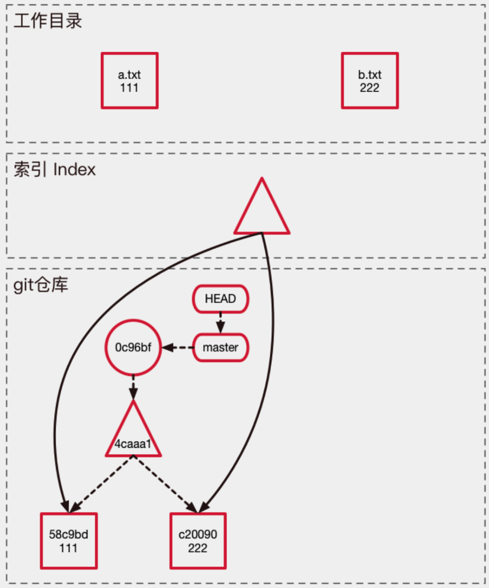
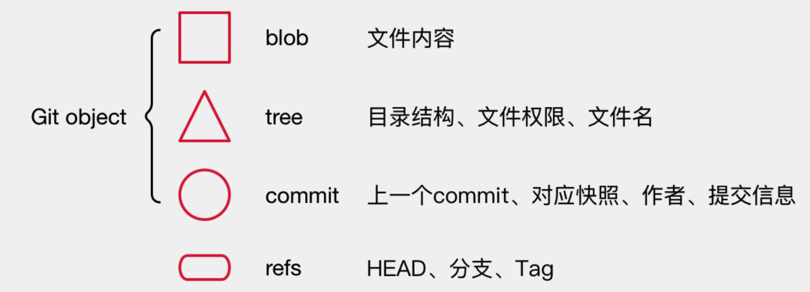
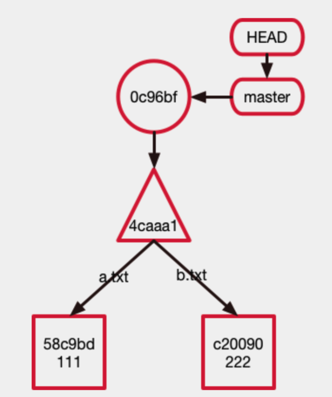

# Git

### 1、git介绍

#### 1.git简介

git 是一个分布式版本控制软件。

git 中有三大分区：

1. **工作目录**：操作系统中的文件系统，所有的代码文件的操作都在这里完成。
2. **索引 index**：文件的一个暂存区，会在下一次 commit 的时候被提交到git仓库。
3. **git仓库**：由 git object 记录着每一次提交的快照，以链式结构记录着提交的变更。



git object 中保存了什么内容：

- **blob object**：文件内容
- **tree object**：目录结构、文件权限、文件名
- **commit object**：上一个commit，对应快照、作者、提交信息

以上三种内容一旦创建之后就不能被变更。

- **refs object**：HEAD、分支、tag等。

Git object 的保存结构是以**哈希树**结构保存的：






#### 2.git常用操作

**1）分支**

```shell
# 新建一个分支，但依然停留在当前分支
$ git branch [branch-name

# 删除分支
$ git branch -d [branch-name]

# 切换到指定分支，并更新工作区
$ git checkout [branch-name]

# 切换到上一个分支
$ git checkout -

# 合并指定分支到当前分支
$ git merge [branch]
```

**2）提交**

```shell
# 提交暂存区到仓库区
$ git commit -m [message]

# 提交暂存区的指定文件到仓库区
$ git commit [file1] [file2] ... -m [message]
```

**3）添加删除文件**

```shell
# 添加指定文件到暂存区
$ git add [file1] [file2] ...

# 添加指定目录到暂存区，包括子目录
$ git add [dir]

# 添加当前目录的所有文件到暂存区
$ git add .

# 删除工作区文件，并且将这次删除放入暂存区
$ git rm [file1] [file2] ...

# 停止追踪指定文件，但该文件会保留在工作区
$ git rm --cached [file]
```

**4）远程同步**

```shell
# 下载远程仓库的所有变动
$ git fetch [remote]

# 取回远程仓库的变化，并与本地分支合并
$ git pull [remote] [branch]

# 上传本地指定分支到远程仓库
$ git push [remote] [branch]

# 强行推送当前分支到远程仓库，即使有冲突
$ git push [remote] --force

# 推送所有分支到远程仓库
$ git push [remote] --all
```

**5）撤销**

```shell
# 恢复暂存区的指定文件到工作区
$ git checkout [file]

# 恢复某个commit的指定文件到暂存区和工作区
$ git checkout [commit] [file]

# 恢复暂存区的所有文件到工作区
$ git checkout .

# 重置当前分支的指针为指定commit，同时重置暂存区，但工作区不变
$ git reset [commit]

# 查看每一个提交的记录
$ git reflog
```

### 2、git常见面试题

**1）为什么要把文件的权限和文件名存储在 tree object 而不是 blob object？**

因为文件的信息可能很大，假如文件的内容没有变更只是变更了文件名信息的话 blob object 就可以进行重用，只需要新建一个 tree object 就可以了，tree object 的体积远小于 blob object。

**2）每次commit，git存储的是全新的文件快照还是存储的文件的变更部分？**

存储的是**全新的文件快照**。

因为git要保证每一个读取一个快照节点的时候都是 O(1) 时间复杂度的，假如存储的是文件的变更部分则会导致需要从第一个快照开始进行叠加，会导致对应的时间复杂度变为 O(n)。

**3）git如何保证文件结构不被篡改？**

git和区块链的文件结构非常相似，两者都是基于**哈希树和分布式**。

**4）git如何获得一个干净的工作区间？**

```sh
$ git stash push
```

**5）git中如何删除敏感信息而不被记录**

```shell
$ git filter-branch --tree-filter 'rm password.txt' HEAD
```

