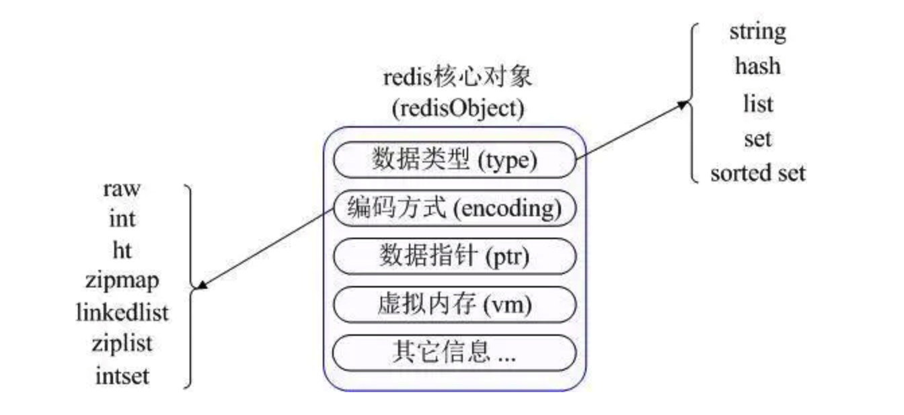

# 分布式缓存

### ==1.在项目中分布式缓存是如何使用？缓存使用不当会造成什么后果？==

#### （1）项目中缓存是如何使用的？

鑫课堂项目中的单点登录业务实现中使用到了分布式缓存来保存用户的身份信息。我们构建了一个认证系统，然后在该系统中使用 Redis 存储用户的身份信息。认证服务基于 Spring Security Oauth2 进行构建，并在其基础上作了一些扩展，采用JWT令牌机制，并自定义了用户身份信息的内容。将用户的 token 和 jwt 令牌存储在 redis 中。token作为 key，jwt 令牌作为 value。用户登录过程中将对应的身份信息保存到缓存中，在用户访问其他子系统的时候从缓存中读取用户的身份信息对用户进行身份验证和授权。

#### （2）使用缓存的好处？

主要从“**高性能**”和“**高并发**”这两点来看待这个问题。核心实现都是 redis 将数据保存在内存中保证的。

**1）高性能**

假如用户第一次访问数据库中的某些数据。这个过程会比较慢，因为是从硬盘上读取的。然后可以将从数据库访问的数据放到到缓存中，这样下一次再访问这些数据的时候就可以直接从缓存中获取了。因为操作缓存就是直接操作内存，所以速度相当快，这样就可以提高系统访问数据的性能。当数据发生改变的时候只需要同时改变缓存中相应的数据即可！

**2）高并发**

直接操作数据库是承受不了高并发的，像 Mysql 数据库建议的并发数是 2000/s，这是由于 Mysql 是比较重的数据库，而且数据都是保存在硬盘中的，每次从硬盘中读取是非常耗费时间的。但是缓存不一样，缓存是保存在内存中的，内存是可以支撑每秒十几万的并发数量的。这样就可以提高系统的并发数量。

#### （3）常见缓存的缺点？

1、数据双写不一致

2、缓存雪崩

3、缓存穿透

4、缓存并发竞争

以上的这些缺点的详细介绍以及具体的解决方案后续介绍。

### ==2.redis 和 memcached 有什么区别？redis 的线程模型是什么？为什么单线程的redis比多线程的 memcached 效率要高得多（为什么redis 是单线程的但是还是可以支撑高并发？）==

redis 其实是单线程异步工作模型。

#### （1）redis 和 memcached 的区别？

**1）redis支持服务器端的数据操作**：redis相比较于memcached来说，拥有更多的数据结构和支持更丰富的数据操作。

**2）集群模式**：memcached 没有原生的集群模式，但是 redis 是原生支持 cluster 模式的。

#### （2）redis 的单线程模型

**1）文件事件处理器**

redis 是基于 reactor 模式（**反应器模式**）开发了**网络事件处理器**，这个处理器就叫做**文件事件处理器（file event handler）**。这个**文件事件处理器是单线程的，所以redis才叫单线程模型**。它采用 **IO 多路复用机制**同时监听多个 socket，将产生事件的 socket 压入**内存队列**中，然后**事件分派器**根据 socket 上的**事件类型**来选择对应的**事件处理器**进行处理。

多个 socket 可能会并发产生不同的操作，每个操作对应不同的**文件事件**，但是 IO 多路复用程序会监听多个 socket，会将产生事件的 socket 放入队列中排队，事件分派器每次从队列中取出一个 socket，根据 socket 的事件类型交给对应的事件处理器进行处理。

文件事件处理器的结构包含 4 个部分：

- **多个 socket**
- **IO 多路复用程序**：epoll、select(**单线程或单进程同时监测若干个文件描述符是否可以执行IO操作的能力**)
- **文件事件分派器**：单线程
- **事件处理器（连接应答处理器、命令请求处理器、命令回复处理器）**：多线程

**因为文件事件分派器队列的消费是单线程的，所以Redis才叫单线程模型**。


一般来说 Redis 的瓶颈并不在 CPU，而在**内存和网络**。如果要使用 CPU 多核，可以搭建多个 Redis 实例来解决。

其实，Redis 4.0 开始就有多线程的概念了，比如 Redis 通过多线程方式在后台删除对象、以及通过 Redis 模块实现的阻塞命令等。

然后，Redis 6.0 在**网络 IO 处理方面上了多线程**，如网络数据的读写和协议解析等，需要注意的是，**执行命令的核心模块还是单线程的**。

内存不够的话，可以加内存或者做数据结构优化和其他优化等，但**网络的性能优化才是大头**，网络 IO 的读写在 Redis 整个执行期间占用了大部分的 CPU 时间，如果把网络处理这部分做成多线程处理方式，那对整个 Redis 的性能会有很大的提升。

**2）客户端和redis通信的一次流程**


要明白，通信是通过 socket 来完成的。

首先，Redis 服务端进程初始化的时候，会将 server socket 的 `AE_READABLE` 事件与连接应答处理器关联。

客户端 socket01 向 Redis 进程的 server socket 请求建立连接，此时 server socket 会产生一个 `AE_READABLE` 事件，IO 多路复用程序监听到 server socket 产生的事件后，将该 socket 压入队列中。文件事件分派器从队列中获取 socket，交给**连接应答处理器**。连接应答处理器会创建一个能与客户端通信的 socket01，并将该 socket01 的 `AE_READABLE` 事件与命令请求处理器关联。

假设此时客户端发送了一个 `set key value` 请求，此时 Redis 中的 socket01 会产生 `AE_READABLE` 事件，IO 多路复用程序将 socket01 压入队列，此时事件分派器从队列中获取到 socket01 产生的 `AE_READABLE` 事件，由于前面 socket01 的 `AE_READABLE` 事件已经与命令请求处理器关联，因此事件分派器将事件交给命令请求处理器来处理。命令请求处理器读取 socket01 的 `key value` 并在自己内存中完成 `key value` 的设置。操作完成后，它会将 socket01 的 `AE_WRITABLE` 事件与命令回复处理器关联。

如果此时客户端准备好接收返回结果了，那么 Redis 中的 socket01 会产生一个 `AE_WRITABLE` 事件，同样压入队列中，事件分派器找到相关联的命令回复处理器，由命令回复处理器对 socket01 输入本次操作的一个结果，比如 `ok` ，之后解除 socket01 的 `AE_WRITABLE` 事件与命令回复处理器的关联。

这样便完成了一次通信。

#### ==（3）问什么 redis 单线程模型也能效率这么高？==

- redis 单线程模型的核心是基于**非阻塞的IO多路复用**，IO多路复用会同时**轮询**的监听多个 socket，然后直接将对应的socket事件压入到队列中去。然后就继续监听其他的socket，整个流程是非阻塞的。
- 整体的流程都是**纯内存操作**的，性能非常高。
- 单线程也可以避免多线程的频繁上下文切换问题，预防了多线程可能产生的竞争问题。

### ==3.redis都有哪些数据类型，分别在哪些场景下使用比较合适？==

redis支持：**string（字符串），hash（哈希），list（列表），set（集合）及zset(sorted set：有序集合)**

redis最经典的使用场景就是**新浪微博**，新浪微博中的数据都是基于redis来构建的。

- **String**，基本的键值对缓存；字符串保存；日志缓存，微信文章阅读数；
- **Hash**，保存结构对象；字典保存；用户对象缓存，购物车缓存；
- **List**，保存列表数据；双向链表保存；粉丝列表数据缓存，微信公众号消息流；
- **Set**，保存集合数据；value永远为null的HashMap保存；关注用户数据缓存、粉丝数据缓存，方便进行共同好友、共同粉丝的**关注模型**的操作，微信朋友圈点赞，微信小程序抽奖；
- **Zset**，带有score的集合数据；hashmap+跳表保存；排行榜缓存、热搜缓存；

先通过一张图了解下Redis内部内存管理中是如何描述这些不同数据类型的：



首先Redis内部使用一个redisObject对象来表示所有的key和value，redisObject最主要的信息如上图所示：type代表一个value对象具体是何种数据类型，encoding是不同数据类型在redis内部的存储方式，比如：type=string代表value存储的是一个普通字符串，那么对应的encoding可以是raw或者是int，如果是int则代表实际redis内部是按数值型类存储和表示这个字符串的，当然前提是这个字符串本身可以用数值表示，比如:"123" "456"这样的字符串。

这里需要特殊说明一下vm字段，只有打开了Redis的虚拟内存功能，此字段才会真正的分配内存，该功能默认是关闭状态的。通过上图我们可以发现Redis使用redisObject来表示所有的key/value数据是比较浪费内存的，当然这些内存管理成本的付出主要也是为了给Redis不同数据类型提供一个统一的管理接口，实际作者也提供了多种方法帮助我们尽量节省内存使用，我们随后会具体讨论。

#### Strings

**1）简单介绍**

**string** 是 redis 最基本的类型，一个 key 对应一个 value。value其实不仅是String，也可以是数字。

string 类型是二进制安全的。意思是 redis 的 string 可以包含任何数据。比如jpg图片或者序列化的对象。string 类型是 Redis 最基本的数据类型，string 类型的值最大能存储 512MB。

常用命令：get、set、incr、decr、mget等。

**2）使用场景**

常规key-value缓存应用。

常规计数: 微博数, 粉丝数。 

**3)实现方式**

String在redis内部存储默认就是一个字符串，被redisObject所引用，当遇到incr,decr等操作时会转成数值型进行计算，此时redisObject的encoding字段为int。

#### Hash

**1）简单介绍**

**Hash** 是一个键值(key => value)对集合。Redis hash 是一个 string 类型的 field 和 value 的映射表，hash 特别适合用于存储对象。 常用命令：hget,hset,hgetall 等。

**2）实现原理**

Redis 的 Hash 类型键使用以下两种数据结构作为底层实现:

- 字典
- 压缩列表

因为压缩列表比字典更节省内存， 所以程序在创建新 Hash 键时， **默认使用压缩列表作为底层实现**， 当有需要时， 程序才会将底层实现从压缩列表转换到字典。

**3）使用场景**

使用存储对象。比如可以用来存储一个用户信息对象数据，包含以下信息：用户ID为查找的key，存储的value用户对象包含姓名，年龄，生日等信息。Redis的Hash实际是内部存储的Value为一个HashMap，并提供了直接存取这个Map成员的接口。也就是说，Key仍然是用户ID, value是一个Map，这个Map的key是成员的属性名，value是属性值，这样对数据的修改和存取都可以直接通过其内部Map的Key(Redis里称内部Map的key为field), 也就是通过 key(用户ID) + field(属性标签) 就可以操作对应属性数据了，既不需要重复存储数据，也不会带来序列化和并发修改控制的问题，很好的解决了问题。

#### List

**1）简单介绍**

**list** 列表是简单的字符串列表，按照插入顺序排序。你可以添加一个元素到列表的头部（左边）或者尾部（右边）。

常用命令：lpush（添加左边元素）,rpush,lpop（移除左边第一个元素）,rpop,lrange（获取列表片段，LRANGE key start stop）等。

**2）应用场景**

Redis list的应用场景非常多，也是Redis最重要的数据结构之一，比如twitter的关注列表，粉丝列表等都可以用Redis的list结构来实现。

消息队列系统：使用list可以构建队列系统，使用sorted set甚至可以构建有优先级的队列系统。

**3）实现原理**

Redis list的实现为一个双向链表，即可以支持反向查找和遍历，更方便操作，不过带来了部分额外的内存开销，Redis内部的很多实现，包括发送缓冲队列等也都是用的这个数据结构。

#### Set

**1）简单介绍**

**set** 是string类型的无序集合。集合是通过hashtable实现的，概念和数学中个的集合基本类似，可以交集，并集，差集等等，set中的元素是没有顺序的。所以添加，删除，查找的复杂度都是O(1)。

Redis set对外提供的功能与list类似是一个列表的功能，特殊之处在于set是可以自动排重的，当你需要存储一个列表数据，又不希望出现重复数据时，set是一个很好的选择，并且set提供了判断某个成员是否在一个set集合内的重要接口，这个也是list所不能提供的。

常用命令：sadd,spop,smembers,sunion 等。

**2）使用场景**

主要用来进行交集，并集，差集的计算。

比如：在微博中，可以将一个用户所有的关注人存在一个集合中，将其所有粉丝存在一个集合。Redis还为集合提供了求交集、并集、差集等操作，可以非常方便的实现如共同关注、共同喜好、二度好友等功能，对上面的所有集合操作，你还可以使用不同的命令选择将结果返回给客户端还是存集到一个新的集合中。

**3）实现原理**

 set 的内部实现是一个 value永远为null的HashMap，实际就是通过计算hash的方式来快速排重的，这也是set能提供判断一个成员是否在集合内的原因。

#### Sorted Sets（Redis zset）

**1）简单介绍**

**zset** 和 set 一样也是string类型元素的集合,且不允许重复的成员。 

Redis sorted set的使用场景与set类似，区别是set不是自动有序的，而sorted set可以通过用户额外提供一个优先级(score)的参数来为成员排序，并且是插入有序的，即自动排序。

当你需要一个有序的并且不重复的集合列表，那么可以选择sorted set数据结构。和Set相比，**Sorted Set关联了一个double类型权重参数score**，使得集合中的元素能够按score进行有序排列，redis正是通过分数来为集合中的成员进行从小到大的排序。zset的成员是唯一的,但分数(score)却可以重复。比如一个存储全班同学成绩的Sorted Set，其集合value可以是同学的学号，而score就可以是其考试得分，这样在数据插入集合的时候，就已经进行了天然的排序。另外还可以用Sorted Set来做带权重的队列，比如普通消息的score为1，重要消息的score为2，然后工作线程可以选择按score的倒序来获取工作任务。让重要的任务优先执行。

**2）使用场景**

比如twitter 的public timeline可以以发表时间作为score来存储，这样获取时就是自动按时间排好序的。

还有一些对应的排行榜等。

**2）底层实现**

Redis sorted set的内部使用**HashMap和跳表(SkipList)**来保证数据的存储和有序，**HashMap里存放的是成员到score的映射，而跳跃表里存放的是所有的成员，排序依据是HashMap里存的score,使用跳跃表的结构可以获得比较高的查找效率**，并且在实现上比较简单。

有序集合对象的编码可以是**`ziplist`（压缩列表）或者`skiplist`**（跳表）。同时满足以下条件时使用ziplist编码：

- 元素数量小于128个
- 所有member的长度都小于64字节

以上两个条件的上限值可通过zset-max-ziplist-entries和zset-max-ziplist-value来修改。

`ziplist`编码的有序集合使用紧挨在一起的压缩**列表**节点来保存，第一个节点保存member，第二个保存score。ziplist内的集合元素按score从小到大排序，score较小的排在表头位置。

`skiplist`编码的有序集合底层是一个命名为`zset`的结构体，而一个zset结构同时包含一个**字典（哈希表）**和一个**跳表**。**跳表按score从小到大保存所有集合元素**。而**字典则保存着从member到score的映射**，这样就可以用O(1)的复杂度来查找member对应的score值。虽然同时使用两种结构，但它们会通过指针来共享相同元素的member和score，因此不会浪费额外的内存。

**3）跳表**

**跳表(skip List)**是一种随机化的数据结构，**基于并联的链表**，实现简单。**插入、删除、查找的复杂度均为O(logN)**。

**4）Redis为什么用skiplist而不用平衡树？**

这里从**内存占用、对范围查找的支持和实现难易程度**这三方面总结的原因。

skiplist与平衡树、哈希表的比较

- skiplist和各种平衡树（如AVL、红黑树等）的元素是有序排列的，而哈希表不是有序的。因此，在哈希表上只能做单个key的查找，不适宜做范围查找。所谓范围查找，指的是查找那些大小在指定的两个值之间的所有节点。
- 在做范围查找的时候，平衡树比skiplist操作要复杂。在平衡树上，我们找到指定范围的小值之后，还需要以中序遍历的顺序继续寻找其它不超过大值的节点。如果不对平衡树进行一定的改造，这里的中序遍历并不容易实现。而在skiplist上进行范围查找就非常简单，只需要在找到小值之后，对第1层链表进行若干步的遍历就可以实现。
- 平衡树的插入和删除操作可能引发子树的调整，逻辑复杂，而skiplist的插入和删除只需要修改相邻节点的指针，操作简单又快速。
- 从内存占用上来说，skiplist比平衡树更灵活一些。一般来说，平衡树每个节点包含2个指针（分别指向左右子树），而skiplist每个节点包含的指针数目平均为1/(1-p)，具体取决于参数p的大小。如果像Redis里的实现一样，取p=1/4，那么平均每个节点包含1.33个指针，比平衡树更有优势。
- 查找单个key，skiplist和平衡树的时间复杂度都为O(log n)，大体相当；而哈希表在保持较低的哈希值冲突概率的前提下，查找时间复杂度接近O(1)，性能更高一些。所以我们平常使用的各种Map或dictionary结构，大都是基于哈希表实现的。
- 从算法实现难度上来比较，skiplist比平衡树要简单得多。

### ==4.redis的过期策略是怎样的？内存淘汰机制有哪些？能手写LRU吗？==

缓存是基于内存的，而且内存是有限的，因此缓存中的数据是会过期的。

那么就可以在在存储数据的时候设置过期时间，在指定时间之后就会失效。但是这些事根据redis的过期策略来决定的。

#### redis的过期策略是怎么样的？

redis针对过期数据的删除策略是：**定期删除+惰性删除**

**定期删除**是指 redis 默认是每隔 **100ms** 就**随机抽取**一些设置了过期时间的 key，检查其是否过期，如果过期就删除。（注意这里是**随机抽取**的。为什么要随机呢？你想一想假如 redis 存了几十万个 key ，每隔 100ms 就遍历所有的设置过期时间的 key 的话，就会给 CPU 带来很大的负载！）

上面的定期删除机制可能会导致还有一些已经过期的数据在内存中并没有被删除，依旧占用着内存。此时就有另一个过期策略：**惰性删除**。惰性删除是指假如该数据已经过期了，那么在下一次在查找该数据的时候会直接先把该数据删除，然后不会返回任何数据。

但是上面的惰性删除是指需要在查询数据的时候才会对过期的数据进行删除。假如没有查询的话则过期的数据还是会继续留在内存中占用着内存。

那么就得需要介绍一下 redis 的内存淘汰机制：

#### redis的内存淘汰机制

redis 支持如下几种内存淘汰机制：

- noeviction: 当内存不足以容纳新写入数据时，新写入操作会报错（这个一般没人用吧，实在是太恶心了。）
- **allkeys-lru**：当内存不足以容纳新写入数据时，在所有的**键空间**中，移除最近最少使用的 key（这个是**最常用**的）。
- allkeys-random：当内存不足以容纳新写入数据时，在**键空间**中，随机移除某个 key（这个一般没人用吧，为啥要随机，肯定是把最近最少使用的 key 给干掉啊。）
- volatile-lru：当内存不足以容纳新写入数据时，在**设置了过期时间的键空间**中，移除最近最少使用的 key（这个一般不太合适）。
- volatile-random：当内存不足以容纳新写入数据时，在**设置了过期时间的键空间**中，**随机移除**某个 key。
- volatile-ttl：当内存不足以容纳新写入数据时，在**设置了过期时间的键空间**中，有**更早过期时间**的 key 优先移除。

#### 手写LRU

LRU底层实现需要用到**双向链表**：

```java
class LRUCache {
    // 自定义双向链表节点
    class DLinkedNode{
        int key;
        int value;
        DLinkedNode prev;
        DLinkedNode next;
        DLinkedNode(){}
        DLinkedNode(int key, int value){
            this.key = key;
            this.value = value;
        }
    }

    // 当前使用的数据量
    private int size = 0;
    // 整体的容量
    private int capacity = 0;
    // 保存键值对数据
    private Map<Integer,DLinkedNode> map = new HashMap<>();
    // 双向链表保存当前的访问顺序
    private DLinkedNode head,tail;

    // 初始化LRU对象
    public LRUCache(int capacity) {
        this.size = 0;
        this.capacity = capacity;
        // 使用伪头节点和伪尾节点
        head = new DLinkedNode();
        tail = new DLinkedNode();
        head.next = tail;
        tail.prev = head;
    }
    
    // get操作
    public int get(int key) {
        // 从map中进行查找对应的节点
        DLinkedNode node = map.get(key);
        if(node == null){
            return -1;
        }
        // 如果key存在则移动到头部
        move2Head(node);
        return node.value;
    }
    
    // put操作
    public void put(int key, int value) {
        // 首先查询该数据是更新还是插入
        DLinkedNode node = map.get(key);
        if(node == null){
            // 插入节点
            node = new DLinkedNode(key,value);
            map.put(key,node);
            // 将该节点添加到头部
            add2Head(node);
            this.size++;
            // 判断当前的容量是否超过总的容量
            if(this.size > this.capacity){
                // 如果超出容量删除双向链表的尾节点
                DLinkedNode tail = removeTail();
                map.remove(tail.key);
                this.size--;
            }
        }else{
            // 更新节点
            node.value = value;
            // 将节点移动到头部
            move2Head(node);
        }
    }
    // 将传入的节点移动到链表头部
    private void move2Head(DLinkedNode node){
        // 将该节点删除
        removeNode(node);
        // 将该节点添加到头节点位置上
        add2Head(node);
    }
    // 删除当前链表的尾节点
    private DLinkedNode removeTail(){
        // 获取当前链表的尾节点
        DLinkedNode node = this.tail.prev;
        // 删除该节点
        removeNode(node);
        // 将该节点进行返回
        return node;
    }
    // 删除双向链表的节点
    private void removeNode(DLinkedNode node){
        // 更改前一个节点的next指针
        node.prev.next = node.next;
        // 更改后一个节点的prev指针
        node.next.prev = node.prev;
    }
    // 将节点插入到链表的头节点
    private void add2Head(DLinkedNode node){
        node.next = this.head.next;
        this.head.next.prev = node;
        this.head.next = node;
        node.prev = this.head;
    }
}

/**
 * Your LRUCache object will be instantiated and called as such:
 * LRUCache obj = new LRUCache(capacity);
 * int param_1 = obj.get(key);
 * obj.put(key,value);
 */
```

### 5.怎么保证redis是高并发和高可用？redis的主从复制原理能介绍一下吗？redis的哨兵原理能介绍一下吗？

#### redis如何保证高并发以及高可用的？

**1）高并发**

redis实现高并发的瓶颈在于：机器数量，单机redis能够承载的QPS大概在上万到几万不等。

如果 redis 要支撑超过10万+的话就是使用**读写分离**操作，一般用redis都是用来支撑读的高并发，而写的请求较少。

读写分离也就是**主从架构**，一主多从，主写从读。将写请求写入到 master redis 节点上，然后 mater 将数据在同步到 slave redis 上。所有的读操作都由 slave redis 来负责。

而且这种架构的好处在于可以支持水平扩容，也就是可以通过增加 slave redis 节点来增加并发。

**主从架构 -> 读写分离 -> 高并发**

**2）高可用**

**主从架构+哨兵 -> 主备切换**

但是假如 master node 宕机之后就无法写数据了，整个系统也就不可用了，此时所有的请求都直接都直接落入到 mysql 数据库中，造成缓存雪崩。

此时就得使用 redis 的**高可用架构**，也就是**故障转移，failover**，也可以叫做主备切换。当在 master node 故障的时候自动检测，将某个 salve node 自动切换为 master node的过程就叫做主备切换。这个过程就实现了 redis 主从架构下的高可用性。

为了监控 master node 的存活情况，就得使用到一个节点就是 sentinal node，也就是**哨兵节点**。该节点就负责监控 master node 的状态，当 master node 宕机的时候就自动选举一个 slave node 为 master node。

#### redis的主从复制原理能介绍一下吗？

**1）主从架构**

redis replication 也就是 redis 的主从结构，也就是一个 master node 配置多个 slave node ，客户端将数据写入到 master node 上，然后返回客户端数据写入成功的提示。之后 master node 再将数据复制到 slave node 上就可以了，采用的是异步执行的方式。

当启动一个 slave node 的时候，它会发送一个 PSYNC 命令给 master node。

如果这是 slave node 首次连接 master node 的话，那么会触发一次 **full resynchronization**，开始 full resynchronization 的时候，master 会启动一个后台线程，开始生成一份 RDB 快照文件，同时还会将从客户端收到的所有写命令缓存在内存中。RDB文件生成完毕之后，master会将这个RDB发送给 salve，slave 会先写入本地磁盘，然后再从本地磁盘加载到内存中。然后master node 内存中缓存的这些数据也会通过写命令发送到 salve，slave会同步这些数据。

如果这是 salve node 重新连接到 master node，那么 master node 仅仅会复制给 salve node 缺少的数据。

slave node 和master node 如果发生了网络故障，断开了连接则会自动重连。master node 发现有多个 salve node 都来重新连接，仅仅会启动一个 RDB save 操作，用一份数据服务所有的 slave node。

**2）主从架构中两种会丢失数据的情况**

1、**异步主从复制**：因为 master -> slave 的复制是异步的，所以可能有部分数据还没有复制到 salve，master 就宕机了，此时这部分数据就丢失了。

2、**脑裂问题**：redis集群出现了异常性的有相同数据、相同工作的两个 master 节点称之为 redis 的脑裂问题。也就是 master 节点由于网络问题无法和其他的 salve node 和 sentinal node 进行通信， sentinal node 就以为 master 节点宕机了，然后就执行故障转移将一个 salve node 选举为 master node，但其实原先的 master node 好在正常工作，这样就导致出现了两个 master node。

此时假如有 client 还是继续向原先旧的 master node 写入数据，当脑裂问题解决的时候 sentinal node 会将原先的 master node 作为新的 salve node，然后同步此时的 master node 数据，这样就会导致原先在旧的 master node 上的一部分数据就丢失了。

**3）redis数据丢失的解决方案？**

解决数据丢失就靠两个参数的设置：

```json
min-slave-to-write 1
min-slave-max-lag 10 
```

以上配置的内容是：要求至少有1个salve 数据复制和同步的延迟不能超过10s。也就是说如果说一旦所有的 salve，数据复制和同步的延迟都超过了10s，那么这个时候 master 就不会在接收任何请求了。

**1）异步主从复制丢失解决**

有了 min-slave-max-lag 这个配置，就可以确保说，一旦slave复制数据和ack延时太久，就认为可能 master 宕机后损失的数据太多了，那么就拒绝写请求，这样把 master 宕机时由于部分数据未同步到 slave 导致的数据丢失降低到可控的范围内。

**2）脑裂数据丢失的解决**

如果一个 master 出现了脑裂，跟其他的 salve 丢失了连接，那么上面两个配置可以确保说，如果不能继续给指定数量的 salve 发送数据，而且 salve 超过 10s没有给自己 ack消息，那么就直接拒绝客户端的写请求。

这样脑裂后的旧master就不会接受client的新数据，也就避免了数据丢失。然后将旧 client 上的数据进行数据降低操作，先写入到磁盘中，然后在重新写入到新 master 上。

#### redis 的哨兵原理能介绍一下吗？

**1）哨兵的介绍**

sentinal，中文名就是哨兵

哨兵是redis集群架构中非常重要的一个组件，主要的功能如下：

- **集群监控**：负责监控 redis master 和 salve 进程是否正常工作；
- 消息通知：如果某个 redis 实例有故障，那么哨兵负责发送消息作为报警通知给管理员；
- **故障转移**，如果 master node 挂掉了，会自动转移到 salve node 上；
- 配置中心：如果故障转移发生了，通知 client 客户端新的 master 地址；

哨兵本身是分布式的，需要作为一个哨兵集群去运行，相互协同工作。

并且在故障转移的过程中，如果一个 master node 宕机了，此时需要大部分的哨兵都同意才可以选举一个 slave node 为 master node，这里涉及到了分布式选举的问题。

**2）哨兵的核心知识**

- 哨兵至少需要**3**个实例来保证自己的健壮性；
- 哨兵+redis主从架构是不会保证数据零丢失的，只能保证 redis 集群的高可用性；

**3）为什么redis哨兵集群只有2个节点无法正常工作？**

如果哨兵集群设置了2个节点，同时设置 quorum =1，也就是说当 master 宕机的时候两个哨兵中只要有一个哨兵认为可以进行故障转移就会选出一个哨兵来完成故障转移操作。

但是得有个前提就是 majority，也就是哨兵运行的最小个数。（2个哨兵的majority是2，3个哨兵的majority是2，5个哨兵的majority是3），也就是说只有当2个哨兵都运行的时候才可以执行故障转移。假如一个哨兵宕机的话就会出现无法执行故障转移的问题。

这就是为什么不能设置2个节点的哨兵集群。

而经典的哨兵集群是三个节点的，这样就算有一个哨兵节点宕机了也是可以继续执行故障转移的。

**4）sdown和odown转换机制**

sdown 和 odown 是两种宕机状态

**sdown**是主观宕机，就是一个哨兵如果觉得一个 master 宕机了，那么就是主观宕机。

**odown**是客观宕机，如果quorum数量的哨兵都觉得一个master宕机了，那么就是客观宕机。

sdown的达成条件很简单，如果一个哨兵ping一个master，超过了 is-master-down-after-milliseconds 指定的毫秒数之后就主观认为master宕机了。

sdown到odown转换的条件很简单，如果一个哨兵在指定时间内，收到了quorum指定数量的其他哨兵也认为那个 master 是 sdown了，那么就认为是 odown le，客观认为 master 宕机。

**5）哨兵的自动发现机制**

哨兵互相之间的发现，是通过 Redis 的 `pub/sub` 系统实现的，每个哨兵都会往 `__sentinel__:hello` 这个 channel 里发送一个消息，这时候所有其他哨兵都可以消费到这个消息，并感知到其他的哨兵的存在。

每隔两秒钟，每个哨兵都会往自己监控的某个 master+slaves 对应的 `__sentinel__:hello` channel 里**发送一个消息**，内容是自己的 host、ip 和 runid 还有对这个 master 的监控配置。

每个哨兵也会去**监听**自己监控的每个 master+slaves 对应的 `__sentinel__:hello` channel，然后去感知到同样在监听这个 master+slaves 的其他哨兵的存在。

每个哨兵还会跟其他哨兵交换对 `master` 的监控配置，互相进行监控配置的同步。

**6）slave 配置的自动纠正**

哨兵会负责自动纠正 slave 的一些配置，比如 slave 如果要成为潜在的 master 候选人，哨兵会确保 slave 复制现有 master 的数据；如果 slave 连接到了一个错误的 master 上，比如故障转移之后，那么哨兵会确保它们连接到正确的 master 上。

**7）slave->master 选举算法**

如果一个 master 被认为 odown 了，而且 majority 数量的哨兵都允许主备切换，那么某个哨兵就会执行主备切换操作，此时首先要选举一个 slave 来，会考虑 slave 的一些信息：

- 跟 master 断开连接的时长
- slave 优先级
- 复制 offset
- run id

如果一个 slave 跟 master 断开连接的时间已经超过了 `down-after-milliseconds` 的 10 倍，外加 master 宕机的时长，那么 slave 就被认为不适合选举为 master。

```
(down-after-milliseconds * 10) + milliseconds_since_master_is_in_SDOWN_state
```

接下来会对 slave 进行排序：

- 按照 slave 优先级进行排序，slave priority 越低，优先级就越高。
- 如果 slave priority 相同，那么看 replica offset，哪个 slave 复制了越多的数据，offset 越靠后，优先级就越高。
- 如果上面两个条件都相同，那么选择一个 run id 比较小的那个 slave。

**8）quorum 和 majority**

每次一个哨兵要做主备切换，首先需要 quorum 数量的哨兵认为 odown，然后选举出一个哨兵来做切换，这个哨兵还需要得到 majority 哨兵的授权，才能正式执行切换。

如果 quorum < majority，比如 5 个哨兵，majority 就是 3，quorum 设置为 2，那么就 3 个哨兵授权就可以执行切换。

但是如果 quorum >= majority，那么必须 quorum 数量的哨兵都授权，比如 5 个哨兵，quorum 是 5，那么必须 5 个哨兵都同意授权，才能执行切换。

**9）configuration epoch**

哨兵会对一套 Redis master+slaves 进行监控，有相应的监控的配置。

执行切换的那个哨兵，会从要切换到的新 master（salve->master）那里得到一个 configuration epoch，这就是一个 version 号，每次切换的 version 号都必须是唯一的。

如果第一个选举出的哨兵切换失败了，那么其他哨兵，会等待 failover-timeout 时间，然后接替继续执行切换，此时会重新获取一个新的 configuration epoch，作为新的 version 号。

**10）configuration 传播**

哨兵完成切换之后，会在自己本地更新生成最新的 master 配置，然后同步给其他的哨兵，就是通过之前说的 `pub/sub` 消息机制。

这里之前的 version 号就很重要了，因为各种消息都是通过一个 channel 去发布和监听的，所以一个哨兵完成一次新的切换之后，新的 master 配置是跟着新的 version 号的。其他的哨兵都是根据版本号的大小来更新自己的 master 配置的。

### ==6.redis的持久化有哪几种方式？不同的持久化机制都有什么优缺点？持久化机制具体的底层是如何实现的？==

这几个问题都是考虑仅仅将数据缓存在内存中，但是此时redis宕机了，在重启，内存里的数据就全部丢失了。

因此就得使用 redis 的持久化机制来将数据写入内存的同时慢慢的将数据写入到磁盘文件中，进行持久化。这样 redis 宕机重启之后就会自动的从磁盘上加载之前持久化的数据，这样仅仅只会丢失少量的数据，但至少不是全部数据丢失。

假如没有做持久化的话，那么当redis出现灾难性故障之后重启redis之后，因为redis 中没有数据则会导致 redis 出现**缓存雪崩**，即所有的请求都没有经过缓存而是直接落到了 mysql 等数据源。这样会导致 mysql 挂掉，导致整个系统崩溃。

#### redis的持久化机制

redis持久化的意义在于**故障恢复**，当redis集群出现灾难级的问题的时候会导致在内存中的数据会丢失。为了应对故障发生之后的数据恢复，必须得对redis的重要数据进行持久化，也就是将内存数据写入到磁盘中，然后定期的将磁盘备份定期同步和备份到一些云存储服务上，这样只会导致丢失少量的数据，不至于丢失全部的数据。

主要有两种持久化机制：**RDB（内存快照）、AOF（命令追加）**

**1）RDB**

RDB持久化机制会每隔一定时间生成 redis 内存中数据的完整快照。

**2）AOF**

AOF持久化机制会将 redis 中每条**写入**的命令作为日志，以 **append-only** 的模式写入到一个日志文件中，在 redis 重启的时候，可以通过回放 AOF 日志中的写入命令来重新构建整个缓存数据。

当有 redis 的写入命令到来的时候会自动将其写入到 AOF 持久化文件中，注意这里其实会首先将数据写入到 os cache 中，然后操作系统每隔 1s 会执行一次 fsync 操作将 os cache 中的数据写入到文件中。

注意由于 redis 的内存是有限的，因此不可能一直的进行数据的写入，当写入的数据达到 redis 的内存总量的时候会执行 redis 的内存淘汰机制（LRU等）来清理掉一些没用的数据。但是这个操作是**不影响 **AOF 的持久化日志文件的，也就是 AOF 的持久化日志文件是**只保存写入的命令**的。这样当 redis 在内存淘汰机制之后就会继续执行数据写入命令，而 AOF 也是会继续将命令以日志的形式写入到 AOF 日志文件中去。这样就会导致 AOF 日志文件持续增大。这个时候当 redis 继续写入数据到内存满的时候 redis 就会执行 **rewrite** 操作，将当前内存中的数据重新写入到一个新的 AOF 日志文件中，然后删除旧的 AOF 日志文件，同时新写入的数据也会直接写入到新的 AOF 文件中。

而保存的 AOF 文件则可以将其同步备份到云服务中。

**3）总结**

**RDB机制是内存快照；AOF机制是写命令追加。**

当同时使用 RDB 和 AOF 的时候，在 redis 重启的时候会选择使用 AOF 来重新构建数据，因为 AOF 中的数据更加完整。

#### 不同持久化机制的优缺点

**1）RDB机制的优点**

- RDB会生成多个数据文件，每个数据文件都代表了某一个时刻中 redis 的数据，这种多个数据文件的方式非常适合做冷备份。
- RDB是直接写到redis**内存**中去的，在一定的时候才会fork出一个**子进程**将其写入到磁盘，这样会保证RDB的性能非常高。
- RDB在恢复的时候直接将其加载到内存中即可，相比较于AOF需要对指令进行回放操作更加快速。

综上所述，RDB非常适合做冷备份。

**2）RDB机制的缺点**

- 可能会丢失比较多的数据（这也是RDB最大的缺点，不适合作为第一恢复方案）。由于RDB是每隔一定的时间才将内存快照写入到磁盘，假如在时间间隔中redis出现故障的话会导致丢失在这个时间间隔中的数据。
- RDB每次在fork子进程执行RDB数据快照文件的时候，如果数据文件特别大，可能会导致当前redis服务暂停一段时间（一般不要让RDB的时间间隔太长，避免文件过大对redis的性能造成影响）。

**3）AOF机制的优点**

- AOF可以更好的保护数据不丢失，一般AOF会每隔**1s**通过后台线程执行一次fsync操作，最多丢失1s的数据。
- AOF日志文件以append-on模式写入，所以没有任何磁盘寻址的开销，写入性能非常高，而且文件不容易破损。
- AOF日志文件即使过大的时候，出现后台重写操作，也不会影响客户端的读写。因为在 rewrite 的时候，后台会**新创建一个线程**来创建一个新的日志文件。
- AOF日志文件是可读的，方便人员对其进行修改。

**4）AOF机制的缺点**

- 相比较于RDB，AOF的日志文件更大。
- 数据恢复时间较长。
- AOF开启后会导致redis的写数据性能降低。但一般配置为每秒fsync一次日志文件，性能也还是可以的。
- AOF记录的日志有可能出现bug。

Redis **4.0** 开始支持 **RDB 和 AOF 的混合持久化**（默认关闭）。

如果把混合持久化打开，AOF 重写的时候就直接**把 RDB 的内容写到 AOF 文件开头**。

这样做的好处是可以结合 RDB 和 AOF 的优点, 快速加载同时避免丢失过多的数据。

当然缺点也是有的， AOF 里面的 RDB 部分是压缩格式不再是 AOF 格式，可读性较差。

### 7.redis集群模式的工作原理了解吗？在集群模式下，redis 的key是如何寻址的？分布式寻址都有哪些算法？了解一致性hash算法吗？

目前使用 redis 都是以 **redis cluster** 模式也就是集群模式部署的，redis的集群模式可以做到在多台机器上，部署多个 redis 实例，每个实例存储一部分数据，当集群中的实例出现故障的时候就可以很方便的交由其他实例接着进行处理。因此有关 redis 的集群模式肯定是要被问的。

#### redis的集群模式的工作原理？

**1）传统的redis高并发高可用实现机制**

redis一般情况下是部署的是单 master 架构的模式，也就是一个 master 节点，一个 slave 节点，一个 sentinal 节点。然后所有的写请求都交由 master 去处理，读请求交由 slave 去处理。slave 同步 master 中的所有数据，sentinal 节点负责监控 master 节点的数据。这种情况下导致的问题是 master 和 slave 节点中存储的数据是一样的，也就是 master 中存多少数据则 slave 中也存多少数据。这就导致系统出现了性能瓶颈。

传统的 redis 高并发高可用的架构是：**replication复制+主从架构+读写分离+哨兵集群**

**2）redis cluster**

但是假如 redis 中需要保存大量的数据的时候所对应的解决方案就是增加多个 master 节点，也就是**横向扩容 master 节点**，多个 master 节点就能存放更多的数据。

为了实现上面的结构就得使用 **redis cluster** 模式，该模式就可以支撑 n 个 master node 节点，每个master node 可以挂载多个 slave node。

redis cluster 具有如下的优点：

- **读写分离架构**：对于每个 master 来说，写请求使用 master 进行处理，读请求使用 slave 进行处理。
- **高可用**：每个 master 可以配置多个 slave 节点，当 master 宕机的时候则**自动切换 slave 为新的 master**。

这样我们只需要使用 redis cluster 来搭建对应的 redis 集群，免去手动搭建 replication+主从+哨兵的集群了。

在 redis cluster 架构下，每个 redis 需要开放两个**端口号**（比如一个是6379，另外一个就是加10000之后的端口号）。普通端口用于向客户端提供服务，加10000之后的端口号用来进行节点间通信，也就是 cluster bus （集群总线）的通信，用来进行故障检测，配置更新，故障转移等。

**3）两者的区别**

- replication：一个master，多个slave，slave 的数量由需求决定，然后在自己搭建一个 sentinal 集群来监控 master 节点的状态就可以保证整体的高可用了。
- redis cluster：主要是针对**海量数据+高并发+高可用**的场景。如果数据量大则建议使用 redis，这种工作模式是不需要使用哨兵节点的。
- sentinel着眼于高可用，Cluster提高并发量。

#### 分布式寻址的算法

redis cluster 中的 key 是通过对应的**分布式寻址算法**来寻址的。

不同的分布式寻址算法决定了在多个 master 节点的时候数据如何分布到这些节点上去。

主要有以下三种：

- **hash算法**：最简单的hash算法，通过取余数的方式将写请求 hash 到对应的 master 节点上，但是假如出现 master 故障的话就会 hash 计算结果错乱，此时会导致几乎接近100%的key找不到对应的值，导致出现缓存穿透的问题。
- **一致性hash算法**：一致性hash算法在简单的hash算法的基础上将各个 master 节点构成一个**逻辑上的圆环**，然后一个 key 过来计算其的 hash 值，然后**顺着圆环以顺时针的方向去找最近的一个 master 节点**，然后将数据写入到该节点上。这样假如某一个 master 宕机了，然后对应的 key 会按照圆环找到下一个 master，但这个 master 上并没有存储对应的数据，但是这样只会导致宕机的那个 master 节点上存储的数据失效，并不会导致全部数据失效。还是很好的。但是这种结构还会导致一个比较严重的问题就是**缓存热点**的问题，即key可能大量集中在某个 hash 区间内，这样会导致大量的数据涌入同一个 master 内，造成 master 的热点问题，出现性能瓶颈。因此为了解决这个问题就在圆环上在加入一些**虚拟节点**，这样就可以保证在一个区间上节点均匀分布，保证不会出现缓存热点的问题。
- **hash slot算法**：redis cluster 有固定的**16384**个**hash slot**，对每个 key 计算 **CRC16**值，然后对16384取模，可以获取key对应的hash slot。并且redis ckuster 中每个 master 都会持有部分的 hash slot，然后当一个matser宕机的时候就会快速的将宕机master上的slot移动到其他 master 上，并且移动的成本也是很低的。

#### redis cluster集群间通信

redis cluster 节点间采取 **gossip** 协议进行通信。redis cluster 是将某个节点的元数据通过之间的不断通信进行更新。这样虽然会存在一些延迟但是好处在于元数据的更新比较分散，不是集中在一个地方的。

每个节点是专门使用一个 **10000+port** 端口来进行通信。

### ==8.什么是 Redis 的雪崩和穿透？如何应对？==

redis的缓存雪崩和穿透是非常致命的问题，是使用缓存的时候经常会出现的致命性的问题。

#### 缓存雪崩

**1）缓存雪崩发生的现象**

系统正在正常运行的过程中突然缓存宕机，导致所有的请求到直接落到数据库上，导致数据库处理不过来宕机，进而导致整个系统崩溃。

**2）缓存雪崩的解决思路**

- **事前**：redis高可用，主从+哨兵，redis cluster，避免全盘崩溃。
- **事中**：在系统内部使用 ehcache 做一个备用的小缓存，系统收到请求之后先查ehcache缓存，如果没有再去查redis，如果ehcache和redis都不存在的话就去查数据库；使用 hystrix 进行限流和降低，避免mysql被打死，好处在于不会导致数据库宕机并且还能支撑一部分的数据被正常处理。
- **事后**：redis持久化，尽快恢复缓存集群。

#### 缓存穿透

**1）缓存穿透发生的现象**

缓存穿透是指当前系统接收到一个查找不存在数据库中数据的请求，这样会导致在缓存中也没有该数据。这样的话这样的请求持续的进行发送就会导致全部去数据库中进行查询，导致数据库可能会宕机。

**2）缓存穿透的解决思路**

可以在第一次查询数据库的过程中没有找到的话就将该数据也加入到缓存中，然后设备对应的value，这样保证下次在发送过来的时候就会直接从缓存中查数据了。

### 9.如何保证缓存和数据库双写时的数据的不一致性？

只要使用缓存就会涉及到缓存和数据库双写，只要双写就一定会有数据库的一致性问题。

首先介绍缓存和数据库双写时候的模式：**cache aside pattern**

**1）Cache Aside Pattern**

- **读的时候，先读缓存，缓存没有的话，那么就读数据库，然后取出数据后放入缓存，同时返回响应。**

- **更新的时候，先删除缓存，然后在更新数据库。**

为什么更新的需要先删除缓存而不是直接更新缓存？

这是一种**懒加载**的实现机制，对于缓存中的数据可能读取的频率并不会和更新的频率一样高，这样的话可以等到它被读取的时候不存在再从数据库中查找进行写入，反而在更新数据库的时候就更新缓存会导致更新缓存的频率太高，但是这期间缓存并没有进行读取，造成了资源的浪费；另一方面的原因在于有时缓存的格式比较复杂，对其进行更新操作上需要涉及多张表之间的关联，这样还不如在读取数据的时候在更新会更加节约资源。

**2）双写不一致的常见情况以及对应的解决思路**

1、先修改数据库，再删除缓存，如果删除缓存失败了，就会导致数据库中是新数据，缓存中是旧数据，导致出现数据不一致。

解决思路：先删除缓存，在修改数据库，如果数据库修改失败了。那么数据库中是旧数据，但是缓存中是空的，就不会出现数据不一致的问题。因为读的时候缓存没有就会去读数据库，然后在写入到缓存，这样数据库和缓存中的数据就是一致的了。

2、更新数据库和读取缓存并发执行，此时缓存已经被删，但是更新数据库还没完成，读请求发现缓存中没有，就去会读数据库，此时缓存只能读取到旧的数据这就发生了数据不一致的问题。这种情况会发生在上亿流量高并发场景下，因此只有在高并发的场景下才会发生上面的问题。

解决思路：将数据库的更新和缓存的读取操作进行**异步串行化**，使用**队列**将操作进行排队，然后一条条执行。对于相同的数据对象的更新和读取请求将其放在同一个内存队列中进行排队。

但是该解决思路会导致写请求假如过多的话出现读请求长时间阻塞的情况，当读请求并发量过高情况下的会对整个缓存结果的性能造成影响，因此需要增加多台机器来实现。因此系统不是严格要求数据一致情况的话可以稍微容忍数据不一致的情况发生。因为串形化会导致性能降低。

### ==10.如何解决redis的并发竞争问题？redis分布式锁==

这个问题是redis当中多个客户端同时并发写一个 key，可能导致本来应该先到的数据后到了，也就导致了数据版本错误的问题就会出现并发竞争问题。

使用**分布式锁**来对并发过程进行加锁操作，确保同一时间只有一个系统实例在操作某个 key，其他都不允许写和读。

### 11.redis中的字典

#### 字典

**1）字典在redis中的应用**

字典在 Redis 中的应用广泛， 使用频率可以说和 SDS 以及双端链表不相上下， 基本上各个功能模块都有用到字典的地方。

其中， 字典的主要用途有以下两个：

1. **实现数据库键空间（key space）；**
2. **用作 Hash 类型键的底层实现之一；**

**2）字典实现**

Redis 选择高效、实现简单的**哈希表**，作为字典的底层实现。redis的字典采用**拉链法**来解决冲突。

为了在字典的键值对不断增多的情况下保持良好的性能， 字典需要对所使用的哈希表（`ht[0]`）进行 **rehash** 操作： 在不修改任何键值对的情况下，对哈希表进行**扩容**， 尽量将比率维持在 1:1 左右。

rehash 程序并不是在激活之后，就马上执行直到完成的， 而是**分多次、渐进式**地完成的。

**3）rehash**

字典的 rehash 操作实际上就是执行以下任务：

1. 创建一个比 `ht[0]->table` 更大的 `ht[1]->table` ；
2. 将 `ht[0]->table` 中的所有键值对迁移到 `ht[1]->table` ；
3. 将原有 `ht[0]` 的数据清空，并将 `ht[1]` 替换为新的 `ht[0]` ；

经过以上步骤之后， 程序就在不改变原有键值对数据的基础上， 增大了哈希表的大小。

假设这样一个场景：在一个有很多键值对的字典里， 某个用户在添加新键值对时触发了 rehash 过程， 如果这个 rehash 过程必须将所有键值对迁移完毕之后才将结果返回给用户， 这样的处理方式将是非常不友好的。

另一方面， 要求服务器必须**阻塞**直到 rehash 完成， 这对于 Redis 服务器本身也是不能接受的。

为了解决这个问题， Redis 使用了**渐进式（incremental）的 rehash **方式： 通过将 rehash 分散到多个步骤中进行， 从而避免了集中式的计算。

在哈希表进行 rehash 时， 字典还会采取一些特别的措施， 确保 rehash 顺利、正确地进行：

- 因为在 rehash 时，字典会**同时使用两个哈希表**，所以在这期间的所有**查找、删除**等操作，除了在 `ht[0]` 上进行，还需要在 `ht[1]` 上进行。
- 在执行**添加操作时，新的节点会直接添加到 `ht[1]` 而不是 `ht[0]` **，这样保证 `ht[0]` 的节点数量在整个 rehash 过程中都只减不增。

**4）总结**

- 字典是由键值对构成的抽象数据结构。
- Redis 中的数据库键和哈希键都基于字典来实现（hash键还可以使用压缩列表）。
- Redis 字典的底层实现为哈希表，每个字典使用两个哈希表，一般情况下只使用 0 号哈希表，只有在 rehash 进行时，才会同时使用 0 号和 1 号哈希表。
- 哈希表使用链地址法来解决键冲突的问题。
- Rehash 可以用于扩展或收缩哈希表。
- 对哈希表的 rehash 是分多次、渐进式地进行的（是同步的，但渐进式的可以避免同步带来的问题）。


