# 自我介绍

## 技术版

### 中文版

面试官，您好！

我叫王鑫，来自西北工业大学软件学院软件工程专业，目前为研究生二年级，研究所属实验室为智能感知与计算工业和信息化部重点实验室。我研究的大方向是普适计算，目前所做的研究方向是基于移动设备的感知与计算。研究生期间我发表了 EI 论文一篇，再投 SCI 论文一篇，并参与了 2020年全国大学生物联网设计竞赛，目前在作品准备阶段。

我在本科期间主要学习的技术方向是 Java后台开发，并且学习了一些 Web 开发的技术框架。在研究生期间由于科研需要主要使用的语言是 Python，因此也学习了一些 Python 方向的技术，比如 Django、Scrapy 爬虫等，并且学习了一些数据可视化的模块以及构建神经网络模型的算法。

除了日常的学术科研任务之外，研究生期间为了巩固自己的 Java 后台开发技术，最近完成了一个在线教学平台的开发。这是一个分布式的项目，使用 Spring Boot 创建微服务，整体项目基于 Spring Cloud 框架进行构建。我主要负责需求分析，Api 接口定义，然后通过后端逻辑的实现完成所定义接口的功能，并简单的掌握前端 Vue.js 的相关技术来进行前后端的连调工作。最终实现该平台完整的功能开发，并且已经将项目的源代码进行了开源。通过该项目的开发学习使我了解到了分布式系统的设计构建开发的完整流程，并且掌握了很多相关的技术，让我受益匪浅。

另外，在日常的科研和学习之余我养成了坚持写博客的习惯，目前我的个人博客已经有四万多的访问人数了，文章的数量也已经超过三百篇了。我主要会在博客中记录我平时遇到的一些Bug的解决方法以及一些重要知识点的整理。

以上就是我的自我介绍。

### 英文版

Hello, interviewer!

My name is Wang Xin and I am from the Software Engineering Department of the Software College of Northwestern Polytechnical University. I am currently a sophomore in graduate school. The general direction of my research is pervasive computing, and the current research direction is based on the perception and computing of mobile devices. During the postgraduate period, I published an EI thesis and then an SCI thesis, and participated in the 2020 National University Bio-Internet Design Competition, which is currently in the preparation stage.

During my undergraduate period, my main technical direction was Java background development, and I learned some technical frameworks for web development. During the graduate period, because the main language used for scientific research was Python, I also learned some Python-oriented technologies, such as Django, Scrapy crawler, etc., and learned some data visualization modules and algorithms for building neural network models.

In addition to daily academic research tasks, in order to consolidate your own Java background development technology during graduate school, recently completed the development of an online teaching platform. This is a distributed project that uses Spring Boot to create microservices, and the overall project is built based on the Spring Cloud framework. I am mainly responsible for requirements analysis, Api interface definition, and then complete the functions of the defined interface through the realization of the back-end logic, and simply master the related technology of the front-end Vue.js to carry out the front-end and back-end continuous debugging work. Eventually, the complete function development of the platform is realized, and the source code of the project has been open sourced. Through the development and learning of this project, I learned the complete process of design, construction and development of distributed systems, and mastered many related technologies, which benefited me a lot.

In addition to the daily research and study, I have developed the habit of insisting on blogging. At present, my personal blog has more than 40,000 visitors, and the number of articles has exceeded 300. I will mainly record in the blog some of the bug solutions I usually encounter and the collation of some important knowledge points.

The above is my self-introduction.

## HR版

### 中文版


### 英文版

## 灵活问题

### 1.和其他同学相比，你觉得自己有什么优势？


### 2.自己的不足有哪些？


### 3.你还有什么问题问我吗？


# 笔试知识点

## 常见编程技术

常见注意事项：

```java
// < a < 不能连用

```

### 0.牛客网笔试编程技巧

笔试考试代码模版：

```java
import java.util.*;
public class Main(){
    public static void main(String[] args){
        Scanner scanner = new Scanner(System.in);
        // ...
        scanner.close();
    }
}
```

对不确定出数量的输入数据的接收：

```java
while(scanner.hasNeext()){
    String str = scanner.next();
}
```

数组中两个元素交换位置：

```java
// 交换数组中的两个元素
private void swap(int a,int b,int[] nums){
    int c = nums[a];
    nums[a] = nums[b];
    nums[b] = c;
}
```


### 1.数组、集合排序

```java
// 数组升序排序
Arrays.sort(arr);
// 数组逆序排序
Arrays.sort(arr, Collections.reverseOrder()); 

// 集合升序排序
Collections.sort(ls);
// 集合降序排序
Collections.sort(ls,Collections.reverseOrder());
// 自定义比较器排序
Collections.sort(ls,(T a, T b)->a.s-(b.s));

// 排序中自定义比较器

// 升序排序
Arrays.sort(intvs, new Comparator<int[]>{
    public int compare(int[] a,int[] b){
        return a[1] - b[1];
    }
});
// lambda表达式写法
Arrays.sort(intervals, (int[] a, int[] b) -> a[1]- b[1]);
```

### 2.栈、队列

```java
// 栈和队列都推荐使用 Deque 来实现 import java.util.Deque
// 可以通过双端队列 Deque 来实现 Stack 的功能，即只往一端进行插入删除的操作。
// 可以通过双端队列 Deque 来实现 Queue 的功能，即一端插入一端取出
Deque<> queue = new Deque<>();
```

- **offerLast(obj)**：向队尾加入元素，还有addLast，区别在于add有可能回报错，而offer不会，以下的类似
- **pollLast()**：取出队尾元素，还有removeLast
- peekLast()：获取队尾元素
- **offerFirst(obj)**：向队首加入元素，还有addFirst
- **pollFirst()**：取出队首元素，还有removeFirst
- peekFirst()：获取队首元素
- isEmpty()：判断队列是否为空

### 3.集合遍历

遍历 Set：

```java
// 直接使用集合中保存的类型进行 for-each 遍历即可
// 以 int 值为例
for(int i : set){
    //...
}
```

遍历 Map：

- 仅需要键 keys 或值 values 请使用**方法二**。
- 如果打算在遍历时删除 entry ，必须使用**方法三**。
- 其他情况下推荐直接使用**方法一**。

```java
// 方法一：for-each遍历entrySet()
Map<Integer, Integer> map = new HashMap<Integer, Integer>();
for(Map.Entry<Integer, Integer> entry : map.entrySet()){
    System.out.println("key is "+entry.getKey()+"; value is "+entry.getValue());
}


// 方法二：for-each 遍历 key 和 value
Map<Integer, Integer> map = new HashMap<Integer, Integer>();
for(Integer key : map.keySet()){
    System.out.println("key is : "+key);
}
for(Integer value : map.values()){
    System.out.println("value is : "+value);
}


// 方法三：使用 iterator 遍历
Map<Integer, Integer> map = new HashMap<Integer, Integer>();
Iterator<Map.entrySet<Integer, Integer>> iterator = map.entrySet().iterator();
while(iterator.hashNext()){
    Map.entrySet<Integer, Integer> entry = iterator.next();
    System.out.println("key is "+entry.getKey()+"; value is "+entry.getValue());
}


// 方法四：通过 key 来寻找 value
Map<Integer, Integer> map = new HashMap<Integer, Integer>();
for(Integer key : map.keySet()){
    System.out.println("key is : "+key);
    System.out.println("value is : "+map.get(key));
}
```

### 4.字符串处理

```java
// 将字符串变为字符数组
char[] sArr = s.toCharArray();
// 将字符串变为大写
str.toUpperCase();
// 将字符串变为小写
str.toLowerCase();
```

### 5.Math工具类

```java
Math.abs();//返回参数的绝对值。
Math.ceil();//向上取整
Math.floor();//向下取整
Math.pow(x,n);//x的n次方
Math.sqrt();//开根号
(int)Math.random()*(r-l+1)+l);// 生成 l 到 r 之间的随机整数
```


## 数值换算

### 1.进制转换

#### 十六进制转十进制

```java
Integer.parseInt(str,16)// str必须表示为字母，不能以 0X 开头
```

#### 十进制转十六进制

```java
Integer.toHexString(num)
```

### 2.因质子分解

```java
    private static void getResult(long num){
        long number = num;
        while(number != 1)
        {
            // 每次都从2开始寻找
            for(int i = 2; i <= number ;i++)
            {
                if(number % i == 0)
                {
                    // 更新number值
                    number /= i;
                    System.out.print(i + " ");
                    break;
                }
            }
        }
    }
```

# 面试知识点

## 项目

### 鑫课堂

#### 1.鑫课堂是个什么样的项目？（介绍该项目）

鑫课堂是一个提供 IT 职业技术课程学习的在线平台，它为即将和已经加入 IT 领域的技术人才提供在线学习服务，用户可以通过本平台实现在线学习、在线练习、在线考试等功能。鑫课堂作为一个在线教育平台，由门户、学习中心、社交系统、教学管理中心、系统管理中心等模块构成。项目采用分布式架构，使用前后端分离方式开发；前端使用 Vue.js  技术栈；服务端采用 Spring 全家桶技术栈，基于 Spring Boot 进行构建，采用 Spring Cloud 架构。整个系统分为用户层、 CDN、负载均衡、前端UI、微服务层、数据层、接口层及DevOps等部分组成。

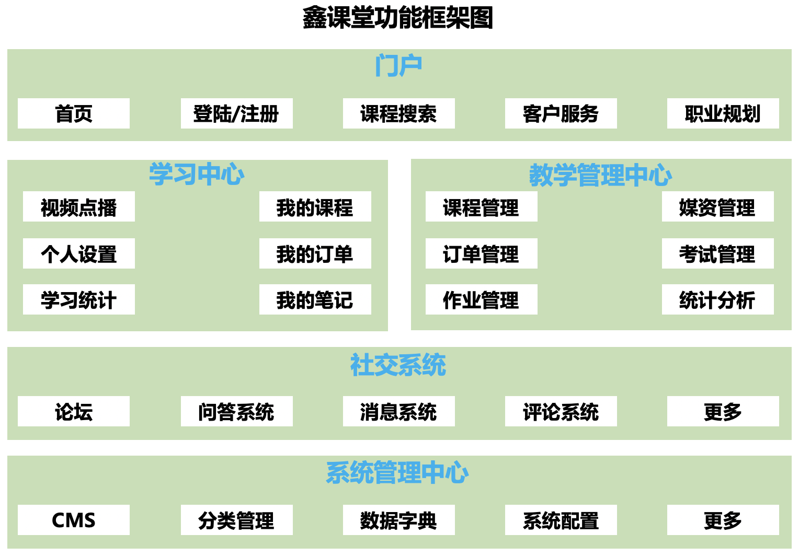

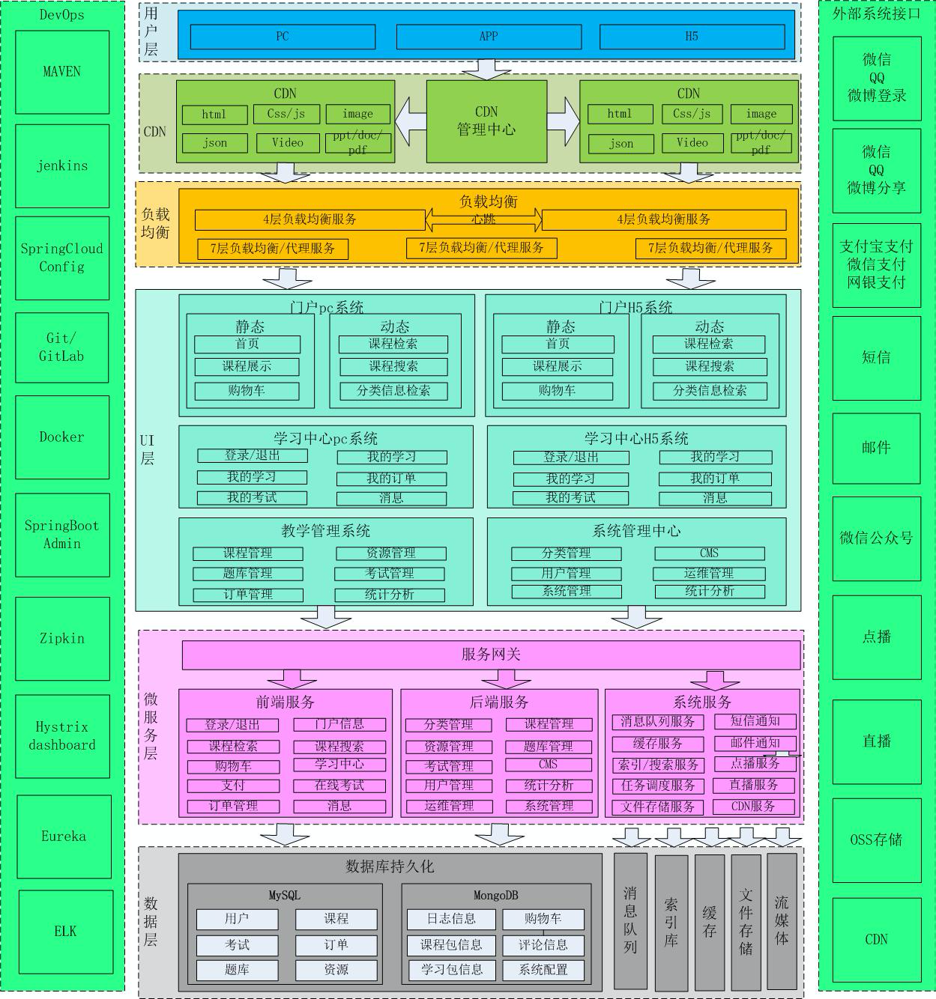

#### 2.项目中都用到了哪些Spring的技术？

该项目是基于Spring全家桶进行构建的，用到了很多的Spring的技术。

首先项目中的微服务都是使用 Spring Boot 进行开发的。

然后在数据层用到了 Spring Data JPA、MongoDB、Redis 等 Spring Data 技术。

在业务层使用 Spring 来控制本地事务，具体来说就在是需要事务执行的方法上使用 Transection 注解。并且还使用到了 Spring Task 任务调度框架来自动执行定时任务。

在控制层使用到了SpringMVC 还有使用到了 Spring Security Oauth2 来执行用户任务操作。

对于微服务之间的管理使用到了 Spring Cloud 中的 Eureka 注册中心，微服务之间的调用则使用到了 Feign Client。

为了保证前端调用微服务的安全性，使用到了 Zuul 网关来进行安全验证。

#### 3.Spring Cloud是怎么使用的？

首先每个微服务使用Spring Boot开发，每个微服务工程包括了web、service、dao三层，这和开发一般的项目没有区别： 

​	a、web层使用Spring MVC实现，对外暴露API接口给前端调用。 

​	b、service层就是根据业务逻辑编写JavaBean，并使用Spring的声明式事务控制方式来控制事务。 

​	c、dao层就是数据访问接口，来访问MySQL和Mongodb，访问MySQL使用Spring Data JPA和Mybatis，访问 mongodb使用Spring data mongodb。 

其次微服务开发完成要向Eureka注册中心注册，以便被其它微服务查找和访问。 

然后微服务与微服务之间使用feign来调用，feign Client具有负载均衡的作用。只需要在接口上声明@FeignClient注解，Spring底层会产生动态代理对象，使用ribbon客户端完成调用。 

最后前端访问微服务需要通过网关，网关使用Nginx和Zuul来实现，Nginx是最前边的负载均衡，通过Nginx之后便到达了Zuul，项目中Zuul的功能是过虑用户请求，判断用户身份，对于一些对外公开的微服务则需要经过Zuul，不对外公开的微服务则直接通过Nginx负载均衡即可访问。

#### 4.Spring Data JPA 和 MyBatis为什么两个都用？具体怎么用的？

项目中使用Spring Data JPA和MyBatis都是用来访问MySQL，但是它们的分工不同： 

- Spring Data JPA是面向对象的，而MyBatis是直接面向SQL语句的。
- Spring Data JPA是Spring 提供的一套JPA接口，使用Spring Data JPA主要完成一些简单的增、删、改、查功能。
- 对于复杂的查询功能会使用MyBatis编写SQL语言来实现，因为使用Spring Data JPA来做一些复杂的查询是没有 MyBatis方便的.

使用Spring Data JPA 的话只需要自定义 Repository 然后继承 JpaRepository，传入对应的数据表实体对象以及主键所对应的属性类型即可。

而使用 MyBatis 的话需要定义 Mapper 接口，定义自定义查询的方法，特别需要注意的是返回值类型的定义，然后在 resources 目录下定义同名的包路径下定义对应的 Mapper xml映射文件。这里需要特别注意 Mapper 接口和映射文件所对应的包路径必须一样。

#### 5.什么雪崩？如何解决？

雪崩是由于微服务没有设置容错保护而导致的。

容错保护是指微服务在执行过程中出现错误并从错误中恢复的能力。微服务容错性不好很容易导致雪崩效应。

微服务的雪崩效应表现在服务与服务之间调用，当其中一个服务无法提供服务可能导致其它服务也死掉，比如：单点登录服务调用用户信息服务查询用户信息，由于用户信息服务无法提供服务导致单点登录服务一直等待，从而导致用户登录、用户退出功能无法使用，像这样由一个服务所引起的一连串的多个服务无法提供服务即是微服务的雪崩效应。

这里Spring Cloud 提供了对应的雪崩解决方法：Spring Cloud Hystrix ，这是基于Netflix的开源框架Hystrix的整合，它实现了断路保护、线程隔离、信号隔离等容错功能。通过断路保护功能就可以实现微服务之间雪崩效应的出现。微服务的断路保护的工作原理是当请求微服务失败的数量达到一定比例时会切换为开路状态，当请求微服务时就直接返回结果不再请求微服务，当保持开路状态一段时间后判断微服务是否可以正常请求，如果正常则切换到半开路状态，最后切换到闭路状态。

具体的操作方法可以采用 Fallback，每个FeignClient方法调用Fallback，当出现开路则调用Fallback方法返回错误结果。

#### 6.视图层用什么技术实现？

视图层在前端和服务端都存在。

前端视图采用vue.js+elementUI产品界面。

服务端都是暴露的rest接口，统一用json展示数据。

#### 7.接口是怎么定义的？采用什么数据格式？如何实现？

1、接口定义

使用 SpringMVC编写Controller方法，对外暴露Http接口，在Controller方法上使用RequestMapping、 PostMapping、GetMapping等注解定义Http接口。 

2、采用什么数据格式？ 

分别说明请求和响应： 

请求： 

get 请求时，前端请求key/value串，SpringMVC采用基本数据类型（String、Integer等）或自定义类型接收。 

Post请求时，前端请求Form表单数据（application/x-www-form-urlencoded）和Json数据(ContentType=application/json)、多部件类型数据（multipart/form-data），对于Json数据SpringMVC使用 @RequestBody注解解析请求的json数据。 

响应： 

统一响应json格式。 

3、如何实现的？

json格式数据SpringMVC采用FastJson解析为对象。 

非json格式数据SpringMVC提供参数绑定的方法，将key/value或Form-Data数据转换为对象或基本数据类型的变量。

#### 8.前后端开发时具体流程是什么？

1、前端与后端开发人员讨论确定接口。 

接口讨论通过，形成接口文档 。 

本项目专门设立一个api工程，在此工程定义接口，Spring Boot 集成 Swagger，生成 Swagger 接口，前后端开发 人员通过html查看接口文档的内容。 

2、前端与后端开发人员按照接口文档进行开发。 

开发过程中各自进行单元测试。 

前端人员怎么进行单元测试？ 

前端人员可以通过一些工具生成一些模拟数据，比如：EasyMock。

3、双方功能开发完成进行前后端联调。

#### 9.前端采用什么技术栈？

前端工程大多为单页面应用（SPA），采用vue.js框架开发，搜索功能前端采用nuxt.js服务端渲染（SSR）框架开发。

技术栈包括： 1、node.js 2、vue.js 3、npm/cnpm 4、webpack 5、axios 6、nuxt.js

#### 10.CMS页面管理模块的功能是什么？

CMS （Content Management System）即内容管理系统，本项目对CMS系统的定位是对各个网站（子站点）页面的管理，本项目的CMS系统不去管理每个子网站的全部资源，比如：图片、CSS、html页面等，主要管理由于运营需要而经常变动的页面，从而满足根据运营需要快速开发、上线的需求。

功能包括： 

1、站点管理，站点就是本项目各个子网站，站点信息包括：站点名称、站点域名、端口、服务器物理路径等。 

2、模板管理，由于要对页面进行静态化，使用freemarker引擎技术，所以需要定义模板。 

3、页面管理，包括：页面添加、页面修改、页面删除等操作。 页面和模版都是存储在MongoDB中的GirdFS中。

4、页面预览，对页面静态化，在浏览器预览页面静态化内容。 

5、页面发布，将页面静态化后发布到所属站点服务器。

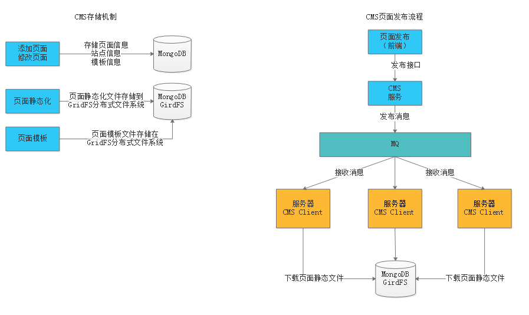

#### 11.GirdFS是什么？工作原理是什么？如何使用？

GridFS是MongoDB提供的用于持久化存储文件的模块，它可以作为分布式文件系统使用，CMS子系统将页面文件、模板文件存储到GridFS中，由于本项目使用MongoDB，选用GridFS可以快速集成开发。

它的工作原理是： 在GridFS存储文件是将文件分块存储，文件会按照256KB的大小分割成多个块进行存储，GridFS使用两个集合 （collection）存储文件，一个集合是chunks, 用于存储文件的二进制数据；一个集合是files，用于存储文件的元数据信息（文件名称、块大小、上传时间等信息）。最后从GridFS中读取文件要对文件的各块进行组装、合并。

使用方法是： 使用Spring data mongodb包下提供的GridFsTemplate访问GirdFS。

#### 12.使用消息队列了吗？如何使用的？有哪些应用场景？

项目使用RabbitMQ消息队列。 

RabbitMQ提供很多的工作模式，如下： 

1、Work queues 

2、Publish/Subscribe 

3、Routing 

4、Topics 

5、Header 

6、RPC 

项目主要使用了Routing模式。 Routing模式即路由模式，使用方法是： 

1、每个消费者监听自己的队列，并且设置routingkey。 

2、生产者将消息发给交换机，由交换机根据routingkey来转发消息到指定的队列。

有哪些应用场景？

1 、任务异步处理。 将不需要同步处理的并且耗时长的操作由消息队列通知消息接收方进行异步处理。提高了应用程序的响应时间。 

2、应用程序解耦合 MQ相当于一个中介，生产方通过MQ与消费方交互，它将应用程序进行解耦合。

比如项目中的CMS的页面发布就用到了RabbitMQ，页面发布包含CMS页面管理微服务以及 CMS Client页面客户端微服务。平台包括多个站点，页面归属不同的站点，需求是发布一个页面应将该页面发布到所属站点的服务器上。 

CMS作为消息的生产者，CMS Client作为消息的消费者。双方使用路由工作模式进行通信，在每个站点服务部署CMS Client程序，并与交换机绑定，绑定时指定站点Id为routingKey。 指定站点id为routingKey就可以实现cms client只能接收到所属站点的页面发布消息。页面发布程序CMS向MQ发布消息时指定页面所属站点Id为routingKey，根据routingKey将消息发给指定的 CMS Client。CMS便执行对应站点的页面发布任务。

每次页面发布会在数据库记录发布日志，每个CMS Client完成页面发布会上报发布结果。 用户通过查询发布日志表的信息就可以知道每一次的发布结果（哪些服务器页面发布成功，哪些发布失败）。

#### 13.课程管理功能介绍

课程管理主要包含课程信息查看、修改、课程预览和课程发布等功能。

课程数据库表设计为了四张：课程基本信息表、课程图片表、课程计划表、课程营销表。这里设计为四张的主要原因是因为：

1、课程信息比较复杂，为了方便教学机构按步骤管理课程信息，并且也可以划分权限管理课程信息，将课程信息 管理功能分为课程基本信息管理、课程图片管理、课程营销信息管、课程计划管理等模块。 

2、将课程信息分开也是为了系统扩展需要，如果将课程所有信息存储在一张表中将不利于系统扩展。

#### 14.媒资管理功能介绍

每个教学机构都可以在媒资系统管理自己的教学资源，包括：视频、教案等文件。 

媒资管理的主要管理对象是课程录播视频，包括：媒资文件的查询、视频上传、视频删除、视频处理等。 

媒资查询：教学机构查询自己所拥有的媒体文件。 

视频上传：将用户线下录制的教学视频上传到媒资系统。 

视频处理：视频上传成功，系统自动对视频进行编码处理。 

视频删除 ：如果该视频已不再使用，可以从媒资系统删除。

如何上传大文件？

前端使用WebUploader将文件分块，调用服务端分块上传接口上传分块文件，分块上传完毕前端请求服务端进行合并，当上传过程中断再次进行上传时服务端判断分块是否已经上传，已经上传的分块不再重新上传。

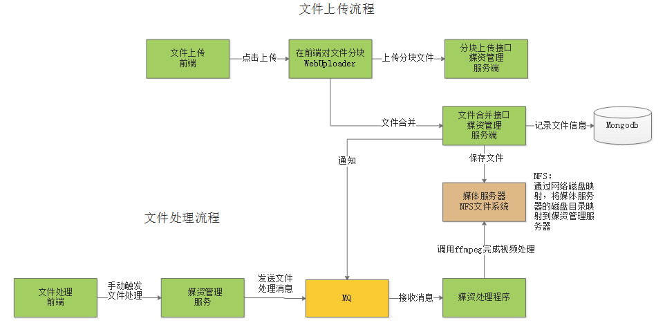

如何进行视频处理？

Java程序调用ffmpeg及流媒体程序员提供的视频处理类库（C程序）完成avi、mp4视频转成m3u8格式的视频。 

Java程序使用Jdk提供的Process Builder调用ffmpeg及C程序进行视频处理。 

Process Builder可以调用第三方程序，在java程序运行时启动第三方程序进程。 

视频处理完成，Java程序捕获第三方程序的输出日志，解析出视频处理完成标记，更新视频处理状态为已完成。

#### 15.搜索服务为什么使用ElasticSearch ？以及如何使用？

项目中课程搜索采用ElasticSearch来完成。

实现方法是： 

１、使用 Logstash（logstash是ES下的一款开源软件，它能够同时 从多个来源采集数据、转换数据）将MySQL中 的课程信息读取到ES中创建索引，使用IK分词器进行分词。 

2、使用 Java High Level REST Client完成搜索。 

3、生产环境使用ES部署为集群。

#### 16.图片服务器为什么使用 FastDFS？

本项目采用fastDFS分布式系统作为图片服务器。 

FastDFS是用c语言编写的一款开源的分布式文件系统，适合小文件的存储。 

FastDFS包括 Tracker server和Storageserver。

客户端请求Tracker server进行文件上传、下载，通过Tracker server调度向Storage server完成文件上传和下载。 

使用FastDSF官方提供的Java API实现。 

图片服务使用Nginx作为代理服务器，对Storage上部署的Nginx完成负载均衡请求。

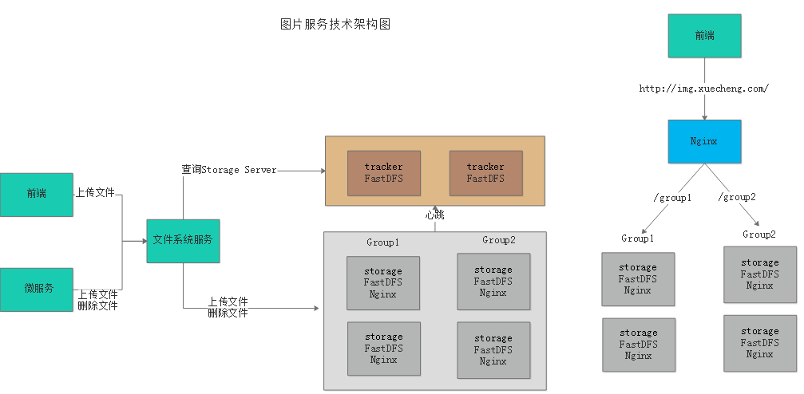

FastDFS相比其它的分布式文件系统它适用小文件存储，它不对文件进行分块存储，也不用对文件进行合并处理， 所以性能比GFS、HDFS等通用文件系统的性能要高。

文件上传的流程如下：

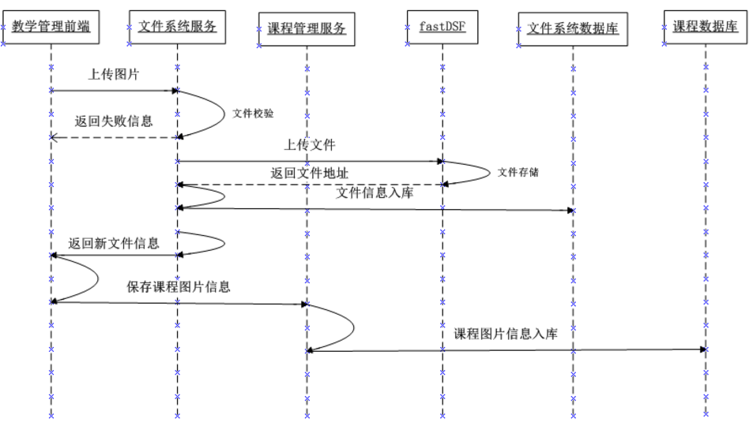

1、管理员进入教学管理前端，点击上传图片 

2、图片上传至文件系统服务，文件系统请求fastDFS上传文件 

3、文件系统将文件入库，存储到文件系统服务数据库中。 

4、文件系统服务向前端返回文件上传结果，如果成功则包括文件的Url路径。 

5、课程管理前端请求课程管理进行保存课程图片信息到课程数据库。 

6、课程管理服务将课程图片保存在课程数据库。

#### 17.认证授权是如何实现的？

本项目采用 Spring security + Oauth2完成用户认证及用户授权。认证授权流程如下：

1、用户请求认证服务完成身份认证。 

2、认证服务下发用户身份令牌和JWT令牌，拥有身份令牌表示身份合法，Jwt令牌用于完成授权。 

3、用户携带jwt令牌请求资源服务。 

4、网关校验用户身份令牌的合法，不合法表示用户没有登录，如果合法则放行继续访问。 

5、资源服务获取jwt令牌，根据jwt令牌完成授权。

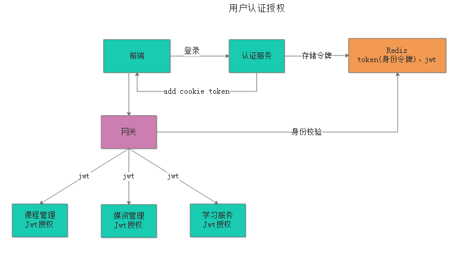

#### 18.事务是怎么控制的？用到分布式事务控制了吗？如何做的？

1、在微服务中使用Spring 声明式事务控制方式进行控制，在Service方法上添加@Transctional注解即可实现事务控制，它控制的是MySQL的本地事务。 

2、项目中大量存在分布式事务控制，比如下单支付、课程发布等地址都用到了分布式事务。 本项目实现分布式事务控制实现最终数据一致性，做法是： 

a、将分布式事务拆分为多个本地事务。 

b、提交事务前每个参与者要通过数据校验，和资源预留。 

c、由消息队列去通知多个事务参与者完成本地事务的提交。 

d、提交失败的本地事务会重试。

#### 19.系统的异常是怎么处理的？

系统对异常的处理使用统一的异常处理流程。 

1、自定义异常类型。 

2、自定义错误代码及错误信息。 

3、对于可预知的异常由程序员在代码中主动抛出自定义异常类型的异常，抛出异常时需要指定错误代码。 

4、对于不可预知的异常（运行时异常）由SpringMVC统一捕获Exception类型的异常，由统一的异常捕获类来解析处理，并转换为与自定义异常类型一致的信息格式（错误代码+错误信息）。 

5、可预知的异常及不可预知的运行时异常最终会采用统一的信息格式（错误代码+错误信息）来表示，最终也会随请求响应给客户端。

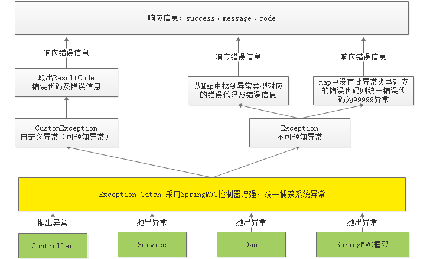

#### 20.你在开发中遇到什么问题？是怎么解决的？

1.在处理订单时要用到定时任务，当时采用的是Spring Task来完成，由于一个订单服务会部署多个，多个订单服务 同时去处理任务会造成任务被重复处理的情况，如何解决任务的重复处理。

解决： 

采用乐观锁解决，在任务表中设置一个version字段记录版本号，取出任务记录同时拿到任务的版本号，执行前对 任务进行锁定，具体的做法是执行update根据当前版本号将版本号加1，update成功表示锁定任务成功，即可开始执行任务。

2.Post提交过来的url无法被后端执行

解决：

controller中并没有将前端传递过来的参数进行捕获，在 controller 中 使用 RequestParam 注解来解析前端post传递过来的参数

## 语言

### Java

#### 并发

##### 1.并发编程三要素

**并发编程三要素：原子性，有序性，可见性**

- 原子性：一个不可再被分割的颗粒。 原子性指的是一个或多个操作要么全部执行成功要么全部执行失败。synchronized 或 Lock能够保证原子性。
- 有序性：程序执行的顺序按照代码的先后顺序执行。（ 处理器可能会对指令进行重排序）。synchronized 或 Lock能够保证可见性。
- 可见性： 一个线程对共享变量的修改,另一个线程能够立刻看到。synchronized 或 Lock 以及 volatile 关键字能够保证有序性。

##### 2.多线程的好处（为什么要使用多线程？）

1）发挥多核CPU的优势

多线程，可以真正发挥出多核CPU的优势来，达到充分利用CPU的目的，采用多线程的方式去同时完成几件事情而不互相干扰。

2）防止阻塞

从程序运行效率的角度来看，单核CPU不但不会发挥出多线程的优势，反而会因为在单核CPU上运行多线程导致线程上下文的切换，而降低程序整体的效率。但是单核CPU我们还是要应用多线程，就是为了防止阻塞。试想，如果单核CPU使用单线程，那么只要这个线程阻塞了，比方说远程读取某个数据吧，对端迟迟未返回又没有设置超时时间，那么你的整个程序在数据返回回来之前就停止运行了。多线程可以防止这个问题，多条线程同时运行，哪怕一条线程的代码执行读取数据阻塞，也不会影响其它任务的执行。

3）便于建模

这是另外一个没有这么明显的优点了。假设有一个大的任务A，单线程编程，那么就要考虑很多，建立整个程序模型比较麻烦。但是如果把这个大的任务A分解成几个小任务，任务B、任务C、任务D，分别建立程序模型，并通过多线程分别运行这几个任务，那就简单很多了。

##### 3.创建线程的方法？

- 继承Thread类创建线程类
  - 定义Thread类的子类，并重写该类的run方法，该run方法的方法体就代表了线程要完成的任务。因此把run()方法称为执行体。
  - 创建Thread子类的实例，即创建了线程对象。
  - 调用线程对象的start()方法来启动该线程。
- 通过Runnable接口创建线程类
  - 定义runnable接口的实现类，并重写该接口的run()方法，该run()方法的方法体同样是该线程的线程执行体。
  - 创建 Runnable实现类的实例，并依此实例作为Thread的target来创建Thread对象，该Thread对象才是真正的线程对象。
  - 调用线程对象的start()方法来启动该线程。
- 通过Callable和Future创建线程
  - 创建Callable接口的实现类，并实现call()方法，该call()方法将作为线程执行体，并且有返回值。
  - 创建Callable实现类的实例，使用FutureTask类来包装Callable对象，该FutureTask对象封装了该Callable对象的call()方法的返回值。
  - 使用FutureTask对象作为Thread对象的target创建并启动新线程。
  - 调用FutureTask对象的get()方法来获得子线程执行结束后的返回值。
  - Future就是对于具体的Runnable或者Callable任务的执行结果进行取消、查询是否完成、获取结果。必要时可以通过get方法获取执行结果，该方法会阻塞直到任务返回结果。
  - FutureTask一个可取消的异步计算，FutureTask 实现了Future的基本方法，提空 start cancel 操作，可以查询计算是否已经完成，并且可以获取计算的结果。结果只可以在计算完成之后获取，get方法会阻塞当计算没有完成的时候，一旦计算已经完成，那么计算就不能再次启动或是取消。

创建线程的三种方式的对比：

1、采用实现Runnable、Callable接口的方式创见多线程时，优势是：

- 线程类只是实现了Runnable接口或Callable接口，还可以继承其他类。

- 在这种方式下，多个线程可以共享同一个target对象，所以非常适合多个相同线程来处理同一份资源的情况，从而可以将CPU、代码和数据分开，形成清晰的模型，较好地体现了面向对象的思想。

劣势是：

- 编程稍微复杂，如果要访问当前线程，则必须使用Thread.currentThread()方法。

2、使用继承Thread类的方式创建多线程时优势是：

- 编写简单，如果需要访问当前线程，则无需使用Thread.currentThread()方法，直接使用this即可获得当前线程。

劣势是：

- 线程类已经继承了Thread类，所以不能再继承其他父类。

##### 4.线程的生命周期和状态?

Java 线程在运行的生命周期中的指定时刻只可能处于下面 6 种不同状态的其中一个状态：


线程在生命周期中并不是固定处于某一个状态而是随着代码的执行在不同状态之间切换。Java 线程状态变迁如下图所示:


线程创建之后它将处于 **NEW（新建）** 状态，调用 `start()` 方法后开始运行，线程这时候处于 **READY（可运行）** 状态。可运行状态的线程获得了 CPU 时间片（timeslice）后就处于 **RUNNING（运行）** 状态（操作系统隐藏 Java 虚拟机（JVM）中的 RUNNABLE 和 RUNNING 状态，它只能看到 RUNNABLE 状态）当线程执行 `wait()`方法之后，线程进入 **WAITING（等待）** 状态。进入等待状态的线程需要依靠其他线程的通知才能够返回到运行状态，而 **TIME_WAITING(超时等待)** 状态相当于在等待状态的基础上增加了超时限制，比如通过 `sleep（long millis）`方法或 `wait（long millis）`方法可以将 Java 线程置于 TIMED WAITING 状态。当超时时间到达后 Java 线程将会返回到 RUNNABLE 状态。当线程调用同步方法时，在没有获取到锁的情况下，线程将会进入到 **BLOCKED（阻塞）** 状态。线程在执行 Runnable 的`run()`方法之后将会进入到 **TERMINATED（终止）** 状态。

##### 6.线程池

线程池是一种池化技术，**池化技术的思想主要是为了减少每次获取资源的消耗，提高对资源的利用率。线程池提供了一种限制和管理资源（包括执行一个任务）的机制**。 每个线程池还维护一些基本统计信息，例如已完成任务的数量。

**使用线程池的好处**：

- **降低资源消耗**。通过重复利用已创建的线程降低线程创建和销毁造成的消耗。
- **提高响应速度**。当任务到达时，任务可以不需要的等到线程创建就能立即执行。
- **提高线程的可管理性**。线程是稀缺资源，如果无限制的创建，不仅会消耗系统资源，还会降低系统的稳定性，使用线程池可以进行统一的分配，调优和监控。

JDK 1.8中创建线程池的方法：

- **newFixedThreadPool**：定长线程池，每当提交一个任务就创建一个线程，直到达到线程池的最大数量，这时线程数量不再变化，当线程发生错误结束时，线程池会补充一个新的线程。
- **newCachedThreadPool**：可缓存的线程池，如果线程池的容量超过了任务数，自动回收空闲线程，任务增加时可以自动添加新线程，线程池的容量不限制。
- **newScheduledThreadPool**：定长线程池，可执行周期性的任务。
- **newSingleThreadExecutor**：单线程的线程池，线程异常结束，会创建一个新的线程，能确保任务按提交顺序执行。
- **newSingleThreadScheduledExecutor**：单线程可执行周期性任务的线程池。
- **newWorkStealingPool**：任务窃取线程池，不保证执行顺序，适合任务耗时差异较大。线程池中有多个线程队列，有的线程队列中有大量的比较耗时的任务堆积，而有的线程队列却是空的，就存在有的线程处于饥饿状态，当一个线程处于饥饿状态时，它就会去其它的线程队列中窃取任务。解决饥饿导致的效率问题。默认创建的并行 level 是 CPU 的核数。主线程结束，即使线程池有任务也会立即停止。

##### 7.Java中的并发工具类

- `CountDownLatch`允许一个或多个线程等待其他线程完成操作。`CountDownLatch`传入一个N当做计数器，每次执行countDown的时候N就会减1，`CountDownLatch`的await方法就会阻塞当前线程，直到N变成零。countDown可以是一个线程中的N个步骤或者是N个线程。
-  `CyclicBarrier`同步屏障。让一组线程到达一个屏障（或者是同步点）的时候被阻塞，直到最后一个线程到达屏障，屏障才会打开，所有的线程继续往下执行。
- `Semaphore`（信号量）用来控制同时访问特定资源的线程数量，通过协调各个线程，以保证合理的使用公共资源。
- `Exchanger`是个用于线程间协作的工具类，用于线程之间的数据交换。它提供一个同步点，在这个同步点，两个线程可以交换彼此的数据。第一个线程先执行`exchange()`方法，第二个线程也执行`exchange()`方法，当两个线程同时到达同步点，这两个线程就可以交换数据。如果一个线程一直没有执行`exchange()`方法，那么会一直等下去，如果担心特殊情况，可以使用`exchange(V v,longtimeout, TimeUnit unit)`设置最大等待时间。

 `CyclicBarrier`和`CountDownLatch`的区别：

`CountDownBatch`的计数器只能使用一次，而`CyclicBarrier`的计数器可以使用`reset()`方法重置。

因此`CyclicBarrier`可以实现更加复杂的功能。

##### 8.synchronized

synchronized关键字解决的是多个线程之间访问资源的同步性，synchronized关键字可以保证被它修饰的方法或者代码块在任意时刻只能有一个线程执行。但是`synchronized`属于重量级锁，很多时候会引起性能问题。

**synchronized关键字最主要的三种使用方式：**

- **修饰实例方法:** 作用于当前对象实例加锁，进入同步代码前要获得当前对象实例的锁
- **修饰静态方法:** 也就是给当前类加锁，会作用于类的所有对象实例，因为静态成员不属于任何一个实例对象，是类成员（ static 表明这是该类的一个静态资源，不管new了多少个对象，只有一份）。所以如果一个线程 A 调用一个实例对象的非静态 synchronized 方法，而线程 B 需要调用这个实例对象所属类的静态 synchronized 方法，是允许的，不会发生互斥现象，**因为访问静态 synchronized 方法占用的锁是当前类的锁，而访问非静态 synchronized 方法占用的锁是当前实例对象锁**。
- **修饰代码块:** 指定加锁对象，对给定对象加锁，进入同步代码库前要获得给定对象的锁。

**总结：** synchronized 关键字加到 static 静态方法和 synchronized(class)代码块上都是是给 Class 类上锁。synchronized 关键字加到实例方法上是给对象实例上锁。尽量不要使用 synchronized(String a) 因为JVM中，字符串常量池具有缓存功能！

**双重校验锁实现对象单例（线程安全）**

```java
public class Singleton {

    private volatile static Singleton uniqueInstance;

    private Singleton() {
    }

    public  static Singleton getUniqueInstance() {
       //先判断对象是否已经实例过，没有实例化过才进入加锁代码
        if (uniqueInstance == null) {
            //类对象加锁
            synchronized (Singleton.class) {
                if (uniqueInstance == null) {
                    uniqueInstance = new Singleton();
                }
            }
        }
        return uniqueInstance;
    }
}
```

##### 9.volatile

得先介绍一下 Java 的内存模型：

在当前的 Java 内存模型下，线程可以把变量保存**本地内存**（比如机器的寄存器）中，而不是直接在主存中进行读写。这就可能造成一个线程在主存中修改了一个变量的值，而另外一个线程还继续使用它在寄存器中的变量值的拷贝，造成**数据的不一致**。

要解决这个问题，就需要把变量声明为**volatile**，这就指示 JVM，这个变量是不稳定的，每次使用它都到主存中进行读取。

 **volatile** 关键字的主要作用就是保证**变量的可见性**然后还有一个作用是**防止指令重排序**。

这里还有一点就是并发编程的三个重要特性：原子性、可见性、有序性。

1. **原子性** : 一个的操作或者多次操作，要么所有的操作全部都得到执行并且不会收到任何因素的干扰而中断，要么所有的操作都执行，要么都不执行。`synchronized `可以保证代码片段的原子性。
2. **可见性** ：当一个变量对共享变量进行了修改，那么另外的线程都是立即可以看到修改后的最新值。`volatile` 关键字可以保证共享变量的可见性。
3. **有序性** ：代码在执行的过程中的先后顺序，Java 在编译器以及运行期间的优化，代码的执行顺序未必就是编写代码时候的顺序。`volatile` 关键字可以禁止指令进行重排序优化。

`synchronized` 关键字可以保证代码片段的原子性；

`volatile` 关键字则可以保证共享变量的可见性以及代码的有序性。

`synchronized` 关键字和 `volatile` 关键字是两个互补的存在，而不是对立的存在：

- **volatile关键字**是线程同步的**轻量级实现**，所以**volatile性能肯定比synchronized关键字要好**。但是**volatile关键字只能用于变量而synchronized关键字可以修饰方法以及代码块**。synchronized关键字在JavaSE1.6之后进行了主要包括为了减少获得锁和释放锁带来的性能消耗而引入的偏向锁和轻量级锁以及其它各种优化之后执行效率有了显著提升，**实际开发中使用 synchronized 关键字的场景还是更多一些**。
- **多线程访问volatile关键字不会发生阻塞，而synchronized关键字可能会发生阻塞**
- **volatile关键字能保证数据的可见性，但不能保证数据的原子性。synchronized关键字两者都能保证。**
- **volatile关键字主要用于解决变量在多个线程之间的可见性，而 synchronized关键字解决的是多个线程之间访问资源的同步性。**

##### 10.CAS

CAS（Compare-and-Swap），即比较并替换，是一种实现并发算法时常用到的技术。像`synchronized`这种独占锁属于**悲观锁**，它是在假设一定会发生冲突的，那么加锁恰好有用，除此之外，还有**乐观锁**，乐观锁的含义就是假设没有发生冲突，那么我正好可以进行某项操作，如果要是发生冲突呢，那我就重试直到成功，乐观锁最常见的就是`CAS`。

CAS需要有3个操作数：内存地址V，旧的预期值A，即将要更新的目标值B。

CAS指令执行时，当且仅当内存地址V的值与预期值A相等时，将内存地址V的值修改为B，否则就什么都不做。整个比较并替换的操作是一个原子操作。

CAS虽然很高效的解决了原子操作问题，但是CAS仍然存在三大问题。

1. 循环时间长开销很大。
2. 只能保证一个共享变量的原子操作。
3. ABA问题。

**循环时间长开销很大：**我们可以看到getAndAddInt方法执行时，如果CAS失败，会一直进行尝试。如果CAS长时间一直不成功，可能会给CPU带来很大的开销。

**只能保证一个共享变量的原子操作：**当对一个共享变量执行操作时，我们可以使用循环CAS的方式来保证原子操作，但是对多个共享变量操作时，循环CAS就无法保证操作的原子性，这个时候就可以用锁来保证原子性。

**什么是ABA问题？ABA问题怎么解决？**

如果内存地址V初次读取的值是A，并且在准备赋值的时候检查到它的值仍然为A，那我们就能说它的值没有被其他线程改变过了吗？

如果在这段期间它的值曾经被改成了B，后来又被改回为A，那CAS操作就会误认为它从来没有被改变过。这个漏洞称为CAS操作的“ABA”问题。Java并发包为了解决这个问题，提供了一个带有标记的原子引用类“AtomicStampedReference”，它可以通过控制变量值的版本来保证CAS的正确性。因此，在使用CAS前要考虑清楚“ABA”问题是否会影响程序并发的正确性，如果需要解决ABA问题，改用传统的互斥同步可能会比原子类更高效。

##### 11.AQS

AQS的全称为（AbstractQueuedSynchronizer），这个类在java.util.concurrent.locks包下面。

AQS是一个用来构建锁和同步器的框架，使用AQS能简单且高效地构造出应用广泛的大量的同步器，比如我们提到的ReentrantLock，Semaphore，其他的诸如ReentrantReadWriteLock，SynchronousQueue，FutureTask等等皆是基于AQS的。当然，我们自己也能利用AQS非常轻松容易地构造出符合我们自己需求的同步器。

**AQS核心思想是，如果被请求的共享资源空闲，则将当前请求资源的线程设置为有效的工作线程，并且将共享资源设置为锁定状态。如果被请求的共享资源被占用，那么就需要一套线程阻塞等待以及被唤醒时锁分配的机制，这个机制AQS是用CLH队列（CLH(Craig,Landin,and Hagersten)队列是一个虚拟的双向队列（虚拟的双向队列即不存在队列实例，仅存在结点之间的关联关系）。AQS是将每条请求共享资源的线程封装成一个CLH锁队列的一个结点（Node）来实现锁的分配。）锁实现的，即将暂时获取不到锁的线程加入到队列中。**

**AQS定义两种资源共享方式**

- **Exclusive**（独占）：只有一个线程能执行，如ReentrantLock。又可分为公平锁和非公平锁：
  - 公平锁：按照线程在队列中的排队顺序，先到者先拿到锁
  - 非公平锁：当线程要获取锁时，无视队列顺序直接去抢锁，谁抢到就是谁的
- **Share**（共享）：多个线程可同时执行，如Semaphore/CountDownLatch。Semaphore、CountDownLatch、 CyclicBarrier、ReadWriteLock 我们都会在后面讲到。

ReentrantReadWriteLock 可以看成是组合式，因为ReentrantReadWriteLock也就是读写锁允许多个线程同时对某一资源进行读。

不同的自定义同步器争用共享资源的方式也不同。自定义同步器在实现时只需要实现共享资源 state 的获取与释放方式即可，至于具体线程等待队列的维护（如获取资源失败入队/唤醒出队等），AQS已经在顶层实现好了。

##### 12.ReadWriteLock

Read-Write Lock Pattern将读取与写入分开处理，在读取数据之前必须获取用来读取的锁定，而写入的时候必须获取用来写入的锁定。因为读取时实例的状态不会改变，所以多个线程可以同时读取；但是，写入会改变实例的状态，所以当有一个线程写入的时候，其它线程既不能读取与不能写入。

##### 13.synchronized和ReentrantLock的区别

两者的共同点：

- 协调多线程对共享对象、变量的访问
- 可重入，同一线程可以多次获得同一个锁
- 都保证了可见性和互斥性

两者的不同点：

- `ReentrantLock`显示获得、释放锁，`synchronized`隐式获得释放锁
- `ReentrantLock`可响应中断、可轮回，`synchronized`是不可以响应中断的，为处理锁的不可用性提供了更高的灵活性
- `ReentrantLock`是`API`级别的，`synchronized`是`JVM`级别的
- `ReentrantLock`可以实现公平锁
- `ReentrantLock`通过`Condition`可以绑定多个条件
- 底层实现不一样， `synchronized`是同步阻塞，使用的是悲观并发策略，`lock`是同步非阻塞，采用的是乐观并发策略

##### 14.线程 B 怎么知道线程 A 修改了变量？

- volatile修饰变量
- synchronized修饰修改变量的方法
- wait/notify
- while轮询

##### 15.synchronized、volatile、CAS 比较

- synchronized是悲观锁，属于抢占式，会引起其他线程阻塞。
- volatile提供多线程共享变量可见性和禁止指令重排序优化。
- CAS是基于冲突检测的乐观锁（非阻塞）

##### 16.sleep 方法和 wait 方法有什么区别?

sleep方法和wait方法都可以用来放弃CPU一定的时间，不同点在于如果线程持有某个对象的监视器，sleep方法不会放弃这个对象的监视器，wait方法会放弃这个对象的监视器。

##### 17.ThreadLocal 是什么？有什么用？

ThreadLocal是一个本地线程副本变量工具类。主要用于将私有线程和该线程存放的副本对象做一个映射，各个线程之间的变量互不干扰，在高并发场景下，可以实现无状态的调用，特别适用于各个线程依赖不通的变量值完成操作的场景。

简单说ThreadLocal就是一种以空间换时间的做法，在每个Thread里面维护了一个以开地址法实现的ThreadLocal.ThreadLocalMap，把数据进行隔离，数据不共享，自然就没有线程安全方面的问题了。

##### 18.为什么 wait()方法和 notify()/notifyAll()方法要在同步块中被调用？

这是JDK强制的，wait()方法和notify()/notifyAll()方法在调用前都必须先获得对象的锁

##### 19.多线程同步有哪几种方法？

Synchronized关键字，Lock锁实现，分布式锁等。

##### 20.线程的调度策略

线程调度器选择优先级最高的线程运行，但是，如果发生以下情况，就会终止线程的运行：

（1）线程体中调用了yield方法让出了对cpu的占用权利

（2）线程体中调用了sleep方法使线程进入睡眠状态

（3）线程由于IO操作受到阻塞

（4）另外一个更高优先级线程出现

（5）在支持时间片的系统中，该线程的时间片用完

##### 21.ConcurrentHashMap 的并发度是什么？

ConcurrentHashMap的并发度就是segment的大小，默认为16，这意味着最多同时可以有16条线程操作ConcurrentHashMap，这也是ConcurrentHashMap对Hashtable的最大优势，任何情况下，Hashtable能同时有两条线程获取Hashtable中的数据。

##### 22.Linux 环境下如何查找哪个线程使用 CPU 最长

使用 top 命令 top -H -p pid

##### 23.Java 死锁以及如何避免？

Java中的死锁是一种编程情况，其中两个或多个线程被永久阻塞，Java死锁情况出现至少两个线程或更多资源。

Java发生死锁的根本原因是：在申请锁时发生了交叉闭环申请。

死锁的原因

1）是多个线程涉及到多个锁，这些锁存在着交叉，所以可能会导致了一个锁依赖的闭环。

例如：线程在获得了锁A并且没有释放的情况下去申请锁B，这时，另一个线程已经获得了锁B，在释放锁B之前又要先获得锁A，因此闭环发生，陷入死锁循环。

2）默认的锁申请操作是阻塞的。

所以要避免死锁，就要在一遇到多个对象锁交叉的情况，就要仔细审查这几个对象的类中的所有方法，是否存在着导致锁依赖的环路的可能性。 总之是尽量避免在一个同步方法中调用其它对象的延时方法和同步方法。

##### 24.怎么唤醒一个阻塞的线程？

如果线程是因为调用了wait()、sleep()或者join()方法而导致的阻塞，可以中断线程，并且通过抛出InterruptedException来唤醒它；如果线程遇到了IO阻塞，无能为力，因为IO是操作系统实现的，Java代码并没有办法直接接触到操作系统。

##### 25.不可变对象对多线程有什么帮助？

前面有提到过的一个问题，不可变对象保证了对象的内存可见性，对不可变对象的读取不需要进行额外的同步手段，提升了代码执行效率。

##### 26.什么是多线程的上下文切换？

多线程的上下文切换是指CPU控制权由一个已经正在运行的线程切换到另外一个就绪并等待获取CPU执行权的线程的过程。

##### 27.如果你提交任务时，线程池队列已满，这时会发生什么？

这里区分一下：

- 如果使用的是无界队列LinkedBlockingQueue，也就是无界队列的话，没关系，继续添加任务到阻塞队列中等待执行，因为LinkedBlockingQueue可以近乎认为是一个无穷大的队列，可以无限存放任务。
- 如果使用的是有界队列比如ArrayBlockingQueue，任务首先会被添加到ArrayBlockingQueue中，ArrayBlockingQueue满了，会根据maximumPoolSize的值增加线程数量，如果增加了线程数量还是处理不过来，ArrayBlockingQueue继续满，那么则会使用拒绝策略RejectedExecutionHandler处理满了的任务，默认是AbortPolicy。

##### 28.Java 中用到的线程调度算法是什么？

抢占式。一个线程用完CPU之后，操作系统会根据线程优先级、线程饥饿情况等数据算出一个总的优先级并分配下一个时间片给某个线程执行。

##### 29.什么是线程调度器(Thread Scheduler)和时间分片(Time Slicing)？

线程调度器是一个操作系统服务，它负责为Runnable状态的线程分配CPU时间。一旦我们创建一个线程并启动它，它的执行便依赖于线程调度器的实现。

时间分片是指将可用的CPU时间分配给可用的Runnable线程的过程。分配CPU时间可以基于线程优先级或者线程等待的时间。线程调度并不受到Java虚拟机控制，所以由应用程序来控制它是更好的选择（也就是说不要让你的程序依赖于线程的优先级）。

##### 30.什么是自旋锁？

自旋锁（spinlock）：是指当一个线程在获取锁的时候，如果锁已经被其它线程获取，那么该线程将循环等待，然后不断的判断锁是否能够被成功获取，直到获取到锁才会退出循环。

##### 31.JavaConcurrencyAPI 中的 Lock 接口(Lockinterface)是什么？对比同步它有什么优势？

Lock接口比同步方法和同步块提供了更具扩展性的锁操作。他们允许更灵活的结构，可以具有完全不同的性质，并且可以支持多个相关类的条件对象。

它的优势有：

- 可以使锁更公平
- 可以使线程在等待锁的时候响应中断
- 可以让线程尝试获取锁，并在无法获取锁的时候立即返回或者等待一段时间
- 可以在不同的范围，以不同的顺序获取和释放锁

##### 32.单例模式的线程安全性？

首先要说的是单例模式的线程安全意味着：某个类的实例在多线程环境下只会被创建一次出来。

单例模式有很多种的写法，我总结一下：

（1）饿汉式单例模式的写法：线程安全

（2）懒汉式单例模式的写法：非线程安全

（3）双检锁单例模式的写法：线程安全

##### 33.Semaphore 有什么作用？

Semaphore就是一个信号量，它的作用是限制某段代码块的并发数。

Semaphore有一个构造函数，可以传入一个int型整数n，表示某段代码最多只有n个线程可以访问，如果超出了n，那么请等待，等到某个线程执行完毕这段代码块，下一个线程再进入。

由此可以看出如果Semaphore构造函数中传入的int型整数n=1，相当于变成了一个synchronized了。

##### 34.Executors 类是什么？

Executors为Executor，ExecutorService，ScheduledExecutorService，ThreadFactory和Callable类提供了一些工具方法。

Executors可以用于方便的创建线程池

##### 35.线程类的构造方法、静态块是被哪个线程调用的？

线程类的构造方法、静态块是被new这个线程类所在的线程所调用的，而run方法里面的代码才是被线程自身所调用的。

如果说上面的说法让你感到困惑，那么我举个例子，假设Thread2中new了Thread1，main函数中new了Thread2，那么：

（1）Thread2的构造方法、静态块是main线程调用的，Thread2的run()方法是Thread2自己调用的

（2）Thread1的构造方法、静态块是Thread2调用的，Thread1的run()方法是Thread1自己调用的

##### 36.同步方法和同步块，哪个是更好的选择?

同步块，这意味着同步块之外的代码是异步执行的，这比同步整个方法更提升代码的效率。请知道一条原则：**同步的范围越小越好**。

##### 37.Java 线程数过多会造成什么异常？

1)线程的生命周期开销非常高

2)消耗过多的CPU资源

如果可运行的线程数量多于可用处理器的数量，那么有线程将会被闲置。大量空闲的线程会占用许多内存，给垃圾回收器带来压力，而且大量的线程在竞争CPU资源时还将产生其他性能的开销。

3)降低稳定性

JVM在可创建线程的数量上存在一个限制，这个限制值将随着平台的不同而不同，并且承受着多个因素制约，包括JVM的启动参数、Thread构造函数中请求栈的大小，以及底层操作系统对线程的限制等。如果破坏了这些限制，那么可能抛出OutOfMemoryError异常。

### Python

#### 1.什么是Python生成器，迭代器？

在 python 中，一边循环一边计算的机制，称为**生成器（generator）**

生成器的实现方式：

1、列表生成式修改法

```python
a = (x for x in range(10))
```

2、函数法

可以将函数中所要生成元素的位置更改为 **yield 元素**。这样该函数便成为了一个生成器。

因为 yield 是阻断式输出命令，程序通过 next 方法执行的时候便会停止在 yield 这里，也就是说每一次的遍历都是以 yield 作为分界线的。

生成器总结：

- 生成器是一个能记住上一次返回时在函数体中的位置的函数。
- 生成器不仅记住了函数的数据状态，而且还能记住函数在流控制构造中的位置。

生成器的特点

- 节约内存
- 迭代到下一次的调用时，所使用的参数都是第一次所保留下的，即是说，在整个所有函数调用的参数都是第一次所调用时保留的，而不是新创建的。
- 生成器中可以有多个 yield

通过生成器 yield 可以实现**协程**。

迭代是访问集合中元素的一种方式。而**迭代器**是一个可以记住迭代集合时遍历位置的对象。迭代器从第一个元素开始往后迭代，直到最后一个元素为止。迭代器**只能前进，不能后退**。

可以被 next() 函数调用并不断返回下一个值的对象被称为**迭代器（Iterator）**

可以使用 iter() 函数来将可迭代对象（Iterable）变为迭代器（Iterator）

迭代器总结

- 凡是可作用于 for 循环的对象都是可迭代对象（Iterable）类型
- 凡是可作用于 next() 函数的对象都是迭代器（Iterator）类型
- 集合类型如 list、dict、str等都是 Iterable 但不是 Iterator，也不能通过 iter() 函数获得一个 iterator 对象。
- **生成器一定是迭代器，但迭代器不一定是生成器**。

#### 2.什么是装饰器？

**装饰器**其实是建立闭包的基础上的。在闭包中传入了一个函数引用，并在闭包中执行了该函数。

**装饰器：在函数执行前后添加相应的代码，而函数的调用并不受影响。**

而为了更加方便的使用装饰器，便利用python中独有的**语法糖@**来使用装饰器。

装饰器是在函数定义前使用的。

有多个装饰器的情况下，先执行第一个装饰器，在执行第二个装饰器，依次类推。但在执行第一个装饰器时，需要传入下一个装饰器的返回值，而第二个装饰器中又需要下一个的返回值。一直调用到原函数，然后在逐层向上返回对应的结果。也就是说装饰器的使用就是一个**栈结构**。

```python
def decorate1(fn):
    def func():
        print("d1 "+fn()+" d1")
    return func()

def decorate1(fn):
    def func():
        print("d2 "+fn()+" d2")
    return func()

# 以上定义了两个装饰器
# 加载装饰器
@decorate1
@decorate2
def test():
    print("hello world")

# 执行函数
test()

# 执行结果
# d1 d2 hello world d2 d1
```

#### 3.元组和list的区别

- 元组的格式是： ()；list的格式是： []

- 元组是不可变类型，没有增删改操作，只能查找和遍历；list是可变类型。

#### 4.Python中的dict底层怎么实现的？

在Python中，**字典是通过哈希表实现的**。

字典也被称为关联数组、哈希数组。也就是说，字典也是一个数组，但**数组的索引是键经过哈希函数处理后得到的散列值**。

哈希表（也叫散列表），根据关键值对(Key-value)而直接进行访问的数据结构。它通过把key和value映射到表中一个位置来访问记录，这种查询速度非常快，更新也快。而这个映射函数叫做哈希函数，存放值的数组叫做哈希表。 哈希函数的实现方式决定了哈希表的搜索效率。具体操作过程是：

1. 数据添加：把key通过哈希函数转换成一个整型数字，然后就将该数字对数组长度进行取余，取余结果就当作数组的下标，将value存储在以该数字为下标的数组空间里。
2. 数据查询：再次使用哈希函数将key转换为对应的数组下标，并定位到数组的位置获取value。

但是，对key进行hash的时候，不同的key可能hash出来的结果是一样的，尤其是数据量增多的时候，这个问题叫做哈希冲突。如果解决这种冲突情况呢？通常的做法有两种，一种是链接法，另一种是开放定址法，Python选择后者。

#### 5.list的底层怎么实现的？

列表实际上采用的就是数据结构中的顺序表，而且是一种采用分离式技术实现的`动态顺序表`

**在Python中，列表被实现为长度可变的数组。**

#### 6.==和is有什么区别？

- == 用来判断值是否相等（值比较）
- is 用来判断两个引用是否指向了同一个对象（引用比较）
- 可以使用 id() 来查看对象存储的位置

#### 7.Python多线程用了几个CPU?

一个 CPU

Python中的多线程是**假的多线程**！因为在python的原始解释器CPython中存在着GIL（Global Interpreter Lock，全局解释器锁），因此在解释执行python代码时，会产生互斥锁来限制线程对共享资源的访问，直到解释器遇到I/O操作或者操作次数达到一定数目时才会释放GIL。

如果是CPU密集, 使用多进程好了（多进程并没有这个问题）.

## 操作系统

### 操作系统基础

#### 1.系统调用（用户态如何切换到内核态？）

根据进程访问资源的特点，我们可以把进程在系统上的运行分为两个级别：

1. 用户态(user mode) : 用户态运行的进程或可以直接读取用户程序的数据。
2. 系统态(kernel mode):可以简单的理解系统态运行的进程或程序几乎可以访问计算机的任何资源，不受限制。

我们运行的用户程序中，凡是与系统态级别的资源有关的操作（如文件管理、进程控制、内存管理等)，都必须通过系统调用方式向操作系统提出服务请求，并由操作系统代为完成。

这些系统调用按功能大致可分为如下几类（用户态如何切换到内核态的方法）：

- 设备管理。完成设备的请求或释放，以及设备启动等功能。
- 文件管理。完成文件的读、写、创建及删除等功能。
- 进程控制。完成进程的创建、撤销、阻塞及唤醒等功能。
- 进程通信。完成进程之间的消息传递或信号传递等功能。
- 内存管理。完成内存的分配、回收以及获取作业占用内存区大小及地址等功能。

#### 2.为什么要分用户态和内核态？

简单以一句话是为了安全， 在CPU的所有指令中，有些指令是非常危险的，如果错用，将导致系统崩溃，比如清内存、设置时钟等。

如果所有的程序都能使用这些指令，那么系统死机的概率将大大增加。

所以出于安全的考虑，CPU将指令分为特权指令和非特权指令，对于那些危险的指令，只允许操作系统及其相关模块使用，普通应用程序只能使用那些不会造成灾难的指令。

### 进程和线程

#### 1.进程和线程的区别？

一个进程中可以有多个线程，多个线程共享进程的**堆**和**方法区 (JDK1.8 之后的元空间)\**资源，但是每个线程有自己的\**程序计数器**、**虚拟机栈** 和 **本地方法栈**。

线程是进程划分成的更小的运行单位,一个进程在其执行的过程中可以产生多个线程。

线程和进程最大的不同在于基本上各进程是独立的，而各线程则不一定，因为同一进程中的线程极有可能会相互影响。

线程执行开销小，但不利于资源的管理和保护；而进程正相反。

#### 2.IO多路复用

IO多路复用是指使用一个线程来检查多个文件描述符（Socket）的就绪状态，内核一旦发现进程指定的一个或者多个IO条件准备读取，它就通知该进程。

与多进程和多线程技术相比，`I/O多路复用技术的最大优势是系统开销小，系统不必创建进程/线程`，也不必维护这些进程/线程，从而大大减小了系统的开销。

目前支持I/O多路复用的系统调用有 `select，pselect，poll，epoll`。

I/O多路复用就是`通过一种机制，一个进程可以监视多个描述符，一旦某个描述符就绪（一般是读就绪或者写就绪），能够通知程序进行相应的读写操作`。

epoll跟select都能提供多路I/O复用的解决方案。

#### 3.进程间通信的方式？

1. **管道/匿名管道(Pipes)** ：用于具有亲缘关系的父子进程间或者兄弟进程之间的通信。
2. **有名管道(Names Pipes)** : 匿名管道由于没有名字，只能用于亲缘关系的进程间通信。为了克服这个缺点，提出了有名管道。有名管道严格遵循**先进先出(first in first out)**。有名管道以磁盘文件的方式存在，可以实现本机任意两个进程通信。
3. **信号(Signal)** ：信号是一种比较复杂的通信方式，用于通知接收进程某个事件已经发生；
4. **信号量(Semaphores)** ：信号量是一个计数器，用于多进程对共享数据的访问，信号量的意图在于进程间同步。这种通信方式主要用于解决与同步相关的问题并避免竞争条件。
5. **消息队列(Message Queuing)** ：消息队列是消息的链表,具有特定的格式,存放在内存中并由消息队列标识符标识。管道和消息队列的通信数据都是先进先出的原则。与管道（无名管道：只存在于内存中的文件；命名管道：存在于实际的磁盘介质或者文件系统）不同的是消息队列存放在内核中，只有在内核重启(即，操作系统重启)或者显示地删除一个消息队列时，该消息队列才会被真正的删除。消息队列可以实现消息的随机查询,消息不一定要以先进先出的次序读取,也可以按消息的类型读取.比 FIFO 更有优势。**消息队列克服了信号承载信息量少，管道只能承载无格式字 节流以及缓冲区大小受限等缺。**
6. **共享内存(Shared memory)** ：使得多个进程可以访问同一块内存空间，不同进程可以及时看到对方进程中对共享内存中数据的更新。这种方式需要依靠某种同步操作，如互斥锁和信号量等。可以说这是最有用的进程间通信方式。
7. **套接字(Sockets)** : 此方法主要用于在客户端和服务器之间通过网络进行通信。套接字是支持 TCP/IP 的网络通信的基本操作单元，可以看做是不同主机之间的进程进行双向通信的端点，简单的说就是通信的两方的一种约定，用套接字中的相关函数来完成通信过程。

进程间通信方式最快的是： **共享内存**。内核专门留出了一块内存区，可以由需要访问的进程将其映射到自己的私有地址空间。进程就可以直接读写这一块内存而不需要进行数据的拷贝，从而大大提高效率。

#### 4.信号量怎么实现对共享资源的访问

为了获得共享资源，进程需要执行下列操作：

（1）创建一个信号量：这要求调用者指定初始值，对于二值信号量来说，它通常是1，也可是0。

（2）等待一个信号量：该操作会测试这个信号量的值，如果小于0，就阻塞。也称为P操作。

（3）挂出一个信号量：该操作将信号量的值加1，也称为V操作。

为了正确地实现信号量，信号量值的测试及减1操作应当是原子操作。为此，信号量通常是在内核中实现的。

Linux环境中，有三种类型：Posix（可移植性操作系统接口）有名信号量（使用Posix IPC名字标识）、Posix基于内存的信号量（存放在共享内存区中）、System V信号量（在内核中维护）。这三种信号量都可用于进程间或线程间的同步。

#### 5.线程间的同步的方式？

1. **互斥量(Mutex)**：采用互斥对象机制，只有拥有互斥对象的线程才有访问公共资源的权限。因为互斥对象只有一个，所以可以保证公共资源不会被多个线程同时访问。比如 Java 中的 synchronized 关键词和各种 Lock 都是这种机制。
2. **信号量(Semphares)** ：它允许同一时刻多个线程访问同一资源，但是需要控制同一时刻访问此资源的最大线程数量。
3. **事件(Event)** :Wait/Notify：通过通知操作的方式来保持多线程同步，还可以方便的实现多线程优先级的比较。

#### 6.进程的调度算法？

- **先到先服务(FCFS)调度算法** : 从就绪队列中选择一个最先进入该队列的进程为之分配资源，使它立即执行并一直执行到完成或发生某事件而被阻塞放弃占用 CPU 时再重新调度。
- **短作业优先(SJF)的调度算法** : 从就绪队列中选出一个估计运行时间最短的进程为之分配资源，使它立即执行并一直执行到完成或发生某事件而被阻塞放弃占用 CPU 时再重新调度。
- **时间片轮转调度算法** : 时间片轮转调度是一种最古老，最简单，最公平且使用最广的算法，又称 RR(Round robin)调度。每个进程被分配一个时间段，称作它的时间片，即该进程允许运行的时间。
- **多级反馈队列调度算法** ：前面介绍的几种进程调度的算法都有一定的局限性。如**短进程优先的调度算法，仅照顾了短进程而忽略了长进程** 。多级反馈队列调度算法既能使高优先级的作业得到响应又能使短作业（进程）迅速完成。，因而它是目前**被公认的一种较好的进程调度算法**，UNIX 操作系统采取的便是这种调度算法。
- **优先级调度** ： 为每个流程分配优先级，首先执行具有最高优先级的进程，依此类推。具有相同优先级的进程以 FCFS 方式执行。可以根据内存要求，时间要求或任何其他资源要求来确定优先级。 

## 计算机网络

### 网络模型

#### 1.7层模型（OSI）：

1、物理层（比特）：**实现相邻计算机节点之间比特流的透明传送，尽可能屏蔽掉具体传输介质和物理设备的差异。**

2、数据链路层（帧）：**网络层交下来的 IP 数据报组装成帧，在两个相邻节点间的链路上传送帧。**

3、网络层（数据报）：**选择合适的网间路由和交换结点， 确保数据及时传送。**

4、传输层（报文）：**负责向两台主机进程之间的通信提供通用的数据传输服务。**

5、会话层：不同机器上的用户之间建立及管理会话。

6、表示层：信息的语法语义及它们之间的关联。

7、应用层：**通过应用进程间的交互来完成特定网络应用。**

#### 2.4层模型（TCP/IP）：

1、网际接口层：

2、网络层：

3、传输层：

4、应用层：

#### 3、模型各层常见协议

7层模型包括：

- 物理层：IEEE802
- 数据链路层：ARP、PPP、PARP
- 网络层：ICMP、IP、RIP、BGP、OSPF
- 传输层：TCP、UDP
- 会话层：
- 表示层：
- 应用层：HTTP、DNS、SMTP、POP3、FTP

四层模型：

- 网际接口层：ARP、PPP、PARP、IEEE802
- 网络层：ICMP、IP
- 传输层：TCP、UDP
- 应用层：HTTP、DNS、SMTP、POP3、FTP

#### 4、各层硬件设备

- 网络层：路由器
- 数据链路层：交换机、网桥
- 物理层：中继器、集线器

### TCP/UDP

#### 1.三次握手


最开始的时候客户端和服务器都是处于CLOSED状态。主动打开连接的为客户端，被动打开连接的是服务器。

- TCP服务器进程先创建传输控制块TCB，时刻准备接受客户进程的连接请求，此时服务器就进入了LISTEN（监听）状态；
- TCP客户进程也是先创建传输控制块TCB，然后向服务器发出连接请求报文，这是报文首部中的同部位SYN=1，同时选择一个初始序列号 seq=x ，此时，TCP客户端进程进入了 SYN-SENT（同步已发送状态）状态。TCP规定，SYN报文段（SYN=1的报文段）不能携带数据，但需要消耗掉一个序号。
- TCP服务器收到请求报文后，如果同意连接，则发出确认报文。确认报文中应该 ACK=1，SYN=1，确认号是ack=x+1，同时也要为自己初始化一个序列号 seq=y，此时，TCP服务器进程进入了SYN-RCVD（同步收到）状态。这个报文也不能携带数据，但是同样要消耗一个序号。
- TCP客户进程收到确认后，还要向服务器给出确认。确认报文的ACK=1，ack=y+1，自己的序列号seq=x+1，此时，TCP连接建立，客户端进入ESTABLISHED（已建立连接）状态。TCP规定，ACK报文段可以携带数据，但是如果不携带数据则不消耗序号。
- 当服务器收到客户端的确认后也进入ESTABLISHED状态，此后双方就可以开始通信了。

#### 2.为什么需要三次握手？（为什么两次握手不行？）

主要防止已经失效的连接请求报文突然又传送到了服务器，从而产生错误。

如果使用的是两次握手建立连接，假设有这样一种场景，客户端发送了第一个请求连接并且没有丢失，只是因为在网络结点中滞留的时间太长了，由于TCP的客户端迟迟没有收到确认报文，以为服务器没有收到，此时重新向服务器发送这条报文，此后客户端和服务器经过两次握手完成连接，传输数据，然后关闭连接。此时此前滞留的那一次请求连接，网络通畅了到达了服务器，这个报文本该是失效的，但是，两次握手的机制将会让客户端和服务器再次建立连接，这将导致不必要的错误和资源的浪费。

如果采用的是三次握手，就算是那一次失效的报文传送过来了，服务端接受到了那条失效报文并且回复了确认报文，但是客户端不会再次发出确认。由于服务器收不到确认，就知道客户端并没有请求连接。

三次握手也可以保证通信的客户端和服务器双方的接收和发送功能均正常。

#### 3.四次挥手


数据传输完毕后，双方都可释放连接。最开始的时候，客户端和服务器都是处于ESTABLISHED状态，然后客户端主动关闭，服务器被动关闭。

- 客户端进程发出连接释放报文，并且停止发送数据。释放数据报文首部，FIN=1，其序列号为seq=u（等于前面已经传送过来的数据的最后一个字节的序号加1），此时，客户端进入FIN-WAIT-1（终止等待1）状态。 TCP规定，FIN报文段即使不携带数据，也要消耗一个序号。
- 服务器收到连接释放报文，发出确认报文，ACK=1，ack=u+1，并且带上自己的序列号seq=v，此时，服务端就进入了CLOSE-WAIT（关闭等待）状态。TCP服务器通知高层的应用进程，客户端向服务器的方向就释放了，这时候处于半关闭状态，即客户端已经没有数据要发送了，但是服务器若发送数据，客户端依然要接受。这个状态还要持续一段时间，也就是整个CLOSE-WAIT状态持续的时间。
- 客户端收到服务器的确认请求后，此时，客户端就进入FIN-WAIT-2（终止等待2）状态，等待服务器发送连接释放报文（在这之前还需要接受服务器发送的最后的数据）。
- 服务器将最后的数据发送完毕后，就向客户端发送连接释放报文，FIN=1，ack=u+1，由于在半关闭状态，服务器很可能又发送了一些数据，假定此时的序列号为seq=w，此时，服务器就进入了LAST-ACK（最后确认）状态，等待客户端的确认。
- 客户端收到服务器的连接释放报文后，必须发出确认，ACK=1，ack=w+1，而自己的序列号是seq=u+1，此时，客户端就进入了TIME-WAIT（时间等待）状态。注意此时TCP连接还没有释放，必须经过2*MSL（最长报文段寿命）的时间后，当客户端撤销相应的TCB后，才进入CLOSED状态。
- 服务器只要收到了客户端发出的确认，立即进入CLOSED状态。同样，撤销TCB后，就结束了这次的TCP连接。可以看到，服务器结束TCP连接的时间要比客户端早一些。

#### 4.为什么客户端最后还要等待2MSL？

MSL（Maximum Segment Lifetime），TCP允许不同的实现可以设置不同的MSL值。

第一，**保证客户端发送的最后一个ACK报文能够到达服务器**，因为这个ACK报文可能丢失，站在服务器的角度看来，我已经发送了FIN+ACK报文请求断开了，客户端还没有给我回应，应该是我发送的请求断开报文它没有收到，于是服务器又会重新发送一次，而客户端就能在这个2MSL时间段内收到这个重传的报文，接着给出回应报文，并且会重启2MSL计时器。

第二，**防止类似与“三次握手”中提到了的“已经失效的连接请求报文段”出现在本连接中**。客户端发送完最后一个确认报文后，在这个2MSL时间中，就可以使本连接持续的时间内所产生的所有报文段都从网络中消失。这样新的连接中不会出现旧连接的请求报文。

#### 5.TCP,UDP区别


UDP 在传送数据之前不需要先建立连接，远地主机在收到 UDP 报文后，不需要给出任何确认。虽然 UDP 不提供可靠交付，但在某些情况下 UDP 确是一种最有效的工作方式（一般用于即时通信），比如： QQ 语音、 QQ 视频 、直播等等

TCP 提供面向连接的服务。在传送数据之前必须先建立连接，数据传送结束后要释放连接。 TCP 不提供广播或多播服务。由于 TCP 要提供可靠的，面向连接的传输服务（TCP的可靠体现在TCP在传递数据之前，会有三次握手来建立连接，而且在数据传递时，有确认、窗口、重传、拥塞控制机制，在数据传完后，还会断开连接用来节约系统资源），这一难以避免增加了许多开销，如确认，流量控制，计时器以及连接管理等。这不仅使协议数据单元的首部增大很多，还要占用许多处理机资源。TCP 一般用于文件传输、发送和接收邮件、远程登录等场景。

#### 6.TCP如何保证可靠传输

1. **序号**：TCP 给发送的每一个包进行编号，接收方对数据包进行排序，把有序数据传送给应用层。
2. **校验和：** TCP 将保持它首部和数据的检验和。这是一个端到端的检验和，目的是检测数据在传输过程中的任何变化。如果收到段的检验和有差错，TCP 将丢弃这个报文段和不确认收到此报文段。
3. **流量控制：** TCP 连接的每一方都有固定大小的缓冲空间，TCP的接收端只允许发送端发送接收端缓冲区能接纳的数据。当接收方来不及处理发送方的数据，能提示发送方降低发送的速率，防止包丢失。TCP 使用的流量控制协议是可变大小的**滑动窗口协议**。 **流量控制是为了控制发送方发送速率，保证接收方来得及接收。**
4. **拥塞控制：** 当网络拥塞时，减少数据的发送。为了进行拥塞控制，TCP 发送方要维持一个 **拥塞窗口(cwnd)** 的状态变量。拥塞控制窗口的大小取决于网络的拥塞程度，并且动态变化。发送方让自己的发送窗口取为拥塞窗口和接收方的接受窗口中较小的一个。TCP的拥塞控制采用了四种算法，即 **慢开始** 、 **拥塞避免** 、**快重传** 和 **快恢复**。
5. **自动重传请求（Automatic Repeat-reQuest，ARQ）协议：** 也是为了实现可靠传输的，它的基本原理就是每发完一个分组就停止发送，等待对方确认。在收到确认后再发下一个分组。
6. **超时重传：** 当 TCP 发出一个段后，它启动一个定时器，等待目的端确认收到这个报文段。如果不能及时收到一个确认，将重发这个报文段。

#### 7.TCP滑动窗口

TCP 的滑动窗口包括接收窗口和发送窗口，主要作用是：**提供TCP的可靠性以及提供TCP的流控特性**，同时滑动窗口机制还体现了TCP面向字节流的设计思路。

TCP header 中有一个 Window Size 字段，它其实是指接收端的窗口，即**接收窗口**。用来告知发送端自己所能接收的数据量，从而达到一部分流控的目的。

对于TCP的接收方，在某一时刻在它的接收缓存内存在3种。**“已接收”，“未接收准备接收”，“未接收并未准备接收”（由于ACK直接由TCP协议栈回复，默认无应用延迟，不存在“已接收未回复ACK”）。其中“未接收准备接收”称之为接收窗口。**

TCP是双工的协议，会话的双方都可以同时接收、发送数据。TCP会话的双方都各自维护一个“发送窗口”和一个“接收窗口”。

“接收窗口”大小取决于应用、系统、硬件的限制（TCP传输速率不能大于应用的数据处理速率）。

“发送窗口”则要求取决于对端通告的“接收窗口”，要求相同。

发送窗口的大小由拥塞窗口和接口窗口的最小值决定。

#### 8.TCP的流量控制和拥塞控制

**什么是流量控制？流量控制的目的？**

如果发送者发送数据过快，接收者来不及接收，那么就会有分组丢失。为了避免分组丢失，**控制发送者的发送速度**，使得接收者来得及接收，这就是流量控制。流量控制根本目的是防止分组丢失，它是构成TCP可靠性的一方面。

**如何实现流量控制？**

由滑动窗口协议（连续ARQ协议）实现。滑动窗口协议既保证了分组无差错、有序接收，也实现了流量控制。主要的方式就是接收方返回的 ACK 中会包含自己的接收窗口的大小，并且利用大小来控制发送方的数据发送。

**流量控制引发的死锁？怎么避免死锁的发生？**

当发送者收到了一个窗口为0的应答，发送者便停止发送，等待接收者的下一个应答。

但是如果这个窗口不为0的应答在传输过程丢失，发送者一直等待下去，而接收者以为发送者已经收到该应答，等待接收新数据，这样双方就相互等待，从而产生死锁。
为了避免流量控制引发的死锁，TCP使用了**持续计时器**。每当发送者收到一个零窗口的应答后就启动该计时器。时间一到便主动发送报文询问接收者的窗口大小。若接收者仍然返回零窗口，则重置该计时器继续等待；若窗口不为0，则表示应答报文丢失了，此时重置发送窗口后开始发送，这样就避免了死锁的产生。

**拥塞**

即对资源的需求超过了可用的资源。若网络中许多资源同时供应不足，网络的性能就要明显变坏，整个网络的吞吐量随之负荷的增大而下降。

**拥塞控制：**

**防止过多的数据注入到网络中，这样可以使网络中的路由器或链路不致过载**。拥塞控制所要做的都有一个前提：**网络能够承受现有的网络负荷**。拥塞控制是一个**全局性的过程**，涉及到所有的主机、路由器，以及与降低网络传输性能有关的所有因素。

**拥塞控制和流量控制的区别：**

- 拥塞控制：拥塞控制是作用于网络的，它是防止过多的数据注入到网络中，避免出现网络负载过大的情况；常用的方法就是：（ 1 ）慢开始、拥塞避免（ 2 ）快重传、快恢复。

- 流量控制：流量控制是作用于接收者的，它是控制发送者的发送速度从而使接收者来得及接收，防止分组丢失的。

**几种拥塞控制方法**

  慢开始( slow-start )、拥塞避免( congestion avoidance )、快重传( fast retransmit )和快恢复( fast recovery )。

**慢开始和拥塞避免**

发送方维持一个拥塞窗口 cwnd ( congestion window )的状态变量。拥塞窗口的大小取决于网络的拥塞程度，并且动态地在变化。发送方让自己的发送窗口等于拥塞。

发送方控制拥塞窗口的原则是：只要网络没有出现拥塞，拥塞窗口就再增大一些，以便把更多的分组发送出去。但只要网络出现拥塞，拥塞窗口就减小一些，以减少注入到网络中的分组数。

**慢开始算法**：当主机开始发送数据时，如果立即所大量数据字节注入到网络，那么就有可能引起网络拥塞，因为现在并不清楚网络的负荷情况。因此，较好的方法是先探测一下，即由小到大逐渐增大发送窗口，也就是说，由小到大逐渐增大拥塞窗口数值。通常在刚刚开始发送报文段时，先把拥塞窗口 cwnd 设置为一个最大报文段MSS的数值。而在每收到一个对新的报文段的确认后，把拥塞窗口增加至多一个MSS的数值。用这样的方法逐步增大发送方的拥塞窗口 cwnd ，可以使分组注入到网络的速率更加合理。

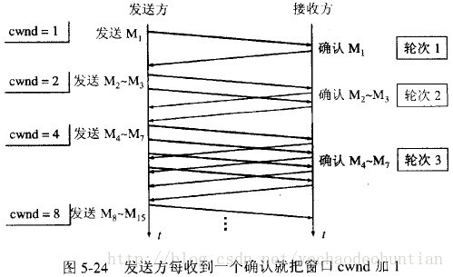

每经过一个传输轮次，拥塞窗口 cwnd 就加倍。一个传输轮次所经历的时间其实就是往返时间RTT。不过“传输轮次”更加强调：把拥塞窗口cwnd所允许发送的报文段都连续发送出去，并收到了对已发送的最后一个字节的确认。

另，慢开始的“慢”并不是指cwnd的增长速率慢，而是指在TCP开始发送报文段时先设置cwnd=1，使得发送方在开始时只发送一个报文段（目的是试探一下网络的拥塞情况），然后再逐渐增大cwnd。

为了防止拥塞窗口cwnd增长过大引起网络拥塞，还需要设置一个慢开始门限ssthresh状态变量（如何设置ssthresh）。慢开始门限ssthresh的用法如下：

- 当 cwnd < ssthresh 时，使用上述的慢开始算法。
- 当 cwnd > ssthresh 时，停止使用慢开始算法而改用拥塞避免算法。
- 当 cwnd = ssthresh 时，既可使用慢开始算法，也可使用拥塞控制避免算法。

**拥塞避免算法**：让拥塞窗口cwnd缓慢地增大，即每经过一个往返时间RTT就把发送方的拥塞窗口cwnd加1，而不是加倍。这样拥塞窗口cwnd按线性规律缓慢增长，比慢开始算法的拥塞窗口增长速率缓慢得多。

无论在慢开始阶段还是在拥塞避免阶段，只要发送方判断网络出现拥塞（其根据就是没有收到确认），就要把慢开始门限ssthresh设置为出现拥塞时的发送方窗口值的一半（但不能小于2）。然后把拥塞窗口cwnd重新设置为1，执行慢开始算法。这样做的目的就是要迅速减少主机发送到网络中的分组数，使得发生拥塞的路由器有足够时间把队列中积压的分组处理完毕。

如下图，用具体数值说明了上述拥塞控制的过程。现在发送窗口的大小和拥塞窗口一样大。

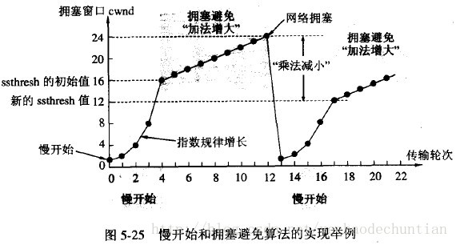

<1>. 当TCP连接进行初始化时，把拥塞窗口cwnd置为1。前面已说过，为了便于理解，图中的窗口单位不使用字节而使用报文段的个数。慢开始门限的初始值设置为16个报文段，即 cwnd = 16 。

<2>. 在执行慢开始算法时，拥塞窗口 cwnd 的初始值为1。以后发送方每收到一个对新报文段的确认ACK，就把拥塞窗口值另1，然后开始下一轮的传输（图中横坐标为传输轮次）。因此拥塞窗口cwnd随着传输轮次按指数规律增长。当拥塞窗口cwnd增长到慢开始门限值ssthresh时（即当cwnd=16时），就改为执行拥塞控制算法，拥塞窗口按线性规律增长。

<3>. 假定拥塞窗口的数值增长到24时，网络出现超时（这很可能就是网络发生拥塞了）。更新后的ssthresh值变为12（即变为出现超时时的拥塞窗口数值24的一半），拥塞窗口再重新设置为1，并执行慢开始算法。当cwnd=ssthresh=12时改为执行拥塞避免算法，拥塞窗口按线性规律增长，每经过一个往返时间增加一个MSS的大小。

强调：“拥塞避免”并非指完全能够避免了拥塞。利用以上的措施要完全避免网络拥塞还是不可能的。“拥塞避免”是说在拥塞避免阶段将拥塞窗口控制为按线性规律增长，**使网络比较不容易出现拥塞。**

**快重传和快恢复**

如果发送方设置的超时计时器时限已到但还没有收到确认，那么很可能是网络出现了拥塞，致使报文段在网络中的某处被丢弃。这时，TCP马上把拥塞窗口 cwnd 减小到1，并执行慢开始算法，同时把慢开始门限值ssthresh减半。这是不使用快重传的情况。

**快重传算法**首先要求接收方每收到一个失序的报文段后就立即发出重复确认（为的是使发送方及早知道有报文段没有到达对方）而不要等到自己发送数据时才进行捎带确认。

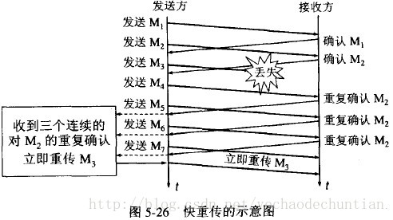

接收方收到了M1和M2后都分别发出了确认。现在假定接收方没有收到M3但接着收到了M4。显然，接收方不能确认M4，因为M4是收到的失序报文段。根据可靠传输原理，接收方可以什么都不做，也可以在适当时机发送一次对M2的确认。但按照快重传算法的规定，接收方应及时发送对M2的重复确认，这样做可以让发送方及早知道报文段M3没有到达接收方。发送方接着发送了M5和M6。接收方收到这两个报文后，也还要再次发出对M2的重复确认。这样，发送方共收到了接收方的四个对M2的确认，其中后三个都是重复确认。快重传算法还规定，发送方只要一连收到三个重复确认就应当立即重传对方尚未收到的报文段M3，而不必继续等待M3设置的重传计时器到期。由于发送方尽早重传未被确认的报文段，因此采用快重传后可以使整个网络吞吐量提高约20%。

与快重传配合使用的还有**快恢复算法**，其过程有以下两个要点：

  <1>. 当发送方连续收到三个重复确认，就执行“乘法减小”算法，把慢开始门限ssthresh减半。这是为了预防网络发生拥塞。请注意：接下去不执行慢开始算法。

  <2>. 由于发送方现在认为网络很可能没有发生拥塞，因此与慢开始不同之处是现在不执行慢开始算法（即拥塞窗口cwnd现在不设置为1），而是把cwnd值设置为慢开始门限ssthresh减半后的数值，然后开始执行拥塞避免算法（“加法增大”），使拥塞窗口缓慢地线性增大。

下图给出了快重传和快恢复的示意图，并标明了“TCP Reno版本”。

区别：新的 TCP Reno 版本在快重传之后采用快恢复算法而不是采用慢开始算法。

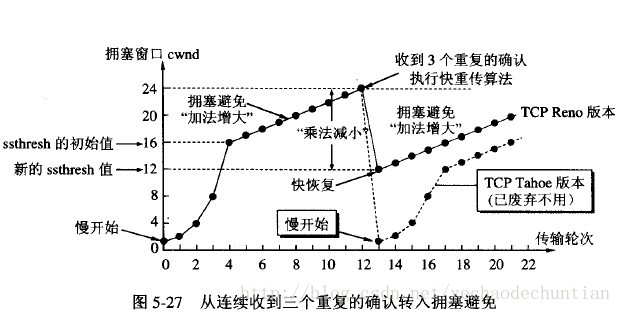

也有的快重传实现是把开始时的拥塞窗口cwnd值再增大一点，即等于 ssthresh + 3 X MSS 。这样做的理由是：既然发送方收到三个重复的确认，就表明有三个分组已经离开了网络。这三个分组不再消耗网络 的资源而是停留在接收方的缓存中。可见现在网络中并不是堆积了分组而是减少了三个分组。因此可以适当把拥塞窗口扩大了些。

在采用快恢复算法时，慢开始算法只是在TCP连接建立时和网络出现超时时才使用。

采用这样的拥塞控制方法使得TCP的性能有明显的改进。

接收方根据自己的接收能力设定了接收窗口rwnd，并把这个窗口值写入TCP首部中的窗口字段，传送给发送方。因此，接收窗口又称为通知窗口。因此，从接收方对发送方的流量控制的角度考虑，发送方的发送窗口一定不能超过对方给出的接收窗口rwnd 。

发送方窗口的上限值 = Min [ rwnd, cwnd ]

当rwnd < cwnd 时，是接收方的接收能力限制发送方窗口的最大值。

当cwnd < rwnd 时，则是网络的拥塞限制发送方窗口的最大值。


### HTTP

#### 1.在浏览器中输入url地址 ->> 显示主页的过程


总体来说分为以下几个过程:

1. DNS解析
2. TCP连接
3. 发送HTTP请求
4. 服务器处理请求并返回HTTP报文
5. 浏览器解析渲染页面
6. 连接结束

#### 2.HTTP状态码

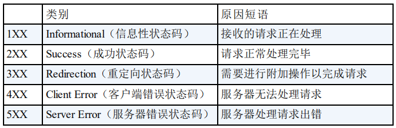

#### 3.HTTP是不保存状态的协议,如何保存用户状态?

- Session：通过**服务端**记录用户的状态。
- Cookie：在**浏览器**中保存用户信息，其中保存用户的 Session，在每次网络请求时加上 Session ID。
- Cookie 存储在客户端中，而 Session 存储在服务器上，相对来说 Session 安全性更高。

#### 4.HTTP和HTTPS的区别？

- HTTP：HyperText Transfer Protocol 超文本传输协议
- HTTPS：Hypertext Transfer Protocol Secure 超文本传输安全协议
- TLS：位于 HTTP 和 TCP 之间的协议，其内部有 TLS握手协议、TLS记录协议
- HTTPS 经由 HTTP 进行通信，但利用 TLS 来保证安全，即 HTTPS = HTTP + TLS

- 端口：HTTP 80；HTTPS：443
- 安全性：HTTP协议运行在 TCP 之上，所有传输的内容都是明文，客户端和服务器端都无法验证对方的身份。HTTPS 是运行在 SSL/TLS 之上的 HTTP 协议，SSL/TLS 运行在 TCP 之上。所有传输的内容都经过加密，加密采用**对称加密**，但对称加密的密钥用服务器方的证书进行了**非对称加密**。
  - **对称加密**：密钥只有一个，加密解密为同一个密码，且加解密速度快，典型的对称加密算法有DES、AES等；
  - **非对称加密**：密钥成对出现（且根据公钥无法推知私钥，根据私钥也无法推知公钥），加密解密使用不同密钥（公钥加密需要私钥解密，私钥加密需要公钥解密），相对对称加密速度较慢，典型的非对称加密算法有RSA、DSA等。

#### 5.HTTPS的连接过程？

http存在的问题：

- 容易被监听
  http通信都是明文，数据在客户端与服务器通信过程中，任何一点都可能被劫持。比如，发送了银行卡号和密码，hacker劫取到数据，就能看到卡号和密码，这是很危险的
- 被伪装
  http通信时，无法保证通行双方是合法的，通信方可能是伪装的。比如你请求www.taobao.com,你怎么知道返回的数据就是来自淘宝，中间人可能返回数据伪装成淘宝。
- 被篡改
  hacker中间篡改数据后，接收方并不知道数据已经被更改

https不是一种新的协议，它是http+SSL(TLS)的结合体，SSL是一种独立协议，所以其它协议比如smtp等也可以跟ssl结合。https改变了通信方式，它由以前的http----->tcp，改为http------>SSL----->tcp；https采用了共享密钥加密+公开密钥加密的方式。

https解决的问题：

- 防监听
  数据是加密的，所以监听得到的数据是密文，hacker看不懂。
- 防伪装
  伪装分为客户端伪装和服务器伪装，通信双方携带证书，证书相当于身份证，有证书就认为合法，没有证书就认为非法，证书由第三方颁布，很难伪造
- 防篡改
  https对数据做了摘要，篡改数据会被感知到。hacker即使从中改了数据也白搭。

后续内容的需要，这里插播一段共享密钥加密和公开密钥加密

- 共享密钥加密（对称加密）
  共享密钥的加密密钥和解密密钥是相同的，所以又称为对称密钥
- 公开密钥加密（非对称加密）
  加密算法是公开的，密钥是保密的。公开密钥分为私有密钥和公有密钥，公有密钥是公开的，任何人(客户端)都可以获取，客户端使用公有密钥加密数据，服务端用私有密钥解密数据。
- 异同
  共享密钥加密与公开密钥加密相比，加解密处理速度快，但公开密钥更适应互联网下使

https连接的过程：


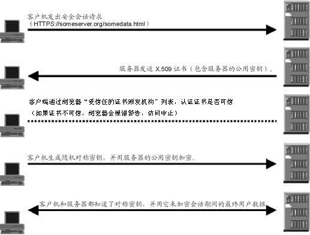

1、客户端发送https的请求。

2、服务器收到后，向客户端发送证书和服务器的公用密钥。

3、客户端收到证书后，使用根证书对服务器发来的证书进行验证，如果证书不可信，那么访问终止

4、客户端随机生成一个对称密钥，使用公钥进行加密，并向服务器发送加密后的对称密钥。

5、服务器收到加密后的对称密钥后使用私有密钥进行解密。

6、這样，双发都有了对称密钥，可以进行加密通信了。

#### 6.HTTP可以使用UDP吗？

HTTP 1、2版本都是使用 TCP

但是 HTTP 3中就使用到了 UDP，**是由Google提出的基于 UDP 协议的 QUIC 协议，并且使用在了 HTTP/3 上**

总结：

- HTTP/1 有连接无法复用、队头阻塞、协议开销大和安全因素等多个缺陷；
- HTTP/2 通过多路复用、二进制流与 Header 压缩等技术，极大地提高了性能，但是还是存在一些问题（HTTP/2 使用了多路复用，一般来说同一域名下只需要使用一个 TCP 连接。但当这个连接中出现了丢包的情况，那就会导致整个 TCP 都要开始等待重传，也就导致了后面的所有数据都被阻塞了）；
- HTTP/3 抛弃 TCP 协议，以全新的视角重新设计 HTTP。其底层支撑是 QUIC 协议，该协议基于 UDP，有 UDP 特有的优势，同时它又取了 TCP 中的精华，实现了即快又可靠的协议；

#### 7.HTTPS怎么确认收到的公钥就是服务器发来的？

浏览器理论上来说无法确认自己收到的公钥是不是服务器发来的。

因此需要一些第三方的证明：

数字证书+数字签名

数字证书由 CA 机构进行颁发，数字证书中保存证书持有者、证书持有者的公钥等信息，将其发送给浏览器，浏览器从中取出公钥信息。为了防止数字证书被修改则可以使用数字签名。明文和数字签名共同组成了数字证书。

浏览器验证过程：

1、拿到证书，得到明文T，数字签名S。

2、用CA机构的公钥对S解密（由于是浏览器信任的机构，所以浏览器保有它的公钥。详情见下文），得到S’。

3、用证书里说明的hash算法对明文T进行hash得到T’。

4、比较S’是否等于T’，等于则表明证书可信。

#### 8.HTTPS为什么安全？

非对称加密算法（**公钥和私钥**）交换对称密钥+数字证书验证身份（**验证公钥是否是伪造的**）+利用**对称密钥**加解密后续传输的数据=**安全**

#### 9.**输入 www.baidu.com，怎么变成 https://www.baidu.com 的，浏览器怎么确定用HTTP还是HTTPS**

之前的话服务器既监听 HTTP 的80端口，也监听 HTTPS 的 443 端口，当发往 HTTP 请求会被服务器使用 302 重定向跳转到 HTTPS，这会有两个影响：

- 不安全，302 跳转不仅暴露了用户的访问站点，也很容易被中间者劫持。
- 降低访问速度，302 跳转不仅需要一个 RTT，浏览器执行跳转也需要执行时间。

并且由于 302 跳转事实上是由浏览器触发的，服务器无法完全控制，这个需求导致了 HSTS 的诞生。

HSTS（HTTP Strict Transport Security）的作用是强制客户端（如浏览器）使用 HTTPS 与服务器创建连接。

服务端返回一个 HSTS 的 HTTP Header，浏览器获取到 HSTS 头部之后，在一段时间内，用户输入 www.baidu. com 会默认将请求内部跳转成 https:// www.baidu. com。

#### 10.转发(Forward)和重定向(Redirect)的区别？

**转发是服务器行为，重定向是客户端行为。**

**转发（Forword）** 通过RequestDispatcher对象的 forward（HttpServletRequest request,HttpServletResponse response） 方法实现的。

**重定向（Redirect）** 是利用服务器返回的状态吗来实现的。客户端浏览器请求服务器的时候，服务器会返回一个状 态码。服务器通过HttpServletRequestResponse的setStatus(int status)方法设置状态码。如果服务器返回301或者 302，则浏览器会到新的网址重新请求该资源。

## 数据库

### SQL

#### 1.数据库的三级模式？

- 外模式
- 模式
- 内模式

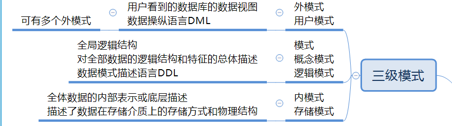

#### 2.数据库中的锁？

**共享锁【S锁、读锁】**
又称读锁，若事务T对数据对象A加上S锁，则事务T可以读A但不能修改A，其他事务只能再对A加S锁，而不能加X锁，直到T释放A上的S锁。这保证了其他事务可以读A，但在T释放A上的S 锁之前不能对A做任何修改。

**排他锁【X锁、写锁】**
又称写锁。若事务T对数据对象A加上X锁，事务T可以读A也可以修改A，其他事务不能再对A加任何锁，直到T释放A上的锁。这保证了其他事务在T释放A上的锁之前不能再读取和修改A。

#### 3.乐观锁&悲观锁

**乐观锁**

总是假设最好的情况，每次去拿数据的时候都认为别人不会修改，所以不会上锁，但是在更新的时候会判断一下在此期间别人有没有去更新这个数据，可以使用版本号机制和CAS算法实现。**乐观锁适用于多读的应用类型，这样可以提高吞吐量**，像数据库提供的类似于**write_condition机制**，其实都是提供的乐观锁。

**悲观锁**

总是假设最坏的情况，每次去拿数据的时候都认为别人会修改，所以每次在拿数据的时候都会上锁，这样别人想拿这个数据就会阻塞直到它拿到锁（**共享资源每次只给一个线程使用，其它线程阻塞，用完后再把资源转让给其它线程**）。传统的关系型数据库里边就用到了很多这种锁机制，比如行锁，表锁等，读锁，写锁等，都是在做操作之前先上锁。

**乐观锁适用于写比较少的情况下（多读场景）**，即冲突真的很少发生的时候，这样可以省去了锁的开销，加大了系统的整个吞吐量。但如果是多写的情况，一般会经常产生冲突，这就会导致上层应用会不断的进行retry，这样反倒是降低了性能，所以**一般多写的场景下用悲观锁就比较合适。**

#### 5.分布式事务&CAP理论

**在分布式系统中一次操作由多个系统协同完成，这种一次事务操作涉及多个系统通过网络协同完成的过程称为分布式事务**。这里强调的是多个系统通过网络协同完成一个事务的过程，并不强调多个系统访问了不同的数据库，即使多个系统访问的是同一个数据库也是分布式事务。

**CAP理论**是分布式事务处理的理论基础，了解了CAP理论有助于我们研究分布式事务的处理方案。

CAP理论是：分布式系统在设计时只能在**一致性(Consistency)、可用性(Availability)、分区容忍性(Partition Tolerance)中满足两种，无法兼顾三种**。

- 一致性(Consistency)：服务A、B、C三个结点都存储了用户数据， 三个结点的数据需要保持同一时刻数据一致性。 
- 可用性(Availability)：服务A、B、C三个结点，其中一个结点宕机不影响整个集群对外提供服务，如果只有服务A结点，当服务A宕机整个系统将无法提供服务，增加服务B、C是为了保证系统的可用性。 
- 分区容忍性(Partition Tolerance)：分区容忍性就是允许系统通过网络协同工作，分区容忍性要解决由于网络分区导致数据的不完整及无法访问等问题。

分布式系统不可避免的出现了多个系统通过网络协同工作的场景，结点之间难免会出现网络中断、网延延迟等现象，这种现象一旦出现就导致数据被分散在不同的结点上，这就是网络分区。

分布式系统能否兼顾C、A、P？ 

在保证分区容忍性的前提下一致性和可用性无法兼顾，如果要提高系统的可用性就要增加多个结点，如果要保证数 据的一致性就要实现每个结点的数据一致，结点越多可用性越好，但是数据一致性越差。 所以，在进行分布式系统设计时，同时满足“一致性”、“可用性”和“分区容忍性”三者是几乎不可能的。

CAP有哪些组合方式？ 

1、CA：放弃分区容忍性，加强一致性和可用性，关系数据库按照CA进行设计。 

2、AP：放弃一致性，加强可用性和分区容忍性，追求最终一致性，很多NoSQL数据库按照AP进行设计。 

说明：这里放弃一致性是指放弃强一致性，强一致性就是写入成功立刻要查询出最新数据。追求最终一致性是指允许暂时的数据不一致，只要最终在用户接受的时间内数据一致即可。 

3、CP：放弃可用性，加强一致性和分区容忍性，一些强一致性要求的系统按CP进行设计，比如跨行转账，一次转账请求要等待双方银行系统都完成整个事务才算完成。 

说明：由于网络问题的存在CP系统可能会出现待等待超时，如果没有处理超时问题则整理系统会出现阻塞。

总结：

在分布式系统设计中**AP**的应用较多，即**保证分区容忍性和可用性，牺牲数据的强一致性（写操作后立刻读取到最 新数据），保证数据最终一致性**。比如：订单退款，今日退款成功，明日账户到账，只要在预定的用户可以接受的 时间内退款事务走完即可。

### MySQL

#### 1.MyISAM和InnoDB区别？

MyISAM是MySQL的默认数据库引擎（5.5版之前）。虽然性能极佳，而且提供了大量的特性，包括全文索引、压缩、空间函数等，但MyISAM不支持事务和行级锁，而且最大的缺陷就是崩溃后无法安全恢复。不过，5.5版本之后，MySQL引入了InnoDB（事务性数据库引擎），MySQL 5.5版本后默认的存储引擎为InnoDB。

#### 2.什么是事务？

**事务是逻辑上的一组操作，要么都执行，要么都不执行。**事物的四大特性(ACID)：

- **原子性（Atomicity）：** 事务是最小的执行单位，不允许分割。事务的原子性确保动作要么全部完成，要么完全不起作用；
- **一致性（Consistency）：** 执行事务前后，数据保持一致，多个事务对同一个数据读取的结果是相同的；
- **隔离性（Isolation）：** 并发访问数据库时，一个用户的事务不被其他事务所干扰，各并发事务之间数据库是独立的；
- **持久性（Durability）：** 一个事务被提交之后。它对数据库中数据的改变是持久的，即使数据库发生故障也不应该对其有任何影响。

#### 3.并发事务带来哪些问题?

在典型的应用程序中，多个事务并发运行，经常会操作相同的数据来完成各自的任务（多个用户对同一数据进行操作）。并发虽然是必须的，但可能会导致以下的问题。

- **脏读（Dirty read）:** 当一个事务正在访问数据并且对数据进行了修改，而这种修改还没有提交到数据库中，这时另外一个事务也访问了这个数据，然后使用了这个数据。因为这个数据是还没有提交的数据，那么另外一个事务读到的这个数据是“脏数据”，依据“脏数据”所做的操作可能是不正确的。
- **丢失修改（Lost to modify）:** 指在一个事务读取一个数据时，另外一个事务也访问了该数据，那么在第一个事务中修改了这个数据后，第二个事务也修改了这个数据。这样第一个事务内的修改结果就被丢失，因此称为丢失修改。
- **不可重复读（Unrepeatableread）:** 指在一个事务内多次读同一数据。在这个事务还没有结束时，另一个事务也访问该数据。那么，在第一个事务中的两次读数据之间，由于第二个事务的修改导致第一个事务两次读取的数据可能不太一样。这就发生了在一个事务内两次读到的数据是不一样的情况，因此称为不可重复读。
- **幻读（Phantom read）:** 幻读与不可重复读类似。它发生在一个事务（T1）读取了几行数据，接着另一个并发事务（T2）插入了一些数据时。在随后的查询中，第一个事务（T1）就会发现多了一些原本不存在的记录，就好像发生了幻觉一样，所以称为幻读。

#### 4.事务隔离级别有哪些?MySQL的默认隔离级别是?

**SQL 标准定义了四个隔离级别：**

- **READ-UNCOMMITTED(读取未提交)：** 最低的隔离级别，允许读取尚未提交的数据变更，**可能会导致脏读、幻读或不可重复读**。
- **READ-COMMITTED(读取已提交)：** 允许读取并发事务已经提交的数据，**可以阻止脏读，但是幻读或不可重复读仍有可能发生**。
- **REPEATABLE-READ(可重复读)：** 对同一字段的多次读取结果都是一致的，除非数据是被本身事务自己所修改，**可以阻止脏读和不可重复读，但幻读仍有可能发生**。
- **SERIALIZABLE(可串行化)：** 最高的隔离级别，完全服从ACID的隔离级别。所有的事务依次逐个执行，这样事务之间就完全不可能产生干扰，也就是说，**该级别可以防止脏读、不可重复读以及幻读**。

| 隔离级别         | 脏读 | 不可重复读 | 幻影读 |
| ---------------- | ---- | ---------- | ------ |
| READ-UNCOMMITTED | √    | √          | √      |
| READ-COMMITTED   | ×    | √          | √      |
| REPEATABLE-READ  | ×    | ×          | √      |
| SERIALIZABLE     | ×    | ×          | ×      |

MySQL InnoDB 存储引擎的默认支持的隔离级别是 **REPEATABLE-READ（可重读）**。

这里需要注意的是：与 SQL 标准不同的地方在于 InnoDB 存储引擎在 **REPEATABLE-READ（可重读）** 事务隔离级别下使用的是 Next-Key Lock 锁算法，因此可以避免幻读的产生。这与其他数据库系统(如 SQL Server) 是不同的。

所以说InnoDB 存储引擎的默认支持的隔离级别是 **REPEATABLE-READ（可重读）** 已经可以完全保证事务的隔离性要求，即达到了 SQL标准的 **SERIALIZABLE(可串行化)** 隔离级别。

InnoDB 存储引擎在 **分布式事务** 的情况下一般会用到 **SERIALIZABLE(可串行化)** 隔离级别。

#### 5.锁机制与InnoDB锁算法

**MyISAM和InnoDB存储引擎使用的锁：**

- MyISAM采用表级锁(table-level locking)。
- InnoDB支持行级锁(row-level locking)和表级锁,默认为行级锁

**表级锁和行级锁对比：**

- **表级锁：** MySQL中锁定 **粒度最大** 的一种锁，对当前操作的整张表加锁，实现简单，资源消耗也比较少，加锁快，不会出现死锁。其锁定粒度最大，触发锁冲突的概率最高，并发度最低，MyISAM和 InnoDB引擎都支持表级锁。
- **行级锁：** MySQL中锁定 **粒度最小** 的一种锁，只针对当前操作的行进行加锁。 行级锁能大大减少数据库操作的冲突。其加锁粒度最小，并发度高，但加锁的开销也最大，加锁慢，会出现死锁。

**InnoDB存储引擎的锁的算法有三种：**

- Record lock：单个行记录上的锁
- Gap lock：间隙锁，锁定一个范围，不包括记录本身
- Next-key lock：record+gap 锁定一个范围，包含记录本身

#### 6.大表优化

当MySQL单表记录数过大时，数据库的CRUD性能会明显下降，一些常见的优化措施如下：

1、限定数据的范围

务必禁止不带任何限制数据范围条件的查询语句。比如：我们当用户在查询订单历史的时候，我们可以控制在一个月的范围内；

2、读/写分离

经典的数据库拆分方案，主库负责写，从库负责读；

3、垂直分区

**根据数据库里面数据表的相关性进行拆分。** 例如，用户表中既有用户的登录信息又有用户的基本信息，可以将用户表拆分成两个单独的表，甚至放到单独的库做分库。

**简单来说垂直拆分是指数据表列的拆分，把一张列比较多的表拆分为多张表。** 

- **垂直拆分的优点：** 可以使得列数据变小，在查询时减少读取的Block数，减少I/O次数。此外，垂直分区可以简化表的结构，易于维护。
- **垂直拆分的缺点：** 主键会出现冗余，需要管理冗余列，并会引起Join操作，可以通过在应用层进行Join来解决。此外，垂直分区会让事务变得更加复杂；

4、水平分区

**保持数据表结构不变，通过某种策略存储数据分片。这样每一片数据分散到不同的表或者库中，达到了分布式的目的。 水平拆分可以支撑非常大的数据量。**

水平拆分是指数据表行的拆分，表的行数超过200万行时，就会变慢，这时可以把一张的表的数据拆成多张表来存放。

水平拆分可以支持非常大的数据量。需要注意的一点是：分表仅仅是解决了单一表数据过大的问题，但由于表的数据还是在同一台机器上，其实对于提升MySQL并发能力没有什么意义，所以 **水平拆分最好分库** 。

水平拆分能够 **支持非常大的数据量存储，应用端改造也少**，但 **分片事务难以解决** ，跨节点Join性能较差，逻辑复杂。《Java工程师修炼之道》的作者推荐 **尽量不要对数据进行分片，因为拆分会带来逻辑、部署、运维的各种复杂度** ，一般的数据表在优化得当的情况下支撑千万以下的数据量是没有太大问题的。如果实在要分片，尽量选择客户端分片架构，这样可以减少一次和中间件的网络I/O。

**下面补充一下数据库分片的两种常见方案：**

- **客户端代理：** **分片逻辑在应用端，封装在jar包中，通过修改或者封装JDBC层来实现。** 当当网的 **Sharding-JDBC** 、阿里的TDDL是两种比较常用的实现。
- **中间件代理：** **在应用和数据中间加了一个代理层。分片逻辑统一维护在中间件服务中。** 我们现在谈的 **Mycat** 、360的Atlas、网易的DDB等等都是这种架构的实现。

#### 7.解释一下什么是池化设计思想。什么是数据库连接池?为什么需要数据库连接池?

池化设计应该不是一个新名词。我们常见的如java线程池、jdbc连接池、redis连接池等就是这类设计的代表实现。这种设计会初始预设资源，解决的问题就是抵消每次获取资源的消耗，如创建线程的开销，获取远程连接的开销等。除了初始化资源，池化设计还包括如下这些特征：池子的初始值、池子的活跃值、池子的最大值等，这些特征可以直接映射到java线程池和数据库连接池的成员属性中。

数据库连接本质就是**一个 socket 的连接**。数据库服务端还要维护一些缓存和用户权限信息之类的 所以占用了一些内存。我们可以把数据库连接池是看做是维护的数据库连接的缓存，以便将来需要对数据库的请求时可以重用这些连接。为每个用户打开和维护数据库连接，尤其是对动态数据库驱动的网站应用程序的请求，既昂贵又浪费资源。

**在连接池中，创建连接后，将其放置在池中，并再次使用它，因此不必建立新的连接。如果使用了所有连接，则会建立一个新连接并将其添加到池中**。

#### 8.分库分表之后,id 主键如何处理？

需要一个全局唯一的 id 来作为 id 主键，这样就不会出现这样的问题了。

生成全局 id 有下面这几种方式：

- **UUID**：UUID(Universally Unique Identifier)的标准型式包含32个16进制数字，以连字号分为五段，形式为8-4-4-4-12的36个字符，不适合作为主键，因为太长了，并且无序不可读，查询效率低。比较适合用于生成唯一的名字的标示比如文件的名字。
- **数据库自增 id** : 两台数据库分别设置不同步长，生成不重复ID的策略来实现高可用。这种方式生成的 id 有序，但是需要独立部署数据库实例，成本高，还会有性能瓶颈。
- **利用 redis 生成 id :** 性能比较好，灵活方便，不依赖于数据库。但是，引入了新的组件造成系统更加复杂，可用性降低，编码更加复杂，增加了系统成本。
- **Mongdb objectID**：通过“时间+机器码+pid+inc”共12个字节，通过4+3+2+3的方式最终标识成一个24长度的十六进制字符。
- **Twitter的snowflake算法** ：Github 地址：https://github.com/twitter-archive/snowflake。
- **美团的[Leaf](https://tech.meituan.com/2017/04/21/mt-leaf.html)分布式ID生成系统** ：Leaf 是美团开源的分布式ID生成器，能保证全局唯一性、趋势递增、单调递增、信息安全。美团技术团队的一篇文章：https://tech.meituan.com/2017/04/21/mt-leaf.html 。

#### 9.为什么 MySQL 使用 B+ 树？

一颗传统的M阶B+树需要满足以下几个要求：

- 从根节点到叶节点的所有路径都具有相同的长度
- 所有数据信息都存储在叶子节点，非叶子节点仅作为叶节点的索引存在
- 根节点至少拥有两个子树
- 每个树节点最多拥有M个子树
- 每个树节点(除了根节点)拥有至少M/2个子树

**B+树是为了磁盘及其他存储辅助设备而设计的一种平衡查找树(不是二叉树)，在B+树中，所有记录的节点按大小顺序存放在同一层的叶节点中，各叶子节点用指针进行连接,而B+树索引本质上就是B+树在数据库中的实现，与纯粹的B+树数据结构还是有点区别**。

MySQL 跟 B+ 树没有直接的关系，真正与 B+ 树有关系的是 MySQL 的默认存储引擎 InnoDB，MySQL 默认的存储引擎 InnoDB 会使用 B+ 树来存储数据。

表中的数据（主键索引）还是辅助索引最终都会使用 B+ 树来存储数据。对于 InnoDB 来说，所有的数据都是以**键值对**的方式存储的，主键索引和辅助索引在存储数据时会将 `id` 和 `index` 作为键，将所有列和 `id` 作为键对应的值。

MySQL 默认的存储引擎选择 B+ 树而不是哈希或者 B 树的原因：

- 哈希虽然能够提供 `O(1)` 的单数据行操作性能，但是对于范围查询和排序却无法很好地支持，最终导致全表扫描；
- B 树能够在非叶节点中存储数据，但是这也导致在查询连续数据时可能会带来更多的随机 I/O，而 B+ 树的所有叶节点可以通过指针相互连接，能够减少顺序遍历时产生的额外随机 I/O；
- B+树索引采用了多叉树的结构，降低了索引结构的深度，避免了传统二叉树结构中绝大部分的随机访问操作，有效减少了磁盘磁头的寻道次数。B+树索引查询效率稳定，也有利于进行范围查询。

### Redis

#### 1.Redis简介

简单来说 redis 就是一个数据库，不过与传统数据库不同的是 redis 的数据是存在内存中的，所以读写速度非常快，因此 redis 被广泛应用于缓存方向。另外，redis 也经常用来做分布式锁。redis 提供了多种数据类型来支持不同的业务场景。除此之外，redis 支持事务 、持久化、LUA 脚本、LRU 驱动事件、多种集群方案。

Redis的优点：

- **redis 支持更丰富的数据类型（支持更复杂的应用场景）**：Redis 不仅仅支持简单的 k/v 类型的数据，同时还提供 list，set，zset，hash 等数据结构的存储。memcache 支持简单的数据类型，String。

- **Redis 支持数据的持久化，可以将内存中的数据保持在磁盘中，重启的时候可以再次加载进行使用。**

- **集群模式**： redis 原生支持 cluster 模式的。

- **Redis 使用单线程的多路 IO 复用模型。**

#### 2.为什么使用Redis？

主要从“高性能”和“高并发”这两点来看待这个问题。

- 高性能：假如用户第一次访问数据库中的某些数据。这个过程会比较慢，因为是从硬盘上读取的。将该用户访问的数据存在缓存中，这样下一次再访问这些数据的时候就可以直接从缓存中获取了。操作缓存就是直接操作内存，所以速度相当快。如果数据库中的对应数据改变的之后，同步改变缓存中相应的数据即可！
- 高并发：直接操作缓存能够承受的请求是远远大于直接访问数据库的，所以我们可以考虑把数据库中的部分数据转移到缓存中去，这样用户的一部分请求会直接到缓存这里而不用经过数据库。

#### 3.Redis的线程模型？

redis 内部使用文件事件处理器 `file event handler`，这个文件事件处理器是单线程的，所以 redis 才叫做单线程的模型。它采用 **IO 多路复用机制**同时监听多个 socket，根据 socket 上的事件来选择对应的事件处理器进行处理。

多个 socket 可能会并发产生不同的操作，每个操作对应不同的文件事件，但是 IO 多路复用程序会监听多个 socket，会将 socket 产生的事件放入队列中排队，事件分派器每次从队列中取出一个事件，把该事件交给对应的事件处理器进行处理。

#### 4.Redis设置过期时间

Redis 中有个设置时间过期的功能，即对存储在 redis 数据库中的值可以设置一个过期时间。（比如我在鑫课堂项目中便将用户的Token保存在Redis中并且设置了对应的过期时间）

#### 5.那么当设置的过期时间到达之后Redis是如何删除该key的？

**定期删除+惰性删除。**

- **定期删除**：redis 默认是每隔 **100ms** 就**随机抽取**一些设置了过期时间的 key，检查其是否过期，如果过期就删除。注意这里是随机抽取的。为什么要随机呢？你想一想假如 redis 存了几十万个 key ，每隔 100ms 就遍历所有的设置过期时间的 key 的话，就会给 CPU 带来很大的负载！
- **惰性删除** ：定期删除可能会导致很多过期 key 到了时间并没有被删除掉。所以就有了惰性删除。假如你的过期 key，靠定期删除没有被删除掉，还停留在内存里，除非你的系统去查一下那个 key，才会被 redis 给删除掉。这就是所谓的惰性删除，也是够懒的哈！

如果定期删除漏掉了很多过期 key，然后你也没及时去查，也就没走惰性删除，此时会怎么样？如果大量过期 key 堆积在内存里，导致 redis 内存块耗尽了。怎么解决这个问题呢？

 **redis 内存淘汰机制。**

**redis 提供 6 种数据淘汰策略：**

1. **volatile-lru**：从已设置过期时间的数据集（server.db[i].expires）中挑选最近最少使用的数据淘汰
2. **volatile-ttl**：从已设置过期时间的数据集（server.db[i].expires）中挑选将要过期的数据淘汰
3. **volatile-random**：从已设置过期时间的数据集（server.db[i].expires）中任意选择数据淘汰
4. **allkeys-lru**：当内存不足以容纳新写入数据时，在键空间中，移除最近最少使用的 key（这个是最常用的）
5. **allkeys-random**：从数据集（server.db[i].dict）中任意选择数据淘汰
6. **no-eviction**：禁止驱逐数据，也就是说当内存不足以容纳新写入数据时，新写入操作会报错。这个应该没人使用吧！

4.0 版本后增加以下两种：

1. **volatile-lfu**：从已设置过期时间的数据集(server.db[i].expires)中挑选最不经常使用的数据淘汰
2. **allkeys-lfu**：当内存不足以容纳新写入数据时，在键空间中，移除最不经常使用的 key

#### 6.Redis持久化机制

Redis 支持两种不同的持久化操作。

- **快照（snapshotting）持久化（RDB）**：Redis 可以通过创建快照来获得存储在内存里面的数据在某个时间点上的副本。快照持久化是 Redis 默认采用的持久化方式。
- **AOF（append-only file）持久化**：与快照持久化相比，AOF 持久化 的实时性更好。（因此已成为主流的持久化方案，默认情况下 Redis 没有开启 AOF方式的持久化）开启 AOF 持久化后每执行一条会更改 Redis 中的数据的命令，Redis 就会将该命令写入硬盘中的 AOF 文件。（为了兼顾数据和写入性能，用户可以考虑 appendfsync everysec 选项 ，让 Redis 每秒同步一次 AOF 文件，Redis 性能几乎没受到任何影响。而且这样即使出现系统崩溃，用户最多只会丢失一秒之内产生的数据。）

Redis 4.0 开始支持 RDB 和 AOF 的混合持久化（默认关闭）。

如果把混合持久化打开，AOF 重写的时候就直接把 RDB 的内容写到 AOF 文件开头。

这样做的好处是可以结合 RDB 和 AOF 的优点, 快速加载同时避免丢失过多的数据。

当然缺点也是有的， AOF 里面的 RDB 部分是压缩格式不再是 AOF 格式，可读性较差。

#### 7.缓存雪崩

缓存同一时间大面积的失效，所以，后面的请求都会落到数据库上，造成数据库短时间内承受大量请求而崩掉。

**有哪些解决办法？**

- 事前：尽量保证整个 redis 集群的高可用性，发现机器宕机尽快补上。选择合适的内存淘汰策略。
- 事中：本地 ehcache 缓存 + hystrix 限流&降级，避免 MySQL 崩掉
- 事后：利用 redis 持久化机制保存的数据尽快恢复缓存

#### 8.**缓存穿透**

缓存穿透说简单点就是大量请求的 key 根本不存在于缓存中，导致请求直接到了数据库上，根本没有经过缓存这一层。

**有哪些解决办法？**

- 最基本的就是首先做好参数校验，一些不合法的参数请求直接抛出异常信息返回给客户端。
- **缓存无效 key** : 如果缓存和数据库都查不到某个 key 的数据就写一个到 redis 中去并设置过期时间。
- **布隆过滤器：**布隆过滤器是一个非常神奇的数据结构，通过它我们可以非常方便地判断一个给定数据是否存在于海量数据中。把所有可能存在的请求的值都存放在布隆过滤器中，当用户请求过来，我会先判断用户发来的请求的值是否存在于布隆过滤器中。不存在的话，直接返回请求参数错误信息给客户端，存在的话才会走下面的流程。

## 数据结构

### 查找

#### 1.哈希碰撞解决办法

哈希函数的目的是使键均匀地分布在数组中，并且可以在内存中以O(1)的时间复杂度进行寻址，从而实现快速查找和修改。哈希表中哈希函数的设计困难在于将数据均匀分布在哈希表中，从而尽量减少哈希碰撞和冲突。由于不同的键可能具有相同的哈希值，即可能出现冲突，高级的哈希函数能够使冲突数目最小化。

常见的哈希碰撞解决方法：

 **1开放定址法**

开放寻址法中，所有的元素都存放在散列表里，当产生哈希冲突时，通过一个探测函数计算出下一个候选位置，如果下一个获选位置还是有冲突，那么不断通过探测函数往下找，直到找个一个空槽来存放待插入元素。

开放定址法包两种：

- 线性探测法：寻找出现冲突的下一个位置
- 平方探测法：按照 +- i^2 的方式进行探测（i=1，2，3，。。。）

 **2 链地址法 **

将所有关键字哈希值相同的记录都存在同一线性链表中，这样不需要占用其他的哈希地址，相同的哈希值在一条链表上，按顺序遍历就可以找到。

 **3 再哈希法 **

这个方法是按顺序规定多个哈希函数，每次查询的时候按顺序调用哈希函数，调用到第一个为空的时候返回不存在，调用到此键的时候返回其值。

 **4 公共溢出区 **

其基本思想是：所有关键字和基本表中关键字为相同哈希值的记录，不管他们由哈希函数得到的哈希地址是什么，一旦发生冲突，都填入溢出表。

### 排序

#### 快排

##### 1.单链表排序

节点的结构：

```java
class ListNode{
    int val;
    ListNode next;
    ListNode(int val){
        this.val = val;
        this.next = null;
    }
}
```

对于链表进行排序可以有**指针交换**和**值交换**两种思路。指针交换就是**归并排序**，值交换就是**快排**。

快排实现单链表排序：

```java
// 注意对链表进行排序都必须得知道链表的开头和结尾
public void QuickSort(ListNode start,ListNode end){
    if(start != end){
        ListNode node = Partition(start,end);
        QuickSort(start,node);
        QuickSort(node.next,end);
    }
}
// 寻找分割点
private ListNode Partition(ListNode start,ListNode end){
    // 分割点指针
    ListNode node = start;
    // 遍历指针
    ListNode left = strat.next;
    while(left != end){
        // strat默认为基准点，按照其为以后标准
        if(start.val > left.val){
            // 注意这里的分割点要往后移动一位在进行值交换
            node = node.next;
            swap(left,node);
        }
        // 遍历指针每次之后都要往后移动
        left = left.next;
    }
    // 最后将基准点和分割点进行交换
    swap(node,start);
    return node;
}
private void swap(ListNode a,ListNode b){
    int temp = a.val;
    a.val = b.val;
    b.val = temp;
}
```

归并实现单链表的排序：

```java
// 注意对链表进行排序都必须得知道链表的开头和结尾
public ListNode mergeSort(ListNode head){
    // 特殊情况
    if(head == null || head.next == null){
        return head;
    }
    // 寻找链表的中间节点
    ListNode mid = getMid(head);
    // 将链表分割为两部分
    ListNode newHead = mid.next;
    mid.next = null;
    // 递归执行归并操作
    ListNode l1 = mergeSort(head);
    ListNode l2 = mergeSort(newHead);
    // 归并两个链表
    return merge(l1,l2);
}
// 快慢指针寻找链表的中间节点
private ListNode getMid(ListNode head){
    if(head == null || head.next == null){
        return head;
    }
    ListNode slow = head;
    ListNode fast = head;
    // 注意这里两个都是fast
    while(fast.next != null && fast.next.next != null){
        slow = slow.next;
        fast = fast.next.next;
    }
    return slow;
}
// 将两个链表归并为一个有序链表
private ListNode merge(ListNode l1, ListNode l2){
    // 特殊情况
    if(l1 == null){
        return l2;
    }
    if(l2 == null){
        return l1;
    }
    if(l1.val <= l2.val){
        l1.next = merge(l1.next,l2);
        return l1;
    }else{
        l2.next = merge(l1,l2.next);
        return l2;
    }
}
```


## 算法

解决一个算法问题的整体思路：

1. 注意题目中的条件
2. 给出测试用例来验证思路
3. 暴力解法通常是思考的起点
4. 对暴力解法进行优化
   - 脑中遍历常见的算法思路
   - 脑中遍历常见的数据结构
   - 空间和时间的交换（哈希表）
   - 预处理数据（排序）
   - 在瓶颈处寻找答案
5. 实际编写代码求解问题
   - 极端条件判断（数组为空？字符串为空？指针为null？数量为0？）
   - 变量名最好使用英文并有意义
   - 代码的模块化，复用性
6. 熟悉白板编程

### 数组类题目

#### 1.二分查找

- 当题目已知数组有序时
- 对数组首先进行排序
- mid = (left+right)/2 是个隐藏bug，会存在整数溢出，正确的为：mid = left+(right-left)/2

#### 2.三路快排

三路快排将整个数组分为 小于v，等于v，大于v 三部分。当递归处理时，遇到等于v的元素直接不用管，只需要处理小于v和大于v的元素。

```
<v  |  =v  |   >v
```

之后再递归的处理 <v 和 >v的部分。

#### 3.对撞指针

对撞指针是一种**双索引技术（Two Pointer）**，即两个指针向一起对撞，直到 i==j，此时已经将整个数组都遍历一遍了。如下所示，i指向0角标，j指向 n-1角标：

```
1 2 3 4 5 6 7 8 9
i->           <-j
```

对撞指针的重点在于**i，j移动的条件**，这类题目中 i 和 j 肯定是要往一起对撞的，变化之处就在于**在什么情况下移动，移动几步**。

#### 4.滑动窗口

滑动窗口也是属于**双索引技术（Two Pointer）**，不同于对撞指针，滑动窗口要求 i 和 j 是往一个方向移动的，只不过 i 和 j 之间是存在一定的间距的，这样就形成了一个窗口，然后整个窗口往一个方向滑动，最终到达数组末尾。

```
1 2 3 4 5 6 7 8 9
i->   j->
---窗口---         
```


### 贪心算法

一般来说，贪心算法一般都和数组**排序**相辅助，假如没有告诉数组有序则需要手动对其进行排序。

贪心算法往往来说是和动态规划算法是具有密切的相关关系的，即有些动态规划的题目可以使用贪心算法来求解。但是这类能用贪心算法来求解的动态规划问题一般都需要具有**贪心选择的性质**。

所谓的贪心选择性质就是：**在求解一个最优化选择问题的时候，我们选择使用贪心的方式选择一组内容之后不会影响子问题的求解。**

## 其他

### Git

git 是一个分布式版本控制软件

三种工作区域

1. Git 的本地仓库：在 .git 目录中
2. 工作区：用户操作目录
3. 暂存区:在 .git 目录中

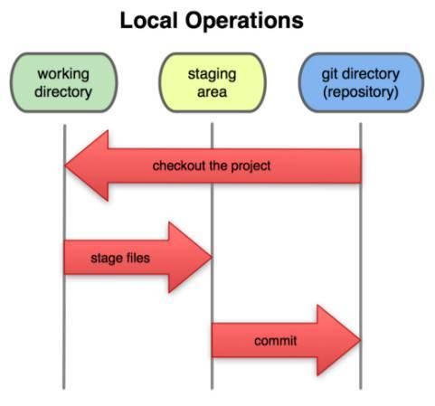

三种状态

1. 已提交（committed）:该文件已经被安全地保存在本地仓库中
2. 已修改（modified）:修改了某个文件，但还没有提交保存
3. 已暂存（staged）:把已修改的文件放在下次提交时要保存的清单中

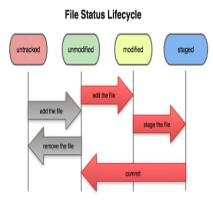

Git 分支初识

1. Git 中的分支，其实本质上仅仅是个指向 commit 对象的可变指针。
2. Git 会使用 master 作为分支的默认名字。在若干次提交后，你其实已经有了一个指向最后一次提交对象的 master 分支，它在每次提交的时候都会自动向前移动。
3. Git 鼓励在工作流程中频繁使用分支与合并。


#### 1.分支

```shell
# 新建一个分支，但依然停留在当前分支
$ git branch [branch-name

# 删除分支
$ git branch -d [branch-name]

# 切换到指定分支，并更新工作区
$ git checkout [branch-name]

# 切换到上一个分支
$ git checkout -

# 合并指定分支到当前分支
$ git merge [branch]
```

#### 2.提交

```shell
# 提交暂存区到仓库区
$ git commit -m [message]

# 提交暂存区的指定文件到仓库区
$ git commit [file1] [file2] ... -m [message]
```

#### 3.添加删除文件

```shell
# 添加指定文件到暂存区
$ git add [file1] [file2] ...

# 添加指定目录到暂存区，包括子目录
$ git add [dir]

# 添加当前目录的所有文件到暂存区
$ git add .

# 删除工作区文件，并且将这次删除放入暂存区
$ git rm [file1] [file2] ...

# 停止追踪指定文件，但该文件会保留在工作区
$ git rm --cached [file]
```

#### 4.远程同步

```shell
# 下载远程仓库的所有变动
$ git fetch [remote]

# 取回远程仓库的变化，并与本地分支合并
$ git pull [remote] [branch]

# 上传本地指定分支到远程仓库
$ git push [remote] [branch]

# 强行推送当前分支到远程仓库，即使有冲突
$ git push [remote] --force

# 推送所有分支到远程仓库
$ git push [remote] --all
```

#### 5.撤销

```shell
# 恢复暂存区的指定文件到工作区
$ git checkout [file]

# 恢复某个commit的指定文件到暂存区和工作区
$ git checkout [commit] [file]

# 恢复暂存区的所有文件到工作区
$ git checkout .

# 重置当前分支的指针为指定commit，同时重置暂存区，但工作区不变
$ git reset [commit]
```

### 后端框架


