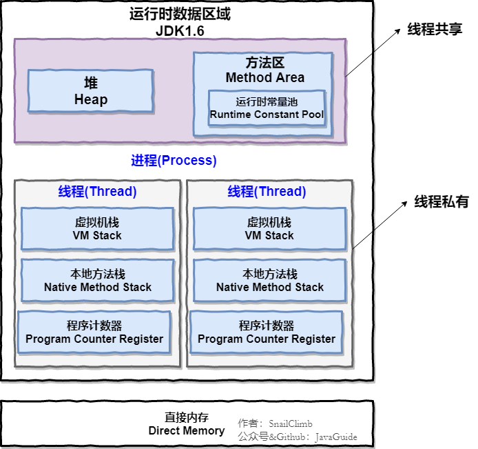

# 自我介绍

## 技术版

### 中文版

面试官，您好！

我叫王鑫，来自西北工业大学软件学院软件工程专业，目前为研究生二年级，研究所属实验室为智能感知与计算工业和信息化部重点实验室。我研究的方向是移动计算，目前所做的研究内容是基于移动设备的感知与计算。研究生期间我发表了 EI 论文一篇，再投 SCI 论文一篇，并参与了 2020年全国大学生物联网设计竞赛，目前在作品准备阶段。

我在本科期间主要学习的技术方向是 Java后台开发，并且学习了一些 Web 开发的技术框架。在研究生期间由于科研需要主要使用的语言是 Python，因此也学习了一些 Python 方向的技术，比如 Django、Scrapy 爬虫等，并且学习了一些数据可视化的模块以及构建神经网络模型的算法。

除了日常的学术科研任务之外，研究生期间为了巩固自己的 Java 后台开发技术，最近完成了一个在线教学平台的开发。这是一个分布式的项目，使用 Spring Boot 创建微服务，整体项目基于 Spring Cloud 框架进行构建。我主要负责需求分析，Api 接口定义，然后通过后端逻辑的实现完成所定义接口的功能，并简单的掌握前端 Vue.js 的相关技术来进行前后端的连调工作。最终实现该平台完整的功能开发，并且已经将项目的源代码进行了开源。通过该项目的开发学习使我了解到了分布式系统的设计构建开发的完整流程，并且掌握了很多相关的技术，让我受益匪浅。

另外，在日常的科研和学习之余我养成了坚持写博客的习惯，目前我的个人博客已经有四万多的访问人数了，文章的数量也已经超过三百篇了。我主要会在博客中记录我平时遇到的一些Bug的解决方法以及一些重要知识点的整理。

非常感谢，以上就是我的自我介绍。

### 英文版

Hello, interviewer!

My name is Wang Xin and I am from the Software Engineering Department of the Software College of Northwestern Polytechnical University. I am currently a sophomore in graduate school. The general direction of my research is pervasive computing, and the current research direction is based on the perception and computing of mobile devices. During the postgraduate period, I published an EI thesis and then an SCI thesis, and participated in the 2020 National University Bio-Internet Design Competition, which is currently in the preparation stage.

During my undergraduate period, my main technical direction was Java background development, and I learned some technical frameworks for web development. During the graduate period, because the main language used for scientific research was Python, I also learned some Python-oriented technologies, such as Django, Scrapy crawler, etc., and learned some data visualization modules and algorithms for building neural network models.

In addition to daily academic research tasks, in order to consolidate your own Java background development technology during graduate school, recently completed the development of an online teaching platform. This is a distributed project that uses Spring Boot to create microservices, and the overall project is built based on the Spring Cloud framework. I am mainly responsible for requirements analysis, Api interface definition, and then complete the functions of the defined interface through the realization of the back-end logic, and simply master the related technology of the front-end Vue.js to carry out the front-end and back-end continuous debugging work. Eventually, the complete function development of the platform is realized, and the source code of the project has been open sourced. Through the development and learning of this project, I learned the complete process of design, construction and development of distributed systems, and mastered many related technologies, which benefited me a lot.

In addition to the daily research and study, I have developed the habit of insisting on blogging. At present, my personal blog has more than 40,000 visitors, and the number of articles has exceeded 300. I will mainly record in the blog some of the bug solutions I usually encounter and the collation of some important knowledge points.

The above is my self-introduction.

## HR版

### 中文版


### 英文版

## 灵活问题

### 1.和其他同学相比，你觉得自己有什么优势？

我觉得我最大的优势是我愿意跟随优秀的人向其学习，我本人并不是一个很优秀的人，但我愿意成为一个优秀的人，因此我每到一个新的平台之后都会寻找周围优秀的人去发现他身上的一些优点，然后去尝试去学习这些优点然后将其吸收为自己的优势。

### 2.自己的不足有哪些？


### 3.你还有什么问题问我吗？


# 笔试知识点

## 常见编程技术

常见注意事项：

```java
// < a < 不能连用

```

### 0.牛客网笔试编程技巧

笔试考试代码模版：

```java
import java.util.*;
public class Main(){
    public static void main(String[] args){
        Scanner scanner = new Scanner(System.in);
        // ...
        scanner.close();
    }
}
```

对不确定出数量的输入数据的接收：

```java
while(scanner.hasNeext()){
    String str = scanner.next();
}
```

数组中两个元素交换位置：

```java
// 交换数组中的两个元素
private void swap(int a,int b,int[] nums){
    int c = nums[a];
    nums[a] = nums[b];
    nums[b] = c;
}
```

树节点结构定义：

```java
 public class TreeNode {
     int val;
     TreeNode left;
     TreeNode right;
     TreeNode(int x) { val = x; }
 }
```


### 1.数组、集合排序

```java
// 数组升序排序
Arrays.sort(arr);
// 数组逆序排序
Arrays.sort(arr, Collections.reverseOrder()); 

// 集合升序排序
Collections.sort(ls);
// 集合降序排序
Collections.sort(ls,Collections.reverseOrder());
// 自定义比较器排序
Collections.sort(ls,(T a, T b)->a.s-(b.s));

// 排序中自定义比较器

// 升序排序
Arrays.sort(intvs, new Comparator<int[]>{
    public int compare(int[] a,int[] b){
        return a[1] - b[1];
    }
});
// lambda表达式写法
Arrays.sort(intervals, (int[] a, int[] b) -> a[1]- b[1]);
```

### 2.栈、队列

```java
// 栈和队列都推荐使用 Deque 来实现 import java.util.Deque
// 可以通过双端队列 Deque 来实现 Stack 的功能，即只往一端进行插入删除的操作。
// 可以通过双端队列 Deque 来实现 Queue 的功能，即一端插入一端取出
Deque<> queue = new ArrayDeque<>();
```

- **offerLast(obj)**：向队尾加入元素，还有addLast，区别在于add有可能回报错，而offer不会，以下的类似
- **pollLast()**：取出队尾元素，还有removeLast
- peekLast()：获取队尾元素
- **offerFirst(obj)**：向队首加入元素，还有addFirst
- **pollFirst()**：取出队首元素，还有removeFirst
- peekFirst()：获取队首元素
- isEmpty()：判断队列是否为空

### 3.集合遍历

遍历 Set：

```java
// 直接使用集合中保存的类型进行 for-each 遍历即可
// 以 int 值为例
for(int i : set){
    //...
}
```

遍历 Map：

- 仅需要键 keys 或值 values 请使用**方法二**。
- 如果打算在遍历时删除 entry ，必须使用**方法三**。
- 其他情况下推荐直接使用**方法一**。

```java
// 方法一：for-each遍历entrySet()
Map<Integer, Integer> map = new HashMap<Integer, Integer>();
for(Map.Entry<Integer, Integer> entry : map.entrySet()){
    System.out.println("key is "+entry.getKey()+"; value is "+entry.getValue());
}


// 方法二：for-each 遍历 key 和 value
Map<Integer, Integer> map = new HashMap<Integer, Integer>();
for(Integer key : map.keySet()){
    System.out.println("key is : "+key);
}
for(Integer value : map.values()){
    System.out.println("value is : "+value);
}


// 方法三：使用 iterator 遍历
Map<Integer, Integer> map = new HashMap<Integer, Integer>();
Iterator<Map.entrySet<Integer, Integer>> iterator = map.entrySet().iterator();
while(iterator.hashNext()){
    Map.entrySet<Integer, Integer> entry = iterator.next();
    System.out.println("key is "+entry.getKey()+"; value is "+entry.getValue());
}


// 方法四：通过 key 来寻找 value
Map<Integer, Integer> map = new HashMap<Integer, Integer>();
for(Integer key : map.keySet()){
    System.out.println("key is : "+key);
    System.out.println("value is : "+map.get(key));
}
```

### 4.字符串处理

```java
// 将字符串变为字符数组
char[] sArr = s.toCharArray();
// 将字符串变为大写
str.toUpperCase();
// 将字符串变为小写
str.toLowerCase();
// 字符串切分 包含头不包含尾
str.substring();
```

### 5.Math工具类

```java
Math.abs();//返回参数的绝对值。
Math.ceil();//向上取整
Math.floor();//向下取整
Math.pow(x,n);//x的n次方
Math.sqrt();//开根号
(int)Math.random()*(r-l+1)+l);// 生成 l 到 r 之间的随机整数 Math.random() 本身生成0到1之间的浮点数
```

### 6.查找表

```java
// 数组的长度是 length 而容器的长度是 size
map.getOrDefault(key,0);// 可以get不存在的值时指定默认值
map.get(key).intValue();// 将结果转为int类型（map中存储的是Integer对象，对象调用 == 是判断内存地址的）
map.containsKey();//map中是否含有指定key
map.remove(key);//根据key删除记录

set.contains();//集合中是否存在指定元素

// TreeSet需要单独创建，并没有实现Set接口
TreeSet<Long> set = new TreeSet<>();
// TreeSet的方法：
set.ceiling(num);//返回大于给定值的最小元素或null
set.floor(num);//返回小于给定值的最大元素或null
```


## 数值换算

### 1.进制转换

#### 十六进制转十进制

```java
Integer.parseInt(str,16)// str必须表示为字母，不能以 0X 开头
```

#### 十进制转十六进制

```java
Integer.toHexString(num)
```

### 2.因质子分解

```java
    private static void getResult(long num){
        long number = num;
        while(number != 1)
        {
            // 每次都从2开始寻找
            for(int i = 2; i <= number ;i++)
            {
                if(number % i == 0)
                {
                    // 更新number值
                    number /= i;
                    System.out.print(i + " ");
                    break;
                }
            }
        }
    }
```

# 面试知识点

## 项目

### 鑫课堂

#### 1.鑫课堂是个什么样的项目？（介绍该项目）

鑫课堂是一个提供 IT 职业技术课程学习的在线平台，它为即将和已经加入 IT 领域的技术人才提供在线学习服务，用户可以通过本平台实现在线学习、在线练习、在线考试等功能。鑫课堂作为一个在线教育平台，由门户、学习中心、社交系统、教学管理中心、系统管理中心等模块构成。项目采用分布式架构，使用前后端分离方式开发；前端使用 Vue.js  技术栈；服务端采用 Spring 全家桶技术栈，基于 Spring Boot 进行构建，采用 Spring Cloud 架构。整个系统分为用户层、 CDN、负载均衡、前端UI、微服务层、数据层、接口层及DevOps等部分组成。

那么什么是“微服务架构”呢？

简单的说，微服务架构就是将一个完整的应用从数据存储开始**垂直**拆分成多个不同的服务，每个服务都能独立部署、独立维护、独立扩展，服务与服务间通过诸如**RESTful API**的方式互相调用。


#### 2.项目中都用到了哪些Spring的技术？

该项目是基于Spring全家桶进行构建的，用到了很多的Spring的技术。

首先项目中的微服务都是使用 Spring Boot 进行开发的。

然后在数据层用到了 Spring Data JPA、MongoDB、Redis 等 Spring Data 技术。

在业务层使用 Spring 来控制本地事务，具体来说就在是需要事务执行的方法上使用 Transection 注解。并且还使用到了 Spring Task 任务调度框架来自动执行定时任务。

在控制层使用到了SpringMVC 还有使用到了 Spring Security Oauth2 来执行用户任务操作。

对于微服务之间的管理使用到了 Spring Cloud 中的 Eureka 注册中心，微服务之间的调用则使用到了 Feign Client。

为了保证前端调用微服务的安全性，使用到了 Zuul 网关来进行安全验证。

#### 3.Spring Cloud是怎么使用的？

首先每个微服务使用Spring Boot开发，每个微服务工程包括了web、service、dao三层，这和开发一般的项目没有区别： 

​	a、web层使用Spring MVC实现，对外暴露API接口给前端调用。 

​	b、service层就是根据业务逻辑编写JavaBean，并使用Spring的声明式事务控制方式来控制事务。 

​	c、dao层就是数据访问接口，来访问MySQL和Mongodb，访问MySQL使用Spring Data JPA和Mybatis，访问 mongodb使用Spring data mongodb。 

其次微服务开发完成要向Eureka注册中心注册，以便被其它微服务查找和访问。 

然后微服务与微服务之间使用feign来调用，feign Client具有负载均衡的作用。只需要在接口上声明@FeignClient注解，Spring底层会产生动态代理对象，使用ribbon客户端完成调用。 

最后前端访问微服务需要通过网关，网关使用Nginx和Zuul来实现，Nginx是最前边的负载均衡，通过Nginx之后便到达了Zuul，项目中Zuul的功能是过虑用户请求，判断用户身份，对于一些对外公开的微服务则需要经过Zuul，不对外公开的微服务则直接通过Nginx负载均衡即可访问。

#### 4.Spring Data JPA 和 MyBatis为什么两个都用？具体怎么用的？

项目中使用Spring Data JPA和MyBatis都是用来访问MySQL，但是它们的分工不同： 

- Spring Data JPA是面向对象的，而MyBatis是直接面向SQL语句的。
- Spring Data JPA是Spring 提供的一套JPA接口，使用Spring Data JPA主要完成一些简单的增、删、改、查功能。
- 对于复杂的查询功能会使用MyBatis编写SQL语言来实现，因为使用Spring Data JPA来做一些复杂的查询是没有 MyBatis方便的.

使用Spring Data JPA 的话只需要自定义 Repository 然后继承 JpaRepository，传入对应的数据表实体对象以及主键所对应的属性类型即可。

而使用 MyBatis 的话需要定义 Mapper 接口，定义自定义查询的方法，特别需要注意的是返回值类型的定义，然后在 resources 目录下定义同名的包路径下定义对应的 Mapper xml映射文件。这里需要特别注意 Mapper 接口和映射文件所对应的包路径必须一样。

#### 5.什么雪崩？如何解决？

雪崩是由于微服务没有设置容错保护而导致的。

容错保护是指微服务在执行过程中出现错误并从错误中恢复的能力。微服务容错性不好很容易导致雪崩效应。

微服务的雪崩效应表现在服务与服务之间调用，当其中一个服务无法提供服务可能导致其它服务也死掉，比如：单点登录服务调用用户信息服务查询用户信息，由于用户信息服务无法提供服务导致单点登录服务一直等待，从而导致用户登录、用户退出功能无法使用，像这样由一个服务所引起的一连串的多个服务无法提供服务即是微服务的雪崩效应。

这里Spring Cloud 提供了对应的雪崩解决方法：Spring Cloud Hystrix ，这是基于Netflix的开源框架Hystrix的整合，它实现了断路保护、线程隔离、信号隔离等容错功能。通过断路保护功能就可以实现微服务之间雪崩效应的出现。微服务的断路保护的工作原理是当请求微服务失败的数量达到一定比例时会切换为开路状态，当请求微服务时就直接返回结果不再请求微服务，当保持开路状态一段时间后判断微服务是否可以正常请求，如果正常则切换到半开路状态，最后切换到闭路状态。

具体的操作方法可以采用 Fallback，每个FeignClient方法调用Fallback，当出现开路则调用Fallback方法返回错误结果。

#### 6.视图层用什么技术实现？

视图层在前端和服务端都存在。

前端视图采用vue.js+elementUI产品界面。

服务端都是暴露的rest接口，统一用json展示数据。

#### 7.接口是怎么定义的？采用什么数据格式？如何实现？

1、接口定义

使用 SpringMVC编写Controller方法，对外暴露Http接口，在Controller方法上使用RequestMapping、 PostMapping、GetMapping等注解定义Http接口。 

2、采用什么数据格式？ 

分别说明请求和响应： 

请求： 

get 请求时，前端请求key/value串，SpringMVC采用基本数据类型（String、Integer等）或自定义类型接收。 

Post请求时，前端请求Form表单数据（application/x-www-form-urlencoded）和Json数据(ContentType=application/json)、多部件类型数据（multipart/form-data），对于Json数据SpringMVC使用 @RequestBody注解解析请求的json数据。 

响应： 

统一响应json格式。 

3、如何实现的？

json格式数据SpringMVC采用FastJson解析为对象。 

非json格式数据SpringMVC提供参数绑定的方法，将key/value或Form-Data数据转换为对象或基本数据类型的变量。

#### 8.前后端开发时具体流程是什么？

1、前端与后端开发人员讨论确定接口。 

接口讨论通过，形成接口文档 。 

本项目专门设立一个api工程，在此工程定义接口，Spring Boot 集成 Swagger，生成 Swagger 接口，前后端开发 人员通过html查看接口文档的内容。 

2、前端与后端开发人员按照接口文档进行开发。 

开发过程中各自进行单元测试。 

前端人员怎么进行单元测试？ 

前端人员可以通过一些工具生成一些模拟数据，比如：EasyMock。

3、双方功能开发完成进行前后端联调。

#### 9.前端采用什么技术栈？

前端工程大多为单页面应用（SPA），采用vue.js框架开发，搜索功能前端采用nuxt.js服务端渲染（SSR）框架开发。

技术栈包括： 1、node.js 2、vue.js 3、npm/cnpm 4、webpack 5、axios 6、nuxt.js

#### 10.CMS页面管理模块的功能是什么？

CMS （Content Management System）即内容管理系统，本项目对CMS系统的定位是对各个网站（子站点）页面的管理，本项目的CMS系统不去管理每个子网站的全部资源，比如：图片、CSS、html页面等，主要管理由于运营需要而经常变动的页面，从而满足根据运营需要快速开发、上线的需求。

功能包括： 

1、站点管理，站点就是本项目各个子网站，站点信息包括：站点名称、站点域名、端口、服务器物理路径等。 

2、模板管理，由于要对页面进行静态化，使用freemarker引擎技术，所以需要定义模板。 

3、页面管理，包括：页面添加、页面修改、页面删除等操作。 页面和模版都是存储在MongoDB中的GirdFS中。

4、页面预览，对页面静态化，在浏览器预览页面静态化内容。 

5、页面发布，将页面静态化后发布到所属站点服务器。


#### 11.GirdFS是什么？工作原理是什么？如何使用？

GridFS是MongoDB提供的用于持久化存储文件的模块，它可以作为分布式文件系统使用，CMS子系统将页面文件、模板文件存储到GridFS中，由于本项目使用MongoDB，选用GridFS可以快速集成开发。

它的工作原理是： 在GridFS存储文件是将文件分块存储，文件会按照256KB的大小分割成多个块进行存储，GridFS使用两个集合 （collection）存储文件，一个集合是chunks, 用于存储文件的二进制数据；一个集合是files，用于存储文件的元数据信息（文件名称、块大小、上传时间等信息）。最后从GridFS中读取文件要对文件的各块进行组装、合并。

使用方法是： 使用Spring data mongodb包下提供的GridFsTemplate访问GirdFS。

#### 12.使用消息队列了吗？如何使用的？有哪些应用场景？

（主要是想弄清楚消息队列都有哪些场景，然后项目中是什么场景，在这个场景中消息队列是如何使用的？）

（可以按照：项目中有什么需求，这个需求有什么技术挑战，如果不使用MQ会很麻烦，用了mq之后带来了很多好处）

项目使用RabbitMQ消息队列。 

RabbitMQ提供很多的工作模式，如下： 

1、Work queues 

2、Publish/Subscribe 

3、Routing 

4、Topics 

5、Header 

6、RPC 

项目主要使用了**Routing模式**。 Routing模式即路由模式，使用方法是： 

1、每个消费者监听自己的队列，并且设置routingkey。 

2、生产者将消息发给交换机，由交换机根据routingkey来转发消息到指定的队列。

消息队列的常见应用场景？

1、**解耦**： MQ相当于一个中介，生产方通过MQ与消费方交互，它将应用程序进行解耦合。

2、**异步**： 将不需要同步处理的并且耗时长的操作由消息队列通知消息接收方进行异步处理。提高了应用程序的响应时间。 

3、**削峰**：降低系统峰值流量。

比如项目中的**CMS**的页面发布就用到了RabbitMQ来解决系统之间的**解耦**应用场景。页面发布包含CMS页面管理微服务以及 CMS Client页面客户端微服务。平台包括多个站点，页面归属不同的站点，需求是发布一个页面应将该页面发布到所属站点的服务器上。 

CMS作为消息的生产者，CMS Client作为消息的消费者。双方使用路由工作模式进行通信，在每个站点服务部署CMS Client程序，并与交换机绑定，绑定时指定站点Id为routingKey。 指定站点id为routingKey就可以实现cms client只能接收到所属站点的页面发布消息。页面发布程序CMS向MQ发布消息时指定页面所属站点Id为routingKey，根据routingKey将消息发给指定的 CMS Client。CMS便执行对应站点的页面发布任务。

每次页面发布会在数据库记录发布日志，每个CMS Client完成页面发布会上报发布结果。 用户通过查询发布日志表的信息就可以知道每一次的发布结果（哪些服务器页面发布成功，哪些发布失败）。

在项目中的**媒资管理**模块中使用 MQ 消息队列来完成视频上传任务与视频处理任务的**异步**执行，降低了视频处理高延时接口的等待时间。

在项目的**订单管理模块**中使用到了MQ消息队列发送订单消息到选课模块中完成自动选课任务，是属于**异步**的应用场景。这里需要涉及到两个模块之间的通信，并且都是属于下订单这一个事物中完成的，也就是属于分布式事务的实现。整体的流程如下图：


1、支付成功后，订单服务向本地数据库更新订单状态并向消息表写入“添加选课消息”，通过本地数据库保证订单状态和添加选课消息的**本地事务**。

2、定时任务扫描消息表，取出“添加选课任务“并发向MQ。

3、学习服务接收到添加选课的消息，先查询本地数据库的历史消息表是否存在消息，存在则说明已经添加选课， 否则向本地数据库添加选课，并向历史消息表添加选课消息。这里选课表和历史消息表在同一个数据库，通过**本地事务**保证。

4、学习服务接收到添加选课的消息，通过查询消息表判断如果已经添加选课也向MQ发送“完成添加选课任务的消息”，否则则添加选课，完成后向MQ发送“完成添加选课任务的消息”，

5、订单服务接收到完成选课的消息后删除订单数据库中消息表的“添加选课消息”，为保证后期对账将消息表的消息先添加到历史消息表再删除消息，表示此消息已经完成。

#### 13.课程管理功能介绍

课程管理主要包含课程信息查看、修改、课程预览和课程发布等功能。

课程数据库表设计为了四张：课程基本信息表、课程图片表、课程计划表、课程营销表。这里设计为四张的主要原因是因为：

1、课程信息比较复杂，为了方便教学机构按步骤管理课程信息，并且也可以划分权限管理课程信息，将课程信息 管理功能分为课程基本信息管理、课程图片管理、课程营销信息管、课程计划管理等模块。 

2、将课程信息分开也是为了系统扩展需要，如果将课程所有信息存储在一张表中将不利于系统扩展。

#### 14.媒资管理功能介绍

每个教学机构都可以在媒资系统管理自己的教学资源，包括：视频、教案等文件。 

媒资管理的主要管理对象是课程录播视频，包括：媒资文件的查询、视频上传、视频删除、视频处理等。 

媒资查询：教学机构查询自己所拥有的媒体文件。 

视频上传：将用户线下录制的教学视频上传到媒资系统。 

视频处理：视频上传成功，系统自动对视频进行编码处理。 

视频删除 ：如果该视频已不再使用，可以从媒资系统删除。

如何上传大文件？

前端使用WebUploader将文件分块，调用服务端分块上传接口上传分块文件，分块上传完毕前端请求服务端进行合并，当上传过程中断再次进行上传时服务端判断分块是否已经上传，已经上传的分块不再重新上传。


如何进行视频处理？

Java程序调用ffmpeg及流媒体程序员提供的视频处理类库（C程序）完成avi、mp4视频转成m3u8格式的视频。 

Java程序使用Jdk提供的Process Builder调用ffmpeg及C程序进行视频处理。 

Process Builder可以调用第三方程序，在java程序运行时启动第三方程序进程。 

视频处理完成，Java程序捕获第三方程序的输出日志，解析出视频处理完成标记，更新视频处理状态为已完成。

#### 15.搜索服务为什么使用ElasticSearch ？以及如何使用？

项目中课程搜索采用ElasticSearch来完成。

实现方法是： 

１、使用 Logstash（logstash是ES下的一款开源软件，它能够同时 从多个来源采集数据、转换数据）将MySQL中 的课程信息读取到ES中创建索引，使用IK分词器进行分词。 

2、使用 Java High Level REST Client完成搜索。 

3、生产环境使用ES部署为集群。

#### 16.图片服务器为什么使用 FastDFS？

本项目采用fastDFS分布式系统作为图片服务器。 

FastDFS是用c语言编写的一款开源的分布式文件系统，适合小文件的存储。 

FastDFS包括 Tracker server和Storageserver。

客户端请求Tracker server进行文件上传、下载，通过Tracker server调度向Storage server完成文件上传和下载。 

使用FastDSF官方提供的Java API实现。 

图片服务使用Nginx作为代理服务器，对Storage上部署的Nginx完成负载均衡请求。


FastDFS相比其它的分布式文件系统它适用小文件存储，它不对文件进行分块存储，也不用对文件进行合并处理， 所以性能比GFS、HDFS等通用文件系统的性能要高。

文件上传的流程如下：


1、管理员进入教学管理前端，点击上传图片 

2、图片上传至文件系统服务，文件系统请求fastDFS上传文件 

3、文件系统将文件入库，存储到文件系统服务数据库中。 

4、文件系统服务向前端返回文件上传结果，如果成功则包括文件的Url路径。 

5、课程管理前端请求课程管理进行保存课程图片信息到课程数据库。 

6、课程管理服务将课程图片保存在课程数据库。

#### 17.认证授权是如何实现的？

本项目采用 Spring security + Oauth2完成用户认证及用户授权。认证授权流程如下：

1、用户请求认证服务完成身份认证。 

2、认证服务下发用户身份令牌和JWT令牌，拥有身份令牌表示身份合法，Jwt令牌用于完成授权。 

3、用户携带jwt令牌请求资源服务。 

4、网关校验用户身份令牌的合法，不合法表示用户没有登录，如果合法则放行继续访问。 

5、资源服务获取jwt令牌，根据jwt令牌完成授权。


#### 18.事务是怎么控制的？用到分布式事务控制了吗？如何做的？

1、在微服务中使用Spring 声明式事务控制方式进行控制，在Service方法上添加@Transctional注解即可实现事务控制，它控制的是MySQL的本地事务。 

2、项目中大量存在分布式事务控制，比如下单支付、课程发布等地址都用到了分布式事务。 本项目实现分布式事务控制实现最终数据一致性，做法是： 

a、将分布式事务拆分为多个本地事务。 

b、提交事务前每个参与者要通过数据校验，和资源预留。 

c、由消息队列去通知多个事务参与者完成本地事务的提交。 

d、提交失败的本地事务会重试。

#### 19.系统的异常是怎么处理的？

系统对异常的处理使用统一的异常处理流程。 

1、自定义异常类型。 

2、自定义错误代码及错误信息。 

3、对于可预知的异常由程序员在代码中主动抛出自定义异常类型的异常，抛出异常时需要指定错误代码。 

4、对于不可预知的异常（运行时异常）由SpringMVC统一捕获Exception类型的异常，由统一的异常捕获类来解析处理，并转换为与自定义异常类型一致的信息格式（错误代码+错误信息）。 

5、可预知的异常及不可预知的运行时异常最终会采用统一的信息格式（错误代码+错误信息）来表示，最终也会随请求响应给客户端。


#### 20.你在开发中遇到什么问题？是怎么解决的？

1.在处理订单时要用到定时任务，当时采用的是Spring Task来完成，由于一个订单服务会部署多个，多个订单服务 同时去处理任务会造成任务被重复处理的情况，如何解决任务的重复处理。

解决： 

采用乐观锁解决，在任务表中设置一个version字段记录版本号，取出任务记录同时拿到任务的版本号，执行前对 任务进行锁定，具体的做法是执行update根据当前版本号将版本号加1，update成功表示锁定任务成功，即可开始执行任务。

2.Post提交过来的url无法被后端执行

解决：

controller中并没有将前端传递过来的参数进行捕获，在 controller 中 使用 RequestParam 注解来解析前端post传递过来的参数

#### 21.项目中的 RPC 实现

什么是 RPC？ 

**RPC**（Remote Procedure Call）—**远程过程调用**，它是一种**通过网络从远程计算机程序上请求服务**，而不需要了解底层网络技术的协议。比如两个不同的服务A,B部署在两台不同的机器上，那么服务 A 如果想要调用服务 B 中的某个方法该怎么办呢？使用 HTTP请求当然可以，但是可能会比较慢而且一些优化做的并不好。 RPC 的出现就是为了解 决这个问题。

RPC原理是什么？


1. 服务消费方（client）调用以本地调用方式调用服务；
2. client stub接收到调用后负责将方法、参数等组装成能够进行网络传输的消息体；
3. client stub找到服务地址，并将消息发送到服务端；
4. server stub收到消息后进行解码；
5. server stub根据解码结果调用本地的服务；
6. 本地服务执行并将结果返回给server stub；
7. server stub将返回结果打包成消息并发送至消费方；
8. client stub接收到消息，并进行解码；
9. 服务消费方得到最终结果。

本项目中为了实现微服务之间的远程调用，使用了 **Spring Cloud** 提供的 **Eurake 和 Feign** 来实现。为了保证系统的高可用，使用两台Eureka Server互相注册，组成高可用。 

微服务向Eureka Server注册自己，并在远程调用时从微服务发现目标服务地址。

微服务远程调用采用**客户端负载均衡**技术，使用**Feign Client**。

**Spring Cloud Eureka**是Spring Cloud Netflix 子项目的核心组件之一，主要用于微服务架构中的**服务治理**。

在微服务架构中往往会有一个注册中心，每个微服务都会向注册中心去注册自己的地址及端口信息，注册中心维护着服务名称与服务实例的对应关系。每个微服务都会定时从注册中心获取服务列表，同时汇报自己的运行情况，这样当有的服务需要调用其他服务时，就可以从自己获取到的服务列表中获取实例地址进行调用，Eureka实现了这套服务注册与发现机制。

**Eureka包含两个组件：Eureka Server和Eureka Client。** **Eureka Server**提供服务注册服务，各个节点启动后，会在Eureka Server中进行注册，这样EurekaServer中的服务注册表中将会存储所有可用服务节点的信息，服务节点的信息可以在界面中直观的看到。

**Eureka Client**是一个java客户端，用于简化与Eureka Server的交互，客户端同时也就是一个内置的、使用轮询(round-robin)负载算法的负载均衡器。


上图简要描述了Eureka的基本架构，由3个角色组成：

1、**Eureka Server**

- 提供服务注册和发现

2、**Service Provider**

- 服务提供方
- 将自身服务注册到Eureka，从而使服务消费方能够找到

3、**Service Consumer**

- 服务消费方
- 从Eureka获取注册服务列表，从而能够消费服务

Eureka特点：

- Eureka不持久化，缓存。
- Eureka通过增量更新注册信息，只关心瞬时状态。
- Eureka提供客户端缓存，宁可返回某服务5分钟之前在哪几个服务器上可用的信息，也不能因为暂时的网络故障而找不到可用的服务器。


**Spring Cloud Feign** 基于 Netflix Feign 实现，整合了 **Spring Cloud Ribbon** 与 **Spring Cloud Hystrix**，除了提供这两者的强大功能之外，它还提供了一种声明式的 Web 服务客户端定义方式。Spring Cloud引入 Feign并且集成了Ribbon实现客户端负载均衡调用。

Spring Cloud Feign 具备可插拔的注解支持，包括 Feign 注解和 JAX-RS 注解。同时，为了适应 Spring 的广大用户，它在 Netflix Feign 的基础上扩展了对 Spring MVC 的注解支持。

Ribbon是Netflix公司开源的一个**负载均衡**的项目[https://github.com/Netflix/ribbon](https://github.com/Netflix/ribbon)，它是一个基于HTTP、 TCP的**客户端负载均衡器**。客户端负载均衡与服务端负载均衡的区别在于**客户端要维护一份服务列表**，Ribbon从 Eureka Server获取服务列表，Ribbon根据负载均衡算法直接请求到具体的微服务，中间省去了负载均衡服务。

Feign工作原理如下： 

1、 启动类添加@EnableFeignClients注解，Spring会扫描标记了@FeignClient注解的接口，并生成此接口的代理对象

2、 @FeignClient(value = "SERVICE_MANAGE_CMS")即指定了cms的服务名称，Feign会从注册中心获取cms服务列表，并通过负载均衡算法进行服务调用。

3、在接口方法 中使用注解@GetMapping("/cms/page/get/{id}")，指定调用的url，Feign将根据url进行远程调 用。

Feign注意点

SpringCloud对Feign进行了增强兼容了SpringMVC的注解 ，我们在使用SpringMVC的注解时需要注意： 

1、feignClient接口有参数在参数必须加@PathVariable("XXX")和@RequestParam("XXX") 

2、feignClient返回值为复杂对象时其类型必须有无参构造函数。


其他的解决方案有：**Apache Dubbo**，一款高性能、轻量级的开源Java RPC 框架。它提供了三大核心能力：**面向接口的远程方法调用，智能容错和负载均衡，以及服务自动注册和发现**。简单来说 **Dubbo 是一个分布式服务框架， 致力于提供高性能和透明化的RPC远程服务调用方案，以及SOA服务治理方案**

一般配合 **zookeeper** 注册中心使用。

#### 22.什么是分布式，为什么要用分布式？

分布式就是将整个工程按照业务进行拆分为多个项目。每个项目部署在不同的节点上，部署在不同结点上的系统通过网络交互来完成协同工作的系统。

**SOA 面向服务的架构**（Service Oriented Architecture），也就是把工程按照业务逻辑拆分成**服务层、表现层**两个工程。服务层中包含业务逻辑，只需要对外提供服务即可。表现层只需要处理和页面的交互，业务逻辑都是调用服务层的服务来实现。SOA架构中有两个主要角色：**服务提供者（Provider）和服务使用者（Consumer）**。

**分布式或者说 SOA 分布式**重要的就是**面向服务**，说简单的分布式就是我们**把整个系统拆分成不同的服务然后将这些服务放在不同的服务器上减轻单体服务的压力提高并发量和性能**。

从开发角度来讲单体应用的代码都集中在一起，而分布式系统的代码根据业务被拆分。所以，每个团队可以负责一个服务的开发，这样**提升了开发效率**。另外，代码根据业务拆分之后**更加便于维护和扩展**。

将系统拆分成分布式之后不光**便于系统扩展和维护**，更能**提高整个系统的性能**。

## 语言

### Java

#### 基础

##### 1.为什么要用单例模式?手写几种线程安全的单例模式?

简单来说使用单例模式可以带来下面几个好处:

- 对于频繁使用的对象，可以省略创建对象所花费的时间，这对于那些重量级对象而言，是非常可观的一笔系统开销； 
- 由于 new 操作的次数减少，因而对系统内存的使用频率也会降低，这将减轻 GC 压力，缩短 GC 停顿时间。

补充：（类加载的过程）

Java程序初始化顺序：

1. 父类的静态代码块
2. 子类的静态代码块
3. 父类的普通代码块
4. 父类的构造方法
5. 子类的普通代码块
6. 子类的构造方法

Java中实现的单例模式有以下几种：

- 懒汉式
- 饿汉式
- 静态内部类
- 枚举

以下是几种单例模式的实现：

**懒汉式(双重检查加锁版本)**

懒汉式在第一次调用的时候进行实例化

```java
public class Singleton{
    // 单例实体对象，volatile保证当uniqueInstance变量初始化成Singleton实例时，多个线程可以正确的处理uniqueInstance变量
    private volatile static Singleton uniqueInstance;
    // 构造函数私有化，不可被外部访问
    private Singleton(){}
    public static Singleton getInstance(){
        // 检查实例，如果不存在就进入同步代码块
        if(uniqueInstance == null){
            // 只有第一次执行才会彻底执行这里的代码
            synchronized(Singleton.class){
                // 进入同步代码块之后再检查一次，如果仍为null，才创建实例
                if(uniqueInstance == null){
                    uniqueInstance = new Singleton();
                }
            }
        }
        return uniqueInstance;
    }
}
```

**静态内部类方式**

静态内部实现的单例是**懒加载的且线程安全**。

只有通过显式调用 getInstance 方法时，才会显式装载 SingletonHolder 类，从而实例化 instance（只有第一次使用 这个单例的实例的时候才加载，同时不会有线程安全问题）。

```java
public class Singleton{
    // 静态内部类中来创建单例对象
    private static class SingletonHolder{
        // 定义为静态常量，不可被修改
        private static final Singleton INSTANCE = new Singleton();
    }
    private Single(){}
    public static final Singleton getInstance(){
        // 只有通过显式调用 getInstance 方法时，才会显式装载 SingletonHolder 类，从而实例化 instance
        return SingletonHolder.INSTANCE;
    }
}
```

**饿汉式**

在类初始化时，已经自行实例化。

```java
public class Singleton{
    // 类加载时直接初始化实例
    private static final Singleton INSTANCE = new Singleton();
    private Singleton(){}
    // 直接返回初始化之后的实例对象
    public static Singleton getInstance(){
        return INSTANCE;
    }
}
```


**枚举方式**

创建枚举默认就是线程安全的，所以不需要担心 double checked locking，而且还能防止反序列化导致重新创建新的对象。保证只有一个实例（即使使用反射机制也无法多次实例化一个枚举量）。

```java
public class Singleton{
    public static void main(String[] args){
        Single single = Single.SINGLE;
        single.print();
    }
    // 枚举对象
    enum Single{
        SINGLE;
        private Single(){}
        public void print(){
            System.out.println("Hello World");
        }
    }
}
```


总结：一般情况下直接使用**饿汉式**就好了，如果明确要求要**懒加载（lazy initialization）**会倾向于使用**静态内部类**，如果涉及到**反序列化**创建对象时会试着使用**枚举**方式来实现单例。

手写单例模式的话需要掌握懒汉式、饿汉式、静态内部类三种。

##### 2.Java 反射机制介绍？

**JAVA反射（Reflection）**：在运行状态中，对于任意一个类，都能够知道这个类的所有属性和方法；对于任意一个对象，都能够调用它的任意一个方法和属性；这种动态获取的信息以及动态调用对象的方法的功能称为java语言的反射机制。

Java的反射机制是java被称为动态语言的一个关键性质。

那么反射机制所能实现的功能有：

1.    只要给定类的全名，即可通过反射获取类的所有信息。
2.    反射可以在程序运行时获取任意一个对象所属的类对象。
3.    在运行时可以获取到类中所有属性对象，并对其操作（包括私有属性）。
4.    在运行时可以获取到类中、父类中所有方法，并调用。

##### 3.类装载器介绍？

**ClassLoader类装载器**就是寻找类的字节码文件并构造出类在  JVM 内部表示的对象组件。主要工作由ClassLoader及其子类负责，ClassLoader是一个重要的 Java运行时系统组件，它负责在运行时查找和装入 Class 字节码文件。

在 JAVA中 java 虚拟机把一个类装入到 java 虚拟机当中需要经过以下的步骤：

1. **装载**：查找和导入Class文件。

2. **链接**：执行校验，准备和解析步骤。

其中校验主要是检查载入class文件数据的正确性，而准备工作就是给类的静态变量来分配存储空间，解析则是将符号引用来转变成直接引用。

3. **初始化**：对类的静态变量、静态代码块执行初始化工作。

类文件被装载并解析之后，在 java 虚拟机内将拥有一个对应的 java.lang.class 类描述对象。该类的对象实例则拥有指向这个类描述对象的引用。而类描述对象又拥有指向关联 ClassLoader 的引用。

JVM装载类时使用**全盘负责委托机制**

**全盘负责**：当一个ClassLoader装载一个类的时候，除非显式的使用另一个ClassLoader，否则该类所依赖即引用的类也由这个ClassLoader来载入。

**委托机制**：先委托父装载器寻找目标类，只有在找不到的情况下才从自己的类路径中查找并装载目标类。这一点是从安全角度来考虑的。

JVM在运行时会产生三个装载器字节码文件：**根装载器、ExtClassLoader（扩展类装载器）和AppClassLoader（系统类装载器）**。

- **根装载器**：不是ClassLoader的子类，由于他是使用C++来编写的，因此在JAVA中看不到他。根装载器来复制装载jre的核心类库，如jre目标下的rt.jar、charsets.jar等。
- **ExtClassLoader**：是ClassLoader的子类，负责装载 jre 扩展目录ext中的jar类包
- **AppClassLoader**：是ClassLoader的子类，负责装载 classpath 路径下的类

这三个装载器之间存在着父子层级的关系：

根装载器是ExtClassLoader的父装载器，而ExtClassLoader是AppClassLoader的父装载器。

在默认情况下使用AppClassLoader装载应用程序的类。

##### 4.Java当中的class对象是什么？有几种获取的方法？

**Class**其实就是类的类型，比如字符串类型就是String，整形类型就是Integer，String和Integer类型就是Class。

Class对象的常用方法介绍：

- getName()    获得类中完整名称
- getDeclaredFields()    获得类中的所有属性
- getDeclaredMethods()     获得类中所有的方法
- getConstructors()     获得类构造方法
- newInstance()     实例化类对象注：newInstance()方法为实例化空参数的类对象时使用。

获取Class对象的有三种方法：

1、利用Class类**forName()**静态方法传入一个类的全路径来返回相对应的类的Class对象。

2、将实例化的类对象转型为Object对象，然后通过Object对象的getClass()方法来返回对应类的Class对象。

3、通过类的class属性返回类的Class对象。

在java反射机制中我们就是使用第一种方式来获取对应的class对象，并使用 newInstance() 方法来得到对应类的类对象，这样便间接的通过代码的方法获取到了对应类的对象。

##### 5.Object类有哪些方法?

Object类是一个特殊的类，是所有类的父类。它主要提供了以下11个方法：

```java
public final native Class<?> getClass();//native方法，用于返回当前运行时对象的Class对象，使用了final关键字修饰，故不允许子类重写。

public native int hashCode(); //native方法，用于返回对象的哈希码，主要使用在哈希表中，比如JDK中的HashMap。 

public boolean equals(Object obj);//用于比较2个对象的内存地址是否相等，String类对该方法进行了重写用户比较字符串的值是否相等。

protected native Object clone() throws CloneNotSupportedException;//naitive方法，用于创建并返回当前对象的一份拷贝。一般情况下，对于任何对象 x，表达式 x.clone() != x 为true，x.clone().getClass() == x.getClass() 为true。Object本身没有实现Cloneable接口，所以不重写clone方法并且进行调用的话会发生 CloneNotSupportedException异常。

public String toString();//返回类的名字@实例的哈希码的16进制的字符串。建议Object所有的子类都重写这个方法。

public final native void notify();//native方法，并且不能重写。唤醒一个在此对象监视器上等待的线程(监视器相当于就是锁的概念)。如果有多个线程在等待只会任意唤醒一个。

public final native void notifyAll();//native方法，并且不能重写。跟notify一样，唯一的区别就是会唤醒在此对象监视器上等待的所有线程，而不是一个线程。

public final native void wait(long timeout) throws InterruptedException;//native方法，并且不能重写。暂停线程的执行。注意：sleep方法没有释放锁，而wait方法释放了锁 。timeout是等待时间。

public final void wait(long timeout, int nanos) throws InterruptedException;//多了nanos参数，这个参数表示额外时间（以毫微秒为单位，范围是 0-999999）。 所以超时的时间还需要加上nanos毫秒。

public final void wait() throws InterruptedException;//跟之前的2个wait方法一样，只不过该方法一直等待，没有超时时间这个概念

protected void finalize() throws Throwable { }//实例被垃圾回收器回收的时候触发的操作
```

##### 6.hashCode与equals的关系 （你重写过 hashcode 和 equals 么，为什么重写equals时必须重写hashCode方法？）

**hashCode()** 的作用是获取哈希码，也称为散列码；它实际上是返回一个int整数。这个哈希码的作用是确定该对象在哈希表中的索引位置。hashCode() 定义在JDK的Object.java中，这就意味着Java中的任何类都包含有hashCode() 函数。另外需要注意的是： Object 的 hashcode 方法是本地方法，也就是用 c 语言或 c++ 实现的，该方法通常用来将 对象的内存地址 转换为整数之后返回。

HashSet 中保存数据的时候会首先调用 **hashCode** 方法获取对象 hashcode 值，然后和已经保存的数据的 hashcode 进行比较，假如出现重复的话就得继续调用 **equals** 方法来检查 hashcode 相同的两个对象是否内存地址也一致，如何继续相同则证明两个对象时同一个对象，因此 hashSet 就不会让其加入。如果不同的话就证明是 hashcode 出现冲突，则散列到其他位置即可。这样就大大减少了调用 equals 的次数，也就大大提高了执行速度。

hashCode()与equals()的相关关系：

1. 两个**对象相等**，则**hashcode一定也是相同**的；
2. 两个**对象相等**,对两个对象分别调用**equals方法都返回true**；
3. 两个对象hashcode相等，**不一定对象相同**；
4. 因此，**equals方法被覆盖过，则hashCode方法也必须被覆盖**，这样才能正确判断两个对象是否相等；
5. hashCode()的默认行为是对**堆**上的对象产生独特值。如果没有重写hashCode()，则**该class的两个对象无论如何都不会相等**（即使这两个对象指向相同的数据）

一句话总结：**保证可以正确判断两个对象是否相等**

##### 7.==与equals的关系？

- == : 它的作用是判断两个对象的**地址是不是相等**。即**判断两个对象是不是同一个对象**。(**基本数据类型 == 比较的是值**，**引用数据类型 == 比较的是内存地址**)

- equals() : 它的作用也是**判断两个对象是否相等**。但它一般有两种使用情况：
  - 类**没有覆盖equals()**方法。则通过equals()比较该类的两个对象时，等价于通过“==”比较这两个对象（底层调用 == ）。 
  - 类**覆盖了equals()**方法。一般，我们都**覆盖equals()方法来比较两个对象的内容相等**（例如String）；若它们的内容相等， 则返回true(即认为这两个对象相等)。**覆盖了 equals 方法之后还需要覆盖 hashcode 方法**，具体内容查看上面的问题。

##### 8.重载和重写的区别?

**重载**： 发生在同一个类中，**方法名必须相同，参数类型不同、个数不同、顺序不同，方法返回值和访问修饰符可以不同**，发生在编译时。

**重写**： 发生在父子类中，**方法名、参数列表必须相同，返回值范围小于等于父类，抛出的异常范围小于等于父类， 访问修饰符范围大于等于父类（两同两小一大）**；如果父类方法访问修饰符为 private 则子类就不能重写该方法。

##### 9.String 和 StringBuffer、StringBuilder 的区别是什么？String 为什 么是不可变的？

- String为不可变类型，因为 String 类使用 **final关键字修饰的字符数组保存字符串**；StringBuffer、StringBuilder为可变类型，也是使用字符数组，但没有 final 关键字修饰。
- String、StringBuffer 是线程安全的，String是不可变类型所以线程安全，StringBuffer对方法添加了**同步锁**所以是线程安全的。；StringBuilder 是线程不安全的。
- String每次改变都会产生一个新的 String 对象，性能较低；StringBuffer、StringBuilder直接对对象本身进行操作，因此性能高。

##### 10.自动装箱与拆箱

**装箱**：将基本类型用它们对应的引用类型包装起来； 

**拆箱**：将包装类型转换为基本数据类型；

##### 11.关于 final 关键字的一些总结

final关键字主要用在三个地方：**变量、方法、类**。

1. 对于一个**final变量**，如果是**基本数据类型**的变量，则其**数值一旦在初始化之后便不能更改**；如果是**引用类型**的变量，则在对其**初始化之后便不能再让其指向另一个对象**。
2. 当用final修饰一个**类**时，表明**这个类不能被继承**。final类中的所有成员方法都会被隐式地指定为final方法。
3. 使用final**方法**的原因有两个。第一个原因是把方法锁定，**以防任何继承类修改它的含义**；第二个原因是效率。 在早期的Java实现版本中，会将final方法转为内嵌调用。但是如果方法过于庞大，可能看不到内嵌调用带来的任何性能提升（现在的Java版本已经不需要使用final方法进行这些优化了）。**类中所有的private方法都隐式地指定为fianl**。

##### 12.Java 中的异常处理

Java异常类层次结构图：


在 Java 中，所有的异常都有一个共同的祖先java.lang包中的 **Throwable类**。

Throwable： 有两个重要的子类： **Exception（异常）** 和 **Error（错误）** ，二者都是 Java 异常处理的重要子类，各自都包含大量子类。

**Error（错误）**:是程序无法处理的错误，表示运行应用程序中较严重问题。大多数错误与代码编写者执行的操作无关，而表示代码运行时 JVM（Java 虚拟机）出现的问题。例如，Java虚拟机运行错误（Virtual MachineError），当 JVM 不再有继续执行操作所需的内存资源时，将出现 OutOfMemoryError。这些异常发生时，Java虚拟机（JVM）一 般会选择线程终止。

这些错误表示故障发生于虚拟机自身、或者发生在虚拟机试图执行应用时，如Java虚拟机运行错误（Virtual MachineError）、类定义错误（NoClassDefFoundError）等。这些错误是不可查的，因为它们在应用程序的控制和 处理能力之 外，而且绝大多数是程序运行时不允许出现的状况。对于设计合理的应用程序来说，即使确实发生了错误，本质上也不应该试图去处理它所引起的异常状况。在 Java中，错误通过Error的子类描述。

**Exception（异常）**:是程序本身可以处理的异常。Exception 类有一个重要的子类RuntimeException。 **RuntimeException 异常**由Java虚拟机抛出。NullPointerException（要访问的变量没有引用任何对象时，抛出该 异常）、ArithmeticException（算术运算异常，一个整数除以0时，抛出该异常）和 ArrayIndexOutOfBoundsException （下标越界异常）。

异常和错误的区别：**异常能被程序本身可以处理，错误是无法处理**。

##### 13.获取用键盘输入常用的的两种方法?

方法1：通过 Scanner

```java
Scanner input = new Scanner(System.in); 
String s = input.nextLine(); 
input.close();
```

方法2：通过 BufferedReader

```java
BufferedReader input = new BufferedReader(new InputStreamReader(System.in)); 
String s = input.readLine();
```

##### 14.接口和抽象类的区别是什么?

1. 接口的方法默认是 **public**，所有方法在接口中不能有实现(Java 8 开始接口方法可以有**默认实现**），抽象类可以有非抽象的方法;
2. 接口中的实例变量默认是 **final** 类型的常量，而抽象类中则不一定；
3. 一个类可以**实现多个接口**，但最多只能**继承一个抽象类**（单继承多实现）；
4. 一个类实现接口的话要实现接口的**所有方法**，而抽象类不一定；
5. 接口不能用 new 实例化，但可以**声明**，但是必须引用一个实现该接口的对象。
6. 从**设计层面**来说，抽象是**对类的抽象**，是一种模板设计，接口是**行为的抽象**，是一种行为的规范。

备注:在JDK8中，接口也可以定义静态方法，可以直接用接口名调用。实现类和实现是不可以调用的。如果同时实现两个接口，接口中定义了一样的默认方法，必须重写，不然会报错。


**异常处理总结:**

- **try 块**：用于捕获异常。其后可接零个或多个catch块，如果没有catch块，则必须跟一个finally块。
- **catch 块**：用于处理try捕获到的异常。 
- **finally 块**：无论是否捕获或处理异常，finally块里的语句都会被执行。当在try块或catch块中遇到return语句时，finally语句块将在方法**返回之前**被执行。

**在以下4种特殊情况下，finally块不会被执行：**

1. 在finally语句块中发生了异常。

2. 在前面的代码中用了System.exit()退出程序。

3. 程序所在的线程死亡。

4. 关闭CPU。

#### 并发

##### 0.有没有在项目中实际使用多线程？

有

在鑫课堂项目中为了实现选课功能的**分布式事务**实现，采用了消息队列来实现分布式事务的AP（可用性和分区容忍性）特性，并满足最终一致性。

为了将多个**选课消息**从**订单服务**发送到**学习服务**中进行处理，需要用到**定时任务**处理的方法，即在指定的时间间隔内重复扫描**任务消息表**并将其发送到消息队列中去。

因为项目是使用 Spring 全家桶来实现的，因此定时任务采用 Spring Task 来实现任务调度。但是 Spring Task 默认是**串行执行的**，无法实现将多个任务**并行执行**，降低了系统运行的性能。因此就使用**线程池**来实现**多线程任务调度**。

创建线程池的方法使用 Executor 的 ThreadPoolTaskScheduler。使用 @Configuration @EnableScheduling 注解来实现多线程的使用。

```java
    /**
     * 创建一个线程池
     * @return
     */
    @Bean
    public ThreadPoolTaskScheduler taskScheduler() {
        ThreadPoolTaskScheduler scheduler = new ThreadPoolTaskScheduler();
        // 初始化线程池
        scheduler.initialize();
        // 线程池容量
        scheduler.setPoolSize(corePoolSize);
        return scheduler;
    }
```

##### 1.并发编程三要素

**并发编程三要素：原子性，有序性，可见性**

- **原子性**：一个不可再被分割的颗粒。 原子性指的是一个或多个操作要么全部执行成功要么全部执行失败。synchronized 或 Lock能够保证原子性。
- **有序性**：程序执行的顺序按照代码的先后顺序执行。（ 处理器可能会对指令进行重排序）。synchronized 或 Lock能够保证可见性。
- **可见性**： 一个线程对共享变量的修改,另一个线程能够立刻看到。synchronized 或 Lock 以及 volatile 关键字能够保证有序性。

##### 2.多线程的好处（为什么要使用多线程？）

**1）发挥多核CPU的优势**

多线程，可以真正发挥出多核CPU的优势来，达到充分利用CPU的目的，采用多线程的方式去同时完成几件事情而不互相干扰。

**2）防止阻塞**

从程序运行效率的角度来看，单核CPU不但不会发挥出多线程的优势，反而会因为在单核CPU上运行多线程导致线程上下文的切换，而降低程序整体的效率。但是单核CPU我们还是要应用多线程，就是为了防止阻塞。试想，如果单核CPU使用单线程，那么只要这个线程阻塞了，比方说远程读取某个数据吧，对端迟迟未返回又没有设置超时时间，那么你的整个程序在数据返回回来之前就停止运行了。多线程可以防止这个问题，多条线程同时运行，哪怕一条线程的代码执行读取数据阻塞，也不会影响其它任务的执行。

**3）便于建模**

这是另外一个没有这么明显的优点了。假设有一个大的任务A，单线程编程，那么就要考虑很多，建立整个程序模型比较麻烦。但是如果把这个大的任务A分解成几个小任务，任务B、任务C、任务D，分别建立程序模型，并通过多线程分别运行这几个任务，那就简单很多了。

##### 3.创建线程的方法？

- **继承Thread类**创建线程类
  - 定义Thread类的子类，并重写该类的**run方法**，该run方法的方法体就代表了线程要完成的任务。因此把run()方法称为执行体。
  - 创建Thread子类的实例，即创建了线程对象。
  - 调用线程对象的**start()**方法来启动该线程。
- 通过**Runnable接口**创建线程类
  - 定义runnable接口的实现类，并重写该接口的**run()方法**，该run()方法的方法体同样是该线程的线程执行体。
  - 创建 Runnable实现类的实例，并依此实例作为Thread的target来创建Thread对象，该Thread对象才是真正的线程对象。
  - 调用线程对象的**start()**方法来启动该线程。
- 通过**Callable接口和Future**创建线程
  - 创建Callable接口的实现类，并实现**call()**方法，该call()方法将作为线程执行体，并且有返回值。
  - 创建Callable实现类的实例，使用FutureTask类来包装Callable对象，该FutureTask对象封装了该Callable对象的call()方法的返回值。
  - 使用FutureTask对象作为Thread对象的target创建并启动新线程。
  - 调用FutureTask对象的get()方法来获得子线程执行结束后的返回值。
  - **Future就是对于具体的Runnable或者Callable任务的执行结果进行取消、查询是否完成、获取结果**。必要时可以通过**get方法**获取执行结果，该方法会阻塞直到任务返回结果。
  - FutureTask一个可取消的异步计算，**FutureTask 实现了Future的基本方法**，提供 start cancel 操作，可以查询计算是否已经完成，并且可以获取计算的结果。结果只可以在计算完成之后获取，get方法会阻塞当计算没有完成的时候，一旦计算已经完成，那么计算就不能再次启动或是取消。

创建线程的三种方式的对比：

1、采用**实现Runnable、Callable接口**的方式创见多线程时

**优势是**：

- 线程类只是实现了Runnable接口或Callable接口，还可以继承其他类。

- 在这种方式下，多个线程可以共享同一个target对象，所以非常适合多个相同线程来处理同一份资源的情况，从而可以将CPU、代码和数据分开，形成清晰的模型，较好地体现了面向对象的思想。

**劣势是**：

- 编程稍微复杂，如果要访问当前线程，则必须使用Thread.currentThread()方法。

2、使用**继承Thread类**的方式创建多线程时

**优势是**：

- 编写简单，如果需要访问当前线程，则无需使用Thread.currentThread()方法，直接使用this即可获得当前线程。

**劣势是**：

- 线程类已经继承了Thread类，所以不能再继承其他父类。

##### 4.线程的生命周期和状态?

Java 线程在运行的生命周期中的指定时刻只可能处于下面 6 种不同状态的其中一个状态：


线程在生命周期中并不是固定处于某一个状态而是随着代码的执行在不同状态之间切换。Java 线程状态变迁如下图所示:


线程创建之后它将处于 **NEW（新建）** 状态，调用 `start()` 方法后开始运行，线程这时候处于 **READY（可运行）** 状态。可运行状态的线程获得了 CPU 时间片（timeslice）后就处于 **RUNNING（运行）** 状态（操作系统隐藏 Java 虚拟机（JVM）中的 RUNNABLE 和 RUNNING 状态，它只能看到 RUNNABLE 状态）当线程执行 `wait()`方法之后，线程进入 **WAITING（等待）** 状态。进入等待状态的线程需要依靠其他线程的通知才能够返回到运行状态，而 **TIME_WAITING(超时等待)** 状态相当于在等待状态的基础上增加了超时限制，比如通过 `sleep（long millis）`方法或 `wait（long millis）`方法可以将 Java 线程置于 TIMED WAITING 状态。当超时时间到达后 Java 线程将会返回到 RUNNABLE 状态。当线程调用同步方法时，在没有获取到锁的情况下，线程将会进入到 **BLOCKED（阻塞）** 状态。线程在执行 Runnable 的`run()`方法之后将会进入到 **TERMINATED（终止）** 状态。

##### 6.线程池以及创建线程池的方法

线程池是一种池化技术，**池化技术的思想主要是为了减少每次获取资源的消耗，提高对资源的利用率。线程池提供了一种限制和管理资源（包括执行一个任务）的机制**。 每个线程池还维护一些基本统计信息，例如已完成任务的数量。

**使用线程池的好处**：

- **降低资源消耗**。通过重复利用已创建的线程降低线程创建和销毁造成的消耗。
- **提高响应速度**。当任务到达时，任务可以不需要的等到线程创建就能立即执行。
- **提高线程的可管理性**。线程是稀缺资源，如果无限制的创建，不仅会消耗系统资源，还会降低系统的稳定性，使用线程池可以进行统一的分配，调优和监控。

创建线程池的方法：

《阿里巴巴Java开发手册》中强制线程池不允 许使用 Executors 去创建，而是通过 **ThreadPoolExecutor 构造函数**的方式，这样的处理方式让写的同学更加明确线程池的运行规则，规避资源耗尽的风险。

**1、通过Executor 框架的工具类Executors来实现**。

- **newFixedThreadPool**：定长线程池，每当提交一个任务就创建一个线程，直到达到线程池的最大数量，这时线程数量不再变化，当线程发生错误结束时，线程池会补充一个新的线程。适用于为了满足资源管理需求，而需要限制当前线程数量的应用场景。它适用于负载比较 重的服务器；
- **newCachedThreadPool**：可缓存的线程池，如果线程池的容量超过了任务数，自动回收空闲线程，任务增加时可以自动添加新线程，线程池的容量不限制。适用于执行很多的短期异步任务的小程序，或者是负载较轻的服务器；
- **newScheduledThreadPool**：定长线程池，可执行周期性的任务。适用于需要多个后台执行周期任务，同时为了满足资源管理需求而需要限 制后台线程的数量的应用场景；
- **newSingleThreadExecutor**：单线程的线程池，线程异常结束，会创建一个新的线程，能确保任务按提交顺序执行。适用于需要保证顺序地执行各个任务并且在任意时间点，不会有多个线程是活动的 应用场景。
- **newSingleThreadScheduledExecutor**：单线程可执行周期性任务的线程池。适用于需要单个后台线程执行周期任务，同时保证顺序地执行各个任务 的应用场景。
- **newWorkStealingPool**：任务窃取线程池，不保证执行顺序，适合任务耗时差异较大。线程池中有多个线程队列，有的线程队列中有大量的比较耗时的任务堆积，而有的线程队列却是空的，就存在有的线程处于饥饿状态，当一个线程处于饥饿状态时，它就会去其它的线程队列中窃取任务。解决饥饿导致的效率问题。默认创建的并行 level 是 CPU 的核数。主线程结束，即使线程池有任务也会立即停止。

Executors 返回线程池对象的弊端如下：

- FixedThreadPool 和 SingleThreadExecutor ： 允许请求的队列长度为 Integer.MAX_VALUE,可能堆积大量的请 求，从而导致OOM。

- CachedThreadPool 和 ScheduledThreadPool ： 允许创建的线程数量为 Integer.MAX_VALUE ，可能会创建大量 线程，从而导致OOM。

**2、ThreadPoolExecutor的构造函数创建**

我们可以自己直接调用 ThreadPoolExecutor 的构造函数来自己创建线程池。在创建的同时，给 BlockQueue 指定容 量就可以了。示例如下：

```java
private static ExecutorService executor = new ThreadPoolExecutor(13, 13, 60L, TimeUnit.SECONDS, new ArrayBlockingQueue(13));
```

这种情况下，一旦提交的线程数超过当前可用线程数时，就会抛出 **java.util.concurrent.RejectedExecutionException**，这是因为当前线程池使用的队列是有边界队列，队列已经满了便无法继续处理新的请求。但是异常（Exception）总比发生错误（Error）要好。

**3、使用开源类库**

Hollis 大佬之前在他的文章中也提到了：“除了自己定义ThreadPoolExecutor外。还有其他方法。这个时候第一时间就应该想到**开源类库**，如 **apache和guava**等。”他推荐使用 **guava提供的ThreadFactoryBuilder** 来创建线程池。下面 是参考他的代码示例：

```java
public class ExecutorsDemo {
    private static ThreadFactory namedThreadFactory = new ThreadFactoryBuilder().setNameFormat("demo-pool-%d").build();
    private static ExecutorService pool = new ThreadPoolExecutor(5, 200, 0L, TimeUnit.MILLISECONDS, new 		LinkedBlockingQueue<Runnable>(1024), namedThreadFactory, new ThreadPoolExecutor.AbortPolicy());
    public static void main(String[] args) {
        for (int i = 0; i < Integer.MAX_VALUE; i++) { 
            pool.execute(new SubThread()); 
        }
    }
}
```

通过上述方式创建线程时，不仅可以避免OOM的问题，还可以自定义线程名称，更加方便的在出错的时候溯源。

##### 7.Java中的并发工具类

- **CountDownLatch**允许一个或多个线程等待其他线程完成操作。`CountDownLatch`传入一个N当做计数器，每次执行countDown的时候N就会减1，`CountDownLatch`的await方法就会阻塞当前线程，直到N变成零。countDown可以是一个线程中的N个步骤或者是N个线程。
-  **CyclicBarrier ** 同步屏障。让一组线程到达一个屏障（或者是同步点）的时候被阻塞，直到最后一个线程到达屏障，屏障才会打开，所有的线程继续往下执行。
- **Semaphore**（信号量）用来控制同时访问特定资源的线程数量，通过协调各个线程，以保证合理的使用公共资源。
- **Exchanger**是个用于线程间协作的工具类，用于线程之间的数据交换。它提供一个同步点，在这个同步点，两个线程可以交换彼此的数据。第一个线程先执行`exchange()`方法，第二个线程也执行`exchange()`方法，当两个线程同时到达同步点，这两个线程就可以交换数据。如果一个线程一直没有执行`exchange()`方法，那么会一直等下去，如果担心特殊情况，可以使用`exchange(V v,longtimeout, TimeUnit unit)`设置最大等待时间。

CyclicBarrier 和 CountDownLatch 的区别：

1. CountDownBatch 的计数器只能使用一次
2. CyclicBarrier 的计数器可以使用 reset() 方法重置，因此 CyclicBarrier 可以实现更加复杂的功能。

##### 8.synchronized 关键字详解

synchronized关键字解决的是**多个线程之间访问资源的同步性**，synchronized关键字可以保证**被它修饰的方法或者代码块在任意时刻只能有一个线程执行**。但是 synchronized 属于重量级锁，很多时候会引起性能问题。

**synchronized关键字最主要的三种使用方式：**

- **修饰实例方法:** 作用于当前**对象实例**加锁，进入同步代码前要获得当前对象实例的锁；
- **修饰静态方法:** 也就是给**当前类**加锁，会作用于类的所有对象实例，因为静态成员不属于任何一个实例对象，是类成员（ static 表明这是该类的一个静态资源，不管new了多少个对象，只有一份）。所以如果一个线程 A 调用一个实例对象的非静态 synchronized 方法，而线程 B 需要调用这个实例对象所属类的静态 synchronized 方法，是允许的，不会发生互斥现象，**因为访问静态 synchronized 方法占用的锁是当前类的锁，而访问非静态 synchronized 方法占用的锁是当前实例对象锁**。
- **修饰代码块:** 指定加锁对象，对**给定对象**加锁，进入同步代码库前要获得给定对象的锁。

**总结：** synchronized 关键字加到 static 静态方法和 synchronized(class)代码块上都是是给 Class 类上锁。synchronized 关键字加到实例方法上是给对象实例上锁。尽量不要使用 synchronized(String a) 因为JVM中，字符串常量池具有缓存功能！

介绍完 sychronized 之后一般会要求手写一个单例模式，这里考察的是多重校验加锁的版本。

**双重校验锁实现对象单例（线程安全，懒汉式）**

```java
public class Singleton {
    // 注意这里得使用 volatile 关键字来修饰
    // 主要原因在于uniqueInstance = new Singleton();这句分三步执行的
    // 使用 volatile 可以禁止 JVM 的指令重排，保证在多线程环境下也能正常运行。
    private volatile static Singleton uniqueInstance;
    // 原先的构造函数私有
    private Singleton() {}
    // 自定义一个public的获取对象的方法
    public static Singleton getUniqueInstance() {
       //先判断对象是否已经实例过，没有实例化过才进入加锁代码
        if (uniqueInstance == null) {
            //类对象加锁
            synchronized (Singleton.class) {
                if (uniqueInstance == null) {
                    // 下面这句分三步执行
                    // 1.为 uniqueInstance分配内存空间
                    // 2.初始化 uniqueInstance
                    // 3.将 uniqueInstance 指向分配的内存地址
                    uniqueInstance = new Singleton();
                }
            }
        }
        return uniqueInstance;
    }
}
```

synchronized 关键字底层原理属于 JVM 层面。synchronized 同步语句块的实现使用的是 monitorenter 和 monitorexit 指令，其中 monitorenter 指令指向同步代码块的开始位置，monitorexit 指令则指明同步代码块的结束位置。

JDK1.6 对锁的实现引入了大量的优化，如**偏向锁、轻量级锁、自旋锁、适应性自旋锁、锁消除、锁粗化**等技术来减少锁操作的开销。

##### 9.volatile 关键字详解

得先介绍一下 Java 的内存模型：

在当前的 Java 内存模型下，线程可以把变量保存**本地内存**（比如机器的寄存器）中，而不是直接在主存中进行读写。这就可能造成一个线程在主存中修改了一个变量的值，而另外一个线程还继续使用它在寄存器中的变量值的拷贝，造成**数据的不一致**。

要解决这个问题，就需要把变量声明为**volatile**，这就指示 JVM，这个变量是不稳定的，每次使用它都到**主存**中进行读取。

 **volatile** 关键字的主要作用就是保证**变量的可见性**然后还有一个作用是**防止指令重排序**。

##### 10.CAS 技术详解

**CAS（Compare-and-Swap），即比较并替换**，是一种实现并发算法时常用到的技术。

像 synchronized 这种独占锁属于**悲观锁**，它是在假设一定会发生冲突的，那么加锁恰好有用。

除此之外，还有**乐观锁**，**乐观锁**的含义就是**假设没有发生冲突，那么我正好可以进行某项操作，如果要是发生冲突呢，那我就重试直到成功**，**乐观锁最常见的就是`CAS`。**

CAS需要有3个操作数：**内存地址V，旧的预期值A，即将要更新的目标值B**。

CAS指令执行时，**当且仅当内存地址V的值与预期值A相等时，将内存地址V的值修改为B，否则就什么都不做**。整个比较并替换的操作是一个**原子操作**。

CAS虽然很高效的解决了原子操作问题，但是CAS仍然存在三大问题。

1. **循环时间长开销很大。**我们可以看到getAndAddInt方法执行时，如果CAS失败，会一直进行尝试。如果CAS长时间一直不成功，可能会给CPU带来很大的开销。
2. **只能保证一个共享变量的原子操作。**当对一个共享变量执行操作时，我们可以使用循环CAS的方式来保证原子操作，但是对多个共享变量操作时，循环CAS就无法保证操作的原子性，这个时候就可以用锁来保证原子性。
3. **ABA问题。**如果内存地址V初次读取的值是A，如果在这段期间它的值曾经被改成了B，后来又被改回为A，那CAS操作就会误认为它从来没有被改变过。这个漏洞称为CAS操作的“ABA”问题。Java并发包为了解决这个问题，提供了一个带有标记的原子引用类 **AtomicStampedReference**，它可以通过控制变量值的**版本**来保证CAS的正确性。因此，在使用CAS前要考虑清楚“ABA”问题是否会影响程序并发的正确性，如果需要解决ABA问题，改用传统的互斥同步可能会比原子类更高效。

##### 11.AQS 类介绍

AQS的全称为（AbstractQueuedSynchronizer），这个类在 java.util.concurrent.locks 包下面。

AQS是一个用来**构建锁和同步器**的框架，使用AQS能简单且高效地构造出应用广泛的大量的同步器，比如我们提到的ReentrantLock，Semaphore，其他的诸如ReentrantReadWriteLock，SynchronousQueue，FutureTask等等皆是基于AQS的。当然，我们自己也能利用AQS非常轻松容易地构造出符合我们自己需求的同步器。

AQS核心思想是，**如果被请求的共享资源空闲，则将当前请求资源的线程设置为有效的工作线程，并且将共享资源设置为锁定状态。如果被请求的共享资源被占用，那么就需要一套线程阻塞等待以及被唤醒时锁分配的机制，这个机制AQS是用CLH队列（CLH(Craig,Landin,and Hagersten)队列是一个虚拟的双向队列（虚拟的双向队列即不存在队列实例，仅存在结点之间的关联关系）。AQS是将每条请求共享资源的线程封装成一个CLH锁队列的一个结点（Node）来实现锁的分配。）锁实现的，即将暂时获取不到锁的线程加入到队列中。**


**AQS定义两种资源共享方式**

- **Exclusive**（独占）：只有一个线程能执行，如ReentrantLock。又可分为公平锁和非公平锁：
  - 公平锁：按照线程在队列中的排队顺序，先到者先拿到锁
  - 非公平锁：当线程要获取锁时，无视队列顺序直接去抢锁，谁抢到就是谁的
- **Share**（共享）：多个线程可同时执行，如Semaphore/CountDownLatch。Semaphore、CountDownLatch、 CyclicBarrier、ReadWriteLock 我们都会在后面讲到。

ReentrantReadWriteLock 可以看成是组合式，因为ReentrantReadWriteLock也就是读写锁允许多个线程同时对某一资源进行读。

不同的自定义同步器争用共享资源的方式也不同。自定义同步器在实现时只需要实现共享资源 state 的获取与释放方式即可，至于具体线程等待队列的维护（如获取资源失败入队/唤醒出队等），AQS已经在顶层实现好了。

##### 12.ReadWriteLock

Read-Write Lock Pattern将读取与写入分开处理，在读取数据之前必须获取用来读取的锁定，而写入的时候必须获取用来写入的锁定。因为读取时实例的状态不会改变，所以多个线程可以同时读取；但是，写入会改变实例的状态，所以当有一个线程写入的时候，其它线程既不能读取与不能写入。

##### 13.synchronized 和 ReentrantLock 的区别

两者的共同点：

- 都是**协调多线程对共享对象、变量**的访问
- 都是**可重入锁**，同一线程可以多次获得同一个锁（自己可以再次获取自己的内部锁）
- 都保证了**可见性**和**互斥性**

两者的不同点：

- ReentrantLock 是 **API** 级别的， synchronized 是 **JVM** 级别的；
- **底层实现**不一样， synchronized 是**同步阻塞**，使用的是**悲观并发策略**，ReentrantLock是 **同步非阻塞**，采用的是**乐观并发策略**；
- ReentrantLock **显示获得、释放锁**，synchronized **隐式获得释放锁**；
- ReentrantLock **可响应中断、可轮回**，synchronized 是**不可以响应中断**的，为处理锁的不可用性提供了更高的灵活性；
- ReentrantLock 可以实现**公平锁**，所谓的公平锁就是先等待的线程先获得锁；
- ReentrantLock 通过 **Condition** 可以绑定多个条件，线程对象可以注册在指定的Condition中，从而可以有选择性的进行线程通知，在调度线程上更加灵活；

##### 14.synchronized 和 volatile 的区别

- **volatile关键字**是线程同步的**轻量级实现**，所以**volatile性能肯定比synchronized关键字要好**。但是**volatile关键字只能用于变量而synchronized关键字可以修饰方法以及代码块**。**实际开发中使用 synchronized 关键字的场景还是更多一些**。
- 多线程访问volatile关键字**不会发生阻塞**，而synchronized关键字可能**会发生阻塞**。
- volatile关键字能保证数据的**可见性**，但不能保证数据的原子性。synchronized关键字**两者都能保证**。
- volatile关键字主要用于解决变量在多个线程之间的**可见性**，而 synchronized关键字解决的是多个线程之间访问资源的**同步性**。

##### 15.synchronized、volatile、CAS 比较

- **synchronized** 是 **悲观锁**，属于**抢占式**，会引起其他线程**阻塞**。
- **volatile**提供多线程共享变量**可见性**和**禁止指令重排序**优化。
- **CAS**是基于**冲突检测**的**乐观锁（非阻塞）**。

##### 16.sleep 方法和 wait 方法有什么区别?

sleep方法和wait方法都可以用来放弃CPU一定的时间，不同点在于如果线程持有某个对象的监视器，sleep方法不会放弃这个对象的监视器，wait方法会放弃这个对象的监视器。

##### 17.ThreadLocal 是什么？有什么用？

ThreadLocal是一个本地线程副本变量工具类。主要用于将私有线程和该线程存放的副本对象做一个映射，各个线程之间的变量互不干扰，在高并发场景下，可以实现无状态的调用，特别适用于各个线程依赖不通的变量值完成操作的场景。

简单说ThreadLocal就是一种以空间换时间的做法，在每个Thread里面维护了一个以开地址法实现的ThreadLocal.ThreadLocalMap，把数据进行隔离，数据不共享，自然就没有线程安全方面的问题了。

##### 18.为什么 wait()方法和 notify()/notifyAll()方法要在同步块中被调用？

这是JDK强制的，wait()方法和notify()/notifyAll()方法在调用前都必须先获得对象的锁

##### 19.多线程同步有哪几种方法？

Synchronized关键字，Lock锁实现，分布式锁等。

##### 20.线程的调度策略

线程调度器选择优先级最高的线程运行，但是，如果发生以下情况，就会终止线程的运行：

（1）线程体中调用了yield方法让出了对cpu的占用权利

（2）线程体中调用了sleep方法使线程进入睡眠状态

（3）线程由于IO操作受到阻塞

（4）另外一个更高优先级线程出现

（5）在支持时间片的系统中，该线程的时间片用完

##### 21.ConcurrentHashMap 的并发度是什么？

ConcurrentHashMap的并发度就是segment的大小，默认为16，这意味着最多同时可以有16条线程操作ConcurrentHashMap，这也是ConcurrentHashMap对Hashtable的最大优势，任何情况下，Hashtable能同时有两条线程获取Hashtable中的数据。

##### 22.Linux 环境下如何查找哪个线程使用 CPU 最长

使用 top 命令 top -H -p pid

##### 23.Java 死锁以及如何避免？

Java中的死锁是一种编程情况，其中两个或多个线程被永久阻塞，Java死锁情况出现至少两个线程或更多资源。

Java发生死锁的根本原因是：在申请锁时发生了交叉闭环申请。

死锁的原因

1）是多个线程涉及到多个锁，这些锁存在着交叉，所以可能会导致了一个锁依赖的闭环。

例如：线程在获得了锁A并且没有释放的情况下去申请锁B，这时，另一个线程已经获得了锁B，在释放锁B之前又要先获得锁A，因此闭环发生，陷入死锁循环。

2）默认的锁申请操作是阻塞的。

所以要避免死锁，就要在一遇到多个对象锁交叉的情况，就要仔细审查这几个对象的类中的所有方法，是否存在着导致锁依赖的环路的可能性。 总之是尽量避免在一个同步方法中调用其它对象的延时方法和同步方法。

##### 24.怎么唤醒一个阻塞的线程？

如果线程是因为调用了wait()、sleep()或者join()方法而导致的阻塞，可以中断线程，并且通过抛出InterruptedException来唤醒它；如果线程遇到了IO阻塞，无能为力，因为IO是操作系统实现的，Java代码并没有办法直接接触到操作系统。

##### 25.不可变对象对多线程有什么帮助？

前面有提到过的一个问题，不可变对象保证了对象的内存可见性，对不可变对象的读取不需要进行额外的同步手段，提升了代码执行效率。

##### 26.什么是多线程的上下文切换？

多线程的上下文切换是指CPU控制权由一个已经正在运行的线程切换到另外一个就绪并等待获取CPU执行权的线程的过程。

##### 27.如果你提交任务时，线程池队列已满，这时会发生什么？

这里区分一下：

- 如果使用的是无界队列LinkedBlockingQueue，也就是无界队列的话，没关系，继续添加任务到阻塞队列中等待执行，因为LinkedBlockingQueue可以近乎认为是一个无穷大的队列，可以无限存放任务。
- 如果使用的是有界队列比如ArrayBlockingQueue，任务首先会被添加到ArrayBlockingQueue中，ArrayBlockingQueue满了，会根据maximumPoolSize的值增加线程数量，如果增加了线程数量还是处理不过来，ArrayBlockingQueue继续满，那么则会使用拒绝策略RejectedExecutionHandler处理满了的任务，默认是AbortPolicy。

##### 28.Java 中用到的线程调度算法是什么？

抢占式。一个线程用完CPU之后，操作系统会根据线程优先级、线程饥饿情况等数据算出一个总的优先级并分配下一个时间片给某个线程执行。

##### 29.什么是线程调度器(Thread Scheduler)和时间分片(Time Slicing)？

线程调度器是一个操作系统服务，它负责为Runnable状态的线程分配CPU时间。一旦我们创建一个线程并启动它，它的执行便依赖于线程调度器的实现。

时间分片是指将可用的CPU时间分配给可用的Runnable线程的过程。分配CPU时间可以基于线程优先级或者线程等待的时间。线程调度并不受到Java虚拟机控制，所以由应用程序来控制它是更好的选择（也就是说不要让你的程序依赖于线程的优先级）。

##### 30.什么是自旋锁？

自旋锁（spinlock）：是指当一个线程在获取锁的时候，如果锁已经被其它线程获取，那么该线程将循环等待，然后不断的判断锁是否能够被成功获取，直到获取到锁才会退出循环。

##### 31.JavaConcurrencyAPI 中的 Lock 接口(Lockinterface)是什么？对比同步它有什么优势？

Lock接口比同步方法和同步块提供了更具扩展性的锁操作。他们允许更灵活的结构，可以具有完全不同的性质，并且可以支持多个相关类的条件对象。

它的优势有：

- 可以使锁更公平
- 可以使线程在等待锁的时候响应中断
- 可以让线程尝试获取锁，并在无法获取锁的时候立即返回或者等待一段时间
- 可以在不同的范围，以不同的顺序获取和释放锁

##### 32.单例模式的线程安全性？

首先要说的是单例模式的线程安全意味着：某个类的实例在多线程环境下只会被创建一次出来。

单例模式有很多种的写法，我总结一下：

（1）饿汉式单例模式的写法：线程安全

（2）懒汉式单例模式的写法：非线程安全

（3）双检锁单例模式的写法：线程安全

##### 33.Semaphore 有什么作用？

Semaphore就是一个信号量，它的作用是限制某段代码块的并发数。

Semaphore有一个构造函数，可以传入一个int型整数n，表示某段代码最多只有n个线程可以访问，如果超出了n，那么请等待，等到某个线程执行完毕这段代码块，下一个线程再进入。

由此可以看出如果Semaphore构造函数中传入的int型整数n=1，相当于变成了一个synchronized了。

##### 34.Executors 类是什么？

Executors为Executor，ExecutorService，ScheduledExecutorService，ThreadFactory和Callable类提供了一些工具方法。

Executors可以用于方便的创建线程池

##### 35.线程类的构造方法、静态块是被哪个线程调用的？

线程类的构造方法、静态块是被new这个线程类所在的线程所调用的，而run方法里面的代码才是被线程自身所调用的。

如果说上面的说法让你感到困惑，那么我举个例子，假设Thread2中new了Thread1，main函数中new了Thread2，那么：

（1）Thread2的构造方法、静态块是main线程调用的，Thread2的run()方法是Thread2自己调用的

（2）Thread1的构造方法、静态块是Thread2调用的，Thread1的run()方法是Thread1自己调用的

##### 36.同步方法和同步块，哪个是更好的选择?

同步块，这意味着同步块之外的代码是异步执行的，这比同步整个方法更提升代码的效率。请知道一条原则：**同步的范围越小越好**。

##### 37.Java 线程数过多会造成什么异常？

1)线程的生命周期开销非常高

2)消耗过多的CPU资源

如果可运行的线程数量多于可用处理器的数量，那么有线程将会被闲置。大量空闲的线程会占用许多内存，给垃圾回收器带来压力，而且大量的线程在竞争CPU资源时还将产生其他性能的开销。

3)降低稳定性

JVM在可创建线程的数量上存在一个限制，这个限制值将随着平台的不同而不同，并且承受着多个因素制约，包括JVM的启动参数、Thread构造函数中请求栈的大小，以及底层操作系统对线程的限制等。如果破坏了这些限制，那么可能抛出OutOfMemoryError异常。

##### 38.截止JDK1.8版本,java并发框架支持锁包括?

读写锁、自旋锁、乐观锁

##### 39.介绍一下Atomic 原子类

原子类就是**具有原子/原子操作特征的类**。

并发包 java.util.concurrent 的原子类都存放在 java.util.concurrent.atomic 下

##### 40.JUC 包中的原子类是哪4类?

**1、基本类型**

使用原子的方式更新基本类型

- AtomicInteger：整形原子类 
- AtomicLong：长整型原子类 
- AtomicBoolean ：布尔型原子类

**2、数组类型**

使用原子的方式更新数组里的某个元素

- AtomicIntegerArray：整形数组原子类 
- AtomicLongArray：长整形数组原子类 
- AtomicReferenceArray ：引用类型数组原子类

**3、引用类型**

- AtomicReference：引用类型原子类 
- AtomicStampedRerence：原子更新引用类型里的字段原子类 
- AtomicMarkableReference ：原子更新带有标记位的引用类型

**4、对象的属性修改类型**

- AtomicIntegerFieldUpdater: 原子更新整形字段的更新器
- AtomicLongFieldUpdater：原子更新长整形字段的更新器 
- AtomicStampedReference：原子更新带有版本号的引用类型。该类将整数值与引用关联起来，可用于解决原子的更新数据和数据的版本号，可以解决使用 CAS 进行原子更新时可能出现的 ABA 问题。

##### 41.AtomicInteger 类的原理

AtomicInteger 类主要利用 **CAS (compare and swap) + volatile 和 native** 方法来保证原子操作，从而避免 synchronized 的高开销，执行效率大为提升。

##### 42.非公平锁和公平锁的区别？

**公平锁**是老老实实在队列中排队获取锁。

**非公平锁**有**两次**抢锁机会，但是一旦进入队列，就永远排队。“**一朝排队，永远排队。**

非公平锁插队就是永远在插队，实际上只要它第一次加锁失败之后，一旦进入队列，跟公平锁就没有区别了。

##### 43.什么情况会造成内存泄露？

在 Java 中，内存泄漏就是**内存中存在一些被分配的对象**，这些对象有下面两个特点：

- 首先，这些对象是可达的，即在有向图中，存在通路可以与其相连；

- 其次，这些对象是无用的，即程序以后不会再使用这些对象。

如果对象满足这两个条件，这些对象就可以判定为 Java 中的内存泄漏，这些对象不会被 GC 所回收，然而它却占用内存。

##### 44.什么是线程死锁，如何解决？

产生死锁的条件有四个：

1. **互斥条件**：所谓互斥就是进程在某一时间内独占资源。 

2. **请求与保持条件**：一个进程因请求资源而阻塞时，对已获得的资源保持不放。 

3. **不剥夺条件**：进程已获得资源，在末使用完之前，不能强行剥夺。 

4. **循环等待条件**：若干进程之间形成一种头尾相接的循环等待资源关系。

假如上述四个条件都满足则证明产生了死锁。

线程死锁是**因为多线程访问共享资源，由于访问的顺序不当所造成的**，通常是一个线程锁定了一个资源A，而又想去锁定资源B；在另一个线程中，锁定了资源B，而又想去锁定资源A以完成自身的操作，两个线程都想得到对方的资源，而不愿释放自己的资源，造成两个线程都在等待，而无法执行的情况。

要解决死锁，可以从死锁的四个条件出发，只要破坏了一个必要条件，那么我们的死锁就解决了。在 java 中使用多线程的时候一定要考虑是否有死锁的问题。

#### 容器

##### 1.Arraylist 与 LinkedList 有什么不同?(注意加上从数据结构分析的内容)

两者主要的区别都是**由于底层的数据结构来决定的**，Arraylist底层实现是Object数组，LinkedList底层实现为双向链表。

1. **是否保证线程安全**： ArrayList 和 LinkedList **都是不同步**的，也就是不保证线程安全；
2. **底层数据结构**： Arraylist 底层使用的是**Object数组**；LinkedList 底层使用的是**双向链表**数据结构（注意双向链表和双向循环链表的区别：）；
3. **插入和删除是否受元素位置的影响**： ① **ArrayList 采用数组存储，所以插入和删除元素的时间复杂度受元素位置的影响**。 比如：执行 add(E e) 方法的时候， ArrayList 会默认在将指定的元素追加到此列表的末尾，这种情况时间复杂度就是O(1)。但是如果要在指定位置 i 插入和删除元素的话（ add(int index, E element) ）时 间复杂度就为 O(n-i)。因为在进行上述操作的时候集合中第 i 和第 i 个元素之后的(n-i)个元素都要执行向后位/向 前移一位的操作。 ② **LinkedList 采用链表存储，所以插入，删除元素时间复杂度不受元素位置的影响，都是近似 O（1）而数组为近似 O（n）**。
4. **是否支持快速随机访问**： LinkedList 不支持高效的随机元素访问，而 ArrayList 支持。快速随机访问就是通过元素的序号快速获取元素对象(对应于 get(int index) 方法)。
5. **内存空间占用**： ArrayList的空间浪费主要体现在在list列表的结尾会预留一定的容量空间，而LinkedList的空间花费则体现在它的每一个元素都需要消耗比ArrayList更多的空间（因为要存放直接后继和直接前驱以及数据）。

RandomAccess 接口不过是一个标识罢了。标识什么？ 标识实现这个接口的类具有随机访问功能。

list 的遍历方式选择：

- 实现了RandomAccess接口的list，优先选择普通for循环 ，其次foreach, 
- 未实现RandomAccess接口的ist， 优先选择iterator遍历（foreach遍历底层也是通过iterator实现的），大size 的数据，千万不要使用普通for循环。

ArrayList 默认的容量大小为**10**，假如用户自定义则按照用户传入的大小初始化。假如容量用完或者新加入的元素需要将 ArrayList 的大小直接增加到一个大小 minCapacity 则需要进行**扩容**，每次扩容为原先大小的**1.5倍**：

```java
//将oldCapacity 右移一位，其效果相当于oldCapacity / 2 (2的一次方)，
//我们知道位运算的速度远远快于整除运算，整句运算式的结果就是将新容量更新为旧容量的1.5倍，
int newCapacity = oldCapacity + (oldCapacity >> 1);
```

假如扩容之后的容量还小于 minCapacity 的话则将容量直接设置为 minCapacity。

注意 ArrayList 的大小最大为 Integer.MAX_VALUE;

##### 2.HashMap 的底层实现

**1) JDK1.8之前**

JDK1.8 之前 HashMap 底层是 **数组和链表** 结合在一起使用也就是 **链表散列**（这里适合解决冲突的拉链法有关）。HashMap 通过 key 的 **hashCode** 经过**扰动函数**处理过后得到 hash 值，然后通过 **(n - 1) & hash** 判断当前元素存放的位置（这里的 n 指的时数组的长度），如果当前位置存在元素的话，就判断该元素与要存入的元素的 hash 值以及 key 是否相同，如果相同的话，直接覆盖，不相同则证明出现**冲突**，通过**拉链法**（所谓 “拉链法” 就是：**将链表和数组相结合。也就是说创建一个链表数组，数组中每一格就是一个链表。若遇到哈希冲突，则将冲突的值加到链表中即可**）解决冲突。

所谓**扰动函数**指的就是 **HashMap 的 hash 方法**。使用 hash 方法也就是扰动函数是**为了防止一些实现比较差的 hashCode() 方法，换句话说使用扰动函数之后可以减少碰撞**。

JDK 1.8 HashMap 的 **hash 方法源码**（JDK 1.8 的 hash方法 相比于 JDK 1.7 hash 方法更加简化，但是原理不变。）：

```java
static final int hash(Object key){
    int h;
    // key.hashCode()：返回散列值也就是hashcode 
    // ^ ：按位异或 
    // >>>:无符号右移，忽略符号位，空位都以0补齐(扰动)
    return (key == null)? 0 : (h=key.hashCode()) ^ (h >>> 16);
}
```

**2) JDK1.8之后**

相比于之前的版本， JDK1.8之后在解决哈希冲突时有了较大的变化，当链表长度大于**阈值（默认为8）**时，将链表转化为 **红黑树**，以减少搜索时间。


**TreeMap、TreeSet以及JDK1.8之后的HashMap**底层都用到了**红黑树**。红黑树就是为了解决二叉查找树的缺陷，因为二叉查找树在某些情况下会退化成一个线性结构。

##### 3.既然谈到了红黑树,你给我手绘一个出来吧,然后简单讲一下自己对于红黑树的理解


红黑树特点:

1. **每个节点非红即黑**；
2. **根节点总是黑色的**；
3. 每个**叶子节点都是黑色的空节点**（NIL节点）；
4. 如果节点是红色的，则它的**子节点必须是黑色**的（反之不一定）；
5. 从根节点到叶节点或空子节点的每条路径，**必须包含相同数目的黑色节点（即相同的黑色高度）**

红黑树的应用：

**TreeMap、TreeSet以及JDK1.8之后的HashMap**底层都用到了红黑树。

 为什么要用红黑树:

简单来说红黑树就是为了解决二叉查找树的缺陷，因为二叉查找树在某些情况下会退化成一个线性结构。

##### 5.红黑树这么优秀,为何 HashMap 不直接使用红黑树得了?

我们知道红黑树属于**（自）平衡二叉树**，但是为了保持“平衡”是需要付出**代价**的， 红黑树在插入新数据后可能需要通过**左旋，右旋、变色**这些操作来保持平衡，这费事啊。你说说我们引入红黑树就是为了查找数据快，如果链表长度很短的话，根本不需要引入红黑树的，你引入之后还要付出代价维持它的平衡。但是链表过长就不一样了。

至于为什么选 8 这个值呢？

通过概率统计所得，这个值是综合查询成本和新增元素成本得出的最好的一个值。

##### 6.HashMap 和 Hashtable 的区别/HashSet 和 HashMap 区别

**HashMap 和 Hashtable 的区别**

HashMap 和 Hashtable 都可以存储键值对的数据。

1. **线程是否安全**： **HashMap 是非线程安全的，HashTable 是线程安全的**；HashTable 内部的方法基本都经过 **synchronized** 修饰。（如果你要保证线程安全的话就使用 **ConcurrentHashMap** 吧）；
2. **效率**： 因为线程安全的问题，HashMap 要比 HashTable 效率高一点。另外，HashTable 基本被淘汰，不要在代码中使用它；
3. **对Null key 和Null value的支持**： HashMap 中，**null 可以作为键，这样的键只有一个，可以有一个或多个键所对应的值为 null**。但是 HashTable 不支持，在 HashTable 中 put 进的键值只要有一个 null，直接抛出 NullPointerException。
4. **初始容量大小和每次扩充容量大小的不同** ： ①**创建时如果不指定容量初始值**，Hashtable 默认的初始大小为 **11**，之后每次扩充，容量变为原来的**2n+1**。HashMap 默认的初始化大小为**16**。之后每次扩充，容量变为原来的**2倍**。②**创建时如果给定了容量初始值**，那么 **Hashtable 会直接使用你给定的大小**，而**HashMap 会将其扩充 为2的幂次方大小**（HashMap 中的 **tableSizeFor()** 方法保证，下面给出了源代码）。也就是说 **HashMap 总是使用2的幂作为哈希表的大小**,后面会介绍到为什么是2的幂次方。 
5. **底层数据结构**： JDK1.8 以后的 HashMap 在解决哈希冲突时有了较大的变化，当链表长度大于阈值（默认为 8）时，将链表转化为红黑树，以减少搜索时间。Hashtable 没有这样的机制。

**HashSet 和 HashMap 区别**

如果你看过 HashSet 源码的话就应该知道：**HashSet 底层就是基于 HashMap 实现的**。（HashSet 的源码非常非常 少，因为除了 clone() 方法、writeObject()方法、readObject()方法是 HashSet 自己不得不实现之外，其他方法都是直接调用 HashMap 中的方法。）


##### 7.HashMap源码分析

**类的属性：**

```java
public class HashMap<K,V> extends AbstractMap<K,V> implements Map<K,V>, Cloneable, Serializable {
    // 序列号
    private static final long serialVersionUID = 362498820763181265L;    
    // 默认的初始容量是16
    static final int DEFAULT_INITIAL_CAPACITY = 1 << 4;   
    // 最大容量
    static final int MAXIMUM_CAPACITY = 1 << 30; 
    // 默认的填充因子
    static final float DEFAULT_LOAD_FACTOR = 0.75f;
    // 当桶(bucket)上的结点数大于这个值时会转成红黑树
    static final int TREEIFY_THRESHOLD = 8; 
    // 当桶(bucket)上的结点数小于这个值时树转链表
    static final int UNTREEIFY_THRESHOLD = 6;
    // 桶中结构转化为红黑树对应的table的最小大小
    static final int MIN_TREEIFY_CAPACITY = 64;
    // 存储元素的数组，总是2的幂次倍
    transient Node<k,v>[] table; 
    // 存放具体元素的集
    transient Set<map.entry<k,v>> entrySet;
    // 存放元素的个数，注意这个不等于数组的长度。
    transient int size;
    // 每次扩容和更改map结构的计数器
    transient int modCount;   
    // 临界值 当实际大小(容量*填充因子)超过临界值时，会进行扩容
    int threshold;
    // 加载因子
    final float loadFactor;
}
```

- **loadFactor加载因子**

  loadFactor加载因子是控制数组存放数据的疏密程度，loadFactor越趋近于1，那么 数组中存放的数据(entry)也就越多，也就越密，也就是会让链表的长度增加，loadFactor越小，也就是趋近于0，数组中存放的数据(entry)也就越少，也就越稀疏。

  **loadFactor太大导致查找元素效率低，太小导致数组的利用率低，存放的数据会很分散。loadFactor的默认值为0.75f是官方给出的一个比较好的临界值**。

  给定的默认容量为 16，负载因子为 0.75。Map 在使用过程中不断的往里面存放数据，当数量达到了 16 * 0.75 = 12 就需要将当前 16 的容量进行扩容，而扩容这个过程涉及到 rehash、复制数据等操作，所以非常消耗性能。

- **threshold**

  **threshold = capacity \* loadFactor**，**当Size>=threshold**的时候，那么就要考虑对数组的扩增了，也就是说，这个的意思就是 **衡量数组是否需要扩增的一个标准**。

**Node节点类源码:**

```java
// 继承自 Map.Entry<K,V>
static class Node<K,V> implements Map.Entry<K,V> {
       final int hash;// 哈希值，存放元素到hashmap中时用来与其他元素hash值比较
       final K key;//键
       V value;//值
       // 指向下一个节点
       Node<K,V> next;
       Node(int hash, K key, V value, Node<K,V> next) {
            this.hash = hash;
            this.key = key;
            this.value = value;
            this.next = next;
        }
        public final K getKey()        { return key; }
        public final V getValue()      { return value; }
        public final String toString() { return key + "=" + value; }
        // 重写hashCode()方法
        public final int hashCode() {
            return Objects.hashCode(key) ^ Objects.hashCode(value);
        }

        public final V setValue(V newValue) {
            V oldValue = value;
            value = newValue;
            return oldValue;
        }
        // 重写 equals() 方法
        public final boolean equals(Object o) {
            if (o == this)
                return true;
            if (o instanceof Map.Entry) {
                Map.Entry<?,?> e = (Map.Entry<?,?>)o;
                if (Objects.equals(key, e.getKey()) &&
                    Objects.equals(value, e.getValue()))
                    return true;
            }
            return false;
        }
}
```

**树节点类源码:**

```java
static final class TreeNode<K,V> extends LinkedHashMap.Entry<K,V> {
        TreeNode<K,V> parent;  // 父
        TreeNode<K,V> left;    // 左
        TreeNode<K,V> right;   // 右
        TreeNode<K,V> prev;    // needed to unlink next upon deletion
        boolean red;           // 判断颜色
        TreeNode(int hash, K key, V val, Node<K,V> next) {
            super(hash, key, val, next);
        }
        // 返回根节点
        final TreeNode<K,V> root() {
            for (TreeNode<K,V> r = this, p;;) {
                if ((p = r.parent) == null)
                    return r;
                r = p;
       }
```

**构造方法**

HashMap 中有四个构造方法，它们分别如下：

```java
    // 默认构造函数。
    public HashMap() {
        this.loadFactor = DEFAULT_LOAD_FACTOR; // all   other fields defaulted
     }
     
     // 包含另一个“Map”的构造函数
     public HashMap(Map<? extends K, ? extends V> m) {
         this.loadFactor = DEFAULT_LOAD_FACTOR;
         putMapEntries(m, false);//下面会分析到这个方法
     }
     
     // 指定“容量大小”的构造函数
     public HashMap(int initialCapacity) {
         this(initialCapacity, DEFAULT_LOAD_FACTOR);
     }
     
     // 指定“容量大小”和“加载因子”的构造函数
     public HashMap(int initialCapacity, float loadFactor) {
         if (initialCapacity < 0)
             throw new IllegalArgumentException("Illegal initial capacity: " + initialCapacity);
         if (initialCapacity > MAXIMUM_CAPACITY)
             initialCapacity = MAXIMUM_CAPACITY;
         if (loadFactor <= 0 || Float.isNaN(loadFactor))
             throw new IllegalArgumentException("Illegal load factor: " + loadFactor);
         this.loadFactor = loadFactor;
         this.threshold = tableSizeFor(initialCapacity);
     }
```

**putMapEntries方法：**

```java
final void putMapEntries(Map<? extends K, ? extends V> m, boolean evict) {
    int s = m.size();
    if (s > 0) {
        // 判断table是否已经初始化
        if (table == null) { // pre-size
            // 未初始化，s为m的实际元素个数
            float ft = ((float)s / loadFactor) + 1.0F;
            int t = ((ft < (float)MAXIMUM_CAPACITY) ?
                    (int)ft : MAXIMUM_CAPACITY);
            // 计算得到的t大于阈值，则初始化阈值
            if (t > threshold)
                threshold = tableSizeFor(t);
        }
        // 已初始化，并且m元素个数大于阈值，进行扩容处理
        else if (s > threshold)
            resize();
        // 将m中的所有元素添加至HashMap中
        for (Map.Entry<? extends K, ? extends V> e : m.entrySet()) {
            K key = e.getKey();
            V value = e.getValue();
            putVal(hash(key), key, value, false, evict);
        }
    }
}
```

**put方法**

HashMap只提供了put用于添加元素，putVal方法只是给put方法调用的一个方法，并没有提供给用户使用。

```java
public V put(K key, V value) {
    return putVal(hash(key), key, value, false, true);
}

final V putVal(int hash, K key, V value, boolean onlyIfAbsent,
                   boolean evict) {
    Node<K,V>[] tab; Node<K,V> p; int n, i;
    // table未初始化或者长度为0，进行扩容
    if ((tab = table) == null || (n = tab.length) == 0)
        n = (tab = resize()).length;
    // (n - 1) & hash 确定元素存放在哪个桶中，桶为空，新生成结点放入桶中(此时，这个结点是放在数组中)
    if ((p = tab[i = (n - 1) & hash]) == null)
        tab[i] = newNode(hash, key, value, null);
    // 桶中已经存在元素
    else {
        Node<K,V> e; K k;
        // 比较桶中第一个元素(数组中的结点)的hash值相等，key相等
        if (p.hash == hash &&
            ((k = p.key) == key || (key != null && key.equals(k))))
                // 将第一个元素赋值给e，用e来记录
                e = p;
        // hash值不相等，即key不相等；为红黑树结点
        else if (p instanceof TreeNode)
            // 放入树中
            e = ((TreeNode<K,V>)p).putTreeVal(this, tab, hash, key, value);
        // 为链表结点
        else {
            // 在链表最末插入结点
            for (int binCount = 0; ; ++binCount) {
                // 到达链表的尾部
                if ((e = p.next) == null) {
                    // 在尾部插入新结点
                    p.next = newNode(hash, key, value, null);
                    // 结点数量达到阈值，转化为红黑树
                    if (binCount >= TREEIFY_THRESHOLD - 1) // -1 for 1st
                        treeifyBin(tab, hash);
                    // 跳出循环
                    break;
                }
                // 判断链表中结点的key值与插入的元素的key值是否相等
                if (e.hash == hash &&
                    ((k = e.key) == key || (key != null && key.equals(k))))
                    // 相等，跳出循环
                    break;
                // 用于遍历桶中的链表，与前面的e = p.next组合，可以遍历链表
                p = e;
            }
        }
        // 表示在桶中找到key值、hash值与插入元素相等的结点
        if (e != null) { 
            // 记录e的value
            V oldValue = e.value;
            // onlyIfAbsent为false或者旧值为null
            if (!onlyIfAbsent || oldValue == null)
                //用新值替换旧值
                e.value = value;
            // 访问后回调
            afterNodeAccess(e);
            // 返回旧值
            return oldValue;
        }
    }
    // 结构性修改
    ++modCount;
    // 实际大小大于阈值则扩容
    if (++size > threshold)
        resize();
    // 插入后回调
    afterNodeInsertion(evict);
    return null;
} 
```

**get方法**

```java
public V get(Object key) {
    Node<K,V> e;
    return (e = getNode(hash(key), key)) == null ? null : e.value;
}

final Node<K,V> getNode(int hash, Object key) {
    Node<K,V>[] tab; Node<K,V> first, e; int n; K k;
    if ((tab = table) != null && (n = tab.length) > 0 &&
        (first = tab[(n - 1) & hash]) != null) {
        // 数组元素相等
        if (first.hash == hash && // always check first node
            ((k = first.key) == key || (key != null && key.equals(k))))
            return first;
        // 桶中不止一个节点
        if ((e = first.next) != null) {
            // 在树中get
            if (first instanceof TreeNode)
                return ((TreeNode<K,V>)first).getTreeNode(hash, key);
            // 在链表中get
            do {
                if (e.hash == hash &&
                    ((k = e.key) == key || (key != null && key.equals(k))))
                    return e;
            } while ((e = e.next) != null);
        }
    }
    return null;
}
```

**resize方法**

进行扩容，会伴随着一次重新hash分配，并且会遍历hash表中所有的元素，是非常耗时的。在编写程序中，要尽量避免resize。

```java
final Node<K,V>[] resize() {
    Node<K,V>[] oldTab = table;
    int oldCap = (oldTab == null) ? 0 : oldTab.length;
    int oldThr = threshold;
    int newCap, newThr = 0;
    if (oldCap > 0) {
        // 超过最大值就不再扩充了，就只好随你碰撞去吧
        if (oldCap >= MAXIMUM_CAPACITY) {
            threshold = Integer.MAX_VALUE;
            return oldTab;
        }
        // 没超过最大值，就扩充为原来的2倍
        else if ((newCap = oldCap << 1) < MAXIMUM_CAPACITY && oldCap >= DEFAULT_INITIAL_CAPACITY)
            newThr = oldThr << 1; // double threshold
    }
    else if (oldThr > 0) // initial capacity was placed in threshold
        newCap = oldThr;
    else { 
        // signifies using defaults
        newCap = DEFAULT_INITIAL_CAPACITY;
        newThr = (int)(DEFAULT_LOAD_FACTOR * DEFAULT_INITIAL_CAPACITY);
    }
    // 计算新的resize上限
    if (newThr == 0) {
        float ft = (float)newCap * loadFactor;
        newThr = (newCap < MAXIMUM_CAPACITY && ft < (float)MAXIMUM_CAPACITY ? (int)ft : Integer.MAX_VALUE);
    }
    threshold = newThr;
    @SuppressWarnings({"rawtypes","unchecked"})
        Node<K,V>[] newTab = (Node<K,V>[])new Node[newCap];
    table = newTab;
    if (oldTab != null) {
        // 把每个bucket都移动到新的buckets中
        for (int j = 0; j < oldCap; ++j) {
            Node<K,V> e;
            if ((e = oldTab[j]) != null) {
                oldTab[j] = null;
                if (e.next == null)
                    newTab[e.hash & (newCap - 1)] = e;
                else if (e instanceof TreeNode)
                    ((TreeNode<K,V>)e).split(this, newTab, j, oldCap);
                else { 
                    Node<K,V> loHead = null, loTail = null;
                    Node<K,V> hiHead = null, hiTail = null;
                    Node<K,V> next;
                    do {
                        next = e.next;
                        // 原索引
                        if ((e.hash & oldCap) == 0) {
                            if (loTail == null)
                                loHead = e;
                            else
                                loTail.next = e;
                            loTail = e;
                        }
                        // 原索引+oldCap
                        else {
                            if (hiTail == null)
                                hiHead = e;
                            else
                                hiTail.next = e;
                            hiTail = e;
                        }
                    } while ((e = next) != null);
                    // 原索引放到bucket里
                    if (loTail != null) {
                        loTail.next = null;
                        newTab[j] = loHead;
                    }
                    // 原索引+oldCap放到bucket里
                    if (hiTail != null) {
                        hiTail.next = null;
                        newTab[j + oldCap] = hiHead;
                    }
                }
            }
        }
    }
    return newTab;
}
```

##### 8.ConcurrentHashMap 和 Hashtable 的区别？

ConcurrentHashMap 和 Hashtable 都是线程安全的，其区别主要体现在实现**线程安全的实现方式**上不同。

- **底层数据结构**： JDK1.7的 ConcurrentHashMap 底层采用 **分段的数组+链表** 实现，JDK1.8 采用的数据结构跟 HashMap1.8的结构一样，**数组+链表/红黑二叉树**。Hashtable 和 JDK1.8 之前的 HashMap 的底层数据结构类似都是采用 **数组+链表** 的形式，数组是 HashMap 的主体，链表则是主要为了解决哈希冲突而存在的； 
- **实现线程安全的方式（重要）**： ① 在**JDK1.7**的时候，**ConcurrentHashMap（分段锁）** 对整个桶数组进行了 **分割分段(Segment)**，每一把锁只锁容器其中一部分数据，多线程访问容器里不同数据段的数据，就不会存在锁竞争，提高并发访问率。（默认分配16个Segment，比Hashtable效率提高16倍。） 到了 **JDK1.8** 的时候已经摒弃了Segment的概念，而是直接用 **Node 数组+链表+红黑树**的数据结构来实现，并发控制使用 **synchronized 和 CAS** 来操作。**（JDK1.6以后 对 synchronized锁做了很多优化）** 整个看起来就像是优化过且线程安全的 HashMap，虽然在JDK1.8中还能看到 Segment 的数据结构，但是已经简化了属性，只是为了兼容旧版本；② **Hashtable(同一把锁)** :使用 **synchronized** 来保证线程安全，效率非常低下。当一个线程访问同步方法时，其他线程也访问同步方法，可能会进入阻塞或轮询状态，如使用 put 添加元素，另一个线程不能使用 put 添加元素，也不能使用 get，竞争会越来越激烈效率越低。

两者的对比图：

HashTable:


JDK1.7的ConcurrentHashMap：


JDK1.8的ConcurrentHashMap（TreeBin: 红黑二叉树节点 Node: 链表节点）：


##### 9.ConcurrentHashMap线程安全的具体实现方式/底层具体实现?

**JDK1.7(上面有示意图)**

首先将数据分为一段一段的存储，然后给每一段数据配一把锁，当一个线程占用锁访问其中一个段数据时，其他段的数据也能被其他线程访问。

**ConcurrentHashMap 是由 Segment 数组结构和 HashEntry 数组结构组成。**

```java
static class Segment<K,V> extends ReentrantLock implements Serializable { }
```

Segment 实现了 **ReentrantLock**,所以 Segment 是一种**可重入锁**，扮演锁的角色。HashEntry 用于存储键值对数据。

一个 ConcurrentHashMap 里包含一个 **Segment 数组**。Segment 的结构和HashMap类似，是一种**数组和链表**结构，**一个 Segment 包含一个 HashEntry 数组**，**每个 HashEntry 是一个链表结构的元素**，每个 Segment 守护着一个 HashEntry数组里的元素，当对 HashEntry 数组的数据进行修改时，必须首先获得对应的 Segment的锁。

**JDK1.8(上面有示意图)**

ConcurrentHashMap 取消了 Segment 分段锁，采用 **CAS和synchronized** 来保证并发安全。**数据结构跟HashMap1.8 **的结构类似，**数组+链表/红黑二叉树**。

synchronized只锁定**当前链表或红黑二叉树的首节点**，这样**只要hash不冲突，就不会产生并发**，效率又提升N倍。

##### 10.HashMap 的长度为什么是2的幂次方？

为了能让 HashMap 存取高效，尽量较少碰撞，也就是要尽量把数据分配均匀。我们上面也讲到了过了，Hash 值的 范围值-2147483648到2147483647，前后加起来大概40亿的映射空间，只要哈希函数映射得比较均匀松散，一般应用是很难出现碰撞的。但问题是一个40亿长度的数组，内存是放不下的。所以这个散列值是不能直接拿来用的。用之前还要先做对数组的长度取模运算，得到的余数才能用来要存放的位置也就是对应的数组下标。这个数组下标的计算方法是“ **(n - 1) & hash** ”。（n代表数组长度）。

这也就解释了 HashMap 的长度为什么是2的幂次方。

这个算法应该如何设计呢？

我们首先可能会想到采用%取余的操作来实现。但是，重点来了：“取余(%)操作中如果除数是2的幂次则等价于与其除数减一的与(&)操作（也就是说 hash%length==hash&(length-1)的前提是 length 是2的 n 次方；）。” 并且采用二进制位操作 &，相对于%能够提高运算效率，这就解释了 HashMap 的长度为什么是2的幂次方。

##### 11.集合框架底层数据结构总结

**Collection**

- **List**
  - **Arraylist**： Object数组；
  - **Vector**： Object数组；
  - **LinkedList**： 双向链表(JDK1.6之前为循环链表，JDK1.7取消了循环) 详细可阅读JDK1.7-LinkedList循环链表优化；

- **Set**
  - **HashSet（无序，唯一）**: 基于 HashMap 实现的，底层采用 HashMap 来保存元素； 
  - **LinkedHashSet**： LinkedHashSet 继承与 HashSet，并且其内部是通过 LinkedHashMap 来实现的。有点类似于我们之前说的LinkedHashMap 其内部是基于 Hashmap 实现一样，不过还是有一点点区别的。 
  - **TreeSet（有序，唯一）**： 红黑树(自平衡的排序二叉树)
- **Map**
  - **HashMap**： JDK1.8之前HashMap由 **数组+链表** 组成的，数组是HashMap的主体，链表则是主要为了解决哈希冲突而存在的（“拉链法”解决冲突）.JDK1.8以后在解决哈希冲突时有了较大的变化，当链表长度大于阈值（默 认为8）时，将链表转化为**红黑树**，以减少搜索时间；
  - **LinkedHashMap**： LinkedHashMap 继承自 HashMap，所以它的底层仍然是基于拉链式散列结构即由**数组和链表或红黑树**组成。另外，LinkedHashMap 在上面结构的基础上，增加了一条**双向链表**，使得上面的结构可以保持键值对的插入顺序。同时通过对链表进行相应的操作，实现了访问顺序相关逻辑；
  - **HashTable**: 数组+链表组成的，数组是 HashMap 的主体，链表则是主要为了解决哈希冲突而存在的；
  - **TreeMap**: 红黑树（自平衡的排序二叉树）

##### 12.十亿条淘宝购买记录,怎么获取出现最多的前十个？

这道题考查的是**堆**的知识点，使用多个堆就可以解决这个问题。

取模分成1W个小数据，然后保存在map中，做一个**最大堆**，每个堆取前十的数据，然后最后做一个**最大堆**，取前十。

#### JVM

##### 1.介绍下 Java 内存区域(运行时数据区域)

**JDK 1.8 之前：**



**JDK 1.8 ：**


**线程私有的：**

- 程序计数器
- 虚拟机栈
- 本地方法栈

**线程共享的：**

- 堆
- 方法区
- 直接内存 (非运行时数据区的一部分)

##### 2.Java 对象的创建过程


**Step1:类加载检查**

虚拟机遇到一条 new 指令时，首先将去检查这个指令的参数是否能在常量池中定位到这个类的符号引用，并且检查这个符号引用代表的类是否已被加载过、解析和初始化过。如果没有，那必须先执行相应的类加载过程。

**Step2:分配内存**

在**类加载检查**通过后，接下来虚拟机将为新生对象**分配内存**。对象所需的内存大小在类加载完成后便可确定，为对象分配空间的任务等同于把一块确定大小的内存从 Java 堆中划分出来。**分配方式**有 **“指针碰撞”** 和 **“空闲列表”** 两种，**选择那种分配方式由 Java 堆是否规整决定，而 Java 堆是否规整又由所采用的垃圾收集器是否带有压缩整理功能决定**。

**内存分配的两种方式：（补充内容，需要掌握）**

选择以上两种方式中的哪一种，取决于 Java 堆内存是否规整。而 Java 堆内存是否规整，取决于 GC 收集器的算法是"**标记-清除**"，还是"**标记-整理**"（也称作"标记-压缩"），值得注意的是，复制算法内存也是规整的


**内存分配并发问题（补充内容，需要掌握）**

在创建对象的时候有一个很重要的问题，就是线程安全，因为在实际开发过程中，创建对象是很频繁的事情，作为虚拟机来说，必须要保证线程是安全的，通常来讲，虚拟机采用两种方式来保证线程安全：

- **CAS+失败重试：** CAS 是乐观锁的一种实现方式。所谓乐观锁就是，每次不加锁而是假设没有冲突而去完成某项操作，如果因为冲突失败就重试，直到成功为止。**虚拟机采用 CAS 配上失败重试的方式保证更新操作的原子性。**
- **TLAB：** 为每一个线程预先在 Eden 区分配一块儿内存，JVM 在给线程中的对象分配内存时，首先在 TLAB 分配，当对象大于 TLAB 中的剩余内存或 TLAB 的内存已用尽时，再采用上述的 CAS 进行内存分配

**Step3:初始化零值**

内存分配完成后，虚拟机需要将分配到的内存空间都初始化为零值（不包括对象头），这一步操作保证了对象的实例字段在 Java 代码中可以不赋初始值就直接使用，程序能访问到这些字段的数据类型所对应的零值。

**Step4:设置对象头**

初始化零值完成之后，**虚拟机要对对象进行必要的设置**，例如这个对象是那个类的实例、如何才能找到类的元数据信息、对象的哈希码、对象的 GC 分代年龄等信息。 **这些信息存放在对象头中。** 另外，根据虚拟机当前运行状态的不同，如是否启用偏向锁等，对象头会有不同的设置方式。

**Step5:执行 init 方法**

在上面工作都完成之后，从虚拟机的视角来看，一个新的对象已经产生了，但从 Java 程序的视角来看，对象创建才刚开始，`<init>` 方法还没有执行，所有的字段都还为零。所以一般来说，执行 new 指令之后会接着执行 `<init>` 方法，把对象按照程序员的意愿进行初始化，这样一个真正可用的对象才算完全产生出来。

##### 3.对象的访问定位

对象的访问方式由虚拟机实现而定，目前主流的访问方式有**①使用句柄**和**②直接指针**两种：

**句柄：** 如果使用句柄的话，那么 Java 堆中将会划分出一块内存来作为**句柄池**，reference 中存储的就是对象的句柄地址，而句柄中包含了对象实例数据与类型数据各自的具体地址信息；

**直接指针：** 如果使用直接指针访问，那么 Java 堆对象的布局中就必须考虑如何放置访问类型数据的相关信息，而 reference 中存储的直接就是对象的地址。

**这两种对象访问方式各有优势。使用句柄来访问的最大好处是 reference 中存储的是稳定的句柄地址，在对象被移动时只会改变句柄中的实例数据指针，而 reference 本身不需要修改。使用直接指针访问方式最大的好处就是速度快，它节省了一次指针定位的时间开销。**

##### 4.String 类和常量池

**String 对象的两种创建方式：**

```java
String str1 = "abcd";//先检查字符串常量池中有没有"abcd"，如果字符串常量池中没有，则创建一个，然后 str1 指向字符串常量池中的对象，如果有，则直接将 str1 指向"abcd""；
String str2 = new String("abcd");//堆中创建一个新的对象
String str3 = new String("abcd");//堆中创建一个新的对象
System.out.println(str1==str2);//false
System.out.println(str2==str3);//false
```

这两种不同的创建方法是有差别的。

- 第一种方式是在**常量池中拿对象**；
- 第二种方式是**直接在堆内存空间创建一个新的对象**。

记住一点：**只要使用 new 方法，便需要创建新的对象。**

尽量避免多个字符串拼接，因为这样会重新创建对象。如果需要改变字符串的话，可以使用 StringBuilder 或者 StringBuffer。

```java
		  String str1 = "str";
		  String str2 = "ing";
		 
		  String str3 = "str" + "ing";//常量池中的对象
		  String str4 = str1 + str2; //在堆上创建的新的对象	  
		  String str5 = "string";//常量池中的对象
		  System.out.println(str3 == str4);//false
		  System.out.println(str3 == str5);//true
		  System.out.println(str4 == str5);//false
```

##### 5.8 种基本类型的包装类和常量池

**Java 基本类型的包装类的大部分都实现了常量池技术，即 Byte,Short,Integer,Long,Character,Boolean；前面 4 种包装类默认创建了数值[-128，127] 的相应类型的缓存数据，Character创建了数值在[0,127]范围的缓存数据，Boolean 直接返回True Or False。如果超出对应范围仍然会去创建新的对象。**

##### 6.如何判断对象已经死亡？

**1、引用计数法**

给对象中添加一个**引用计数器**，每当有一个地方引用它，计数器就加 1；当引用失效，计数器就减 1；任何时候计数器为 0 的对象就是不可能再被使用的。这个方法实现简单，效率高，但是目前主流的虚拟机中并没有选择这个算法来管理内存，其最主要的原因是它很难解决对象之间相互**循环引用**的问题。

**2、可达性分析法**

通过一系列的称为 **“GC Roots”** 的对象作为起点，从这些节点开始向下搜索，节点所走过的路径称为引用链，当一个对象到 GC Roots 没有任何引用链相连的话，则证明此对象是不可用的。


##### 7.如何判断一个常量是废弃常量？

运行时常量池主要回收的是废弃的常量。那么，我们如何判断一个常量是废弃常量呢？

假如在常量池中存在字符串 "abc"，如果当前**没有任何 String 对象引用该字符串常量**的话，就说明常量 "abc" 就是废弃常量，如果这时发生内存回收的话而且有必要的话，"abc" 就会被系统清理出常量池。

##### 8.如何判断一个类是无用的类?

判定一个常量是否是“废弃常量”比较简单，而要判定一个类是否是“无用的类”的条件则相对苛刻许多。类需要同时满足下面 3 个条件才能算是 **“无用的类”** ：

- 该类所有的实例都已经被回收，也就是 Java 堆中不存在该类的任何实例。
- 加载该类的 ClassLoader 已经被回收。
- 该类对应的 java.lang.Class 对象没有在任何地方被引用，无法在任何地方通过反射访问该类的方法。

虚拟机可以对满足上述 3 个条件的无用类进行回收，这里说的仅仅是“可以”，而并不是和对象一样不使用了就会必然被回收。

##### 9.强引用、软引用、弱引用、虚引用

**1．强引用（StrongReference）**

以前我们使用的大部分引用实际上都是强引用，这是使用最普遍的引用。如果一个对象具有强引用，那就类似于**必不可少的生活用品**，垃圾回收器绝不会回收它。当内存空间不足，Java 虚拟机宁愿抛出 OutOfMemoryError 错误，使程序异常终止，也不会靠随意回收具有强引用的对象来解决内存不足问题。

**2．软引用（SoftReference）**

如果一个对象只具有软引用，那就类似于**可有可无的生活用品**。如果内存空间足够，垃圾回收器就不会回收它，如果内存空间不足了，就会回收这些对象的内存。只要垃圾回收器没有回收它，该对象就可以被程序使用。软引用可用来实现内存敏感的高速缓存。

软引用可以和一个引用队列（ReferenceQueue）联合使用，如果软引用所引用的对象被垃圾回收，JAVA 虚拟机就会把这个软引用加入到与之关联的引用队列中。

**3．弱引用（WeakReference）**

如果一个对象只具有弱引用，那就类似于**可有可无的生活用品**。弱引用与软引用的区别在于：**只具有弱引用的对象拥有更短暂的生命周期。在垃圾回收器线程扫描它所管辖的内存区域的过程中，一旦发现了只具有弱引用的对象，不管当前内存空间足够与否，都会回收它的内存**。不过，由于垃圾回收器是一个优先级很低的线程， 因此不一定会很快发现那些只具有弱引用的对象。

弱引用可以和一个引用队列（ReferenceQueue）联合使用，如果弱引用所引用的对象被垃圾回收，Java 虚拟机就会把这个弱引用加入到与之关联的引用队列中。

**4．虚引用（PhantomReference）**

"虚引用"顾名思义，就是**形同虚设**，与其他几种引用都不同，虚引用并不会决定对象的生命周期。如果一个对象仅持有虚引用，那么它就和没有任何引用一样，在任何时候都可能被垃圾回收。

**虚引用主要用来跟踪对象被垃圾回收的活动**。

**虚引用与软引用和弱引用的一个区别在于：** **虚引用必须和引用队列（ReferenceQueue）联合使用**。当垃圾回收器准备回收一个对象时，如果发现它还有虚引用，就会在回收对象的内存之前，把这个虚引用加入到与之关联的引用队列中。程序可以通过判断引用队列中是否已经加入了虚引用，来了解被引用的对象是否将要被垃圾回收。程序如果发现某个虚引用已经被加入到引用队列，那么就可以在所引用的对象的内存被回收之前采取必要的行动。

特别注意，在程序设计中一般很少使用弱引用与虚引用，使用软引用的情况较多，这是因为**软引用可以加速 JVM 对垃圾内存的回收速度，可以维护系统的运行安全，防止内存溢出（OutOfMemory）等问题的产生**。

##### 10.垃圾收集有哪些算法？


**1、标记-清除算法**

该算法分为“标记”和“清除”阶段：首先标记出所有需要回收的对象，在标记完成后统一回收掉所有被标记的对象。它是最基础的收集算法，后续的算法都是对其不足进行改进得到。这种垃圾收集算法会带来两个明显的问题：

1. **效率问题**
2. **空间问题（标记清除后会产生大量不连续的碎片）**


**2、复制算法**

为了解决效率问题，“复制”收集算法出现了。它可以将内存分为大小相同的两块，每次使用其中的一块。当这一块的内存使用完后，就将还存活的对象复制到另一块去，然后再把使用的空间一次清理掉。这样就使每次的内存回收都是对内存区间的一半进行回收。


**3、标记-整理算法**

根据老年代的特点提出的一种标记算法，标记过程仍然与“标记-清除”算法一样，但后续步骤不是直接对可回收对象回收，而是让所有存活的对象向一端移动，然后直接清理掉端边界以外的内存。


**3、分代收集算法（HotSpot为什么要分为新生代和老年代？）**

当前虚拟机的垃圾收集都采用分代收集算法，这种算法没有什么新的思想，只是根据对象存活周期的不同将内存分为几块。一般将 java 堆分为**新生代和老年代**，这样我们就可以根据各个年代的特点选择合适的垃圾收集算法。

**比如在新生代中，每次收集都会有大量对象死去，所以可以选择复制算法，只需要付出少量对象的复制成本就可以完成每次垃圾收集。而老年代的对象存活几率是比较高的，而且没有额外的空间对它进行分配担保，所以我们必须选择“标记-清除”或“标记-整理”算法进行垃圾收集。**

##### 11.常见的垃圾回收器有那些？


**Serial 收集器**

Serial（串行）收集器收集器是最基本、历史最悠久的垃圾收集器了。大家看名字就知道这个收集器是一个单线程收集器了。它的 **“单线程”** 的意义不仅仅意味着它只会使用一条垃圾收集线程去完成垃圾收集工作，更重要的是它在进行垃圾收集工作的时候必须暂停其他所有的工作线程（ **"Stop The World"** ），直到它收集结束。


Serial收集器的优点是：**简单而高效（与其他收集器的单线程相比）**

**ParNew 收集器**

**ParNew 收集器其实就是 Serial 收集器的多线程版本，除了使用多线程进行垃圾收集外，其余行为（控制参数、收集算法、回收策略等等）和 Serial 收集器完全一样。**


**Parallel Scavenge 收集器**

Parallel Scavenge 收集器也是使用复制算法的多线程收集器，它看上去几乎和ParNew都一样。 **那么它有什么特别之处呢？**

**Parallel Scavenge 收集器关注点是吞吐量（高效率的利用 CPU）。CMS 等垃圾收集器的关注点更多的是用户线程的停顿时间（提高用户体验）。所谓吞吐量就是 CPU 中用于运行用户代码的时间与 CPU 总消耗时间的比值。** Parallel Scavenge 收集器提供了很多参数供用户找到最合适的停顿时间或最大吞吐量，如果对于收集器运作不太了解的话，手工优化存在困难的话可以选择把内存管理优化交给虚拟机去完成也是一个不错的选择。


**Serial Old 收集器**

**Serial 收集器的老年代版本**，它同样是一个单线程收集器。它主要有两大用途：一种用途是在 JDK1.5 以及以前的版本中与 Parallel Scavenge 收集器搭配使用，另一种用途是作为 CMS 收集器的后备方案。

**Parallel Old 收集器**

**Parallel Scavenge 收集器的老年代版本**。使用多线程和“标记-整理”算法。在注重吞吐量以及 CPU 资源的场合，都可以优先考虑 Parallel Scavenge 收集器和 Parallel Old 收集器。

**CMS 收集器**

**CMS（Concurrent Mark Sweep）收集器是一种以获取最短回收停顿时间为目标的收集器。它非常符合在注重用户体验的应用上使用。**

**CMS（Concurrent Mark Sweep）收集器是 HotSpot 虚拟机第一款真正意义上的并发收集器，它第一次实现了让垃圾收集线程与用户线程（基本上）同时工作。**

从名字中的**Mark Sweep**这两个词可以看出，CMS 收集器是一种 **“标记-清除”算法**实现的，它的运作过程相比于前面几种垃圾收集器来说更加复杂一些。整个过程分为四个步骤：

- **初始标记：** 暂停所有的其他线程，并记录下直接与 root 相连的对象，速度很快 ；
- **并发标记：** 同时开启 GC 和用户线程，用一个闭包结构去记录可达对象。但在这个阶段结束，这个闭包结构并不能保证包含当前所有的可达对象。因为用户线程可能会不断的更新引用域，所以 GC 线程无法保证可达性分析的实时性。所以这个算法里会跟踪记录这些发生引用更新的地方。
- **重新标记：** 重新标记阶段就是为了修正并发标记期间因为用户程序继续运行而导致标记产生变动的那一部分对象的标记记录，这个阶段的停顿时间一般会比初始标记阶段的时间稍长，远远比并发标记阶段时间短
- **并发清除：** 开启用户线程，同时 GC 线程开始对未标记的区域做清扫。


从它的名字就可以看出它是一款优秀的垃圾收集器，主要优点：**并发收集、低停顿**。但是它有下面三个明显的缺点：

- **对 CPU 资源敏感；**
- **无法处理浮动垃圾；**
- **它使用的回收算法-“标记-清除”算法会导致收集结束时会有大量空间碎片产生。**

**G1 收集器**

**G1 (Garbage-First) 是一款面向服务器的垃圾收集器,主要针对配备多颗处理器及大容量内存的机器. 以极高概率满足 GC 停顿时间要求的同时,还具备高吞吐量性能特征.**

被视为 JDK1.7 中 HotSpot 虚拟机的一个重要进化特征。它具备一下特点：

- **并行与并发**：G1 能充分利用 CPU、多核环境下的硬件优势，使用多个 CPU（CPU 或者 CPU 核心）来缩短 Stop-The-World 停顿时间。部分其他收集器原本需要停顿 Java 线程执行的 GC 动作，G1 收集器仍然可以通过并发的方式让 java 程序继续执行。
- **分代收集**：虽然 G1 可以不需要其他收集器配合就能独立管理整个 GC 堆，但是还是保留了分代的概念。
- **空间整合**：与 CMS 的“标记--清理”算法不同，G1 从整体来看是基于“标记整理”算法实现的收集器；从局部上来看是基于“复制”算法实现的。
- **可预测的停顿**：这是 G1 相对于 CMS 的另一个大优势，降低停顿时间是 G1 和 CMS 共同的关注点，但 G1 除了追求低停顿外，还能建立可预测的停顿时间模型，能让使用者明确指定在一个长度为 M 毫秒的时间片段内。

G1 收集器的运作大致分为以下几个步骤：

- **初始标记**
- **并发标记**
- **最终标记**
- **筛选回收**

**G1 收集器在后台维护了一个优先列表，每次根据允许的收集时间，优先选择回收价值最大的 Region(这也就是它的名字 Garbage-First 的由来)**。这种使用 Region 划分内存空间以及有优先级的区域回收方式，保证了 G1 收集器在有限时间内可以尽可能高的收集效率（把内存化整为零）。

##### 12.Minor Gc和Full GC 有什么不同呢？

**Full GC 就是收集整个堆，包括新生代，老年代，永久代(在JDK 1.8及以后，永久代会被移除，换为metaspace)等收集所有部分的模式**

Minor GC 是俗称，**新生代(新生代分为一个 Eden区和两个Survivor区)的垃圾收集叫做 Minor GC**。当 Eden 区的空间耗尽了怎么办？这个时候 Java虚拟机便会触发一次 **Minor GC**来收集新生代的垃圾，存活下来的对象，则会被送到 Survivor区。

#### Spring

##### 1.简单介绍一下 Spring bean ;知道 Spring 的 bean 的作用域与生命周期吗?

在 Spring 中，那些组成**应用程序的主体及由 Spring IOC（控制反转） 容器所管理的对象**，被称之为 bean。

简单地讲，bean 就是**由 IOC 容器初始化、装配及管理的对象**，除此之外，bean 就与应用程序中的其他对象没有什么区别了。

而 bean 的定义以及 bean 相互间的依赖关系将通过**配置元数据**来描述。

Spring中的bean默认都是**单例**的，这些单例Bean在多线程程序下如何保证线程安全呢？ 例如对于Web应用来说， Web容器对于每个用户请求都创建一个单独的Sevlet线程来处理请求，引入Spring框架之后，每个Action都是单例的，那么对于 Spring 托管的单例 Service Bean，如何保证其安全呢？ 

Spring 的单例是**基于 BeanFactory 也就是 Spring 容器**的，单例 Bean 在此**容器内只有一个**，Java的单例是基于 JVM，每个 JVM 内只有一个实例。

**作用域一般指对象或变量之间的可见范围。**

而在Spring容器中**是指其创建的Bean对象相对于其他Bean对象的请求可见范围**。

在Spring 容器当中，一共提供了5种作用域类型，在配置文件中，通过属性scope来设置bean的作用域范围。


Spring 容器可以管理 singleton 作用域下 bean 的生命周期，在此作用域下，Spring 能够精确地知道bean何时被创建，何时初始化完成，以及何时被销毁。而对于 prototype 作用域的bean，Spring只负责创建，当容器创建了 bean 的实例后，bean 的实例就交给了客户端的代码管理，Spring容器将不再跟踪其生命周期，并且不会管理那些被配置成prototype作用域的bean的生命周期。

Spring Bean的生命周期是这样的：

- Bean容器找到配置文件中 Spring Bean 的定义。
- Bean容器利用 Java Reflection API 创建一个Bean的实例。
- 如果涉及到一些属性值利用set方法设置一些属性值。
- 如果Bean实现了BeanNameAware接口，调用setBeanName()方法，传入Bean的名字。
- 如果Bean实现了BeanClassLoaderAware接口，调用setBeanClassLoader()方法，传入ClassLoader对象的实例。
- 如果Bean实现了BeanFactoryAware接口，调用setBeanClassLoader()方法，传入ClassLoader对象的实例。
- 与上面的类似，如果实现了其他*Aware接口，就调用相应的方法。
- 如果有和加载这个Bean的Spring容器相关的BeanPostProcessor对象，执行postProcessBeforeInitialization()方法
- 如果Bean实现了InitializingBean接口，执行afterPropertiesSet()方法。
- 如果Bean在配置文件中的定义包含init-method属性，执行指定的方法。
- 如果有和加载这个Bean的Spring容器相关的BeanPostProcessor对象，执行postProcessAfterInitialization()方法
- 当要销毁Bean的时候，如果Bean实现了DisposableBean接口，执行destroy()方法。
- 当要销毁Bean的时候，如果Bean在配置文件中的定义包含destroy-method属性，执行指定的方法。


##### 2.Spring 中的事务传播行为了解吗? TransactionDefinition 接口中哪五个表示隔离级别的常量?

**隔离级别**

TransactionDefinition 接口中定义了**五个**表示隔离级别的常量（后四个分别对应于mysql的事物隔离级别）：

- **TransactionDefinition.ISOLATION_DEFAULT**: 使用后端数据库默认的隔离级别，Mysql 默认采用的 **REPEATABLE_READ** 隔离级别（加锁之后可以实现到SERIALIZABLE级别） Oracle 默认采用的 READ_COMMITTED隔离级别；
- **TransactionDefinition.ISOLATION_READ_UNCOMMITTED**: 最低的隔离级别，**允许读取尚未提交的数据变更**，可能会导致**脏读、幻读或不可重复读** ；
- **TransactionDefinition.ISOLATION_READ_COMMITTED**: **允许读取并发事务已经提交的数据**，可以**阻止脏读，但是幻读或不可重复读仍有可能发生** ；
- **TransactionDefinition.ISOLATION_REPEATABLE_READ**: **对同一字段的多次读取结果都是一致的**，除非数据是被本身事务自己所修改，可以**阻止脏读和不可重复读，但幻读仍有可能发生**。 
- **TransactionDefinition.ISOLATION_SERIALIZABLE**: 最高的隔离级别，完全服从ACID的隔离级别。**所有的事务依次逐个执行，这样事务之间就完全不可能产生干扰**，也就是说，该级别**可以防止脏读、不可重复读以及幻读**。但是这将严重影响程序的性能。通常情况下也不会用到该级别。

**事务传播行为**

事务传播行为（为了解决业务层方法之间互相调用的事务问题）： **当事务方法被另一个事务方法调用时，必须指定事务应该如何传播**。例如：方法可能继续在现有事务中运行，也可能开启一个新事务，并在自己的事务中运行。

在 TransactionDefinition定义中包括了如下几个表示传播行为的常量：

**支持当前事务的情况：**

- **TransactionDefinition.PROPAGATION_REQUIRED**： 如果当前存在事务，则加入该事务；如果当前没有事务， 则创建一个新的事务。
- **TransactionDefinition.PROPAGATION_SUPPORTS**： 如果当前存在事务，则加入该事务；如果当前没有事务， 则以非事务的方式继续运行。 
- **TransactionDefinition.PROPAGATION_MANDATORY**： 如果当前存在事务，则加入该事务；如果当前没有事务，则抛出异常。（mandatory：强制性）

**不支持当前事务的情况：**

- **TransactionDefinition.PROPAGATION_REQUIRES_NEW**： 创建一个新的事务，如果当前存在事务，则把当前事务挂起。 
- **TransactionDefinition.PROPAGATION_NOT_SUPPORTED**： 以非事务方式运行，如果当前存在事务，则把当前事务挂起。 
- **TransactionDefinition.PROPAGATION_NEVER**： 以非事务方式运行，如果当前存在事务，则抛出异常。

**其他情况：**

- **TransactionDefinition.PROPAGATION_NESTED**： 如果当前存在事务，则创建一个事务作为当前事务的嵌套事 务来运行；如果当前没有事务，则该取值等价于TransactionDefinition.PROPAGATION_REQUIRED。

##### 3.SpringMVC 原理了解吗?


客户端发送请求 ->  前端控制器 DispatcherServlet 接受客户端请求  ->  找到处理器映射 HandlerMapping 解析请求对应的 Handler ->  HandlerAdapter 会根据 Handler 来调用真正的处理器（Controller）开始处理请求，并处理相应的业务逻辑（Service）  ->  处理器返回一个模型视图 ModelAndView  ->  视图解析器进行解析  ->  返回一个视图对象 -> 前端控制器 DispatcherServlet 渲染数据（Model）-> 将得到视图对象返回给用户。

##### 4.Spring AOP IOC 实现原理？

**IOC**: **控制反转也叫依赖注入**。

IOC利用**java反射机制**，AOP利用**代理模式**。

IOC 概念看似很抽象，但是很容易理解。 说简单点就是将对象交给容器管理，你只需要在spring配置文件中配置对应的bean以及设置相关的属性，让spring 容器来生成类的实例对象以及管理对象。在spring容器启动的时候，spring会把你在配置文件中配置的bean都初始化好，然后在你需要调用的时候，就把它已经初始化好的那些bean分配给你需要调用这些bean的类。

**AOP**： **面向切面编程**。（Aspect-Oriented Programming）。

AOP可以说是对OOP的补充和完善。OOP引入封装、 继承和多态性等概念来建立一种对象层次结构，用以模拟公共行为的一个集合。

实现AOP的技术，主要分为两大类： 

- 采用**动态代理技术**，利用截取消息的方式，对该消息进行装饰，以取代原有对象行为的执行；
- 采用**静态织入**的方式，引入特定的语法创建“方面”，从而使得编译器可以在编译期间织入有关“方面”的代码，属于静态代理。

##### 5.Eureka是如何进⾏行行服务注册的？

Eureka是Netflix开发的服务发现框架，本身是一个基于REST的服务，主要用于定位运行在AWS域中的中间层服务，以达到负载均衡和中间层服务故障转移的目的。SpringCloud将它集成在其子项目spring-cloud-netflix中，以实现SpringCloud的服务发现功能。

Eureka包含两个组件：Eureka Server和Eureka Client。

调用关系说明：

1.服务提供者在启动时，向注册中心注册自己提供的服务。
 2.服务消费者在启动时，向注册中心订阅自己所需的服务。
 3.注册中心返回服务提供者地址给消费者。
 4.服务消费者从提供者地址中调用消费者。
 注意！ 下面的服务端指：注册中心，客户端指：服务提供者和消费者

**Eureka Server**：提供服务注册服务，各个节点启动后，会在Eureka Server中进行注册，包括**主机与端口号、服务版本号、通讯协议**等。这样EurekaServer中的**服务注册表**中将会存储所有可用服务节点的信息，服务节点的信息可以在界面中直观的看到。
Eureka服务端支持集群模式部署，首尾相连形成一个闭环即可，集群中的的不同服务注册中心通过**异步模式**互相复制各自的状态，这也意味着在给定的时间点每个实例关于所有服务的状态可能存在不一致的现象。

**eureka客户端**，主要处理服务的注册和发现。客户端服务通过注册和参数配置的方式，嵌入在客户端应用程序的代码中。在应用程序启动时，Eureka客户端向服务注册中心注册自身提供的服务，并周期性的发送**心跳**来更新它的服务租约。同时，他也能从服务端查询当前注册的服务信息并把它们缓存到本地并周期性的刷新服务状态。

**服务调用**
服务消费者在获取服务清单后，通过服务名可以获取具体提供服务的实例名和该实例的元数据信息。因为有这些服务实例的详细信息，所以客户端可以根据自己的需要决定具体调用哪个实例，在Ribbon中会默认采用轮询的方式进行调用，从而实现客户端的负载均衡。

##### 6.如果服务宕机或者⽆无法访问了了，我还去请求该服务，Eureka会怎么处理？ 会有什么现象？

当服务提供者出现网络故障，无法与 Eureka Server 进行续约，Eureka Server 会将该实例移除。

会报服务不存在的错误。

##### 7.Eureka自我保护模式

Eureka Server 的自我保护机制会检查最近`15分钟`内所有Eureka Client正常心跳的占比，如果低于`85%`就会被触发。

当触发自我保护机制后Eureka Server就会锁定服务列表，不让服务列表内的服务过期，不过这样我们在访问服务时，得到的服务很有可能是已经失效的实例，如果是这样我们就会无法访问到期望的资源，会导致服务调用失败，所以这时我们就需要有对应的容错机制、熔断机制。

#### 消息队列MQ

鑫课堂项目中的**订单管理模块**、**媒资管理模块**以及**CMS模块**都用到了消息队列。

##### 0.RabbitMQ 的工作原理以及工作模式


其中：

- **Broker**：消息队列服务进程，此进程包括两个部分：Exchange 和 Queue，是 RabbitMQ的核心组成部分。
- **Exchange**：消息队列交换机，按一定的规则将消息路由转发到某个队列，对消息进行过虑。
- **Queue**：消息队列，存储消息的队列，消息到达队列并转发给指定的消费方。
- **Producer**：消息生产者，即生产方客户端，生产方客户端将消息发送到MQ。
- **Consumer**：消息消费者，即消费方客户端，接收MQ转发的消息。

其中我们的发送消息的**生产者**通过 RabbitMQ 与接收消息的消费方进行消息通信的流程如下：

1、生产者和 Broker 建立 TCP 连接。

2、生产者和 Broker 建立 Channel(通道)。

3、生产者通过 Channel 将消息发送给 Broker，由Exchange(交换机) 将消息进行转发。

4、Exchange 将消息转发到指定的 Queue(队列)。

而消息的接收方**消费者**获取消息的流程如下：

1、消费者和 Broker 建立 TCP 连接。

2、消费者和 Broker 建立Channel(通道)。

3、消费者监听指定的 Queue。

4、当有消息到达 Queue 时 Broker 默认将消息推送给消费者。

5、消费者接收到消息。

RabbitMQ 共有以下几种工作模式 ：

- Work queues：工作队列模式
- Publish/Subscribe：发布订阅模式
- Routing：路由模式
- Topics：通配符模式
- Header：Header 模式
- RPC：RPC 模式

**工作队列模式** ：多个消费端共同消费同一个队列中的消息。对于任务过重或任务较多情况使用工作队列可以提高任务处理的速度。

1、一条消息只会被一个消费者接收；

2、rabbit采用**轮询**的方式将消息是平均发送给消费者的；

3、消费者在处理完某条消息后，才会收到下一条消息。

**发布订阅模式**：每个消费者监听自己的队列。生产者将消息发给 broker，由交换机将消息转发到绑定此交换机的每个队列，每个绑定交换机的队列都将接收到消息。

**publish/subscribe 与 work queues 有什么区别？**

**相同点**：

两者实现的发布/订阅的效果是一样的，多个消费端监听同一个队列不会重复消费消息，都是通过**轮询**的方式接收消息。

**区别**：

1）work queues 不用定义交换机，而publish/subscribe需要定义交换机。

2）publish/subscribe 的生产方是面向交换机发送消息，work queues的生产方是面向队列发送消息(底层使用默认交换机)。

3）publish/subscribe 需要设置队列和交换机的绑定，work queues不需要设置，实质上work queues会将队列绑定到默认的交换机。

实际工作中建议使用 publish/subscribe，发布订阅模式比工作队列模式更强大，并且发布订阅模式可以指定自己专用的交换机。

**路由模式**：

1、每个消费者监听自己的队列，并且设置 routingkey。

2、生产者将消息发给交换机，由交换机根据 routingkey 来转发消息到指定的队列。

3、routingkey 是决定消息发送到哪个队列的关键。

**Routing 模式和 Publish/subscibe 有啥区别？**

Routing 模式要求队列在绑定交换机时要指定 routingkey，消息会转发到符合 routingkey 的队列。

**通配符模式**：

1、每个消费者监听自己的队列，并且设置带**通配符**的routingkey。

2、生产者将消息发给broker，由交换机根据routingkey来转发消息到指定的队列。

其中，通配符的格式为：

- 符号“#”可以匹配多个词语。
- 符号“*”可以匹配一个词语。

Topic模式更多加强大，它可以实现 Routing、publish/subscirbe 模式的功能。

**header 模式**与 routing 不同的地方在于，header 模式取消 routingkey，使用 header 中的 key/value（键值对）匹配队列。

**RPC 即客户端远程调用服务端**的方法 ，使用 MQ 可以实现 RPC 的异步调用，基于Direct交换机实现，流程如下：

1、客户端即是生产者就是消费者，向 RPC 请求队列发送 RPC 调用消息，同时监听 RPC 响应队列。

2、服务端监听 RPC 请求队列的消息，收到消息后执行服务端的方法，得到方法返回的结果。

3、服务端将 RPC 方法的结果发送到 RPC 响应队列。

4、客户端（RPC调用方）监听 RPC 响应队列，接收到RPC调用结果。

##### 1.什么是消息队列？

我们可以把**消息队列**比作是**一个存放消息的容器**，当我们需要使用消息的时候可以取出消息供自己使用。消息队列是**分布式系统**中重要的组件，使用消息队列主要是为了**通过异步处理提高系统性能和削峰、降低系统耦合性**。

另外，我们知道**队列 Queue** 是一种**先进先出**的数据结构，所以消费消息时也是按照顺序来消费的。

##### 2.介绍一下消息队列MQ的应用场景（使用消息队列的好处）

使用消息队列主要有三点好处：解耦、异步、削峰

**1）解耦**

系统中多个系统需要接受某一系统发送的消息，此时会存在严重耦合的情况。假如不使用消息队列的话则得在发送消息的系统中需要维护多个接口，并且还需要考虑系统停止接收消息的情况，这样会严重加重系统之间的耦合性，导致消息的发送比较复杂难以维护。

但使用消息队列的话发送消息的系统就可以作为消息的生产方只需要将消息发送到 MQ 中，然后其余负责接收消息的作为消息的消费方只需要从 MQ 中取数据就行。相应的新系统接收和取消接收消息都只需要和 MQ 进行交互即可，这样的话消息的发送发就无需再进行任务处理，降低了整个系统的耦合性。

**2）异步**

有时一次请求会在系统中调用其他系统共同完成，此时使用同步去完成的话会极大的增加用户的等待时间，导致用户体验非常差，并且假如其中有系统因为网络原因导致执行失败则会导致整个请求失败。

但使用消息队列的话可以创建多个 MQ 队列来分别发布执行任务，此时在有新的请求到来时只需要向对应的 MQ 队列中发送任务执行消息，则多个系统会直接同时接收到执行任务的消息然后去执行对应的任务操作。而对于请求来说，只需要在本系统中完成任务之后再将消息发送出去之后就不用在去管其余系统的执行。这样就做到了任务异步执行来做到接口的性能优化。

**3）削峰**

在没有使用 MQ 的时候系统在流量高峰期的时候直接去访问 Mysql 数据库的话则 Mysql 可能会被直接打死（一般情况下每秒2000就到极限了），然后整个系统崩溃，导致整个系统不可用。然后在其余的低峰期的时候就不会有那么多的请求。

但使用 MQ 的话就可以实现削峰，可以直接将所有的请求都直接写入到 MQ 中，然后对应所需执行的系统可以慢慢的从 MQ 中拉取自己能够承受的请求数量来进行处理，这样就能保证系统是不会崩溃掉的。但是会存在一些请求的短暂积压，不过在整个高峰期的话积压也不会非常严重。

##### 2.那么使用消息队列会带来什么问题?考虑过这些问题吗?

**可用性降低**： 系统可用性在某种程度上降低，为什么这样说呢？在加入MQ之前，你不用考虑消息丢失或者说MQ挂掉等等的情况，但是，引入MQ之后你就需要去考虑了！

**复杂性提高**： 加入MQ之后，你需要保证消息没有被重复消费、处理消息丢失的情况、保证消息传递的顺序性等等问题！ 

**一致性问题**： 万一消息的真正消费者并没有正确消费消息怎么办？这样就会导致数据不一致的情况了!

##### 3.介绍一下你知道哪几种消息队列,该如何选择呢?

我主要使用过 RabbitMQ，是由 erlang 语言开发，基于AMQP（Advanced Message Queue 高级消息队列协议）协议实现的消息队列。并且 Spring Boot 中也集成了 RabbitMQ。

ActiveMQ、RabbitMQ、RocketMQ、Kafka 等几种常见的消息队列的比较：

- **ActiveMQ** 吞吐量到万级；社区算是比较成熟；功能强大；**比较早期所使用到的消息队列，但是会有偶尔丢失消息的可能性**。但是较目前来说，ActiveMQ 的性能比较差，而且版本迭代很慢，不推荐使用。 
- **RabbitMQ** 在吞吐量方面虽然稍逊于 Kafka 和 RocketMQ 但也达到了万级；但是由于它**基于 erlang 开发，所以并发能力很强， 性能极其好，延时很低，达到微秒级；并且提供详细的后台管理界面；而且社区很活跃，适合小中型公司使用**。但是也因为 RabbitMQ 基于 erlang 开发，所以国内很少有公司有实力做 erlang源码级别的研究和定制；如果业务场景对并发量要求不是太高（十万级、百万级），那这四种消息队列 中，RabbitMQ 一定是你的首选。
- **RocketMQ** 阿里出品，Java 系开源项目；吞吐量10万，可以做到大规模吞吐；性能很好，**支持分布式结构；可以支撑大规模的topic数量，支持复杂的 MQ 业务场景**；但是社区活跃度相对较为一般，不过也还可以。 并且由于是阿里公司维护，有被抛弃的风险，**适合有一定技术实力的大中型公司采用，可以自己对源码进行定制**。
- **kafka** 提供超高的吞吐量，单机100万，ms 级的延迟，**极高的可用性以及可靠性，而且分布式可以任意扩展**。同时 kafka 最好是支撑较少的 topic 数量即可，保证其超高吞吐量。**在大数据领域中实时计算以及日志采集中经常采用，已经成为业内标准**。 kafka 唯一的一点劣势是有可能消息重复消费，那么对数据准确性会造成极其轻微的影响，这点轻微影响可以忽略。

补充知识：

**JMS**（JAVA Message Service,java消息服务）是java的消息服务，JMS的客户端之间可以通过JMS服务进行异步的。

消息传输。JMS（JAVA Message Service,Java消息服务）API是一个消息服务的标准或者说是规范，允许应用程序组件基于JavaEE平台创建、发送、接收和读取消息。它使分布式通信耦合度更低，消息服务更加可靠以及异步性。

**ActiveMQ 就是基于 JMS 规范实现的**。

**AMQP**（Advanced Message Queuing Protocol）一个提供统一消息服务的应用层**高级消息队列协议**（二 进制应用层协议），是**应用层**协议的一个**开放标准**,为面向消息的中间件设计，兼容 JMS。基于此协议的客户端与消息中间件可传递消息，并不受客户端/中间件同产品，不同的开发语言等条件的限制。

总结：

- AMQP 为消息定义了线路层（wire-level protocol）的协议，而JMS所定义的是API规范。在 Java 体系中，多个 client均可以通过JMS进行交互，不需要应用修改代码，但是其对跨平台的支持较差。而AMQP天然具有跨平 台、跨语言特性。 
- JMS 支持TextMessage、MapMessage 等复杂的消息类型；而 AMQP 仅支持 byte[] 消息类型（复杂的类型可序列化后发送）。 
- 由于Exchange 提供的路由算法，AMQP可以提供多样化的路由方式来传递消息到消息队列，而 JMS 仅支持 队列和主题/订阅 方式两种。

**RabbitMQ 就是基于 AMQP 协议实现的**。

##### 4.如何保证消息队列的高可用？

因为在系统中引入了 MQ 之后会导致系统的可用性降低（引入MQ所带来的缺点之一），所以就必须去解决这个问题。

因为我只使用过 rabbitMQ，因此主要回答该 MQ 的高可用是如何保证的。

RabbitMQ主要是基于**主从结构**来进行高可用性设计，主要有三种模式：

1）**单机模式**：测试使用；

2）**普通集群模式**：在多台机器上启动多个 RabbitMQ 实例，每个机器启动一个。但是创建的 queue 只会放在一个实例上去运行（元数据和实际数据），但是其他每个实例都同步 queue 的元数据。当有消费者消费数据的时候则会从具有实际数据的节点上拉取实际的数据。这种模式只是实现了将多个消费者来连接到其他实例节点上来获取数据，但是实际的数据还是只在一台机器上。缺点：会在rabiitmq集群内部产生大量的数据传输；可用性几乎没什么保障，假如保存实际数据的节点宕机了整个集群也就不可用了。

3）**镜像集群模式**：这才是 RabbitMQ 支持高可用的模式，和普通集群模式不同的是，创建的 queue 无论元数据还是 queue 中保存的真实数据都会存在于多个实例上。然后每次生产者产生消息的时候都会自动的将消息在多个 queue 中间进行同步（每个节点上都有queue的完整镜像）。这样的好处在于其中一台节点宕机了，其他的还可以继续使用。但是缺点是不是分布式的，体现在性能开销增加（需要同步所有的queue）并且损失了集群的扩展性（增加的节点也要同步所有的数据）。开启方式需要在管理控制台中新增景象集群模式的策略，当再次创建queue的时候就可以应用这个策略。

##### 5.如何保证消息不被重复消费呢？（如何保证消息消费时的幂等性？）

RabbitMQ 不保证消息不重复，如果你的业务需要保证严格的不重复消息，需要你自己在业务端去重。

RabbitMQ、RocketMQ、Kafka，都有可能会出现消息重复消费的问题。因为这问题通常不是 MQ 自己保证的，是**由开发者来保证**的。

RabbitMQ为了保证消息必达，**消息上下半场均可能发送重复消息**，如何保证消息的幂等性呢？

幂等性就是指一个数据不论重复来多次都得保证对应的数据是不会改变的，不能出错。也就是一条数据重复出现多次只会处理一次。

**上半场**

MQ-client生成**inner-msg-id**，保证上半场幂等。

这个ID全局唯一，业务无关，由MQ保证。 

**下半场**

业务发送方带入**biz-id**，业务接收方去重保证幂等。

这个ID对单业务唯一，业务相关，对MQ透明。

结论：**幂等性，不仅对MQ有要求，对业务上下游也有要求。**

在鑫课堂项目中订单系统出可能会出现幂等性的问题，采用办法就是将发送的消息都保存在 Mysql 数据库中，然后每次使用定时任务从数据库中读取任务记录将其发送到 MQ 中去，为了保证不重复发送消息使用到了**乐观锁**来读取任务，具体是使用**版本号机制**来实现乐观锁，每发送了一条消息之后就将版本号加一，下一次扫描就不会处理该任务了，此过程使用本地事务控制。消息的消费方在处理完选课任务之后也会将数据写入到数据库中，保证了消息的幂等性。

##### 6.如何保证消息的可靠性传输？（如何处理消息丢失的问题？）

RabbitMQ 重点传输核心业务，数据是不能弄丢的。在鑫课堂项目中的订单系统中也使用到了消息的可靠性机制。

RabbitMQ **在生产者发送消息到 RabbitMQ、RabbitMQ本身保存消息、RabbitMQ发送消息到消费者**这三个过程中都有可能因为网络原因或者机器宕机等问题而导致消息丢失。

1）**生产者弄丢消息**：将 Channel 设置为 **confirm 机制**，然后直接发送消息就不用管了，confirm机制会异步控制消息的可靠性。RabbitMQ 在接收到消息之后就会回调本地的一个接口通知该消息已经成功接收；假如在接收消息的时候报错了也会回调对应的接口告诉该消息发送失败。该方法也会保证消息的吞吐量不受影响。还有一种方法是事务模式。但是一般情况下会选择非阻塞异步的 Confirm 机制来实现，在鑫课堂项目中也是使用到这种方式的。

2）**RabbitMQ 弄丢数据**：为了防止 RabbitMQ 弄丢数据必须得将其设置为**持久化**的，这样消息写入之后会持久化到磁盘中去。持久化需要两个步骤：第一步是创建 queue 的时候需要将其设置为持久化的，这样只会持久化保持 queue 的元数据；第二步是发送消息的时候将消息的 deliveryMode 设置为 2，这样会将消息本身进行持久化。这样 RabbitMQ 就算挂了也会从磁盘上恢复数据。但是防止假如 RabbitMQ 开启了持久化但是有消息发送到 RabbitMQ，但是还没来得及持久化就挂了，这时在内存中的数据也是会丢失的，虽然数据量很小。这时就可以将 Confirm 机制和持久化机制结合使用，只有当持久化成功之后才通知生产者 ack 就可以避免这个问题了。

3）**消费者弄丢消息**：消费者弄丢数据的原因在于开启了 **autoAck**机制，导致其在消费消息的过程中就自动通知 RabbitMQ 消息消费完成，但是此时又恰好出现了系统宕机导致这条消息其实并没有成功消费。解决方案就是只需要将 autoAck 机制关闭，然后当消息处理完成之后自己发送一个对应的 ack 到 RabbitMQ 中。

##### 7.如何保证消息的顺序性？

RabbitMQ消息会出现乱序的情况：一个 queue 多个 consumer 会导致消息乱序（写入queue的数据只会被一个消费者进行消费，也就是RabbitMQ的工作队列模式，即 RabbitMQ 发送到分布式系统的场景）。

解决方案：将业务拆分为多个 queue，每个 queue 对应一个 consumer，可以在 consumer 内部维护一个 queue 来排队任务然后底层使用 worker 来处理。

##### 8.如何解决消息队列的延时以及过期失效问题？（消息队列满了之后应该怎么处理？有几百万消息积压几小时，如何解决？）

这几个问题其实都是一个问题，都是消费者端出现了问题导致消息没有被及时消费所导致的。此时可以分为如下两种情况来处理：

1）大量消息积压在 MQ 中几个小时了还没解决：

一般这种情况下只能操作临时紧急扩容了，具体的操作步骤如下：

1、首先修复 consumer 的问题，保证其的消费速度，然后将现有的速度较慢的 consumer 停掉

2、新建一个 exchange，然后临时建立好原先10倍或者20倍的queue的数量

3、然后写一个临时分发数据的 consumer 程序，这个程序部署上去来消费积压的数据，消费之后不做耗时的处理，直接均匀轮询写入临时建立好的10倍数量的queue，不要落库。

4、然后使用新建的 consumer 来将消息快速的消费掉。这种做法相当于是临时将 queue 和 concumer 资源扩大10倍，以正常情况下的10倍速度来消费数据。

5、等快速消费完积压的数据之后，得恢复原先的部署架构，重新用原先的 consumer 机器来消费消息。

2）消息过期已经被删掉了：

对于 RabbitMQ 来说，RabbitMQ 可以设置过期时间 TTL，如果积压的消息时间超过了这个时间之后就会被 RabbitMQ 给清理掉。这样也只能等用户休息时间写程序将丢失的那部分数据找回来然后重新写入 RabbitMQ 中。

##### 9.如果让你写一个消息队列，你会如何进行架构设计？

可以按照现有的一些比较优秀的消息队列的设计方式来进行介绍，也是主要通过消息队列中比较重要的几个点来介绍：

1、首先消息队列得支持可伸缩，也就是支持分布式。这里可以参考 kafka 的设计理念，broker -> topic -> partition，每个 partition 放一个机器，保存一部分数据。

2、其次为了保证消息的可靠性，得让消息队列支持本地化操作。让数据顺序写入到磁盘中，因此磁盘顺序读写的性能高。然后保证在消费者、MQ、生产者之间的消息不回丢失。

3、最后还得保证消息的可用性，得让消息队列支持高可用保障。执行多副本leader 以及 foller 的机制，让 broker 挂了之后还可以重新选举 leader 来对外进行服务。

#### 分布式搜索引擎 Elasticsearch

一般业内的标准都是使用分布式搜索引擎 Elasticsearch，简称 es。在鑫课堂项目中就使用到了 es 来进行课程信息的检索。

##### 0.es的基础知识

Elasticsearch 是一个基于[Lucene](https://baike.baidu.com/item/Lucene/6753302)的搜索服务器。它提供了一个分布式多用户能力的全文搜索引擎，基于RESTful web接口。

ES 的索引库是一个逻辑概念，它包括了**分词列表**及**文档列表**，同一个索引库中存储了相同类型的文档。它就相当于 MySQL中的表，或相当于 Mongodb 中的集合。

下图是 Elasticsearch 的索引结构，下边黑色部分是物理结构，上边黄色部分是逻辑结构，逻辑结构也是为了更好的去描述 Elasticsearch 的工作原理及去使用物理结构中的索引文件。


逻辑结构部分是一个**倒排索引表**：

- 将要搜索的文档内容分词，所有不重复的词组成分词列表。
- 将搜索的文档最终以Document方式存储起来。
- 每个词和docment都有关联。

所谓倒排索引表是正排索引表的相反操作，在正排索引表当中，索引查找的顺序在先找 document 文档，然后再从 document 文档中查找对应的 term 词；而倒排索引表刚好相反，索引先找 term 词，再根据 term 找对应的 document。因此倒排索引表需要专门保存 term 和 document 之间的对应关系的。

##### 1.es的分布式架构原理能说一下吗？（es是如何实现分布式的？）

elasticsearch 的设计理念是分布式搜索引擎，底层其实还是基于 lucene 的。

核心思想就是在多台机器上启动多个 es 进程实例，组成一个 es 集群。es 中存储的基本单位是索引，索引就相当于 mysql 中的一张表。es 中的基本概念：index、type、mapping、document、field。（es在版本之后忽略type）mapping就是相当于 mysql 中的表结构定义，定义了type中每个字段的名称以及字段类型以及相应的配置；往 index 中写入的一条数据就是 document，一条 document 就相当于 mysql 中某个表的一行，每个 document 中有多个 field，每个 field 代表了这个 document 中一个字段的值。

创建在 es 中的 index 会被拆分为多个 shard，每个 shard 中会存放 index 中的一部分数据。接着 shard 中的数据还会进行多个备份，也就是说每个 shard 中都有一个 primary shard，负责写入数据，但是还有几个 replica shard（一般 primary 和 replica 不在同一台设备上）。primary shard 写入数据之后会将数据同步到其他几个 replica shard 上去。但是客户端进去数据的读取的时候是可以通过 primary shard 或者 replica shard 任何一个 shard 都可以的。也就是说写入只可以是 primary shard，而读取 primary 和 replica 都是可以的。

整个 es 集群会自动选举一个一个节点作为 master 节点，这个 master 节点其实就是干一些管理的工作，比如维护元数据以及负责切换 primary shard 和 replica shard 的身份等。假如 master 节点宕机了则会重新选举一个节点为 master 节点。

节点宕机之后其上面的 primary shard 的身份会有对应的 replica shard 来代替成为新的 primary shard。当宕机的机器修复好之后 mater 节点会将缺失的 replica shard 分配过去，同步后续修改的数据，让集群恢复正常。

以上就是 es 的整体分布式架构原理。

##### 2.es写入和查询数据的原理是什么？

1）es写数据原理：

1、客户端随机选择一个 node 发送写数据请求，这个 node 就被作为 coordinating node（协调节点）

2、coordinating node 对 document 进行 hash 判断其所要保存的 shard ，然后执行路由操作将其转发到具有该 shard 的 primary shard 的 node 上。

3、具有 primary shard 的 node 上的 shard 对数据进行写入操作，并将数据同步到 replica shard 上去。

4、coordinating node 发现 primary 和 replica shard 都完成数据保存操作之后会返回对应的响应信息给客户端。

2）es读数据原理：

查询，GET一条数据，写入了一个 document，这个 document 会自动分配一个全局唯一的 id，doc id，同时也是根据 doc id 进行 hash 路由到对应的 primary shard 上。

然后就可以通过 doc id 来进行查询，node 会根据 doc id 进行 hash，判断出来当时把 doc id 分配到那个 shard 上就从那个 shard 上去查询。

1、客户端随机选择一个 node 发送读取数据请求，该 node 作为 coordinating node

2、coordinating node 对 document 进行 hash 选择保存数据的 shard，然后将消息转发到具有该 sahrd 的 node 上，此时会使用 round-robin 随机轮询算法在 primary 和 replica 中随机选择一个让读请求进行负载均衡。

3、执行该请求的 node 会返回对应的 document 给 coordinating node

4、coordinating node 返回 document 给客户端。 

3）es索引数据原理：

es最强大的就是做全文检索

1、客户端随机选择一个 node 发送索引数据请求，该 node 作为 coordinating node

2、coordinating node 将搜索请求转发到所有的 shard 对应的 primary sahrd 或者 replica shard ，接下来分为两步来执行

3、query phase：每个shard将自己的搜索结果（doc id）返回给协调节点，由协调节点进行数据的合并、排序、分页等操作，产生最终的结果

4、fetch phase：接着由协调节点根据 doc is 去各个节点上拉取实际的 document 数据，最后返回给客户端。

### Python

#### 1.什么是Python生成器，迭代器？

在 python 中，一边循环一边计算的机制，称为**生成器（generator）**

生成器的实现方式：

1、列表生成式修改法

```python
a = (x for x in range(10))
```

2、函数法

可以将函数中所要生成元素的位置更改为 **yield 元素**。这样该函数便成为了一个生成器。

因为 yield 是阻断式输出命令，程序通过 next 方法执行的时候便会停止在 yield 这里，也就是说每一次的遍历都是以 yield 作为分界线的。

生成器总结：

- 生成器是一个能记住上一次返回时在函数体中的位置的函数。
- 生成器不仅记住了函数的数据状态，而且还能记住函数在流控制构造中的位置。

生成器的特点

- 节约内存
- 迭代到下一次的调用时，所使用的参数都是第一次所保留下的，即是说，在整个所有函数调用的参数都是第一次所调用时保留的，而不是新创建的。
- 生成器中可以有多个 yield

通过生成器 yield 可以实现**协程**。

迭代是访问集合中元素的一种方式。而**迭代器**是一个可以记住迭代集合时遍历位置的对象。迭代器从第一个元素开始往后迭代，直到最后一个元素为止。迭代器**只能前进，不能后退**。

可以被 next() 函数调用并不断返回下一个值的对象被称为**迭代器（Iterator）**

可以使用 iter() 函数来将可迭代对象（Iterable）变为迭代器（Iterator）

迭代器总结

- 凡是可作用于 for 循环的对象都是可迭代对象（Iterable）类型
- 凡是可作用于 next() 函数的对象都是迭代器（Iterator）类型
- 集合类型如 list、dict、str等都是 Iterable 但不是 Iterator，也不能通过 iter() 函数获得一个 iterator 对象。
- **生成器一定是迭代器，但迭代器不一定是生成器**。

#### 2.什么是装饰器？

**装饰器**其实是建立闭包的基础上的。在闭包中传入了一个函数引用，并在闭包中执行了该函数。

**装饰器：在函数执行前后添加相应的代码，而函数的调用并不受影响。**

而为了更加方便的使用装饰器，便利用python中独有的**语法糖@**来使用装饰器。

装饰器是在函数定义前使用的。

有多个装饰器的情况下，先执行第一个装饰器，在执行第二个装饰器，依次类推。但在执行第一个装饰器时，需要传入下一个装饰器的返回值，而第二个装饰器中又需要下一个的返回值。一直调用到原函数，然后在逐层向上返回对应的结果。也就是说装饰器的使用就是一个**栈结构**。

```python
def decorate1(fn):
    def func():
        print("d1 "+fn()+" d1")
    return func()

def decorate1(fn):
    def func():
        print("d2 "+fn()+" d2")
    return func()

# 以上定义了两个装饰器
# 加载装饰器
@decorate1
@decorate2
def test():
    print("hello world")

# 执行函数
test()

# 执行结果
# d1 d2 hello world d2 d1
```

#### 3.元组和list的区别

- 元组的格式是： ()；list的格式是： []

- 元组是不可变类型，没有增删改操作，只能查找和遍历；list是可变类型。

#### 4.Python中的dict底层怎么实现的？

在Python中，**字典是通过哈希表实现的**。

字典也被称为关联数组、哈希数组。也就是说，字典也是一个数组，但**数组的索引是键经过哈希函数处理后得到的散列值**。

哈希表（也叫散列表），根据关键值对(Key-value)而直接进行访问的数据结构。它通过把key和value映射到表中一个位置来访问记录，这种查询速度非常快，更新也快。而这个映射函数叫做哈希函数，存放值的数组叫做哈希表。 哈希函数的实现方式决定了哈希表的搜索效率。具体操作过程是：

1. 数据添加：把key通过哈希函数转换成一个整型数字，然后就将该数字对数组长度进行取余，取余结果就当作数组的下标，将value存储在以该数字为下标的数组空间里。
2. 数据查询：再次使用哈希函数将key转换为对应的数组下标，并定位到数组的位置获取value。

但是，对key进行hash的时候，不同的key可能hash出来的结果是一样的，尤其是数据量增多的时候，这个问题叫做哈希冲突。如果解决这种冲突情况呢？通常的做法有两种，一种是链接法，另一种是开放定址法，Python选择后者。

#### 5.list的底层怎么实现的？

列表实际上采用的就是数据结构中的顺序表，而且是一种采用分离式技术实现的`动态顺序表`

**在Python中，列表被实现为长度可变的数组。**

#### 6.==和is有什么区别？

- == 用来判断值是否相等（值比较）
- is 用来判断两个引用是否指向了同一个对象（引用比较）
- 可以使用 id() 来查看对象存储的位置

#### 7.Python多线程用了几个CPU?

一个 CPU

Python中的多线程是**假的多线程**！因为在python的原始解释器CPython中存在着GIL（Global Interpreter Lock，全局解释器锁），因此在解释执行python代码时，会产生互斥锁来限制线程对共享资源的访问，直到解释器遇到I/O操作或者操作次数达到一定数目时才会释放GIL。

如果是CPU密集, 使用多进程好了（多进程并没有这个问题）.

## 操作系统

### 操作系统基础

#### 1.系统调用（用户态如何切换到内核态？）

根据进程访问资源的特点，我们可以把进程在系统上的运行分为两个级别：

1. 用户态(user mode) : 用户态运行的进程或可以直接读取用户程序的数据。
2. 系统态(kernel mode):可以简单的理解系统态运行的进程或程序几乎可以访问计算机的任何资源，不受限制。

我们运行的用户程序中，凡是与系统态级别的资源有关的操作（如文件管理、进程控制、内存管理等)，都必须通过系统调用方式向操作系统提出服务请求，并由操作系统代为完成。

这些系统调用按功能大致可分为如下几类（用户态如何切换到内核态的方法）：

- 设备管理。完成设备的请求或释放，以及设备启动等功能。
- 文件管理。完成文件的读、写、创建及删除等功能。
- 进程控制。完成进程的创建、撤销、阻塞及唤醒等功能。
- 进程通信。完成进程之间的消息传递或信号传递等功能。
- 内存管理。完成内存的分配、回收以及获取作业占用内存区大小及地址等功能。

#### 2.为什么要分用户态和内核态？

简单以一句话是为了安全， 在CPU的所有指令中，有些指令是非常危险的，如果错用，将导致系统崩溃，比如清内存、设置时钟等。

如果所有的程序都能使用这些指令，那么系统死机的概率将大大增加。

所以出于安全的考虑，CPU将指令分为特权指令和非特权指令，对于那些危险的指令，只允许操作系统及其相关模块使用，普通应用程序只能使用那些不会造成灾难的指令。

### 进程和线程

#### 1.进程和线程的区别？

一个进程中可以有多个线程，多个线程共享进程的**堆**和**方法区 (JDK1.8 之后的元空间)\**资源，但是每个线程有自己的\**程序计数器**、**虚拟机栈** 和 **本地方法栈**。

线程是进程划分成的更小的运行单位,一个进程在其执行的过程中可以产生多个线程。

线程和进程最大的不同在于基本上各进程是独立的，而各线程则不一定，因为同一进程中的线程极有可能会相互影响。

线程执行开销小，但不利于资源的管理和保护；而进程正相反。

#### 2.IO多路复用

IO多路复用是指使用一个线程来检查多个文件描述符（Socket）的就绪状态，内核一旦发现进程指定的一个或者多个IO条件准备读取，它就通知该进程。

与多进程和多线程技术相比，`I/O多路复用技术的最大优势是系统开销小，系统不必创建进程/线程`，也不必维护这些进程/线程，从而大大减小了系统的开销。

目前支持I/O多路复用的系统调用有 `select，pselect，poll，epoll`。

I/O多路复用就是`通过一种机制，一个进程可以监视多个描述符，一旦某个描述符就绪（一般是读就绪或者写就绪），能够通知程序进行相应的读写操作`。

epoll跟select都能提供多路I/O复用的解决方案。

#### 3.进程间通信的方式？

1. **管道/匿名管道(Pipes)** ：用于具有亲缘关系的父子进程间或者兄弟进程之间的通信。
2. **有名管道(Names Pipes)** : 匿名管道由于没有名字，只能用于亲缘关系的进程间通信。为了克服这个缺点，提出了有名管道。有名管道严格遵循**先进先出(first in first out)**。有名管道以磁盘文件的方式存在，可以实现本机任意两个进程通信。
3. **信号(Signal)** ：信号是一种比较复杂的通信方式，用于通知接收进程某个事件已经发生；
4. **信号量(Semaphores)** ：信号量是一个计数器，用于多进程对共享数据的访问，信号量的意图在于进程间同步。这种通信方式主要用于解决与同步相关的问题并避免竞争条件。
5. **消息队列(Message Queuing)** ：消息队列是消息的链表,具有特定的格式,存放在内存中并由消息队列标识符标识。管道和消息队列的通信数据都是先进先出的原则。与管道（无名管道：只存在于内存中的文件；命名管道：存在于实际的磁盘介质或者文件系统）不同的是消息队列存放在内核中，只有在内核重启(即，操作系统重启)或者显示地删除一个消息队列时，该消息队列才会被真正的删除。消息队列可以实现消息的随机查询,消息不一定要以先进先出的次序读取,也可以按消息的类型读取.比 FIFO 更有优势。**消息队列克服了信号承载信息量少，管道只能承载无格式字 节流以及缓冲区大小受限等缺。**
6. **共享内存(Shared memory)** ：使得多个进程可以访问同一块内存空间，不同进程可以及时看到对方进程中对共享内存中数据的更新。这种方式需要依靠某种同步操作，如互斥锁和信号量等。可以说这是最有用的进程间通信方式。
7. **套接字(Sockets)** : 此方法主要用于在客户端和服务器之间通过网络进行通信。套接字是支持 TCP/IP 的网络通信的基本操作单元，可以看做是不同主机之间的进程进行双向通信的端点，简单的说就是通信的两方的一种约定，用套接字中的相关函数来完成通信过程。

进程间通信方式最快的是： **共享内存**。内核专门留出了一块内存区，可以由需要访问的进程将其映射到自己的私有地址空间。进程就可以直接读写这一块内存而不需要进行数据的拷贝，从而大大提高效率。

#### 4.信号量怎么实现对共享资源的访问

为了获得共享资源，进程需要执行下列操作：

（1）创建一个信号量：这要求调用者指定初始值，对于二值信号量来说，它通常是1，也可是0。

（2）等待一个信号量：该操作会测试这个信号量的值，如果小于0，就阻塞。也称为P操作。

（3）挂出一个信号量：该操作将信号量的值加1，也称为V操作。

为了正确地实现信号量，信号量值的测试及减1操作应当是原子操作。为此，信号量通常是在内核中实现的。

Linux环境中，有三种类型：Posix（可移植性操作系统接口）有名信号量（使用Posix IPC名字标识）、Posix基于内存的信号量（存放在共享内存区中）、System V信号量（在内核中维护）。这三种信号量都可用于进程间或线程间的同步。

#### 5.线程间的同步的方式？

1. **互斥量(Mutex)**：采用互斥对象机制，只有拥有互斥对象的线程才有访问公共资源的权限。因为互斥对象只有一个，所以可以保证公共资源不会被多个线程同时访问。比如 Java 中的 synchronized 关键词和各种 Lock 都是这种机制。
2. **信号量(Semphares)** ：它允许同一时刻多个线程访问同一资源，但是需要控制同一时刻访问此资源的最大线程数量。
3. **事件(Event)** :Wait/Notify：通过通知操作的方式来保持多线程同步，还可以方便的实现多线程优先级的比较。

#### 6.进程的调度算法？

- **先到先服务(FCFS)调度算法** : 从就绪队列中选择一个最先进入该队列的进程为之分配资源，使它立即执行并一直执行到完成或发生某事件而被阻塞放弃占用 CPU 时再重新调度。
- **短作业优先(SJF)的调度算法** : 从就绪队列中选出一个估计运行时间最短的进程为之分配资源，使它立即执行并一直执行到完成或发生某事件而被阻塞放弃占用 CPU 时再重新调度。
- **时间片轮转调度算法** : 时间片轮转调度是一种最古老，最简单，最公平且使用最广的算法，又称 RR(Round robin)调度。每个进程被分配一个时间段，称作它的时间片，即该进程允许运行的时间。
- **多级反馈队列调度算法** ：前面介绍的几种进程调度的算法都有一定的局限性。如**短进程优先的调度算法，仅照顾了短进程而忽略了长进程** 。多级反馈队列调度算法既能使高优先级的作业得到响应又能使短作业（进程）迅速完成。，因而它是目前**被公认的一种较好的进程调度算法**，UNIX 操作系统采取的便是这种调度算法。
- **优先级调度** ： 为每个流程分配优先级，首先执行具有最高优先级的进程，依此类推。具有相同优先级的进程以 FCFS 方式执行。可以根据内存要求，时间要求或任何其他资源要求来确定优先级。 

### Linux

#### 1.如何查看指定的进程

```shell
# 查看所有进程
ps aux
# 查看java进程
ps aux | grep java
```


## 计算机网络

### 网络模型

#### 1.7层模型（OSI）：

1、物理层（比特）：**实现相邻计算机节点之间比特流的透明传送，尽可能屏蔽掉具体传输介质和物理设备的差异。**

2、数据链路层（帧）：**网络层交下来的 IP 数据报组装成帧，在两个相邻节点间的链路上传送帧。**

3、网络层（数据报）：**选择合适的网间路由和交换结点， 确保数据及时传送。**

4、传输层（报文）：**负责向两台主机进程之间的通信提供通用的数据传输服务。**

5、会话层：不同机器上的用户之间建立及管理会话。

6、表示层：信息的语法语义及它们之间的关联。

7、应用层：**通过应用进程间的交互来完成特定网络应用。**

#### 2.4层模型（TCP/IP）：

1、网际接口层：

2、网络层：

3、传输层：

4、应用层：

#### 3、模型各层常见协议

7层模型包括：

- 物理层：IEEE802
- 数据链路层：ARP、PPP、PARP
- 网络层：ICMP、IP、RIP、BGP、OSPF
- 传输层：TCP、UDP
- 会话层：
- 表示层：
- 应用层：HTTP、DNS、SMTP、POP3、FTP

四层模型：

- 网际接口层：ARP、PPP、PARP、IEEE802
- 网络层：ICMP、IP
- 传输层：TCP、UDP
- 应用层：HTTP、DNS、SMTP、POP3、FTP

#### 4、各层硬件设备

- 网络层：路由器
- 数据链路层：交换机、网桥
- 物理层：中继器、集线器

### TCP/UDP

#### 1.三次握手


最开始的时候客户端和服务器都是处于CLOSED状态。主动打开连接的为客户端，被动打开连接的是服务器。

**第一次握手**：建立连接时，客户端发送syn包（syn=j）到服务器，并进入SYN_SENT状态，等待服务器确认；SYN：同步序列编号（Synchronize Sequence Numbers）。

**第二次握手**：服务器收到syn包，必须确认客户的SYN（ack=j+1），同时自己也发送一个SYN包（syn=k），即SYN+ACK包，此时服务器进入SYN_RECV状态；

**第三次握手**：客户端收到服务器的SYN+ACK包，向服务器发送确认包ACK(ack=k+1），此包发送完毕，客户端和服务器进入ESTABLISHED（TCP连接成功）状态，完成三次握手。

- TCP服务器进程先创建传输控制块TCB，时刻准备接受客户进程的连接请求，此时服务器就进入了LISTEN（监听）状态；
- TCP客户进程也是先创建传输控制块TCB，然后向服务器发出连接请求报文，这是报文首部中的同部位SYN=1，同时选择一个初始序列号 seq=x ，此时，TCP客户端进程进入了 SYN-SENT（同步已发送状态）状态。**TCP规定，SYN报文段（SYN=1的报文段）不能携带数据，但需要消耗掉一个序号。**
- TCP服务器收到请求报文后，如果同意连接，则发出确认报文。确认报文中应该 ACK=1，SYN=1，确认号是ack=x+1，同时也要为自己初始化一个序列号 seq=y，此时，TCP服务器进程进入了SYN-RCVD（同步收到）状态。这个报文也不能携带数据，但是同样要消耗一个序号。
- TCP客户进程收到确认后，还要向服务器给出确认。确认报文的ACK=1，ack=y+1，自己的序列号seq=x+1，此时，TCP连接建立，客户端进入ESTABLISHED（已建立连接）状态。TCP规定，ACK报文段可以携带数据，但是如果不携带数据则不消耗序号。
- 当服务器收到客户端的确认后也进入ESTABLISHED状态，此后双方就可以开始通信了。

#### 2.为什么需要三次握手？（为什么两次握手不行？）

主要防止已经失效的连接请求报文突然又传送到了服务器，从而产生错误。

如果使用的是两次握手建立连接，假设有这样一种场景，客户端发送了第一个请求连接并且没有丢失，只是因为在网络结点中滞留的时间太长了，由于TCP的客户端迟迟没有收到确认报文，以为服务器没有收到，此时重新向服务器发送这条报文，此后客户端和服务器经过两次握手完成连接，传输数据，然后关闭连接。此时此前滞留的那一次请求连接，网络通畅了到达了服务器，这个报文本该是失效的，但是，两次握手的机制将会让客户端和服务器再次建立连接，这将导致不必要的错误和资源的浪费。

如果采用的是三次握手，就算是那一次失效的报文传送过来了，服务端接受到了那条失效报文并且回复了确认报文，但是客户端不会再次发出确认。由于服务器收不到确认，就知道客户端并没有请求连接。

三次握手也可以保证通信的客户端和服务器双方的接收和发送功能均正常。

#### 3.四次挥手


数据传输完毕后，双方都可释放连接。最开始的时候，客户端和服务器都是处于ESTABLISHED状态，然后客户端主动关闭，服务器被动关闭。

- 客户端进程发出连接释放报文，并且停止发送数据。释放数据报文首部，FIN=1，其序列号为seq=u（等于前面已经传送过来的数据的最后一个字节的序号加1），此时，客户端进入FIN-WAIT-1（终止等待1）状态。 TCP规定，FIN报文段即使不携带数据，也要消耗一个序号。
- 服务器收到连接释放报文，发出确认报文，ACK=1，ack=u+1，并且带上自己的序列号seq=v，此时，服务端就进入了CLOSE-WAIT（关闭等待）状态。TCP服务器通知高层的应用进程，客户端向服务器的方向就释放了，这时候处于半关闭状态，即客户端已经没有数据要发送了，但是服务器若发送数据，客户端依然要接受。这个状态还要持续一段时间，也就是整个CLOSE-WAIT状态持续的时间。
- 客户端收到服务器的确认请求后，此时，客户端就进入FIN-WAIT-2（终止等待2）状态，等待服务器发送连接释放报文（在这之前还需要接受服务器发送的最后的数据）。
- 服务器将最后的数据发送完毕后，就向客户端发送连接释放报文，FIN=1，ack=u+1，由于在半关闭状态，服务器很可能又发送了一些数据，假定此时的序列号为seq=w，此时，服务器就进入了LAST-ACK（最后确认）状态，等待客户端的确认。
- 客户端收到服务器的连接释放报文后，必须发出确认，ACK=1，ack=w+1，而自己的序列号是seq=u+1，此时，客户端就进入了TIME-WAIT（时间等待）状态。注意此时TCP连接还没有释放，必须经过2*MSL（最长报文段寿命）的时间后，当客户端撤销相应的TCB后，才进入CLOSED状态。
- 服务器只要收到了客户端发出的确认，立即进入CLOSED状态。同样，撤销TCB后，就结束了这次的TCP连接。可以看到，服务器结束TCP连接的时间要比客户端早一些。

#### 4.为什么客户端最后还要等待2MSL？

MSL（Maximum Segment Lifetime），TCP允许不同的实现可以设置不同的MSL值。

第一，**保证客户端发送的最后一个ACK报文能够到达服务器**，因为这个ACK报文可能丢失，站在服务器的角度看来，我已经发送了FIN+ACK报文请求断开了，客户端还没有给我回应，应该是我发送的请求断开报文它没有收到，于是服务器又会重新发送一次，而客户端就能在这个2MSL时间段内收到这个重传的报文，接着给出回应报文，并且会重启2MSL计时器。

第二，**防止类似与“三次握手”中提到了的“已经失效的连接请求报文段”出现在本连接中**。客户端发送完最后一个确认报文后，在这个2MSL时间中，就可以使本连接持续的时间内所产生的所有报文段都从网络中消失。这样新的连接中不会出现旧连接的请求报文。

#### 5.TCP,UDP区别


UDP 在传送数据之前不需要先建立连接，远地主机在收到 UDP 报文后，不需要给出任何确认。虽然 UDP 不提供可靠交付，但在某些情况下 UDP 确是一种最有效的工作方式（一般用于即时通信），比如： QQ 语音、 QQ 视频 、直播等等

TCP 提供面向连接的服务。在传送数据之前必须先建立连接，数据传送结束后要释放连接。 TCP 不提供广播或多播服务。由于 TCP 要提供可靠的，面向连接的传输服务（TCP的可靠体现在TCP在传递数据之前，会有三次握手来建立连接，而且在数据传递时，有确认、窗口、重传、拥塞控制机制，在数据传完后，还会断开连接用来节约系统资源），这一难以避免增加了许多开销，如确认，流量控制，计时器以及连接管理等。这不仅使协议数据单元的首部增大很多，还要占用许多处理机资源。TCP 一般用于文件传输、发送和接收邮件、远程登录等场景。

#### 6.TCP如何保证可靠传输

1. **序号**：TCP 给发送的每一个包进行编号，接收方对数据包进行排序，把有序数据传送给应用层。
2. **校验和：** TCP 将保持它首部和数据的检验和。这是一个端到端的检验和，目的是检测数据在传输过程中的任何变化。如果收到段的检验和有差错，TCP 将丢弃这个报文段和不确认收到此报文段。
3. **流量控制：** TCP 连接的每一方都有固定大小的缓冲空间，TCP的接收端只允许发送端发送接收端缓冲区能接纳的数据。当接收方来不及处理发送方的数据，能提示发送方降低发送的速率，防止包丢失。TCP 使用的流量控制协议是可变大小的**滑动窗口协议**。 **流量控制是为了控制发送方发送速率，保证接收方来得及接收。**
4. **拥塞控制：** 当网络拥塞时，减少数据的发送。为了进行拥塞控制，TCP 发送方要维持一个 **拥塞窗口(cwnd)** 的状态变量。拥塞控制窗口的大小取决于网络的拥塞程度，并且动态变化。发送方让自己的发送窗口取为拥塞窗口和接收方的接受窗口中较小的一个。TCP的拥塞控制采用了四种算法，即 **慢开始** 、 **拥塞避免** 、**快重传** 和 **快恢复**。
5. **自动重传请求（Automatic Repeat-reQuest，ARQ）协议：** 也是为了实现可靠传输的，它的基本原理就是每发完一个分组就停止发送，等待对方确认。在收到确认后再发下一个分组。
6. **超时重传：** 当 TCP 发出一个段后，它启动一个定时器，等待目的端确认收到这个报文段。如果不能及时收到一个确认，将重发这个报文段。

#### 7.TCP滑动窗口

TCP 的滑动窗口包括接收窗口和发送窗口，主要作用是：**提供TCP的可靠性以及提供TCP的流控特性**，同时滑动窗口机制还体现了TCP面向字节流的设计思路。

TCP header 中有一个 Window Size 字段，它其实是指接收端的窗口，即**接收窗口**。用来告知发送端自己所能接收的数据量，从而达到一部分流控的目的。

对于TCP的接收方，在某一时刻在它的接收缓存内存在3种。**“已接收”，“未接收准备接收”，“未接收并未准备接收”（由于ACK直接由TCP协议栈回复，默认无应用延迟，不存在“已接收未回复ACK”）。其中“未接收准备接收”称之为接收窗口。**

TCP是双工的协议，会话的双方都可以同时接收、发送数据。TCP会话的双方都各自维护一个“发送窗口”和一个“接收窗口”。

“接收窗口”大小取决于应用、系统、硬件的限制（TCP传输速率不能大于应用的数据处理速率）。

“发送窗口”则要求取决于对端通告的“接收窗口”，要求相同。

发送窗口的大小由拥塞窗口和接口窗口的最小值决定。

#### 8.TCP的流量控制和拥塞控制

**什么是流量控制？流量控制的目的？**

如果发送者发送数据过快，接收者来不及接收，那么就会有分组丢失。为了避免分组丢失，**控制发送者的发送速度**，使得接收者来得及接收，这就是流量控制。流量控制根本目的是防止分组丢失，它是构成TCP可靠性的一方面。

**如何实现流量控制？**

由滑动窗口协议（连续ARQ协议）实现。滑动窗口协议既保证了分组无差错、有序接收，也实现了流量控制。主要的方式就是接收方返回的 ACK 中会包含自己的接收窗口的大小，并且利用大小来控制发送方的数据发送。

**流量控制引发的死锁？怎么避免死锁的发生？**

当发送者收到了一个窗口为0的应答，发送者便停止发送，等待接收者的下一个应答。

但是如果这个窗口不为0的应答在传输过程丢失，发送者一直等待下去，而接收者以为发送者已经收到该应答，等待接收新数据，这样双方就相互等待，从而产生死锁。
为了避免流量控制引发的死锁，TCP使用了**持续计时器**。每当发送者收到一个零窗口的应答后就启动该计时器。时间一到便主动发送报文询问接收者的窗口大小。若接收者仍然返回零窗口，则重置该计时器继续等待；若窗口不为0，则表示应答报文丢失了，此时重置发送窗口后开始发送，这样就避免了死锁的产生。

**拥塞**

即对资源的需求超过了可用的资源。若网络中许多资源同时供应不足，网络的性能就要明显变坏，整个网络的吞吐量随之负荷的增大而下降。

**拥塞控制：**

**防止过多的数据注入到网络中，这样可以使网络中的路由器或链路不致过载**。拥塞控制所要做的都有一个前提：**网络能够承受现有的网络负荷**。拥塞控制是一个**全局性的过程**，涉及到所有的主机、路由器，以及与降低网络传输性能有关的所有因素。

**拥塞控制和流量控制的区别：**

- 拥塞控制：拥塞控制是作用于网络的，它是防止过多的数据注入到网络中，避免出现网络负载过大的情况；常用的方法就是：（ 1 ）慢开始、拥塞避免（ 2 ）快重传、快恢复。

- 流量控制：流量控制是作用于接收者的，它是控制发送者的发送速度从而使接收者来得及接收，防止分组丢失的。

**几种拥塞控制方法**

  慢开始( slow-start )、拥塞避免( congestion avoidance )、快重传( fast retransmit )和快恢复( fast recovery )。

**慢开始和拥塞避免**

发送方维持一个拥塞窗口 cwnd ( congestion window )的状态变量。拥塞窗口的大小取决于网络的拥塞程度，并且动态地在变化。发送方让自己的发送窗口等于拥塞。

发送方控制拥塞窗口的原则是：只要网络没有出现拥塞，拥塞窗口就再增大一些，以便把更多的分组发送出去。但只要网络出现拥塞，拥塞窗口就减小一些，以减少注入到网络中的分组数。

**慢开始算法**：当主机开始发送数据时，如果立即所大量数据字节注入到网络，那么就有可能引起网络拥塞，因为现在并不清楚网络的负荷情况。因此，较好的方法是先探测一下，即由小到大逐渐增大发送窗口，也就是说，由小到大逐渐增大拥塞窗口数值。通常在刚刚开始发送报文段时，先把拥塞窗口 cwnd 设置为一个最大报文段MSS的数值。而在每收到一个对新的报文段的确认后，把拥塞窗口增加至多一个MSS的数值。用这样的方法逐步增大发送方的拥塞窗口 cwnd ，可以使分组注入到网络的速率更加合理。


每经过一个传输轮次，拥塞窗口 cwnd 就加倍。一个传输轮次所经历的时间其实就是往返时间RTT。不过“传输轮次”更加强调：把拥塞窗口cwnd所允许发送的报文段都连续发送出去，并收到了对已发送的最后一个字节的确认。

另，慢开始的“慢”并不是指cwnd的增长速率慢，而是指在TCP开始发送报文段时先设置cwnd=1，使得发送方在开始时只发送一个报文段（目的是试探一下网络的拥塞情况），然后再逐渐增大cwnd。

为了防止拥塞窗口cwnd增长过大引起网络拥塞，还需要设置一个慢开始门限ssthresh状态变量（如何设置ssthresh）。慢开始门限ssthresh的用法如下：

- 当 cwnd < ssthresh 时，使用上述的慢开始算法。
- 当 cwnd > ssthresh 时，停止使用慢开始算法而改用拥塞避免算法。
- 当 cwnd = ssthresh 时，既可使用慢开始算法，也可使用拥塞控制避免算法。

**拥塞避免算法**：让拥塞窗口cwnd缓慢地增大，即每经过一个往返时间RTT就把发送方的拥塞窗口cwnd加1，而不是加倍。这样拥塞窗口cwnd按线性规律缓慢增长，比慢开始算法的拥塞窗口增长速率缓慢得多。

无论在慢开始阶段还是在拥塞避免阶段，只要发送方判断网络出现拥塞（其根据就是没有收到确认），就要把慢开始门限ssthresh设置为出现拥塞时的发送方窗口值的一半（但不能小于2）。然后把拥塞窗口cwnd重新设置为1，执行慢开始算法。这样做的目的就是要迅速减少主机发送到网络中的分组数，使得发生拥塞的路由器有足够时间把队列中积压的分组处理完毕。

如下图，用具体数值说明了上述拥塞控制的过程。现在发送窗口的大小和拥塞窗口一样大。


<1>. 当TCP连接进行初始化时，把拥塞窗口cwnd置为1。前面已说过，为了便于理解，图中的窗口单位不使用字节而使用报文段的个数。慢开始门限的初始值设置为16个报文段，即 cwnd = 16 。

<2>. 在执行慢开始算法时，拥塞窗口 cwnd 的初始值为1。以后发送方每收到一个对新报文段的确认ACK，就把拥塞窗口值另1，然后开始下一轮的传输（图中横坐标为传输轮次）。因此拥塞窗口cwnd随着传输轮次按指数规律增长。当拥塞窗口cwnd增长到慢开始门限值ssthresh时（即当cwnd=16时），就改为执行拥塞控制算法，拥塞窗口按线性规律增长。

<3>. 假定拥塞窗口的数值增长到24时，网络出现超时（这很可能就是网络发生拥塞了）。更新后的ssthresh值变为12（即变为出现超时时的拥塞窗口数值24的一半），拥塞窗口再重新设置为1，并执行慢开始算法。当cwnd=ssthresh=12时改为执行拥塞避免算法，拥塞窗口按线性规律增长，每经过一个往返时间增加一个MSS的大小。

强调：“拥塞避免”并非指完全能够避免了拥塞。利用以上的措施要完全避免网络拥塞还是不可能的。“拥塞避免”是说在拥塞避免阶段将拥塞窗口控制为按线性规律增长，**使网络比较不容易出现拥塞。**

**快重传和快恢复**

如果发送方设置的超时计时器时限已到但还没有收到确认，那么很可能是网络出现了拥塞，致使报文段在网络中的某处被丢弃。这时，TCP马上把拥塞窗口 cwnd 减小到1，并执行慢开始算法，同时把慢开始门限值ssthresh减半。这是不使用快重传的情况。

**快重传算法**首先要求接收方每收到一个失序的报文段后就立即发出重复确认（为的是使发送方及早知道有报文段没有到达对方）而不要等到自己发送数据时才进行捎带确认。


接收方收到了M1和M2后都分别发出了确认。现在假定接收方没有收到M3但接着收到了M4。显然，接收方不能确认M4，因为M4是收到的失序报文段。根据可靠传输原理，接收方可以什么都不做，也可以在适当时机发送一次对M2的确认。但按照快重传算法的规定，接收方应及时发送对M2的重复确认，这样做可以让发送方及早知道报文段M3没有到达接收方。发送方接着发送了M5和M6。接收方收到这两个报文后，也还要再次发出对M2的重复确认。这样，发送方共收到了接收方的四个对M2的确认，其中后三个都是重复确认。快重传算法还规定，发送方只要一连收到三个重复确认就应当立即重传对方尚未收到的报文段M3，而不必继续等待M3设置的重传计时器到期。由于发送方尽早重传未被确认的报文段，因此采用快重传后可以使整个网络吞吐量提高约20%。

与快重传配合使用的还有**快恢复算法**，其过程有以下两个要点：

  <1>. 当发送方连续收到三个重复确认，就执行“乘法减小”算法，把慢开始门限ssthresh减半。这是为了预防网络发生拥塞。请注意：接下去不执行慢开始算法。

  <2>. 由于发送方现在认为网络很可能没有发生拥塞，因此与慢开始不同之处是现在不执行慢开始算法（即拥塞窗口cwnd现在不设置为1），而是把cwnd值设置为慢开始门限ssthresh减半后的数值，然后开始执行拥塞避免算法（“加法增大”），使拥塞窗口缓慢地线性增大。

下图给出了快重传和快恢复的示意图，并标明了“TCP Reno版本”。

区别：新的 TCP Reno 版本在快重传之后采用快恢复算法而不是采用慢开始算法。


也有的快重传实现是把开始时的拥塞窗口cwnd值再增大一点，即等于 ssthresh + 3 X MSS 。这样做的理由是：既然发送方收到三个重复的确认，就表明有三个分组已经离开了网络。这三个分组不再消耗网络 的资源而是停留在接收方的缓存中。可见现在网络中并不是堆积了分组而是减少了三个分组。因此可以适当把拥塞窗口扩大了些。

在采用快恢复算法时，慢开始算法只是在TCP连接建立时和网络出现超时时才使用。

采用这样的拥塞控制方法使得TCP的性能有明显的改进。

接收方根据自己的接收能力设定了接收窗口rwnd，并把这个窗口值写入TCP首部中的窗口字段，传送给发送方。因此，接收窗口又称为通知窗口。因此，从接收方对发送方的流量控制的角度考虑，发送方的发送窗口一定不能超过对方给出的接收窗口rwnd 。

发送方窗口的上限值 = Min [ rwnd, cwnd ]

当rwnd < cwnd 时，是接收方的接收能力限制发送方窗口的最大值。

当cwnd < rwnd 时，则是网络的拥塞限制发送方窗口的最大值。

#### 9.IP地址与MAC地址的区别?

IP地址是指互联网协议地址（Internet Protocol Address）IP Address的缩写。IP地址是IP协议提供的一种统一的地 址格式，它为互联网上的每一个网络和每一台主机分配一个逻辑地址，以此来屏蔽物理地址的差异。

MAC 地址又称为物理地址、硬件地址，用来定义网络设备的位置。网卡的物理地址通常是由网卡生产厂家写入网卡 的，具有全球唯一性。MAC地址用于在网络中唯一标示一个网卡，一台电脑会有一或多个网卡，每个网卡都需要有一 个唯一的MAC地址。

### HTTP

#### 1.在浏览器中输入url地址 ->> 显示主页的过程


总体来说分为以下几个过程:

1. DNS解析
2. TCP连接
3. 发送HTTP请求
4. 服务器处理请求并返回HTTP报文
5. 浏览器解析渲染页面
6. 连接结束

先通过DNS解析到服务器地址，然后反向代理、负载均衡服务器等，寻找集群中的一台机器来真正执行你的请求。还可以介绍CDN、页面缓存、Cookie以及session等。

这个过程还包括三次握手、HTTP request中包含哪些内容，状态码等，还有OSI七层分层可以介绍。

服务器接到请求后，会执行业务逻辑，执行过程中可以按照MVC来分别介绍。

服务处理过程中是否调用其他RPC服务或者异步消息，这个过程包含服务发现与注册，消息路由。

最后查询数据库，会不会经过缓存？是不是关系型数据库？是会分库分表还是做哪些操作？

对于数据库，分库分表如果数据量大的话是有必要的，一般业务根据一个分表字段进行取模进行分表，而在做数据库操作的时候，也根据同样的规则，决定数据的读写操作对应哪张表。这种也有开源的实现的，如阿里的TDDL就有这种功能。分库分表还涉及到很多技术，比如sequence如何设置 ，如何解决热点问题等。

最后再把处理结果封装成response，返回给客户端。浏览器再进行页面渲染。


#### 2.HTTP状态码


#### 3.HTTP是不保存状态的协议,如何保存用户状态?

- Session：通过**服务端**记录用户的状态。
- Cookie：在**浏览器**中保存用户信息，其中保存用户的 Session，在每次网络请求时加上 Session ID。
- Cookie 存储在客户端中，而 Session 存储在服务器上，相对来说 Session 安全性更高。

#### 4.HTTP和HTTPS的区别？

- HTTP：HyperText Transfer Protocol 超文本传输协议
- HTTPS：Hypertext Transfer Protocol Secure 超文本传输安全协议
- TLS：位于 HTTP 和 TCP 之间的协议，其内部有 TLS握手协议、TLS记录协议
- HTTPS 经由 HTTP 进行通信，但利用 TLS 来保证安全，即 HTTPS = HTTP + TLS

- 端口：HTTP 80；HTTPS：443
- 安全性：HTTP协议运行在 TCP 之上，所有传输的内容都是明文，客户端和服务器端都无法验证对方的身份。HTTPS 是运行在 SSL/TLS 之上的 HTTP 协议，SSL/TLS 运行在 TCP 之上。所有传输的内容都经过加密，加密采用**对称加密**，但对称加密的密钥用服务器方的证书进行了**非对称加密**。
  - **对称加密**：密钥只有一个，加密解密为同一个密码，且加解密速度快，典型的对称加密算法有DES、AES等；
  - **非对称加密**：密钥成对出现（且根据公钥无法推知私钥，根据私钥也无法推知公钥），加密解密使用不同密钥（公钥加密需要私钥解密，私钥加密需要公钥解密），相对对称加密速度较慢，典型的非对称加密算法有RSA、DSA等。

#### 5.HTTPS的连接过程？

http存在的问题：

- 容易被监听
  http通信都是明文，数据在客户端与服务器通信过程中，任何一点都可能被劫持。比如，发送了银行卡号和密码，hacker劫取到数据，就能看到卡号和密码，这是很危险的
- 被伪装
  http通信时，无法保证通行双方是合法的，通信方可能是伪装的。比如你请求www.taobao.com,你怎么知道返回的数据就是来自淘宝，中间人可能返回数据伪装成淘宝。
- 被篡改
  hacker中间篡改数据后，接收方并不知道数据已经被更改

https不是一种新的协议，它是http+SSL(TLS)的结合体，SSL是一种独立协议，所以其它协议比如smtp等也可以跟ssl结合。https改变了通信方式，它由以前的http----->tcp，改为http------>SSL----->tcp；https采用了共享密钥加密+公开密钥加密的方式。

https解决的问题：

- 防监听
  数据是加密的，所以监听得到的数据是密文，hacker看不懂。
- 防伪装
  伪装分为客户端伪装和服务器伪装，通信双方携带证书，证书相当于身份证，有证书就认为合法，没有证书就认为非法，证书由第三方颁布，很难伪造
- 防篡改
  https对数据做了摘要，篡改数据会被感知到。hacker即使从中改了数据也白搭。

后续内容的需要，这里插播一段共享密钥加密和公开密钥加密

- 共享密钥加密（对称加密）
  共享密钥的加密密钥和解密密钥是相同的，所以又称为对称密钥
- 公开密钥加密（非对称加密）
  加密算法是公开的，密钥是保密的。公开密钥分为私有密钥和公有密钥，公有密钥是公开的，任何人(客户端)都可以获取，客户端使用公有密钥加密数据，服务端用私有密钥解密数据。
- 异同
  共享密钥加密与公开密钥加密相比，加解密处理速度快，但公开密钥更适应互联网下使

https连接的过程：


1、客户端发送https的请求。

2、服务器收到后，向客户端发送证书和服务器的公用密钥。

3、客户端收到证书后，使用根证书对服务器发来的证书进行验证，如果证书不可信，那么访问终止

4、客户端随机生成一个对称密钥，使用公钥进行加密，并向服务器发送加密后的对称密钥。

5、服务器收到加密后的对称密钥后使用私有密钥进行解密。

6、這样，双发都有了对称密钥，可以进行加密通信了。

#### 6.HTTP可以使用UDP吗？

HTTP 1、2版本都是使用 TCP

但是 HTTP 3中就使用到了 UDP，**是由Google提出的基于 UDP 协议的 QUIC 协议，并且使用在了 HTTP/3 上**

总结：

- HTTP/1 有连接无法复用、队头阻塞、协议开销大和安全因素等多个缺陷；
- HTTP/2 通过多路复用、二进制流与 Header 压缩等技术，极大地提高了性能，但是还是存在一些问题（HTTP/2 使用了多路复用，一般来说同一域名下只需要使用一个 TCP 连接。但当这个连接中出现了丢包的情况，那就会导致整个 TCP 都要开始等待重传，也就导致了后面的所有数据都被阻塞了）；
- HTTP/3 抛弃 TCP 协议，以全新的视角重新设计 HTTP。其底层支撑是 QUIC 协议，该协议基于 UDP，有 UDP 特有的优势，同时它又取了 TCP 中的精华，实现了即快又可靠的协议；

#### 7.HTTPS怎么确认收到的公钥就是服务器发来的？

浏览器理论上来说无法确认自己收到的公钥是不是服务器发来的。

因此需要一些第三方的证明：

数字证书+数字签名

数字证书由 CA 机构进行颁发，数字证书中保存证书持有者、证书持有者的公钥等信息，将其发送给浏览器，浏览器从中取出公钥信息。为了防止数字证书被修改则可以使用数字签名。明文和数字签名共同组成了数字证书。

浏览器验证过程：

1、拿到证书，得到明文T，数字签名S。

2、用CA机构的公钥对S解密（由于是浏览器信任的机构，所以浏览器保有它的公钥。详情见下文），得到S’。

3、用证书里说明的hash算法对明文T进行hash得到T’。

4、比较S’是否等于T’，等于则表明证书可信。

#### 8.HTTPS为什么安全？

非对称加密算法（**公钥和私钥**）交换对称密钥+数字证书验证身份（**验证公钥是否是伪造的**）+利用**对称密钥**加解密后续传输的数据=**安全**

#### 9.**输入 www.baidu.com，怎么变成 https://www.baidu.com 的，浏览器怎么确定用HTTP还是HTTPS**

之前的话服务器既监听 HTTP 的80端口，也监听 HTTPS 的 443 端口，当发往 HTTP 请求会被服务器使用 302 重定向跳转到 HTTPS，这会有两个影响：

- 不安全，302 跳转不仅暴露了用户的访问站点，也很容易被中间者劫持。
- 降低访问速度，302 跳转不仅需要一个 RTT，浏览器执行跳转也需要执行时间。

并且由于 302 跳转事实上是由浏览器触发的，服务器无法完全控制，这个需求导致了 HSTS 的诞生。

HSTS（HTTP Strict Transport Security）的作用是强制客户端（如浏览器）使用 HTTPS 与服务器创建连接。

服务端返回一个 HSTS 的 HTTP Header，浏览器获取到 HSTS 头部之后，在一段时间内，用户输入 www.baidu. com 会默认将请求内部跳转成 https:// www.baidu. com。

#### 10.转发(Forward)和重定向(Redirect)的区别？

**转发是服务器行为，重定向是客户端行为。**

**转发（Forword）** 通过RequestDispatcher对象的 forward（HttpServletRequest request,HttpServletResponse response） 方法实现的。

**重定向（Redirect）** 是利用服务器返回的状态吗来实现的。客户端浏览器请求服务器的时候，服务器会返回一个状 态码。服务器通过HttpServletRequestResponse的s

etStatus(int status)方法设置状态码。如果服务器返回301或者 302，则浏览器会到新的网址重新请求该资源。

#### 11.HTTP请求,响应报文格式

HTTP请求报文主要由**请求行、请求头部、请求正文**3部分组成

HTTP响应报文主要由**状态行、响应头部、响应正文**3部分组成

## 数据库

### SQL

#### 1.数据库的三级模式？

- 外模式
- 模式
- 内模式


#### 2.数据库中的锁？

**共享锁【S锁、读锁】**
又称读锁，若事务T对数据对象A加上S锁，则事务T可以读A但不能修改A，其他事务只能再对A加S锁，而不能加X锁，直到T释放A上的S锁。这保证了其他事务可以读A，但在T释放A上的S 锁之前不能对A做任何修改。

**排他锁【X锁、写锁】**
又称写锁。若事务T对数据对象A加上X锁，事务T可以读A也可以修改A，其他事务不能再对A加任何锁，直到T释放A上的锁。这保证了其他事务在T释放A上的锁之前不能再读取和修改A。

#### 3.乐观锁&悲观锁

**乐观锁**

总是假设最好的情况，每次去拿数据的时候都认为别人不会修改，所以不会上锁，但是在更新的时候会判断一下在此期间别人有没有去更新这个数据，可以使用版本号机制和CAS算法实现。**乐观锁适用于多读的应用类型，这样可以提高吞吐量**，像数据库提供的类似于**write_condition机制**，其实都是提供的乐观锁。

**悲观锁**

总是假设最坏的情况，每次去拿数据的时候都认为别人会修改，所以每次在拿数据的时候都会上锁，这样别人想拿这个数据就会阻塞直到它拿到锁（**共享资源每次只给一个线程使用，其它线程阻塞，用完后再把资源转让给其它线程**）。传统的关系型数据库里边就用到了很多这种锁机制，比如行锁，表锁等，读锁，写锁等，都是在做操作之前先上锁。

**乐观锁适用于写比较少的情况下（多读场景）**，即冲突真的很少发生的时候，这样可以省去了锁的开销，加大了系统的整个吞吐量。但如果是多写的情况，一般会经常产生冲突，这就会导致上层应用会不断的进行retry，这样反倒是降低了性能，所以**一般多写的场景下用悲观锁就比较合适。**

#### 5.分布式事务&CAP理论

**在分布式系统中一次操作由多个系统协同完成，这种一次事务操作涉及多个系统通过网络协同完成的过程称为分布式事务**。这里强调的是多个系统通过网络协同完成一个事务的过程，并不强调多个系统访问了不同的数据库，即使多个系统访问的是同一个数据库也是分布式事务。

**CAP理论**是分布式事务处理的理论基础，了解了CAP理论有助于我们研究分布式事务的处理方案。

CAP理论是：分布式系统在设计时只能在**一致性(Consistency)、可用性(Availability)、分区容忍性(Partition Tolerance)中满足两种，无法兼顾三种**。

- 一致性(Consistency)：服务A、B、C三个结点都存储了用户数据， 三个结点的数据需要保持同一时刻数据一致性。 
- 可用性(Availability)：服务A、B、C三个结点，其中一个结点宕机不影响整个集群对外提供服务，如果只有服务A结点，当服务A宕机整个系统将无法提供服务，增加服务B、C是为了保证系统的可用性。 
- 分区容忍性(Partition Tolerance)：分区容忍性就是允许系统通过网络协同工作，分区容忍性要解决由于网络分区导致数据的不完整及无法访问等问题。

分布式系统不可避免的出现了多个系统通过网络协同工作的场景，结点之间难免会出现网络中断、网延延迟等现象，这种现象一旦出现就导致数据被分散在不同的结点上，这就是网络分区。

分布式系统能否兼顾C、A、P？ 

在保证分区容忍性的前提下一致性和可用性无法兼顾，如果要提高系统的可用性就要增加多个结点，如果要保证数 据的一致性就要实现每个结点的数据一致，结点越多可用性越好，但是数据一致性越差。 所以，在进行分布式系统设计时，同时满足“一致性”、“可用性”和“分区容忍性”三者是几乎不可能的。

CAP有哪些组合方式？ 

1、CA：放弃分区容忍性，加强一致性和可用性，关系数据库按照CA进行设计。 

2、AP：放弃一致性，加强可用性和分区容忍性，追求最终一致性，很多NoSQL数据库按照AP进行设计。 

说明：这里放弃一致性是指放弃强一致性，强一致性就是写入成功立刻要查询出最新数据。追求最终一致性是指允许暂时的数据不一致，只要最终在用户接受的时间内数据一致即可。 

3、CP：放弃可用性，加强一致性和分区容忍性，一些强一致性要求的系统按CP进行设计，比如跨行转账，一次转账请求要等待双方银行系统都完成整个事务才算完成。 

说明：由于网络问题的存在CP系统可能会出现待等待超时，如果没有处理超时问题则整理系统会出现阻塞。

总结：

在分布式系统设计中**AP**的应用较多，即**保证分区容忍性和可用性，牺牲数据的强一致性（写操作后立刻读取到最 新数据），保证数据最终一致性**。比如：订单退款，今日退款成功，明日账户到账，只要在预定的用户可以接受的 时间内退款事务走完即可。

### MySQL

#### 1.MyISAM和InnoDB区别？

MyISAM是MySQL的默认数据库引擎（5.5版之前）。虽然性能极佳，而且提供了大量的特性，包括全文索引、压缩、空间函数等，但**MyISAM不支持事务和行级锁，而且最大的缺陷就是崩溃后无法安全恢复**。不过，5.5版本之后，MySQL引入了InnoDB（事务性数据库引擎），MySQL 5.5版本后默认的存储引擎为InnoDB。

**两者的对比**

1. **count运算上的区别**： 因为**MyISAM缓存有表meta-data**（行数等），因此在做**COUNT(*)**时-对于一个结构很好的查询是不需要消耗多少资源的。而对于InnoDB来说，则没有这种缓存
2. **是否支持事务和崩溃后的安全恢复**： MyISAM 强调的是性能，每次查询具有原子性,其执行数度比InnoDB类型更快，但是不提供事务支持。但是 InnoDB 提供事务支持事务，外部键等高级数据库功能。 具有事务 (commit)、回滚(rollback)和崩溃修复能力(crash recovery capabilities)的事务安全(transaction-safe (ACID compliant))型表。
3. **是否支持外键**： MyISAM不支持，而InnoDB支持。

**两者的总结**

MyISAM更适合**读密集**的表，而InnoDB更适合**写密集**的的表。 在数据库做主从分离的情况下，经常选择MyISAM作为主库的存储引擎。

一般来说，如果需要事务支持，并且有较高的并发读取频率(MyISAM的表锁的粒度太大，所以当该表写并发量较高 时，要等待的查询就会很多了)，InnoDB是不错的选择。如果你的数据量很大（MyISAM支持压缩特性可以减少磁盘 的空间占用），而且不需要支持事务时，MyISAM是最好的选择。

#### 2.什么是事务？

**事务是逻辑上的一组操作，要么都执行，要么都不执行。**事物的四大特性(ACID)：

- **原子性（Atomicity）：** 事务是最小的执行单位，不允许分割。事务的原子性确保动作要么全部完成，要么完全不起作用；
- **一致性（Consistency）：** 执行事务前后，数据保持一致，多个事务对同一个数据读取的结果是相同的；
- **隔离性（Isolation）：** 并发访问数据库时，一个用户的事务不被其他事务所干扰，各并发事务之间数据库是独立的；
- **持久性（Durability）：** 一个事务被提交之后。它对数据库中数据的改变是持久的，即使数据库发生故障也不应该对其有任何影响。

#### 3.并发事务带来哪些问题?

在典型的应用程序中，多个事务并发运行，经常会操作相同的数据来完成各自的任务（多个用户对同一数据进行操作）。并发虽然是必须的，但可能会导致以下的问题。

- **脏读（Dirty read）:** 当一个事务正在访问数据并且对数据进行了修改，而这种修改还没有提交到数据库中，这时另外一个事务也访问了这个数据，然后使用了这个数据。因为这个数据是还没有提交的数据，那么另外一个事务读到的这个数据是“脏数据”，依据“脏数据”所做的操作可能是不正确的。
- **丢失修改（Lost to modify）:** 指在一个事务读取一个数据时，另外一个事务也访问了该数据，那么在第一个事务中修改了这个数据后，第二个事务也修改了这个数据。这样第一个事务内的修改结果就被丢失，因此称为丢失修改。
- **不可重复读（Unrepeatableread）:** 指在一个事务内多次读同一数据。在这个事务还没有结束时，另一个事务也访问该数据。那么，在第一个事务中的两次读数据之间，由于第二个事务的修改导致第一个事务两次读取的数据可能不太一样。这就发生了在一个事务内两次读到的数据是不一样的情况，因此称为不可重复读。
- **幻读（Phantom read）:** 幻读与不可重复读类似。它发生在一个事务（T1）读取了几行数据，接着另一个并发事务（T2）插入了一些数据时。在随后的查询中，第一个事务（T1）就会发现多了一些原本不存在的记录，就好像发生了幻觉一样，所以称为幻读。

不可重复读的重点是**修改**，幻读的重点在于**新增或者删除**。

#### 4.事务隔离级别有哪些?MySQL的默认隔离级别是?

SQL 标准定义了四个**隔离级别：**

- **READ-UNCOMMITTED(读取未提交)：** 最低的隔离级别，允许读取尚未提交的数据变更，**可能会导致脏读、幻读或不可重复读**。
- **READ-COMMITTED(读取已提交)：** 允许读取并发事务已经提交的数据，**可以阻止脏读，但是幻读或不可重复读仍有可能发生**。
- **REPEATABLE-READ(可重复读)：** 对同一字段的多次读取结果都是一致的，除非数据是被本身事务自己所修改，**可以阻止脏读和不可重复读，但幻读仍有可能发生**。
- **SERIALIZABLE(可串行化)：** 最高的隔离级别，完全服从ACID的隔离级别。所有的事务依次逐个执行，这样事务之间就完全不可能产生干扰，也就是说，**该级别可以防止脏读、不可重复读以及幻读**。

| 隔离级别         | 脏读 | 不可重复读 | 幻影读 |
| ---------------- | ---- | ---------- | ------ |
| READ-UNCOMMITTED | √    | √          | √      |
| READ-COMMITTED   | ×    | √          | √      |
| REPEATABLE-READ  | ×    | ×          | √      |
| SERIALIZABLE     | ×    | ×          | ×      |

MySQL InnoDB 存储引擎的**默认支持**的隔离级别是 **REPEATABLE-READ（可重读）**。

这里需要注意的是：与 SQL 标准不同的地方在于 InnoDB 存储引擎在 **REPEATABLE-READ（可重读）** 事务隔离级别下使用的是 **Next-Key Lock** （表级锁+行级锁组合，record+gap 锁定一个范围，包含记录本身）锁算法，因此可以避免幻读的产生。这与其他数据库系统(如 SQL Server) 是不同的。

所以说InnoDB 存储引擎的默认支持的隔离级别是 **REPEATABLE-READ（可重读）** 已经可以完全保证事务的隔离性要求，即达到了 SQL标准的 **SERIALIZABLE(可串行化)** 隔离级别。

InnoDB 存储引擎在 **分布式事务** 的情况下一般会用到 **SERIALIZABLE(可串行化)** 隔离级别。

#### 5.锁机制与InnoDB锁算法

**MyISAM和InnoDB存储引擎使用的锁：**

- MyISAM采用**表级锁(table-level locking)**。
- InnoDB支持**行级锁(row-level locking)和表级锁**,默认为行级锁

**表级锁和行级锁对比：**

- **表级锁：** MySQL中锁定 **粒度最大** 的一种锁，对当前操作的**整张表**加锁，实现简单，资源消耗也比较少，加锁快，不会出现死锁。其锁定粒度最大，触发锁冲突的概率最高，并发度最低，MyISAM和 InnoDB引擎都支持表级锁。
- **行级锁：** MySQL中锁定 **粒度最小** 的一种锁，只针对**当前操作的行**进行加锁。 行级锁能大大减少数据库操作的冲突。其加锁粒度最小，并发度高，但加锁的开销也最大，加锁慢，会出现死锁。

**InnoDB存储引擎的锁的算法有三种：**

- **Record lock**：单个行记录上的锁
- **Gap lock**：间隙锁，锁定一个范围，不包括记录本身
- **Next-key lock**：record+gap 锁定一个范围，包含记录本身

#### 6.大表优化

当MySQL单表记录数过大时，数据库的CRUD性能会明显下降，一些常见的优化措施如下：

1、**限定数据的范围**

务必禁止不带任何限制数据范围条件的查询语句。比如：我们当用户在查询订单历史的时候，我们可以控制在一个月的范围内；

2、**读/写分离**

经典的数据库拆分方案，主库负责写，从库负责读；

3、**垂直分区**

**根据数据库里面数据表的相关性进行拆分。** 例如，用户表中既有用户的登录信息又有用户的基本信息，可以将用户表拆分成两个单独的表，甚至放到单独的库做分库。

**简单来说垂直拆分是指数据表列的拆分，把一张列比较多的表拆分为多张表。** 

- **垂直拆分的优点：** 可以使得列数据变小，在查询时减少读取的Block数，减少I/O次数。此外，垂直分区可以简化表的结构，易于维护。
- **垂直拆分的缺点：** 主键会出现冗余，需要管理冗余列，并会引起Join操作，可以通过在应用层进行Join来解决。此外，垂直分区会让事务变得更加复杂；

4、**水平分区**

**保持数据表结构不变，通过某种策略存储数据分片。这样每一片数据分散到不同的表或者库中，达到了分布式的目的。 水平拆分可以支撑非常大的数据量。**

水平拆分是指数据表行的拆分，表的行数超过200万行时，就会变慢，这时可以把一张的表的数据拆成多张表来存放。

水平拆分可以支持非常大的数据量。需要注意的一点是：分表仅仅是解决了单一表数据过大的问题，但由于表的数据还是在同一台机器上，其实对于提升MySQL并发能力没有什么意义，所以 **水平拆分最好分库** 。

水平拆分能够 **支持非常大的数据量存储，应用端改造也少**，但 **分片事务难以解决** ，跨节点Join性能较差，逻辑复杂。《Java工程师修炼之道》的作者推荐 **尽量不要对数据进行分片，因为拆分会带来逻辑、部署、运维的各种复杂度** ，一般的数据表在优化得当的情况下支撑千万以下的数据量是没有太大问题的。如果实在要分片，尽量选择客户端分片架构，这样可以减少一次和中间件的网络I/O。

**下面补充一下数据库分片的两种常见方案：**

- **客户端代理：** **分片逻辑在应用端，封装在jar包中，通过修改或者封装JDBC层来实现。** 当当网的 **Sharding-JDBC** 、阿里的TDDL是两种比较常用的实现。
- **中间件代理：** **在应用和数据中间加了一个代理层。分片逻辑统一维护在中间件服务中。** 我们现在谈的 **Mycat** 、360的Atlas、网易的DDB等等都是这种架构的实现。

#### 7.解释一下什么是池化设计思想。什么是数据库连接池?为什么需要数据库连接池?

池化设计应该不是一个新名词。我们常见的如java线程池、jdbc连接池、redis连接池等就是这类设计的代表实现。这种设计会**初始预设资源**，解决的问题就是抵消每次获取资源的消耗，如创建线程的开销，获取远程连接的开销等。除了初始化资源，池化设计还包括如下这些特征：**池子的初始值、池子的活跃值、池子的最大值**等，这些特征可以直接映射到java线程池和数据库连接池的成员属性中。

数据库连接本质就是**一个 socket 的连接**。数据库服务端还要维护一些缓存和用户权限信息之类的 所以占用了一些内存。我们可以把数据库连接池是看做是维护的数据库连接的缓存，以便将来需要对数据库的请求时可以重用这些连接。为每个用户打开和维护数据库连接，尤其是对动态数据库驱动的网站应用程序的请求，既昂贵又浪费资源。

**在连接池中，创建连接后，将其放置在池中，并再次使用它，因此不必建立新的连接。如果使用了所有连接，则会建立一个新连接并将其添加到池中**。

#### 8.分库分表之后,id 主键如何处理？

需要一个**全局唯一**的 id 来作为 id 主键，这样就不会出现这样的问题了。

我在项目中使用的是 MongoDB 的 ObjectId 方法。

生成全局 id 有下面这几种方式：

- **UUID**：UUID(Universally Unique Identifier)的标准型式包含32个16进制数字，以连字号分为五段，形式为8-4-4-4-12的36个字符，不适合作为主键，因为太长了，并且无序不可读，查询效率低。比较适合用于生成唯一的名字的标示比如文件的名字。
- **数据库自增 id** : 两台数据库分别设置不同步长，生成不重复ID的策略来实现高可用。这种方式生成的 id 有序，但是需要独立部署数据库实例，成本高，还会有性能瓶颈。
- **利用 redis 生成 id :** 性能比较好，灵活方便，不依赖于数据库。但是，引入了新的组件造成系统更加复杂，可用性降低，编码更加复杂，增加了系统成本。
- **Mongdb objectID**：通过“时间+机器码+pid+inc”共12个字节，通过4+3+2+3的方式最终标识成一个24长度的十六进制字符。
- **Twitter的snowflake算法** ：Github 地址：https://github.com/twitter-archive/snowflake。
- **美团的[Leaf](https://tech.meituan.com/2017/04/21/mt-leaf.html)分布式ID生成系统** ：Leaf 是美团开源的分布式ID生成器，能保证全局唯一性、趋势递增、单调递增、信息安全。美团技术团队的一篇文章：https://tech.meituan.com/2017/04/21/mt-leaf.html 。

#### 9.为什么 MySQL 使用 B+ 树？

一颗传统的 M 阶 B+ 树需要满足以下几个要求：

- 从根节点到叶节点的**所有路径**都具有**相同的**长度
- 所有**数据信息都存储在叶子节点**，非叶子节点仅作为叶节点的**索引**存在
- 根节点至少拥有两个子树
- 每个树节点最多拥有M个子树
- 每个树节点(除了根节点)拥有至少M/2个子树

**B+树是为了磁盘及其他存储辅助设备而设计的一种平衡查找树(不是二叉树)，在B+树中，所有记录的节点按大小顺序存放在同一层的叶节点中，各叶子节点用指针进行连接,而B+树索引本质上就是B+树在数据库中的实现，与纯粹的B+树数据结构还是有点区别**。

MySQL 跟 B+ 树没有直接的关系，真正与 B+ 树有关系的是 MySQL 的默认存储引擎 **InnoDB**，MySQL 默认的存储引擎 InnoDB 会使用 B+ 树来存储数据。

表中的数据（主键索引）还是辅助索引最终都会使用 B+ 树来存储数据。对于 InnoDB 来说，所有的数据都是以**键值对**的方式存储的，主键索引和辅助索引在存储数据时会将 `id` 和 `index` 作为键，将所有列和 `id` 作为键对应的值。

MySQL 默认的存储引擎选择 B+ 树而不是哈希或者 B 树的原因：

- 哈希虽然能够提供 `O(1)` 的单数据行操作性能，但是对于范围查询和排序却无法很好地支持，最终导致全表扫描；
- B 树能够在**非叶节点**中存储数据，但是这也导致在查询连续数据时可能会带来更多的随机 I/O，而 B+ 树的所有叶节点可以通过指针相互连接，能够减少顺序遍历时产生的额外随机 I/O；
- B+树索引采用了多叉树的结构，降低了索引结构的深度，避免了传统二叉树结构中绝大部分的随机访问操作，有效减少了磁盘磁头的寻道次数。B+树索引查询效率稳定，也有利于进行范围查询。

### Redis

#### 1.Redis简介

简单来说 redis 就是一个**数据库**，不过与传统数据库不同的是 redis 的数据是存在**内存**中的，所以读写速度非常快，因此 redis 被广泛应用于**缓存**方向。

另外，redis 也经常用来做**分布式锁**。redis 提供了多种数据类型来支持不同的业务场景。除此之外，redis 支持事务 、持久化、LUA 脚本、LRU 驱动事件、多种集群方案。

Redis的优点：

- **redis 支持更丰富的数据类型（支持更复杂的应用场景）**：Redis 不仅仅支持简单的 k/v 类型的数据，同时还提供 list，set，zset，hash 等数据结构的存储。

- **Redis 支持数据的持久化，可以将内存中的数据保持在磁盘中，重启的时候可以再次加载进行使用。**

- **集群模式**： redis 原生支持 cluster 模式的。


#### 2.为什么使用Redis？

主要从“高性能”和“高并发”这两点来看待这个问题。核心实现都是 redis 将数据保存在内存中保证的。

- **高性能**：假如用户第一次访问数据库中的某些数据。这个过程会比较慢，因为是从硬盘上读取的。将该用户访问的数据存在缓存中，这样下一次再访问这些数据的时候就可以直接从缓存中获取了。操作缓存就是直接操作内存，所以速度相当快。如果数据库中的对应数据改变的之后，同步改变缓存中相应的数据即可！
- **高并发**：直接操作缓存能够承受的请求是远远大于直接访问数据库的，所以我们可以考虑把数据库中的部分数据转移到缓存中去，这样用户的一部分请求会直接到缓存这里而不用经过数据库。

#### 3.Redis的线程模型？

redis 内部使用文件事件处理器 **file event handler**，这个文件事件处理器是**单线程**的，所以 redis 才叫做单线程的模型。它采用 **IO 多路复用机制**同时监听多个 socket，根据 socket 上的事件来选择对应的事件处理器进行处理。

多个 socket 可能会并发产生不同的操作，每个操作对应不同的文件事件，但是 IO 多路复用程序会监听多个 socket，会将 socket 产生的事件放入**队列**中排队，事件分派器每次从队列中取出一个事件，把该事件交给对应的事件处理器进行处理。

#### 4.Redis设置过期时间

Redis 中有个设置时间过期的功能，即对存储在 redis 数据库中的值可以设置一个过期时间。（比如我在鑫课堂项目中便将用户的Token保存在Redis中并且设置了对应的过期时间）

#### 5.那么当设置的过期时间到达之后Redis是如何删除该key的？

**定期删除+惰性删除。**

- **定期删除**：redis 默认是每隔 **100ms** 就**随机抽取**一些设置了过期时间的 key，检查其是否过期，如果过期就删除。注意这里是**随机抽取**的。为什么要随机呢？你想一想假如 redis 存了几十万个 key ，每隔 100ms 就遍历所有的设置过期时间的 key 的话，就会给 CPU 带来很大的负载！
- **惰性删除** ：定期删除可能会导致很多过期 key 到了时间并没有被删除掉。所以就有了惰性删除。假如你的过期 key，靠定期删除没有被删除掉，还停留在内存里，**除非你的系统去查一下那个 key，才会被 redis 给删除掉**。这就是所谓的惰性删除，也是够懒的哈！

如果定期删除漏掉了很多过期 key，然后你也没及时去查，也就没走惰性删除，此时会怎么样？如果大量过期 key 堆积在内存里，导致 redis 内存块耗尽了。怎么解决这个问题呢？这里就得使用 redis 的内存淘汰机制。

 **redis 内存淘汰机制。**

**redis 提供 6 种数据淘汰策略：**

1. **volatile-lru**：从已设置过期时间的数据集（server.db[i].expires）中挑选最近最少使用的数据淘汰
2. **volatile-ttl**：从已设置过期时间的数据集（server.db[i].expires）中挑选将要过期的数据淘汰
3. **volatile-random**：从已设置过期时间的数据集（server.db[i].expires）中任意选择数据淘汰
4. **allkeys-lru**：当内存不足以容纳新写入数据时，在键空间中，移除最近最少使用的 key（这个是最常用的）
5. **allkeys-random**：从数据集（server.db[i].dict）中任意选择数据淘汰
6. **no-eviction**：禁止驱逐数据，也就是说当内存不足以容纳新写入数据时，新写入操作会报错。这个应该没人使用吧！

4.0 版本后增加以下两种：

1. **volatile-lfu**：从已设置过期时间的数据集(server.db[i].expires)中挑选最不经常使用的数据淘汰
2. **allkeys-lfu**：当内存不足以容纳新写入数据时，在键空间中，移除最不经常使用的 key

#### 6.Redis持久化机制

Redis 的持久化机制就可以保证 Redis 挂掉之后还可以进行恢复数据

Redis 支持两种不同的持久化操作。

- **快照（snapshotting）持久化（RDB）**：Redis 可以通过创建快照来获得存储在内存里面的数据在某个**时间点**上的副本。快照持久化是 Redis **默认**采用的持久化方式。
- **AOF（append-only file）持久化**：与快照持久化相比，AOF 持久化的实时性更好。（因此已成为主流的持久化方案，默认情况下 Redis 没有开启 AOF方式的持久化）开启 AOF 持久化后**每执行一条会更改 Redis 中的数据的命令，Redis 就会将该命令写入硬盘中的 AOF 文件**。（为了兼顾数据和写入性能，用户可以考虑 appendfsync everysec 选项 ，让 Redis **每秒**同步一次 AOF 文件，Redis 性能几乎没受到任何影响。而且这样即使出现系统崩溃，用户最多只会丢失一秒之内产生的数据。）

Redis **4.0** 开始支持 **RDB 和 AOF 的混合持久化**（默认关闭）。

如果把混合持久化打开，AOF 重写的时候就直接**把 RDB 的内容写到 AOF 文件开头**。

这样做的好处是可以结合 RDB 和 AOF 的优点, 快速加载同时避免丢失过多的数据。

当然缺点也是有的， AOF 里面的 RDB 部分是压缩格式不再是 AOF 格式，可读性较差。

#### 7.缓存雪崩

缓存雪崩：**缓存同一时间大面积的失效，所以，后面的请求都会落到数据库上，造成数据库短时间内承受大量请求而崩掉。**

**有哪些解决办法？**

- **事前**：尽量保证整个 redis 集群的高可用性，发现机器宕机尽快补上。选择合适的内存淘汰策略。
- **事中**：本地 ehcache 缓存 + hystrix 限流&降级，避免 MySQL 崩掉
- **事后**：利用 redis 持久化机制保存的数据尽快恢复缓存

#### 8.**缓存穿透**

缓存穿透说简单点就是**大量请求的 key 根本不存在于缓存中，导致请求直接到了数据库上，根本没有经过缓存这一层**。

**有哪些解决办法？**

- 最基本的就是首先做好**参数校验**，一些不合法的参数请求直接抛出异常信息返回给客户端。
- **缓存无效 key** : 如果缓存和数据库都查不到某个 key 的数据就写一个到 redis 中去并设置过期时间。
- **布隆过滤器：**布隆过滤器是一个非常神奇的数据结构，通过它我们**可以非常方便地判断一个给定数据是否存在于海量数据中**。把所有可能存在的请求的值都存放在布隆过滤器中，当用户请求过来，我会先判断用户发来的请求的值是否存在于布隆过滤器中。不存在的话，直接返回请求参数错误信息给客户端，存在的话才会走下面的流程。

#### 9.Redis事务

Redis 通过 **MULTI、EXEC、WATCH** 等命令来实现事务(transaction)功能。事务提供了一种**将多个命令请求打包，然后一次性、按顺序地执行多个命令的机制，并且在事务执行期间，服务器不会中断事务而改去执行其他客户端的命令请求，它会将事务中的所有命令都执行完毕，然后才去处理其他客户端的命令请求**。

在传统的关系式数据库中，常常用 ACID 性质来检验事务功能的可靠性和安全性。在 Redis 中，事务**总是**具有**原子性 （Atomicity)、一致性(Consistency)和隔离性（Isolation）**，并且当 Redis 运行在**某种特定的持久化模式**下时，事务也具有持久性（Durability）。

#### 10.如何解决 Redis 的并发竞争 Key 问题？

所谓 Redis 的并发竞争 Key 的问题也就是**多个系统同时对一个 key 进行操作，但是最后执行的顺序和我们期望的顺序不同，这样也就导致了结果的不同！**

推荐一种方案：**分布式锁**（zookeeper 和 redis 都可以实现分布式锁）。（如果不存在 Redis 的并发竞争 Key 问 题，不要使用分布式锁，这样会影响性能）

#### 11.如何保证缓存与数据库双写时的数据一致性？

你只要用缓存，就可能会涉及到缓存与数据库双存储双写，你只要是双写，就一定会有数据一致性的问题，那么你如何解决一致性问题？

一般来说，就是如果你的系统不是严格要求缓存+数据库必须一致性的话，缓存可以稍微的跟数据库偶尔有不一致的情况，最好不要做这个方案，**读请求和写请求串行化**，串到一个**内存队列**里去，这样就可以保证一定不会出现不一致的情况。

串行化之后，就会导致系统的吞吐量会大幅度的降低，用比正常情况下多几倍的机器去支撑线上的一个请求。

### MongoDb

#### 1.系型数据库和非关系型数据库的区别

非关系型数据库的优势：

- **性能**：NOSQL是基于键值对的，可以想象成表中的主键和值的对应关系，而且不需要经过SQL层的解析，所以性能非常高

- **可扩展性**：同样也是因为基于键值对，数据之间没有耦合性，所以非常容易水平扩展。

使用场景：日志、埋点、论坛、博客等

关系型数据库的优势：

- **复杂查询**：可以用SQL语句方便的在一个表以及多个表之间做非常复杂的数据查询

- **事务支持**:使得对于安全性能很高的数据访问要求得以实现。

使用场景：所有有逻辑关系的数据存储

## 数据结构

### Queue

#### 1.什么是队列？

**队列**是数据结构中比较重要的一种类型，它支持 FIFO，尾部添加、头部删除（先进队列的元素先出队列），跟我们生活中的排队类似。

#### 2.Java集合框架中的Queue？

Java 集合中的 Queue 继承自 Collection 接口 ，Deque, LinkedList, PriorityQueue, BlockingQueue 等类都实现了它。 Queue 用来存放等待处理元素的集合，这种场景一般用于缓冲、并发访问。 除了继承 Collection 接口的一些 方法，Queue 还添加了额外的 添加、删除、查询操作。

### Set

#### 1.什么是Set？

Set 继承于 Collection 接口，是一个不允许出现重复元素，并且无序的集合，主要 HashSet 和 TreeSet 两大实现类。

在判断重复元素的时候，Set 集合会调用 hashCode()和 equal()方法来实现。

补充有序、无序集合的知识：

- **有序集合**：集合里的元素可以根据 key 或 index 访问 (List、Map) 
- **无序集合**：集合里的元素只能遍历。（Set）

#### 2.HashSet 和 TreeSet 底层数据结构？

HashSet 是**哈希表**结构，主要利用 HashMap 的 key 来存储元素，计算插入元素的 hashCode 来获取元素在集合中的位置；

TreeSet 是**红黑树**结构，每一个元素都是树中的一个节点，插入的元素都会进行排序；

### List

#### 1.什么是List？

在 List 中，用户可以精确控制列表中每个元素的插入位置，另外用户可以通过整数**索引**（列表中的位置）访问元素， 并搜索列表中的元素。 与 Set 不同，List 通常允许重复的元素。 另外 List 是**有序集合**而 Set 是无序集合。

#### 2.List的常见实现类

- **ArrayList** 是一个**数组队列**，相当于动态数组。它由数组实现，随机访问效率高，随机插入、随机删除效率低。 
- **LinkedList** 是一个**双向链表**。它也可以被当作堆栈、队列或双端队列进行操作。LinkedList随机访问效率低，但随机插入、随机删除效率高。
- **Vector** 是**矢量队列**，和ArrayList一样，它也是一个动态数组，由数组实现。但是ArrayList是非线程安全的，而 **Vector是线程安全**的。
- **Stack** 是**栈**，它继承于Vector。它的特性是：先进后出(FILO, First In Last Out)。

### 查找

#### 1.哈希碰撞解决办法

哈希函数的目的是使键均匀地分布在数组中，并且可以在内存中以O(1)的时间复杂度进行寻址，从而实现快速查找和修改。哈希表中哈希函数的设计困难在于将数据均匀分布在哈希表中，从而尽量减少哈希碰撞和冲突。由于不同的键可能具有相同的哈希值，即可能出现冲突，高级的哈希函数能够使冲突数目最小化。

常见的哈希碰撞解决方法：

 **1开放定址法**

开放寻址法中，所有的元素都存放在散列表里，当产生哈希冲突时，通过一个探测函数计算出下一个候选位置，如果下一个获选位置还是有冲突，那么不断通过探测函数往下找，直到找个一个空槽来存放待插入元素。

开放定址法包两种：

- 线性探测法：寻找出现冲突的下一个位置
- 平方探测法：按照 +- i^2 的方式进行探测（i=1，2，3，。。。）

 **2 链地址法 **

将所有关键字哈希值相同的记录都存在同一线性链表中，这样不需要占用其他的哈希地址，相同的哈希值在一条链表上，按顺序遍历就可以找到。

 **3 再哈希法 **

这个方法是按顺序规定多个哈希函数，每次查询的时候按顺序调用哈希函数，调用到第一个为空的时候返回不存在，调用到此键的时候返回其值。

 **4 公共溢出区 **

其基本思想是：所有关键字和基本表中关键字为相同哈希值的记录，不管他们由哈希函数得到的哈希地址是什么，一旦发生冲突，都填入溢出表。

### 排序

#### O(n^2)的排序算法

这类的排序算法是比较简单的排序算法，包括：选择、冒泡、插入、希尔等

##### 1.选择排序 Selection Sort

算法原理：每次遍历一遍待排序数据，然后从待排序数组中**选择最小**的一个与待排序数据的第一个元素**交换**位置，直到待排序数组为空。也就是说：**每次排序都将一个元素保存在最终位置上**。

算法实现：

```java
public void selectionSort(int[] nums, int n){
    for(int i=0;i<nums.length;i++){
        // 选择最小的数
        int minIndex = i;
        for(int j=i;j<nums.length;j++){
            if(nums[j] < nums[minIndex]){
                minIndex = j;
            }
        }
        // 交换
        swap(nums,minIndex,i);
    }
}
```

##### 2.插入排序 Insertion Sort

算法原理：

首先将第一个元素作为有序部分，剩余的元素作为无序部分，接着依次将无序部分的第一个元素和有序部分的元素进行比较（从后向前），假如该元素比前面的元素小则进行交换，接着继续执行比较交换，直到该元素不小于前面的元素则该元素已经插入到合适的位置了。接着继续为下一个无序部分的第一个元素执行相同的操作，知道所有的无序部分的元素为空。

在这里第二层循环的时候遇到指定的条件是可以直接中止第二层循环的，这也是插入排序在**最优情况**下的时间复杂度为 O(n) 的原因。因为该原因，插入排序可以在很多的复杂的排序方法中作为子排序操作。

但是一次**交换**操作相当于**三次赋值**操作，比较浪费时间。可以对交换操作进行优化：可以在每次第一层循环的时候将所要插入的元素保存起来，然后该位置就可以存放其他元素，把比该元素小的元素都往后移动一位，之后空出来的位置便将该元素进行插入。这样才是插入排序的正确实现方式。

算法实现：

```java
public void insertionSort(int[] nums, int n){
    // 控制无序数组的角标
    for(int i=1;i<n;i++){
        // 当前所要插入的无序元素
        int num = nums[i];
        // 插入位置
        int j=i;
        // 寻找插入位置
        while(j>0 && num<nums[j-1]){
            nums[j] = nums[j-1];
            j--;
        }
        // 插入元素
        nums[j] = num;
    }
}
```

##### 3.冒泡排序 Bubble Sort

算法原理：

冒泡排序是将整个待排序数组进行处理，从头开始进行两两比较，假如前一个元素大于后一个元素则进行交换，每次保证较大的元素放置在后面的位置上。这样一直比较交换到数组末尾，此时数组末尾保存的便是整个数组最大的元素了。也就是说**每一趟排序之后都会将一个元素放置到最终的位置上**。之后继续进行其余元素的比较和交换，将整个数组的第二大、第三大等等都找到，直到所有的元素都有序为止。

对于冒泡排序来说，当第二重循环的过程中没有发生**元素交换**其实就可以保证当前元素已经有序了，可以提前结束排序操作。

算法实现：

```java
public void bubbleSort(int[] nums,int n){
    for(int i=n-1;i>0;i--){
        boolean flag = false;
        for(int j=0;j<i;j++){
            if(nums[j] > nums[j+1]){
                swap(nums,j,j+1);
                flag = true;
            }
        }
        if(!flag){
            break;
        }
    }
}
```

##### 4.希尔排序 Shell Sort

算法思想：

希尔排序，也叫**递减增量排序**，是插入排序的一种更高效的改进版本。希尔排序是**不稳定**的排序算法。

希尔排序是基于插入排序的以下两点性质而提出改进方向的：

- 插入排序对**几乎已经排好序的数据**操作时效率高，可以达到线性排序的效果。
- 但插入排序一般来说是低效的，因为插入排序每次只能将数据移动一位。

希尔排序通过将比较的全部元素分为几个区域来提升插入排序的性能。这样可以让一个元素可以一次性的朝最终位置前进一大步。然后算法在取越来越小的步长进行排序，算法的最后一步就是普通的插入排序。但是到了这步，需要排序的数据是几乎已经排好序的了。

算法实现：

```java
public void shellSort(int[] nums,int n){
    // 生成初始增量
    int h = 0;
    while(h<=n){
        h = h*3+1;
    }
    // 开始进行希尔排序
    while(h >= 1){
        // 对每一个h都进行一次插入排序
        for(int i=h;i<n;i++){
            // 待插入的元素
            int num = nums[i];
            // 待插入的位置
            int j = i;
            while((j-h)>=0 && num<nums[j-h]){
                nums[j] = nums[j-h];
                j = j-h;
            }
            // 待插入元素插入指定位置
            nums[j] = num;
        }
    }
}
```

#### O(nlogn)的排序算法

##### 1.归并排序

算法思想：

归并排序（二路归并）主要使用了**分治算法**的思想。首先将待排序的数组从中间一分为二之后进行递归分解，当分解到只剩下一个元素的时候该元素就是有序的，然后在逐渐合并向上归并。在合并到最后时，当初一分为二的数组自身已经有序了，此时在进行最后的一次 merge 操作便可以将整个数组合并成有序数组。

在最后的 merge 操作中为了更好的将两个有序数组合并为一个有序数组这里需要使用到一个和待排序数组一样长度大小的**辅助数组**。

也就是说对于归并排序来说，主要进行如下步骤的递归操作：

- 寻找中间节点将数组一分为二
- 对分割开的两个数组进行递归分割
- 将递归分割返回的节点进行归并操作

而其中归并排序最重要的是最后的**归并**操作。

对于数组来说需要使用**i 和 j 两个指针**来对于所要归并的两部分数组进行逐位的判断，将较小的放置在 temp 数组中，最后将所有的 temp 数组中的内容拷贝到原数组中。

算法实现：

```java
// 对nums数组中的[l,r]的元素进行归并排序
public void mergeSort(int[] nums, int l, int r){
    // 递归结束条件
    if(l >= r){
        return;
    }
    // 获取中间元素
    int mid = l+(r-l)/2;
    // 递归执行归并排序
    mergeSort(nums,l,mid-1);
    mergeSort(nums,mid,r);
    // 对数组执行归并操作
    merge(nums,l,mid,r);
}

// 将两个数组归并和一个有序数组
private void merge(int[] nums,int l,int mid, int r){
    // 创建辅助数组
    int temp = new int[r-l+1];
    // 将nums数组中的元素保存在temp数组中
    for(int i=l;i<=r;i++){
        temp[i-l] = nums[i];
    }
    // 执行归并操作（这里的左右角标要和上面划分数组相对应）左右角标分别指向两个数组的起始位置
    int left = l;
    int right = mid;
    for(int i=l;i<=r;i++){
        if(left > mid){
            // 右半部分还有元素没有并入
            nums[i] = temp[right-l];
            right++;
        }else if(right > r){
            // 左半部分还有元素没有并入
            nums[i] = temp[left-l];
            left++;
        }else{
            // 将两个数组中小的进行归并
            if(temp[left-l]<temp[right-l]){
                nums[i] = temp[left-l];
                left++;
            }else{
                nums[i] = temp[right-l];
                right++;
            }
        }
    }
}
```

##### 2.快速排序

算法思想：

快速排序是所有算法中排序最快的，其最主要的步骤是**parition**过程的实现。partition过程首先会选择一个**基准元素**，然后通过移动该元素，使得其位于**排序结束之后的最终位置上**，也就是前面的元素都比该元素小，后面的元素都比该元素大。然后 partition 返回该元素，该元素便将整个数组分割为了两部分，之后快速排序继续递归的去处理这两个部分，直到整体有序。

算法实现：

 ```java
public void quickSort(int[] nums, int left, int right){
    if(left >= right){
        return;
    }
    int part = partition(nums, left, right);
    quickSort(nums,left,part-1);
    quickSort(nums,part+1,right);
}
private int partition(int[] nums, int left, int right){
    // 默认将第一个元素作为基准元素
    int v = nums[left];
    // 基准元素最终保存的位置
    int index = left;
    // 开始进行基准元素的移动
    for(int i=left+1;i<=right;i++){
        if(nums[i] < v){
            swap(nums,++index,i);
        }
    }
    // 保存基准元素
    swap(nums,index,left);
    // 返回基准点
    return index;
}
 ```

对于上面 parttion 的操作来说其基准元素的选择是直接选择的待排序数组中的第一个元素，而在数组完全有序的时候，这时所生成的递归树是不平衡的，递归树变成了一个只有右子树的类链表结构，树的高度为 n ，因此时间复杂度退化为了 O(n^2)。

产生上面问题的原因在于在 partition 过程中选择的**基准元素**是默认选择第一个元素的。因此只需**随机**选择一个元素作为基准元素这样便可以很大**概率**上避免出现上面那种情况。

```java
// 随机生成范围在[left,right]之间的数并将其与left下的元素进行交换，这样left下的基准元素就是随机的
swap(nums,left,(int)Math.random()*(right-left+1)+left);
```

但是对于数组中存在大量和 partition 基准元素相同的数据，按照之前提出的 partition 实现方式来看的话会导致 partition 分割的数组左右大小不一致（前面提出的 partition 只是将小于基准元素的放置在一端，其余大于和等于的元素都在另一边）。这样就会导致算法的性能退化到 O(n^2) 的情况。因此得对具有大量相同元素的情况进行优化。

```java
private int parition(int[] nums, int left, int right){
    // 首先随机选择基准元素
    swap(nums, left, (int)Math.random()*(right-left+1)+left);
    // 获取基准元素
    int v = nums[left];
    int i = left+1;
    int j = right;
    while(i<j){
        while(j>left && nums[j]>v) j--;
        while(i<right && nums[i]<v) i++;
        swap(nums, i, j);
        i++;
        j--;
    }
    swap(nums, left, i);
    return i;
}
```

还是针对上面的数组中存在大量重复元素的问题，还有一种解法就是**三路快排**，这种方式也可以解决重复元素过多的问题。

还是通过修改 partition 部分来实现三路快排。普通的 partition 是将整个数组分为 大于基准元素以及小于基准元素两大部分，但是由于数组中可能存在大量**等于基准元素**的元素，导致 partition 分割不均匀。这里三路快排便将原先分割的两部分变为三部分，即小于基准元素，等于基准元素和大于基准元素。然后每次快速排序只需要考虑小于基准元素和大于基准元素的部分。

```java
public void quickSort2Ways(int[] nums, int left, int right){
    if(left > right){
        return;
    }
    // 开始进行partition操作
    swap(nums,left,(int)Math.random()*(right-left+1)+left);
    int v = nums[left];
    // 角标定义
    int i = left+1;
    int lt = left;
    int gt = right+1;
    // 开始寻找
    while(i<gt){
        // 小于基准元素则移动到左侧并且i++因为交换过来的i肯定也是小于v的
        if(nums[i]<v){
            swap(nums,i++,++lt);
        }else if(nums[i]>v){
            // 大于基准元素的则移动到右侧但是这里i不++，因为移动过来的不一定大于v
            swap(nums,i,--gt);
        }else{
            i++;
        }
    }
    swap(nums,left,lt);
    // 继续递归执行
    quickSort2Ways(nums,left,lt-1);
    quickSort2Ways(nums,gt,right);
}
```

##### 3.堆排序

相比较于堆排序**堆**这种数据结构更加重要，堆排序只是堆这种数据结构的一个应用而已。接下来介绍下堆数据结构所产生的一个重要数据结构：**优先队列**。

普通队列：先进先出、后进后出。而优先队列：出队顺序和入队顺序无关、而是和**优先级**有关。

优先队列可以动态选择优先级最高的任务去执行，因此在很多场景中都有应用。

优先队列的应用场景：

- 操作系统任务调度
- 游戏角色视野
- 在n个元素中选出前m个元素（使用排序来求解的时间复杂度：O(nlogn)；使用优先队列求解：O(nlogm)）

队列的主要操作：

- 入队：offer(object)
- 出队：poll()
- 获取队首元素：peek()

优先队列实现可以通过数组等来实现：

| 实现方式 | 入队    | 出队    |
| -------- | ------- | ------- |
| 普通数组 | O(1)    | O(n)    |
| 顺序数组 | O(n)    | O(1)    |
| 堆       | O(logn) | O(logn) |

可以看到通过堆来实现优先队列的话效率平均是最好的。下面就来实现以下堆：

堆其实是一种**树**形结构，其中最经典的堆是**二叉堆**，并且二叉堆是一颗**完全二叉树**。（完全二叉树是在满二叉树的基础上按照从下到上，从右到左依次删除节点得到的，满二叉树一定是完全二叉树，完全二叉树不一定是满二叉树）

堆可以有如下两种结构：

- **大顶堆**：堆中父节点的值总是大于子节点的值。
- **小顶堆**：堆中父节点的值总是小于子节点的值。

对于堆来说，虽然其是一种树形结构，但是由于堆是**完全二叉树**，因此满足完全二叉树的性质：

（从根节点开始，按照从上到下，从左到右对树进行编号，从1开始[因为这是一种比较经典的堆实现方式，当然也可以从0开始]，标记之后堆便具有如下的性质）

- 对于任意一个根节点来说，其角标为 i，假如其有左孩子，则左孩子的角标为 2*i；
- 对于任意一个根节点来说，其角标为 i，假如其有右孩子，则右孩子的角标为 2*i+1;
- 对于任意一个节点来说，其角标为 i，假如其有父亲节点，则父亲节点的角标为 i/2，除法默认向下取整。

```java
parent(i) = i/2;
left child (i) = 2*i;
right child (i) = 2*i+1;
```

对于实现堆来说，其主要的操作方法有：

- 构造函数，传入创建堆的大小
- add(object)：入堆
- poll()：出堆
- peek()：获取堆顶元素
- size()：获取堆容量
- isEmpty()：堆是否为空

最大堆实现-Java

```java
class MaxHeap{
    // 存储数据的数组
    private int[] nums;
    // 数组当前容量
    private int count;
    // 队列总的容量
    private int capacity;
    // 构造函数，创建堆
    MaxHeap(int capacity){
        this.nums = new int[capacity+1];
        this.count = 0;
        this.capacity = capacity;
    }
    
    // 获取堆容量
    public int size(){
        return count;
    }
    
    // 判断堆是否为空
    public boolean isEmpty(){
        return count == 0;
    }
    
    // 添加元素
    public void add(int num){
        // 判断当前容量是否可以保存当前的元素
        if(count >= capacity){
            // 进行数组扩容
            resize();
        }
        // 保存元素
        nums[++count] = num;
        // 向上移动保持大顶堆结构
        this.shiftUp(count);
    }
    
    // 获取堆顶元素并删除
    public int poll(){
        if(count > 0){
            int res = nums[1];
            swap(1,count);
            count--;
            // 保持大顶堆的结构
            shiftDown(1);
            return res;
        }
        return 0;
    }
    
    // 获取堆顶元素但不删除
    public int peek(){
        if(count>0){
            return nums[count];
        }
        return 0;
    }
    
    // 扩容
    private void resize(){
        // 扩容为原来的两倍
        capacity = capacity << 1;
        // 新数组的大小
        int[] newNums = new int[capacity+1];
        // 将旧数组进行拷贝
        for(int i=0;i<=count;i++){
            newNums[i] = nums[i];
        }
        // 更新数组
        nums = newNums;
    }
    
    // 将k索引下的元素向下移动到大顶堆的合适位置上
    private void shiftDown(int k){
        while(2*k <= count){
            int j = 2*k;// 在此轮循环中 k 位置下的会和 j 位置下的元素交换
            // 获取左右孩子中的最大值
            if(j+1 <= count && nums[j+1] > nums[j]){
                j += 1;
            }
            // 将孩子中的最大值与该节点进行交换
            if(nums[k] >= nums[j]){
                break;
            }else{
                swap(k,j);
                k = j;
            }
        }
    }
    
    // 将k索引下的元素向上移动到大顶堆的合适位置上
    private void shiftUp(int k){
        while(k>1 && nums[k/2]<nums[k]){
            swap(k/2,k);
            k/=2;
        }
    }
    
    // 交换两个索引下的值
    private void swap(int i,int j){
        int temp = nums[i];
        nums[i] = nums[j];
        nums[j] = temp;
    }
}
```

对于普通的堆来说，为了将一个数组建立为堆，必然需要将整个数组中的元素进行**交换**。这样就使得原先只需要使用 O(1) 的时间复杂度对数组进行索引的话，当为了建立堆之后数组的索引和元素便没有一定的对应关系了，也就是得使用 O(n) 来寻找元素。这就导致了对于数组的索引效率低下，并没有很好的发挥数组索引的优势。这时，就引出了**索引堆**。

下图就是一个最大索引堆，堆是通过**索引**和**元素**一起来构建的，堆中保存的是**索引**，但建立堆的根据是通过索引对应的**元素**建立的。

这也是一种常见的算法优化思想：**索引优化**：即将元素的索引保存到另外的数组中，通过对索引数组执行算法操作，保证了索引和数组之间的对应关系，又可以正常实现算法逻辑。

将元素建立为索引堆之后，对应的**data**数据域并没有发生改变，而改变的是**index**域。

也就是索引堆只是在原有堆的基础上添加了对应的**数据**数组。而在建堆的时候是通过比较数据数组中的内容，而保存堆的时候保存的是数据数组的角标。

也就是说还是将用户传入的指定索引的数据按照用户传入的索引保存在堆中，然后使用另一个数组保存这个索引，另一个数组才是真正堆的实现数组，而调整这个堆的依据是按照保存数据的那个数组决定的。

```java
class IndexMaxHeap{
    // 存储数据的数组
    private int[] nums;
    // 存储索引的数组，从1开始进行索引
    private int[] indexes;
    // 数组当前容量
    private int count;
    private int capacity;
    // 构造函数，数组容量为capacity+1，因为数组从1开始存储。
    IndexMaxHeap(int capacity){
        this.nums = new int[capacity+1];
        this.indexes = new int[capacity+1];
        this.count = 0;
        this.capacity = capacity;
    }

    // 获取堆容量
    public int size(){
        return count;
    }

    // 判断堆是否为空
    public boolean isEmpty(){
        return count==0;
    }

    // 添加元素，传入的i对用户而言，是从0开始索引的
    public void add(int i,int num){
        // 判断当前容量是否可以保存当前的元素
        if(count >= capacity){
            // 进行数组扩容
            resize();
        }
        i++;
        // 直接按照传入的索引保存元素
        nums[i] = num;
        // 将原先保存元素的保存为索引
        indexes[count+1] = i;
        count++;
        // 保持大顶堆结构
        this.shiftUp(count);
    }

    // 获取堆顶元素，并删除
    public int poll(){
        if(count>0){
            int res = nums[indexes[1]];
            swap(1,count);
            count--;
            // 保持大顶堆结构
            shiftDown(1);
            return res;
        }
        return 0;
    }

    // 获取堆顶元素，不删除
    public int peek(){
        if(count>0){
            return nums[indexes[count]];
        }
        return 0;
    }

    // 获取堆顶元素的索引
    public int pollIndex(){
        if(count>0){
            int res = indexes[1]-1;
            swap(1,count);
            count--;
            // 保持大顶堆结构
            shiftDown(1);
            return res;
        }
        return 0;
    }

    // 根据索引获取堆中的内容
    public int getItem(int i){
        return nums[i+1];
    }

    // 将堆中指定索引的元素更换为newItem
  	// 时间复杂度为O(n)，可以进行优化
    public void change(int i,int newItem){
        i++;
        nums[i] = newItem;
        // 找到index[j] = i,j表示nums[i]在堆中的位置
        // 之后在进行shiftUp shiftDoen
        for(int j=1;j<=count;j++){
            if(indexes[j] == i){
                shiftUp(j);
                shiftDown(j);
                return;
            }
        }
    }

    // 扩容
    private void resize(){
        // 扩容为原来的两倍
        capacity = capacity << 1;
        // 新数组的大小
        int[] newNums = new int[capacity+1];
      	int[] newIndexes = new int[capacity+1];
        // 将旧数组进行拷贝
        for(int i=0;i<=count;i++){
            newNums[i] = nums[i];
        }
      	for(int i=0;i<=count;i++){
            newIndexes[i] = indexes[i];
        }
        // 更新数组
        nums = newNums;
      	indexes = newIndexes;
    }

    // 将k索引下的元素向下移动到大顶堆的合适位置上
    private void shiftDown(int k){
        while(2*k <= count){
            int j = 2*k;// 在此轮循环中，nums[k] 会和 nums[j] 交换位置
            // 获取左右孩子中的最大值
            if(j+1 <= count && nums[indexes[j+1]] > nums[indexes[j]]){
                j += 1;
            }
            // 将孩子中的最大值与该节点进行交换
            if(nums[indexes[k]] >= nums[indexes[j]]){
                break;
            }else{
                swap(k,j);
                k = j;
            }
        }
    }

    // 将k索引下的元素向上移动到大顶堆的合适位置上
    private void shiftUp(int k){
        // 判断内容需要先从index中获取索引，在通过索引来进行判断
        while(k>1 && nums[indexes[k/2]] < nums[indexes[k]]){
            swap(k/2,k);
            k/=2;
        }
    }

    // 交换两个索引下的值
    private void swap(int i,int j){
        int temp = indexes[i];
        indexes[i] = indexes[j];
        indexes[j] = temp;
    }
}
```

在上面实现的最大索引堆中的 exchange 操作中需要先将整个堆 indexes 扫描一遍才可以知道用户传入的索引具体指向的内容。也就是说算法的复杂度为O(n)，当我们的元素非常大的时候这样的操作就会将整个算法的性能拖慢。

为此我们可以使用算法优化中的一个常见技巧：**反向追踪**：也就是将索引在数组中的位置另外保存到一个数组中，这样便可以通过O(1)的时间复杂度知道索引在数组中的位置了。

为此我们可以在索引堆中添加一个 reverse 数组用来专门保存 indexes 中索引所对应的在堆中的位置。

```java
class IndexMaxHeap{
    // 存储数据的数组
    private int[] nums;
    // 存储索引的数组，从1开始进行索引
    private int[] indexes;
  	// 存储索引的索引的数组
  	private int[] reverse;
    // 数组当前容量
    private int count;
    private int capacity;
    // 构造函数，数组容量为capacity+1，因为数组从1开始存储。
    IndexMaxHeap(int capacity){
        this.nums = new int[capacity+1];
        this.indexes = new int[capacity+1];
      	this.reverse = new int[capacity+1];
        this.count = 0;
        this.capacity = capacity;
    }

    // 获取堆容量
    public int size(){
        return count;
    }

    // 判断堆是否为空
    public boolean isEmpty(){
        return count==0;
    }

    // 添加元素，传入的i对用户而言，是从0开始索引的
    public void add(int i,int num){
        // 判断当前容量是否可以保存当前的元素
        if(count >= capacity){
            // 进行数组扩容
            resize();
        }
        i++;
        // 直接按照传入的索引保存元素
        nums[i] = num;
        // 将原先保存元素的索引保存
        indexes[count+1] = i;
      	// 将索引进行保存
      	reverse[i] = count+1;
        count++;
        // 保持大顶堆结构
        this.shiftUp(count);
    }

    // 获取堆顶元素，并删除
    public int poll(){
        if(count>0){
            int res = nums[indexes[1]];
            swap(1,count);
          	reverse[indexes[1]] = 1;
          	reverse[indexes[count]] = 0;
            count--;
            // 保持大顶堆结构
            shiftDown(1);
            return res;
        }
        return 0;
    }

    // 获取堆顶元素，不删除
    public int peek(){
        if(count>0){
            return nums[indexes[count]];
        }
        return 0;
    }

    // 获取堆顶元素的索引
    public int pollIndex(){
        if(count>0){
            int res = indexes[1]-1;
            swap(1,count);
          	reverse[indexes[1]] = 1;
          	reverse[indexes[count]] = 0;
            count--;
            // 保持大顶堆结构
            shiftDown(1);
            return res;
        }
        return 0;
    }

  	public boolean contains(int i){
      	if(i+1>=1 && i+1<=capacity){
          	return reverse[i+1] != 0;
        }
      	return false;
    }
    // 根据索引获取堆中的内容
    public int getItem(int i){
        // 判断用户传入的i是否存在在堆中
      	if(!contains(i)){
          return 0;
        }
        return nums[i+1];
    }

    // 将堆中指定索引的元素更换为newItem
  	// 时间复杂度为O(n)，可以进行优化
    public void change(int i,int newItem){
      	// 判断用户传入的i是否存在在堆中
      	if(!contains(i)){
          return;
        }
        i++;// 用户传入的索引和我们的不同，我们的从1开始，用户的从0开始，要加一 
        nums[i] = newItem;
        // 找到index[j] = i,j表示nums[i]在堆中的位置
      	int j = reverse[i];
        // 之后在进行shiftUp shiftDoen
      	shiftUp(j);
      	shiftDown(j);
        
    }

    // 扩容
    private void resize(){
        // 扩容为原来的两倍
        capacity = capacity << 1;
        // 新数组的大小
        int[] newNums = new int[capacity+1];
      	int[] newIndexes = new int[capacity+1];
      	int[] newReverse = new int[capacity+1];
        // 将旧数组进行拷贝
        for(int i=0;i<=count;i++){
            newNums[i] = nums[i];
        }
      	for(int i=0;i<=count;i++){
            newIndexes[i] = indexes[i];
        }
      	for(int i=0;i<=count;i++){
            newReverse[i] = reverse[i];
        }
        // 更新数组
        nums = newNums;
      	indexes = newIndexes;
      	reverse = newReverse;
    }

    // 将k索引下的元素向下移动到大顶堆的合适位置上
    private void shiftDown(int k){
        while(2*k <= count){
            int j = 2*k;// 在此轮循环中，nums[k] 会和 nums[j] 交换位置
            // 获取左右孩子中的最大值
            if(j+1 <= count && nums[indexes[j+1]] > nums[indexes[j]]){
                j += 1;
            }
            // 将孩子中的最大值与该节点进行交换
            if(nums[indexes[k]] >= nums[indexes[j]]){
                break;
            }else{
                swap(k,j);
              	// 更新reverse
              	reverse[indexes[k]] = k;
              	reverse[indexes[j]] = j;
                k = j;
            }
        }
    }

    // 将k索引下的元素向上移动到大顶堆的合适位置上
    private void shiftUp(int k){
        // 判断内容需要先从index中获取索引，在通过索引来进行判断
        while(k>1 && nums[indexes[k/2]] < nums[indexes[k]]){
            swap(k/2,k);
          	reverse[indexes[k/2]] = k/2;
          	reverse[indexes[k]] = k;
            k/=2;
        }
    }

    // 交换两个索引下的值
    private void swap(int i,int j){
        int temp = indexes[i];
        indexes[i] = indexes[j];
        indexes[j] = temp;
    }
}
```

堆相关的问题：

- 使用堆实现优先队列。
  - 操作系统任务调度。：操作系统将所有的任务保存到堆中，按照优先级进行保存。
  - 游戏视野任务。：游戏角色周围的任务按照优先级保存到堆中。
  - 在n个元素中选出前m名。使用大小为m的堆，将n个元素入堆，最终保存在堆中的就是前m个，时间复杂度为O(nlogm).
- D路归并排序。：将数组分为d路之后，从d路数组之中获取到最小值便可以通过一个最小堆实现。
- d叉堆 d-ary heap。本节所讲的只是简单的二叉堆，其实还可以实现d叉堆。

堆的实现细节优化：

- shiftUp和shiftDown 中使用赋值操作替换swap操作。
- 表示堆的数组从0开始索引。
- 没有capacity的限制，动态的调整堆中数组的大小。

堆排序实现：

首先可以简单的将所有的待排序数据存放到堆中，然后在依次从堆中获取元素将其赋值给原数组，这样原数组就成为了有序数组了。

```java
public void heapSort(int[] nums,int n){
  MaxHeap maxHeap = new MaxHeap(n);
  // 将元素保存到堆中
  for(int i=0;i<n;i++){
    maxHeap.add(nums[i]);
  }
  // 将堆中排好序的元素再保存到原数组中
  for(int i=n-1;i>=0;i--){
    nums[i] = maxHeap.poll();
  }
}
```

将一个数组转换为堆的过程被称为**Heapify**。

Heapify 相比较与传统的建堆过程来说，首先第一步直接将元素都保存到数组中，也就是创建一颗默认的完全二叉树结构。然后从这颗二叉树的**第一个非叶子节点**开始执行 **shiftDown** 操作，也就是将第一个非叶子节点进行堆调整，将其调整为符合堆定义的节点，然后继续调整第二个非叶子节点，第三个，...，直到根节点执行完 shiftDown 操作之后整颗树也就有序了。这就是 Heapify 的过程。

注意，第一个非叶子节点的定义是在完全二叉树中按照从上到下，从右到左的第一个非叶子节点。按照之前堆完全二叉树的编号来说，第一个**非叶子**的位置为 **n/2** ，其中 n为二叉树的个数。

为了事业 Heapify 过程来实现堆排序，这里需要修改大顶堆的构造函数。

```java
// 对于heapify来说，需要再MaxHeap中添加一个对应的构造函数
MaxHeap(int[] nums,int n){
  count = n;
  this.nums = new int[n+1];
  capacity = n >> 1;
  // 将传入的数组拷贝
  for(int i=0;i<n;i++){
    this.nums[i+1] = nums[i];
  }
  
  // 从第一个非叶子节点开始执行shiftDown操作
  for(int i=(n/2);i>0;i--){
    shiftDown(i);
  }
}
```

这样修改了大顶堆的构造函数之后便可以进行堆排序了：

```java
public void heapSort(int[] nums,int n){
  MaxHeap maxHeap = new MaxHeap(nums,n);
  // 将堆中的元素保存到原数组
  for(int i=n-1;i>=0;i--){
    nums[i] = maxHeap.poll();
  }
}
```

heapify过程的时间复杂度为：O(n)

上面使用 heapify 的操作进行堆排序使用到了一个额外的数组空间，也就导致了算法的空间复杂度为:O(n)，这里我们学习下如何在**原地**实现堆排序，也就是时间复杂度为 O(1) 的堆排序。

对于所传递给算法的数组来说，我们就可以直接将其作为一个完全二叉树，只不过并不满足大顶堆的要求。但是我们可以在这个数组上执行 heapify 操作来使整个数组成为一个大顶堆。这样数组的最大元素便处于数组的第一个位置上，我们只需要将其与数组的最后一个元素进行交换，便找到了数组的最大的一个元素（也就是**一次堆排序便有一个元素放置到最终位置上**）。之后再来看除最后一个元素之外的整个数组，整个数组已经不满足大顶堆的定义了，但也仅仅是第一个元素不满足，我们可以对第一个元素进行 shiftDown 操作，这样整个数组又成为了一个大顶堆。之后只需要继续将数组的第一个元素与数组倒数第二个元素进行交换。这样就已经有两个元素有序了。继续执行这样的循环，直到整个数组有序。

注意，进行原地堆排序的数组是从0开始进行索引的。

下面实现原地堆排序（需要掌握）：

```java
public void heapSort(int[] nums,int n){
  // 首先使用heapify将整个数组调整为大顶堆结构
  for(int i=(n-1)/2;i>=0;i--){
    shiftDown(nums,n,i);
  }
  // 开始进行排序
  for(int i=n-1;i>0;i--){
    swap(nums,i,0);
    shiftDown(nums,i,0);
  }
}
public void swap(int[] nums,int i,int j){
  int temp = nums[i];
  nums[i] = nums[j];
  nums[j] = temp;
}

// 对长度为n的数组的k位置开始进行shiftDown操作（堆排序核心操作）
public void shiftDown(int[] nums,int n,int k){
  // 假如存在孩子节点便一直持续进行
  while(2*k+1 < n){
    int j = 2*k+1;
    // 存在右孩子，看右孩子是否大于左孩子
    if(j+1<n && nums[j+1]>nums[j]){
      j+=1;
  	}
    // 根节点已经大于孩子节点则无需执行交换
  	if(nums[k] >= nums[j]){
    	break;
  	}
  	// 将父亲节点与较大的孩子节点进行交换
  	swap(nums,k,j);
  	// 继续往下进行判断
  	k = j;
	}
}
```

#### 排序算法总结

**稳定排序**：对于相等的元素，在排序后，原来靠前的元素依然靠前，也就是相等元素的**相对位置**并没有发生改变。

| 排序算法                | 平均时间复杂度  | 最优时间复杂度 | 最差时间复杂度 | 原地排序 | 额外空间    | 稳定性     |
| ----------------------- | --------------- | -------------- | -------------- | -------- | ----------- | ---------- |
| 选择排序 Selection Sort | O(n^2)          | O(n^2)         | O(n^2)         | 是       | O(1)        | 稳定       |
| 冒泡排序 Bubble Sort    | O(n^2)          | O(n^2)         | O(n^2)         | 是       | O(1)        | 稳定       |
| 插入排序 Insertion Sort | O(n^2)          | O(n)           | O(n^2)         | 是       | O(1)        | 稳定       |
| 归并排序 Merge Sort     | **O(nlogn)**    | O(nlogn)       | O(nlogn)       | 否       | **O(n)**    | 稳定       |
| 希尔排序 Shell Sort     | O(nlogn)~O(n^2) | O(n^1.3)       | O(n^2)         | 是       | O(1)        | **不稳定** |
| 快速排序 Quick Sort     | **O(nlogn)**    | O(nlogn)       | O(n^2)         | 是       | **O(logn)** | **不稳定** |
| 堆排序 Heap Sort        | **O(nlogn)**    | O(nlogn)       | O(nlogn)       | 是       | O(1)        | **不稳定** |

#### 排序应用

##### 1.单链表排序

节点的结构：

```java
class ListNode{
    int val;
    ListNode next;
    ListNode(int val){
        this.val = val;
        this.next = null;
    }
}
```

对于链表进行排序可以有**指针交换**和**值交换**两种思路。指针交换就是**归并排序**，值交换就是**快排**。

快排实现单链表排序：

```java
// 注意对链表进行排序都必须得知道链表的开头和结尾
public void QuickSort(ListNode start,ListNode end){
    if(start != end){
        ListNode node = Partition(start,end);
        QuickSort(start,node);
        QuickSort(node.next,end);
    }
}
// 寻找分割点
private ListNode Partition(ListNode start,ListNode end){
    // 分割点指针
    ListNode node = start;
    // 遍历指针
    ListNode left = strat.next;
    while(left != end){
        // strat默认为基准点，按照其为以后标准
        if(start.val > left.val){
            // 注意这里的分割点要往后移动一位在进行值交换
            node = node.next;
            swap(left,node);
        }
        // 遍历指针每次之后都要往后移动
        left = left.next;
    }
    // 最后将基准点和分割点进行交换
    swap(node,start);
    return node;
}
private void swap(ListNode a,ListNode b){
    int temp = a.val;
    a.val = b.val;
    b.val = temp;
}
```

归并实现单链表的排序：

```java
// 注意对链表进行排序都必须得知道链表的开头和结尾
public ListNode mergeSort(ListNode head){
    // 特殊情况
    if(head == null || head.next == null){
        return head;
    }
    // 寻找链表的中间节点
    ListNode mid = getMid(head);
    // 将链表分割为两部分
    ListNode newHead = mid.next;
    mid.next = null;
    // 递归执行归并操作
    ListNode l1 = mergeSort(head);
    ListNode l2 = mergeSort(newHead);
    // 归并两个链表
    return merge(l1,l2);
}
// 快慢指针寻找链表的中间节点
private ListNode getMid(ListNode head){
    if(head == null || head.next == null){
        return head;
    }
    ListNode slow = head;
    ListNode fast = head;
    // 注意这里两个都是fast
    while(fast.next != null && fast.next.next != null){
        slow = slow.next;
        fast = fast.next.next;
    }
    return slow;
}
// 将两个链表归并为一个有序链表
private ListNode merge(ListNode l1, ListNode l2){
    // 特殊情况
    if(l1 == null){
        return l2;
    }
    if(l2 == null){
        return l1;
    }
    if(l1.val <= l2.val){
        l1.next = merge(l1.next,l2);
        return l1;
    }else{
        l2.next = merge(l1,l2.next);
        return l2;
    }
}
```

### 树

#### 1.二叉树层次遍历

二叉树的层次遍历可以通过一个辅助的数据结构来实现，该数据结构用来保存树中每一个节点的层次：

```java
class LevelInfo{
    int level;
    TreeNode node;
    LevelInfo(int x, TreeNode n){
        level = x;
        node = n;
    }
}
```

然后是对应的层次遍历算法：

```java
class Solution {
    public List<List<Integer>> levelOrder(TreeNode root) {
        // 创建队列
        Deque<LevelInfo> deque = new ArrayDeque<>();
        // 保存结果
        List<List<Integer>> res = new ArrayList<>();
        if(root == null){
            return res;
        }
        // 将跟节点加入队列中
        deque.offerLast(new LevelInfo(0,root));
        // 开始进行层次遍历
        while(!deque.isEmpty()){
            // 获取当前列表头元素
            LevelInfo levelInfo = deque.pollFirst();
            TreeNode node = levelInfo.node;
            // 当前头元素的level
            int level = levelInfo.level;
            // 判断当前层之前是否处理过
            if(res.size() == level){
                // 没有处理则新建list将结果进行保存
                List<Integer> list = new ArrayList<>();
                list.add(node.val);
                res.add(list);
            }else{
                // 已经处理则直接将当前头元素进行保存
                res.get(level).add(node.val);
            }
            // 将当前节点的左右子树加入到队列中
            if(node.left != null){
                deque.offerLast(new LevelInfo(level+1,node.left));
            }
            if(node.right != null){
                deque.offerLast(new LevelInfo(level+1,node.right));
            }
        }
        // 返回结果
        return res;
    }
}
```


## 算法

解决一个算法问题的整体思路：

1. 注意题目中的条件
2. 给出测试用例来验证思路
3. 暴力解法通常是思考的起点
4. 对暴力解法进行优化
   - 脑中遍历常见的算法思路
   - 脑中遍历常见的数据结构
   - 空间和时间的交换（哈希表）
   - 预处理数据（排序）
   - 在瓶颈处寻找答案
5. 实际编写代码求解问题
   - 极端条件判断（数组为空？字符串为空？指针为null？数量为0？）
   - 变量名最好使用英文并有意义
   - 代码的模块化，复用性
6. 熟悉白板编程
7. O(n) 的时间复杂度进行优化就只有 O(logn)，优化方法可以是：树、递归等

### 数组类题目

#### 1.二分查找

- 当题目已知数组有序时
- 对数组首先进行排序
- mid = (left+right)/2 是个隐藏bug，会存在整数溢出，正确的为：mid = left+(right-left)/2

#### 2.三路快排

三路快排将整个数组分为 小于v，等于v，大于v 三部分。当递归处理时，遇到等于v的元素直接不用管，只需要处理小于v和大于v的元素。

```
<v  |  =v  |   >v
```

之后再递归的处理 <v 和 >v的部分。

#### 3.对撞指针

对撞指针是一种**双索引技术（Two Pointer）**，即两个指针向一起对撞，直到 i==j，此时已经将整个数组都遍历一遍了。如下所示，i指向0角标，j指向 n-1角标：

```
1 2 3 4 5 6 7 8 9
i->           <-j
```

对撞指针的重点在于**i，j移动的条件**，这类题目中 i 和 j 肯定是要往一起对撞的，变化之处就在于**在什么情况下移动，移动几步**。

#### 4.滑动窗口

滑动窗口也是属于**双索引技术（Two Pointer）**，不同于对撞指针，滑动窗口要求 i 和 j 是往一个方向移动的，只不过 i 和 j 之间是存在一定的间距的，这样就形成了一个窗口，然后整个窗口往一个方向滑动，最终到达数组末尾。

```
1 2 3 4 5 6 7 8 9
i->   j->
---窗口---         
```

一般滑动窗口的题目要求都是数组中的**连续数据**或者字符串中的**连续子串**。

滑动窗口通过控制 j 来保证滑动的结束，通过控制 i 来决定滑动的结果。

滑动窗口在遇到字符串问题寻找子串的时候需要借助到**Map**来保存字符出现的次数，这样就可以求解一些子串问题。而滑动窗口的滑动就是受 Map 的内容影响。

### 查找表

对于查找表类问题来说，最主要的是要弄清楚**所要查找的内容？** 对于查找表类问题来说，最主要所要查找的内容主要有两类：

- 查找**有无**
  - 使用**set（集合）**来存储元素，集合容器中**不存在重复元素**。
- 查找**对应关系**
  - 使用 **map（字典）**来存储元素，字典容器分为 key 和 value，具有**一一对应**的关系。

也就是说，对于查找表类的问题来说主要是 set 和 map 两大容器的灵活应用。而 set map 容器类的常见操作包括：

- 增：put、add
- 删：remove
- 改：put
- 查：get
- 是否存在元素：contains()、containsKey()

注意可以使用多个 Set 或者 Map

### 链表

对于链表类的问题来说，最基本的解题思路就是：**多指针穿针引线**，也就是创建多个指针，然后将指针进行变换实现题目的要求。

创建链表的**虚拟头节点**也是很多链表类问题常见的技巧。

除了使用头节点进行一些简单的穿针引线之外，还有另外的一些更复杂的链表的问题需要使用到**更多的指针**进行更复杂的穿针引线操作。另外一些在数组中使用的技巧其实也是可以应用到链表上的。比如**插入排序和归并排序**就可以通过链表的形式进行展示。

之前我们都知道在处理链表类问题的时候是不能够修改链表的 val 的，但是遇到一些特殊的问题我们就必须得通过**修改链表节点的 val **来解题。

链表和数组都是属于线性表，因此都可以使用一些通用的方法来求解。这里介绍**双指针技术**，对于链表来说，双指针技术只要我们设置好双指针所代表的含义之后我们就可以通过设置双指针移动的规律来求解问题。比如**对撞**来缩小范围，或者形成**滑动窗口**来一起前进。

### 贪心算法

一般来说，贪心算法一般都和数组**排序**相辅助，假如没有告诉数组有序则需要手动对其进行排序。

贪心算法往往来说是和动态规划算法是具有密切的相关关系的，即有些动态规划的题目可以使用贪心算法来求解。但是这类能用贪心算法来求解的动态规划问题一般都需要具有**贪心选择的性质**。

所谓的贪心选择性质就是：**在求解一个最优化选择问题的时候，我们选择使用贪心的方式选择一组内容之后不会影响子问题的求解。**

## 其他

### Git

git 是一个分布式版本控制软件

三种工作区域

1. Git 的本地仓库：在 .git 目录中
2. 工作区：用户操作目录
3. 暂存区:在 .git 目录中


三种状态

1. 已提交（committed）:该文件已经被安全地保存在本地仓库中
2. 已修改（modified）:修改了某个文件，但还没有提交保存
3. 已暂存（staged）:把已修改的文件放在下次提交时要保存的清单中


Git 分支初识

1. Git 中的分支，其实本质上仅仅是个指向 commit 对象的可变指针。
2. Git 会使用 master 作为分支的默认名字。在若干次提交后，你其实已经有了一个指向最后一次提交对象的 master 分支，它在每次提交的时候都会自动向前移动。
3. Git 鼓励在工作流程中频繁使用分支与合并。


#### 1.分支

```shell
# 新建一个分支，但依然停留在当前分支
$ git branch [branch-name

# 删除分支
$ git branch -d [branch-name]

# 切换到指定分支，并更新工作区
$ git checkout [branch-name]

# 切换到上一个分支
$ git checkout -

# 合并指定分支到当前分支
$ git merge [branch]
```

#### 2.提交

```shell
# 提交暂存区到仓库区
$ git commit -m [message]

# 提交暂存区的指定文件到仓库区
$ git commit [file1] [file2] ... -m [message]
```

#### 3.添加删除文件

```shell
# 添加指定文件到暂存区
$ git add [file1] [file2] ...

# 添加指定目录到暂存区，包括子目录
$ git add [dir]

# 添加当前目录的所有文件到暂存区
$ git add .

# 删除工作区文件，并且将这次删除放入暂存区
$ git rm [file1] [file2] ...

# 停止追踪指定文件，但该文件会保留在工作区
$ git rm --cached [file]
```

#### 4.远程同步

```shell
# 下载远程仓库的所有变动
$ git fetch [remote]

# 取回远程仓库的变化，并与本地分支合并
$ git pull [remote] [branch]

# 上传本地指定分支到远程仓库
$ git push [remote] [branch]

# 强行推送当前分支到远程仓库，即使有冲突
$ git push [remote] --force

# 推送所有分支到远程仓库
$ git push [remote] --all
```

#### 5.撤销

```shell
# 恢复暂存区的指定文件到工作区
$ git checkout [file]

# 恢复某个commit的指定文件到暂存区和工作区
$ git checkout [commit] [file]

# 恢复暂存区的所有文件到工作区
$ git checkout .

# 重置当前分支的指针为指定commit，同时重置暂存区，但工作区不变
$ git reset [commit]
```

### Nginx

#### 1.简单介绍一下 Nginx

Nginx是一款轻量级的Web 服务器/反向代理服务器及电子邮件（IMAP/POP3）代理服务器。 Nginx主要提供**反向代理、负载均衡、静态资源服务**等服务。

**反向代理**

谈到反向代理，就不得不提一下正向代理。无论是正向代理，还是反向代理，说到底，就是代理模式的衍生版本罢了

- **正向代理**：某些情况下，代理我们用户去访问服务器，需要用户手动的设置代理服务器的ip和端口号。正向代理比较常见的一个例子就是 VPN了。 
- **反向代理**： 是用来代理服务器的，代理我们要访问的目标服务器。代理服务器接受请求，然后将请求转发给内部网络的服务器，并将从服务器上得到的结果返回给客户端，此时代理服务器对外就表现为一个服务器。


所以，简单的理解，就是**正向代理是为客户端做代理，代替客户端去访问服务器**，而**反向代理是为服务器做代理，代替服务器接受客户端请求**。也就是说**正向代理屏蔽客户端，反向代理屏蔽服务端**。

**负载均衡**

在高并发情况下需要使用，其原理就是**将并发请求分摊到多个服务器执行，减轻每台服务器的压力，多台服务器(集群)共同完成工作任务，从而提高了数据的吞吐量**。

Nginx支持的**weight轮询（默认）、ip_hash、fair、url_hash**这四种负载均衡调度算法。

负载均衡相比于反向代理更侧重的是将请求分担到多台服务器上去，所以谈论负载均衡只有在提供某服务的服务器大于两台时才有意义。

**静态资源服务器（动静分离）**

动静分离是让动态网站里的动态网页根据一定规则把不变的资源和经常变的资源区分开来，动静资源做好了拆分以后，我们就可以**根据静态资源的特点将其做缓存操作**，这就是网站静态化处理的核心思路。

#### 2.为什么要用Nginx？

（本意是想考察Nginx的优点）

Nginx 有以下5个优点：

1. **高并发、高性能**（这是其他web服务器不具有的）
2. **可扩展性好**（模块化设计，第三方插件生态圈丰富）
3. **高可靠性**（可以在服务器行持续不间断的运行数年）
4. **热部署**（这个功能对于 Nginx 来说特别重要，热部署指可以在不停止 Nginx服务的情况下升级 Nginx）
5. **BSD许可证**（意味着我们可以将源代码下载下来进行修改然后使用自己的版本）

#### 3.Nginx 的四个主要组成部分了解吗?

1. **Nginx 二进制可执行文件**：由各模块源码编译出一个文件 
2. **Nginx.conf 配置文件**：控制Nginx 行为 
3. **acess.log 访问日志**： 记录每一条HTTP请求信息 
4. **error.log 错误日志**:定位问题

#### 4.Nginx为什么那么快？

Nginx之所以性能如此优越，是因为它使用了多进程 + 异步非阻塞方式（IO 多路复用 epoll）。

下图是 Nginx 的进程模型：


多进程：一个 Master 进程、多个 Worker 进程，Master 进程管理 Worker 进程

### 设计模式


#### 创建型

创建型模式主要解决对象的创建问题，封装复杂的创建过程，解耦对象的创建代码和使⽤代码。

**单例模式**⽤来创建全局唯⼀的对象。

**⼯⼚模式**⽤来创建不同但是相关类型的对象（继承同⼀⽗类或者接⼝的⼀组⼦类），由给定的参数来决定创建哪种类型的对象。

**建造者模式**是⽤来创建复杂对象，可以通过设置不同的可选参数，“定制化”地创建不同的对象。

**原型模式**针对创建成本⽐较⼤的对象，利⽤对已有对象进⾏复制的⽅式进⾏创建，以达到节省创建时间的⽬的。

#### 结构型

##### 代理模式

主要角色：

- 抽象主题（Subject）类：通过接口或抽象类声明真实主题和代理对象实现的业务方法。
- 真实主题（Real Subject）类：实现了抽象主题中的具体业务，是代理对象所代表的真实对象，是最终要引用的对象。
- 代理（Proxy）类：提供了与真实主题相同的接口，其内部含有对真实主题的引用，它可以访问、控制或扩展真实主题的功能。

##### 桥接模式

定义

桥接（Bridge）模式：将抽象与实现分离，使它们可以独立变化。它是用组合关系代替继承关系来实现，从而降低了抽象和实现这两个可变维度的耦合度。

*抽象化和实现化之间使用关联关系（组合或者聚合关系）而不是继承关系，从而使两者可以相对独立地变化，这就是桥接模式的用意。*

适用场景：

- 当一个类存在两个独立变化的维度，且这两个维度都需要进行扩展时。例如包有钱包，手提包，又有颜色(黄、红、蓝)

实现

主要角色：

- 抽象化（Abstraction）角色：定义抽象类，并包含一个对实现化对象的引用。
- 扩展抽象化（Refined   Abstraction）角色：是抽象化角色的子类，实现父类中的业务方法，并通过组合关系调用实现化角色中的业务方法。
- 实现化（Implementor）角色：定义实现化角色的接口，供扩展抽象化角色调用。
- 具体实现化（Concrete Implementor）角色：给出实现化角色接口的具体实现。


##### 装饰器模式

定义

装饰（Decorator）模式：指在不改变现有对象结构的情况下，动态地给该对象增加一些职责（即增加其额外功能）的模式

jdk io就使用了装饰器模式，例如，InputStream 的子类 FilterInputStream，OutputStream 的子类 FilterOutputStream，Reader 的子类 BufferedReader 以及 FilterReader，还有 Writer 的子类 BufferedWriter、FilterWriter 以及 PrintWriter 等，它们都是抽象装饰类。

应用场景

当需要通过对现有的一组基本功能进行排列组合而产生非常多的功能时，采用继承关系很难实现，而采用装饰模式却很好实现。

实现

主要角色

- 抽象构件（Component）角色：定义一个抽象接口以规范准备接收附加责任的对象。
- 具体构件（Concrete   Component）角色：实现抽象构件，通过装饰角色为其添加一些职责。
- 抽象装饰（Decorator）角色：继承抽象构件，并包含具体构件的实例，可以通过其子类扩展具体构件的功能。
- 具体装饰（ConcreteDecorator）角色：实现抽象装饰的相关方法，并给具体构件对象添加附加的责任


##### 适配器模式

定义

适配器模式（Adapter）：将一个类的接口转换成客户希望的另外一个接口，使得原本由于接口不兼容而不能一起工作的那些类能一起工作。适配器模式分为类结构型模式和对象结构型模式两种，前者类之间的耦合度比后者高，且要求程序员了解现有组件库中的相关组件的内部结构，所以应用相对较少些。

实现

主要角色

- 目标（Target）接口：当前系统业务所期待的接口，它可以是抽象类或接口。
- 适配者（Adaptee）类：它是被访问和适配的现存组件库中的组件接口。
- 适配器（Adapter）类：它是一个转换器，通过继承或引用适配者的对象，把适配者接口转换成目标接口，让客户按目标接口的格式访问适配者。

类适配器模式


对象适配器模式


##### 门面模式

定义

外观（Facade）模式的定义：是一种通过为多个复杂的子系统提供一个一致的接口，而使这些子系统更加容易被访问的模式。该模式对外有一个统一接口，外部应用程序不用关心内部子系统的具体的细节，这样会大大降低应用程序的复杂度，提高了程序的可维护性。

实现

主要角色

- 外观（Facade）角色：为多个子系统对外提供一个共同的接口。
- 子系统（Sub System）角色：实现系统的部分功能，客户可以通过外观角色访问它。
- 客户（Client）角色：通过一个外观角色访问各个子系统的功能。


##### 组合模式

定义

组合（Composite）模式的定义：有时又叫作部分-整体模式，它是一种将对象组合成树状的层次结构的模式，用来表示“部分-整体”的关系，使用户对单个对象和组合对象具有一致的访问性

实现

主要角色

- 抽象构件（Component）：它的主要作用是为树叶构件和树枝构件声明公共接口，并实现它们的默认行为。在透明式的组合模式中抽象构件还声明访问和管理子类的接口；在安全式的组合模式中不声明访问和管理子类的接口，管理工作由树枝构件完成。
- 树叶构件（Leaf）：是组合中的叶节点对象，它没有子节点，用于实现抽象构件角色中 声明的公共接口。
- 树枝构件（Composite）：是组合中的分支节点对象，它有子节点。它实现了抽象构件角色中声明的接口，它的主要作用是存储和管理子部件，通常包含 Add()、Remove()、GetChild() 等方法。


##### 亨元模式

定义

享元（Flyweight）模式的定义：运用共享技术来有効地支持大量细粒度对象的复用。它通过共享已经存在的又橡来大幅度减少需要创建的对象数量、避免大量相似类的开销，从而提高系统资源的利用率。

实现

主要角色

- 抽象享元（Flyweight）:是所有的具体享元类的基类，为具体享元规范需要实现的公共接口，非享元的外部状态以参数的形式通过方法传入。
- 具体享元（Concrete Flyweight）：实现抽象享元角色中所规定的接口。
- 非享元（Unsharable Flyweight)：是不可以共享的外部状态，它以参数的形式注入具体享元的相关方法中。
- 享元工厂（Flyweight Factory）：负责创建和管理享元角色。当客户对象请求一个享元对象时，享元工厂检査系统中是否存在符合要求的享元对象，如果存在则提供给客户；如果不存在的话，则创建一个新的享元对象。


#### 行为型

##### 模板方法

定义

**模板方法（Template Method）模式**：定义一个操作中的算法骨架，而将算法的一些步骤延迟到子类中，使得子类可以不改变该算法结构的情况下重定义该算法的某些特定步骤。

父类中定义公共方法或者执行步骤，有差异的部分由具体的子类去实现。

适用场景：

1. 算法的整体步骤很固定，但其中个别部分易变时，这时候可以使用模板方法模式，将容易变的部分抽象出来，供子类实现。
2. 当多个子类存在公共的行为时，可以将其提取出来并集中到一个公共父类中以避免代码重复。首先，要识别现有代码中的不同之处，并且将不同之处分离为新的操作。最后，用一个调用这些新的操作的模板方法来替换这些不同的代码。

实现

主要角色

1. 抽象类(Abstract Class)

2. - 抽象方法：在抽象类中申明，由具体子类实现。
   - 具体方法：在抽象类中已经实现，在具体子类中可以继承或重写它。
   - 钩子方法（非必须）在抽象类中已经实现，包括用于判断的逻辑方法和需要子类重写的空方法两种。

3. - 模板方法：定义了算法的骨架，按某种顺序调用其包含的基本方法。
   - 基本方法

4. 具体子类(ConcreteClass)：实现抽象类中所定义的抽象方法和钩子方法

##### 观察者模式

**定义**

**观察者（Observer）模式**: 指多个对象间存在一对多的依赖关系，当一个对象的状态发生改变时，所有依赖于它的对象都得到通知并被自动更新。这种模式有时又称作发布-订阅模式、模型-视图模式。

**实现**

主要角色

- Subject 就是抽象主题：它负责管理所有观察者的引用，同时定义主要的事件操作。
- ConcreteSubject 具体主题：它实现了抽象主题的所有定义的接口，当自己发生变化时，会通知所有观察者。
- Observer 观察者：监听主题发生变化相应的操作接口。
- Concrete Observer 具体观察者，实现抽象观察者中定义的抽象方法

##### 命令模式

定义

**命令（Command）模式**：将一个请求封装为一个对象，使发出请求的责任和执行请求的责任分割开。这样两者之间通过命令对象进行沟通，这样方便将命令对象进行储存、传递、调用、增加与管理。

适合场景：

1. 当系统需要将++请求调用者与请求接收者解耦++时，命令模式使得调用者和接收者不直接交互。
2. 当系统需要++随机请求命令或经常增加或删除命令++时，命令模式比较方便实现这些功能。
3. 当系统需要++执行一组操作++时，命令模式可以定义宏命令来实现该功能。
4. 当系统需要支持命令的撤销（Undo）操作和恢复（Redo）操作时，可以将命令对象存储起来，采用备忘录模式来实现。

实现

主要角色：

- Command 命令：命令接口定义一个抽象方法
- ConcreteCommand：具体命令，负责调用接受者的相应操作
- Invoker 请求者：负责调用命令对象执行请求
- Receiver 接受者：负责具体实施和执行一次请求