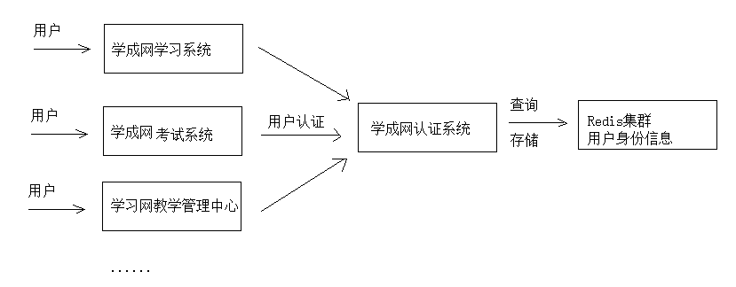
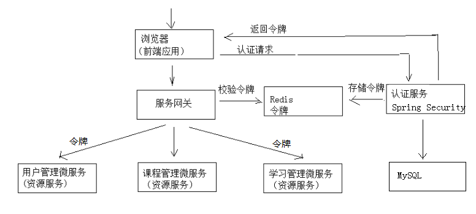

# 分布式系统

### ==1.什么是分布式？为什么要用分布式？什么是微服务架构？==

**1）什么是分布式？**

分布式就是将整个工程按照业务进行拆分为多个项目。每个项目部署在不同的节点上，部署在不同结点上的系统通过网络交互来完成协同工作的系统。

**SOA 面向服务的架构**（Service Oriented Architecture），也就是把工程按照业务逻辑拆分成**服务层、表现层**两个工程。服务层中包含业务逻辑，只需要对外提供服务即可。表现层只需要处理和页面的交互，业务逻辑都是调用服务层的服务来实现。SOA架构中有两个主要角色：**服务提供者（Provider）和服务使用者（Consumer）**。

**分布式或者说 SOA 分布式**重要的就是**面向服务**，说简单的分布式就是我们**把整个系统拆分成不同的服务然后将这些服务放在不同的服务器上减轻单体服务的压力提高并发量和性能**。

**2）为什么要用分布式？**

从开发角度来讲单体应用的代码都集中在一起，而分布式系统的代码根据业务被拆分。所以，每个团队可以负责一个服务的开发，这样**提升了开发效率**。另外，代码根据业务拆分之后**更加便于维护和扩展**。

将系统拆分成分布式之后不光**便于系统扩展和维护**，更能**提高整个系统的性能**。

**==3）什么是“微服务架构”呢？==**

简单的说，微服务架构就是将一个**完整的应用**从**数据存储**开始**垂直**拆分成多个不同的服务，每个服务都能**独立开发、独立部署、独立维护、独立扩展**，服务与服务间通过诸如**RESTful API**的方式互相调用。

==**4）微服务架构的优点和缺点**==

优点：

- **逻辑清晰**
- **简化部署**
- **可扩展**
- **灵活组合**
- **技术异构**
- **高可靠**

缺点：

- **复杂度高**
- **运维复杂**
- **影响性能**

### ==2.分布式系统一致性session如何实现==

将用户的 session+Token 信息保存到 **Redis 分布式缓存**当中。在鑫课堂项目中就用到了这种方法。

**1）session复制**

将 session 在多个系统之间复制，但是由于将session进行复制需要占用过多的内网带宽并且存储内容较多，让系统内存占用率过高。

**2）session前端存储**

将 session 保存到 cookie 中，但这种方式有安全性问题。

**3）session沾滞**

配置 nginx 让同一 ip 的请求只访问到同一台机器，但还是存在性能以及session存储在内存的问题。

**4）session后端集中存储**

使用 redis 来将 session 进行集中式存储，还可以持久化保存，当请求过多时也可以进行水平扩展。推荐使用。

**单点登录实现**

本项目包括多个子项目，如：学习系统，教学管理中心、系统管理中心等，为了提高用户体验性需要实现**用户只认证一次便可以在多个拥有访问权限的系统中访问**，这个功能叫做单点登录。

**单点登录（Single Sign On）**简称为 SSO，是目前比较流行的企业业务整合的解决方案之一。 SSO的定义是**在多个应用系统中，用户只需要登录一次就可以访问所有相互信任的应用系统**。

分布式系统要实现单点登录，通常将**认证系统**独立抽取出来，并且**将用户身份信息存储在单独的存储介质**，比如： MySQL、Redis，考虑性能要求，通常存储在Redis中，如下图：



单点登录的特点是：

1、认证系统为独立的系统。

2、各子系统通过Http或其它协议与认证系统通信，完成用户认证。

3、用户身份信息存储在Redis集群。

Java中有很多用户认证的框架都可以实现单点登录： 

1、Apache Shiro.

2、CAS 

3、Spring security CAS

本项目采用 Spring security + Oauth2 完成用户认证及用户授权，Spring security 是一个强大的和高度可定制的身份验证和访问控制框架，Spring security 框架集成了 Oauth2 协议，下图是项目认证架构图：



1、用户请求认证服务完成认证。 

2、认证服务下发用户身份令牌，拥有身份令牌表示身份合法。 

3、用户携带令牌请求资源服务，请求资源服务必先经过网关。 

4、网关校验用户身份令牌的合法，不合法表示用户没有登录，如果合法则放行继续访问。 

5、资源服务获取令牌，根据令牌完成授权。 

6、资源服务完成授权则响应资源信息。

本项目认证服务基于 **Spring Security Oauth2** 进行构建，并在其基础上作了一些扩展，采用**JWT令牌机制**，并自定义了用户身份信息的内容。

使用JWT的思路是，用户认证通过会得到一个JWT令牌，JWT令牌中已经包括了用户相关的信息，客户端只需要携带 JWT访问资源服务，资源服务根据事先约定的算法自行完成令牌校验，无需每次都请求认证服务完成授权。 

**JSON Web Token（JWT）**是一个开放的行业标准（RFC 7519），它定义了一种简介的、自包含的协议格式，用于 在通信双方传递json对象，传递的信息经过数字签名可以被验证和信任。

JWT可以使用**HMAC算法**或使用**RSA的公钥/私钥对**来签名，防止被篡改。

JWT令牌的优点：

1、jwt基于json，非常方便解析。 

2、可以在令牌中自定义丰富的内容，易扩展。 

3、通过非对称加密算法及数字签名技术，JWT防止篡改，安全性高。 

4、资源服务使用JWT可不依赖认证服务即可完成授权。

缺点： 

１、JWT令牌较长，占存储空间比较大。

### ==3.分布式事务实现方法？==

**1）两阶段提交协议(2PC)**

为解决分布式系统的数据一致性问题出现了**两阶段提交协议（2 Phase Commitment Protocol）**，两阶段提交由**协调者**和**参与者**组成，共经过**两个阶段**和**三个操作**，部分关系数据库如Oracle、MySQL支持两阶段提交协议，本节讲解关系数据库两阶段提交协议。

1）第一阶段：**准备阶段（prepare）**

协调者通知参与者准备提交订单，参与者开始投票。

协调者完成准备工作向协调者回应Yes。

2）第二阶段：**提交(commit)/回滚(rollback)阶段**

协调者根据参与者的投票结果发起最终的提交指令。

如果有参与者没有准备好则发起回滚指令。

一个下单减库存的例子：

1、应用程序连接两个数据源。 

2、应用程序通过事务协调器向两个库发起prepare，两个数据库收到消息分别执行本地事务（记录日志），但不提交，如果执行成功则回复yes，否则回复no。 

3、事务协调器收到回复，只要有一方回复no则分别向参与者发起回滚事务，参与者开始回滚事务。 

4、事务协调器收到回复，全部回复yes，此时向参与者发起提交事务。如果参与者有一方提交事务失败则由事务协调器发起回滚事务。

2PC的优点：实现强一致性，部分关系数据库支持（Oracle、MySQL等）。 

缺点：整个事务的执行需要由协调者在多个节点之间去协调，增加了事务的执行时间，性能低下。 

解决方案有：springboot+Atomikos or Bitronix

**2）事务补偿（TCC）**

TCC事务补偿是基于2PC实现的业务层事务控制方案，它是**Try、Confirm和Cancel**三个单词的首字母，含义如下： 

1、**Try 检查及预留业务资源**：完成提交事务前的检查，并预留好资源。 

2、**Confirm 确定执行业务操作**：对try阶段预留的资源正式执行。 

3、**Cancel 取消执行业务操作**：对try阶段预留的资源释放。

下边用一个下单减库存的业务为例来说明：

1、Try

下单业务由订单服务和库存服务协同完成，在try阶段订单服务和库存服务完成检查和预留资源。 

订单服务检查当前是否满足提交订单的条件（比如：当前存在未完成订单的不允许提交新订单）。 

库存服务检查当前是否有充足的库存，并锁定资源。 

2、Confirm 订单服务和库存服务成功完成Try后开始正式执行资源操作。 

订单服务向订单写一条订单信息。 

库存服务减去库存。 

3、Cancel 如果订单服务和库存服务有一方出现失败则全部取消操作。 

订单服务需要删除新增的订单信息。 

库存服务将减去的库存再还原。

优点：最终保证数据的一致性，在业务层实现事务控制，灵活性好。 

缺点：开发成本高，每个事务操作每个参与者都需要实现try/confirm/cancel三个接口。

注意：TCC的try/confirm/cancel接口都要实现幂等性，在为在try、confirm、cancel失败后要不断重试。 

什么是幂等性？ 幂等性是**指同一个操作无论请求多少次，其结果都相同。 **

幂等操作实现方式有： 

1、操作之前在业务方法进行判断如果执行过了就不再执行。 

2、缓存所有请求和处理的结果，已经处理的请求则直接返回结果。

3 、在数据库表中加一个状态字段（未处理，已处理），数据操作时判断未处理时再处理。

**3）消息队列实现最终一致**

本方案是**将分布式事务拆分成多个本地事务来完成，并且由消息队列异步协调完成**，如下图： 

下边以下单减少库存为例来说明：

1、订单服务和库存服务完成检查和预留资源。 

2、订单服务在本地事务中完成添加订单表记录和添加“减少库存任务消息”。 

3、由定时任务根据消息表的记录发送给MQ通知库存服务执行减库存操作。 

4、库存服务执行减少库存，并且记录执行消息状态（为避免重复执行消息，在执行减库存之前查询是否执行过此消息）。 

5、库存服务向MQ发送完成减少库存的消息。 

6、订单服务接收到完成库存减少的消息后删除原来添加的“减少库存任务消息”。 

实现最终事务一致要求：预留资源成功理论上要求正式执行成功，如果执行失败会进行重试，要求业务执行方法实现幂等。

优点 ： 

由MQ按异步的方式协调完成事务，性能较高。 

不用实现try/confirm/cancel接口，开发成本比TCC低。 

缺点： 

此方式基于关系数据库本地事务来实现，会出现频繁读写数据库记录，浪费数据库资源，另外对于高并发操作不是最佳方案。

### ==4.Spring Eureka注册中心实现原理？==

微服务架构中最核心的部分是**服务治理**，服务治理最基础的组件是**注册中心**。

注册中心是分布式开发的核心组件之一，而eureka是spring cloud推荐的注册中心实现。Eureka提供了完整的**Service Registry**和**Service Discovery**实现。


- **Eureka Server**：提供服务注册和发现，多个Eureka Server之间会同步数据，做到状态一致（最终一致性）
- **Service Provider**：服务提供方，将自身服务注册到Eureka，从而使服务消费方能够找到
- **Service Consumer**：服务消费方，从Eureka获取注册服务列表，从而能够消费服务

从 CAP 理论看，Eureka 是一个 AP 系统，优先保证可用性A 和 分区容错性P，不保证强一致性C，只保证最终一致性，因此在架构中设计了较多缓存。

eureka包含两个组件：eureka server 和 eureka client，它们的作用如下：

- eureka client 是一个 java 客户端，用于简化与 eureka server 的交互。
- eureka server提供服务发现的能力，各个微服务启动时，会通过 eureka client 向 eureka server进行注册自己的信息（例如网络信息），eureka server会存储该服务的信息。
- 微服务启动后，会周期性地向 eureka server发送**心跳**（默认周期为**30秒**）以续约自己的信息。如果eureka Server在一定时间内没有接收到某个微服务节点的心跳，eureka server将会注销该微服务节点（默认**90秒**）；
- 每个 eureka server 同时也是 eureka client，多个 eureka server 之间通过复制的方式完成服务注册表的同步。
- eureka client 会缓存 eureka server 中的信息。即使所有的 eureka server 节点都宕掉，服务消费者依然可以使用缓存中的信息找到服务提供者。

总的来说：

- Eureka Client：负责将这个服务的信息注册到Eureka Server中
- Eureka Server：注册中心，里面有一个注册表，保存了各个服务所在的机器和端口号

基于 Spring Cloud Eureka 注册中心进行远程调用的流程：[https://blog.csdn.net/yeyazhishang/article/details/84344402](https://blog.csdn.net/yeyazhishang/article/details/84344402)

### ==5.微服务故障恢复机制==

- **服务降级**：出现故障时执行服务降级策略来保证整体系统可用。
- **变更管理**：当对服务进行修改时……例如发布代码的新版本或者改变一些配置，则总会有可能引起故障或者引入新的错误。为了应对变更带来的问题，你可以实施变更策略管理并且实现其自动回滚。比如，当部署新的代码或者修改配置时，应该分步将这些变更部署到服务实例群中的部分实例中，并且进行监控，如果发现关键指标出现问题则能自动进行回滚。
- **健康检查和负载均衡**：持续从实例中收集健康信息，并且设置负载均衡的路由，让其只指向健康的实例组件。
- **自我修复**：通过外部系统监控实例的状态，当服务出现故障一段时间后则会重启服务。
- **故障转移缓存（Failover Caching）**：失效转移缓存通常使用两个不同的过期日期：其中更短的日期指示在正常情况下能使用缓存的时间，而更长的一个日期则指示在故障失效的时候，能使用缓存中的数据时长。
- **重试逻辑（Retry Logic）**：微服务系统重试可能会触发多个其他请求或重试操作，并导致级联效应。为减少重试带来的影响，你应该减少重试的数量，并使用指数退避算法（exponential backoff algorithm）来持续增加重试之间的延迟时间，直到达到最大限制。
- **限流器和负载开关（Rate Limiters and Load Shedders）**：限流是指在一段时间内，定义某个客户或应用可以接收或处理多少个请求的技术。使用负载开关可以确保对于关键的事务总能提供足够的资源保障，它为高优先级的请求保留一些资源，并且不允许低优先级的事务去占用这些资源。
- **快速且单独失效（Fail Fast and Independently）**：服务可以快速、单独地失效。为了在服务层面隔离故障，我们可以使用隔板模式（bulkhead pattern）。可以使用基于操作的成功/失败统计次数的熔断模式，而不是使用超时。
- **舱壁模式（Bulkheads）**：在工业领域中，常使用舱壁将划分为几个部分，以便在有某部分船体发生破裂时，其他部分依然能密封安然无恙。
- **断路器（Circuit Breakers）**：可以使用断路器来处理错误，而不是使用小型和特定基于事务的静态超时机制。断路器以现实世界的电子元件命名，因为它们的行为是都是相同的。你可以保护资源，并通过使用断路器协助它们进行恢。断路器在分布式系统中非常有用，因为重复的故障可能会导致雪球效应，并使整个系统崩溃。当在短时间内多次发生指定类型的错误，断路器会开启。开启的断路器可以拒绝接下来更多的请求 – 就像防止真实的电子流动一样。断路器通常在一定时间后关闭，以便为底层服务提供足够的空间来恢复。
- **故障测试（Testing for Failures）**：应该持续地测试系统的常见问题，以确保你的服务可各类故障环境下运行。你应经常测试故障，以让你的团队对可能发生的事故有所准备。

### ==6.分布式锁==

分布式锁可以使用 **zookeeper** 或者 **redis 自身提供的分布式锁**以及**Mysql 乐观锁**等。

redis 的分布式锁支持如下的特性：

- **互斥性**：在任意一个时刻，只有一个客户端持有锁。
- **无死锁**：即便持有锁的客户端崩溃或者其他意外事件，锁仍然可以被获取。
- **容错**：只要大部分Redis节点都活着，客户端就可以获取和释放锁

每次写之前都需要判读一下当前的这个 value 的**时间戳**是否比缓存里的 value 的时间戳更新，如果更新则可以写，如果更旧则不能用旧的数据覆盖新的数据。

Redis 分布式锁主要利用 Redis 的 **setnx** （如果不存在则更新）命令。

SETNX（**SET if Not eXist**）的使用方式为：**SETNX key value**，只在键key不存在的情况下，将键key的值设置为value，若键key存在，则SETNX不做任何动作。

SETNX在设置成功时返回，设置失败时返回0。当要获取锁时，直接使用SETNX获取锁，当要释放锁时，使用DEL命令删除掉对应的键key即可。

- 加锁命令：**SETNX key value**，当键不存在时，对键进行设置操作并返回成功，否则返回失败。KEY 是锁的唯一标识，一般按业务来决定命名。
- 解锁命令：**DEL key**，通过删除键值对释放锁，以便其他线程可以通过 SETNX 命令来获取锁。
- 锁超时：**EXPIRE key timeout**, 设置 key 的超时时间，以保证即使锁没有被显式释放，锁也可以在一定时间后自动释放，避免资源被永远锁住。

上面这种方案有一个致命问题，就是**某个线程在获取锁之后由于某些异常因素（比如宕机）而不能正常的执行解锁操作，那么这个锁就永远释放不掉了**。

为此，我们可以为这个锁加上一个**超时时间**，第一时间我们会联想到Redis的**EXPIRE**命令（EXPIRE key seconds）。

但是这里我们不能使用EXPIRE来实现分布式锁，因为它与SETNX一起是两个操作，在这两个操作之间可能会发生异常，从而还是达不到预期的结果，示例如下：

```java
// STEP 1
SETNX key value
// 若在这里（STEP1和STEP2之间）程序突然崩溃，则无法设置过期时间，将有可能无法释放锁
// STEP 2
EXPIRE key expireTime
```

对此，正确的姿势应该是使用 **“SET key value [EX seconds] [PX milliseconds] [NX|XX]”** 这个命令，也就是set key的时候就直接指定对应的超时时间。

修改之后的方案看上去很完美，但实际上还是会有问题。

试想一下，某线程A获取了锁并且设置了过期时间为10s，然后在执行业务逻辑的时候耗费了15s，此时线程A获取的锁早已被Redis的过期机制自动释放了。

在线程A获取锁并经过10s之后，该锁可能已经被其它线程获取到了。当线程A执行完业务逻辑准备解锁（DEL key）的时候，有可能删除掉的是其它线程已经获取到的锁。

所以最好的方式是**在解锁时判断锁是否是自己的**，我们可以在设置key的时候将**value**设置为一个**唯一值uniqueValue**（可以是随机值、UUID、或者机器号+线程号的组合、签名等）。

当解锁时，也就是**删除key**的时候**先判断一下key对应的value是否等于先前设置的值，如果相等才能删除key**，伪代码示例如下：

```java
if uniqueKey == GET(key) {
    DEL key
}
```

这里我们一眼就可以看出问题来：**GET和DEL是两个分开的操作，在GET执行之后且在DEL执行之前的间隙是可能会发生异常的**。

如果我们只要保证解锁的代码是**原子性**的就能解决问题了。

这里我们引入了一种新的方式，就是**Lua脚本**，示例如下：

```java
if redis.call("get",KEYS[1]) == ARGV[1] then
    return redis.call("del",KEYS[1])
else
    return 0
end
```

其中ARGV[1]表示设置key时指定的唯一值。

由于Lua脚本的**原子性**，在Redis执行该脚本的过程中，其他客户端的命令**都需要等待该Lua脚本执行完才能执行**。一个基于 lua 脚本的实现中间件就是**redisson**。

表面来看，这个方法似乎很管用，但是这里存在一个问题：**在我们的系统架构里存在一个单点故障，如果Redis的master节点宕机了怎么办呢？**

有人可能会说：加一个slave节点！在master宕机时用slave就行了！

但是其实这个方案明显是不可行的，因为Redis的复制是**异步**的。是为了保证 **AP** （可用性、分区容忍性）而忽略 C（一致性，只保证最终一致性）。

举例来说：

1. 线程A在master节点拿到了锁。
2. master节点在把A创建的key写入slave之前宕机了。
3. slave变成了master节点。
4. 线程B也得到了和A还持有的相同的锁。（因为原来的slave里面还没有A持有锁的信息）

当然，在某些场景下这个方案没有什么问题，比如业务模型允许同时持有锁的情况，那么使用这种方案也未尝不可。

举例说明，某个服务有2个服务实例A和B，初始情况下A获取了锁然后对资源进行操作（可以假设这个操作很耗费资源），B没有获取到锁而不执行任何操作，此时B可以看做是A的热备。

当A出现异常时，B可以“转正”，当锁出现异常时，比如Redis master宕机，那么B可能会同时持有锁并且对资源进行操作，如果操作的结果是幂等的（或者其它情况），那么也可以使用这种方案。

这里引入分布式锁可以让服务在正常情况下避免重复计算而造成资源的浪费。

为了应对这种情况，antriez提出了**Redlock算法**。

Redlock算法的主要思想是：**假设我们有N个Redis master节点，这些节点都是完全独立的，我们可以运用前面的方案来对前面单个的Redis master节点来获取锁和解锁**

如果我们总体上能**在合理的范围内获取N/2+1个锁，那么我们就可以认为成功获得了锁，反之则没有获取锁**（可类比Quorum模型）。

虽然Redlock的原理很好理解，但是其内部的实现细节很是复杂，要考虑很多因素

具体内容可以参考：[https://redis.io/topics/distlock](https://link.zhihu.com/?target=https%3A//redis.io/topics/distlock)。

Redlock算法也并非是“银弹”，他除了条件有点苛刻外，其算法本身也被质疑。

使用Redis分布式锁并不能做到万无一失。一般而言，Redis分布式锁的优势在于**性能**，而如果要考虑到**可靠性**，那么**Zookeeper**这类的组件会比Redis要高。因为 **Zookeeper**是保证**CP**（一致性、分区容忍性）忽略**A**（可用性），会等数据在集群中复制成功之后才返回。

当然，在合适的环境下使用基于数据库实现的分布式锁会更合适。

不过就以可靠性而言，没有任何组件是完全可靠的，程序员的价值不仅仅在于表象地如何灵活运用这些组件，而在于如何基于这些不可靠的组件构建一个可靠的系统。

还是那句老话，选择何种方案，合适最重要。

各种分布式锁实现方式的优缺点：

**Mysql**小结

- 适用场景: Mysql分布式锁一般适用于**资源存在数据库**，如果数据库存在比如订单，那么可以直接对这条数据加行锁，不需要我们上面多的繁琐的步骤，比如一个订单，那么我们可以用select * from order_table where id = 'xxx' for update进行加**行锁**，那么其他的事务就不能对其进行修改。
- 优点:理解起来简单，不需要维护额外的第三方中间件(比如Redis,Zk)。
- 缺点:虽然容易理解但是实现起来较为繁琐，需要自己考虑锁超时，加事务等等。性能局限于数据库，一般对比缓存来说性能较低。对于高并发的场景并不是很适合。

**ZK**小结

- 优点:ZK可以**不需要关心锁超时时间**，实现起来有现成的第三方包，比较方便，并且支持读写锁，ZK获取锁**会按照加锁的顺序**，所以其是公平锁。对于高可用利用ZK集群进行保证。
- 缺点:ZK需要**额外维护**，增加维护成本，性能和Mysql相差不大，依然比较差。并且需要开发人员了解ZK是什么。

**Redis**小结

- 优点:对于Redis实现简单，性能对比ZK和Mysql较好。如果不需要特别复杂的要求，那么自己就可以利用setNx进行实现，如果自己需要复杂的需求的话那么可以利用或者借鉴**Redission**。对于一些要求比较严格的场景来说的话可以使用**RedLock**。
- 缺点:需要维护Redis集群，如果要实现RedLock那么需要维护更多的集群。

### ==7.Spring Cloud Zuul介绍？为什么要使用Zuul？如何实现？==

**1）Zuul介绍**

[Zuul](https://github.com/Netflix/zuul) Netflix 开发的一款提供**动态路由、监控、弹性、安全**的**网关服务**。网关的作用相当于一个过虑器、拦截器，它可以拦截多个系统的请求。 

Spring Cloud Zuul 是整合 Netflix 公司的 Zuul 开源项目实现的微服务网关，它实现了**请求路由、负载均衡、校验过虑**等功能。 

服务网关是在微服务前边设置一道屏障，请求先到服务网关，网关会对请求进行**过滤、校验、路由**等处理。

有了服务网关可以提高微服务的**安全性**，网关校验请求的合法性，请求不合法将被拦截，拒绝访问。 

Zuul与Nginx怎么配合使用？ 

Zuul与Nginx在实际项目中需要配合使用，Nginx的作用是**反向代理、负载均衡**，Zuul的作用是**保障微服务的安全访问，拦截微服务请求，校验合法性及负载均衡**。

**2）为什么要使用Zuul？**

Zuul使用了一系列不同类型的过滤器，使我们能够快速灵活地将功能应用到服务中。这些过滤器帮助我们执行以下功能：

- **身份验证和安全性** ： 识别每个资源的身份验证需求，并拒绝不满足它们的请求
- **监控** ： 在边缘跟踪有意义的数据和统计数据，以便给我们一个准确的生产视图
- **动态路由** ： 动态路由请求到不同的后端集群
- **压力测试** ： 逐渐增加集群的流量，以评估性能
- **限流** ： 为每种请求类型分配容量，并丢弃超过限制的请求
- **静态响应处理** ： 直接在边缘构建一些响应，而不是将它们转发到内部集群

**3）Zuul是如何工作的？**

Zuul的核心业务逻辑是过滤器。它们能够执行非常大范围的操作，并且可以在请求-响应生命周期的不同阶段运行。如下图所示：


- **Inbound Filters** ： 路由到 Origin 之前执行，可以用于身份验证、路由和装饰请求
- **Endpoint Filters** ： 可用于返回静态响应，否则内置的ProxyEndpoint过滤器将请求路由到Origin
- **Outbound Filters** ： 从Origin那里获取响应后执行，可以用于度量、装饰用户的响应或添加自定义header

有两种类型的过滤器：sync 和 async。因为Zuul是运行在一个事件循环之上的，因此从来不要在过滤中阻塞。如果你非要阻塞，可以在一个异步过滤器中这样做，并且在一个单独的线程池上运行，否则可以使用同步过滤器。

过滤器是Zuul的核心功能。它们负责应用程序的业务逻辑，可以执行各种任务。

- **Type** ： 通常定义过滤器应用在哪个阶段
- **Async** ： 定义过滤器是同步还是异步
- **Execution Order** ： 执行顺序
- **Criteria** ： 过滤器执行的条件
- **Action** ： 如果条件满足，过滤器执行的动作

Zuul提供了一个动态读取、编译和运行这些过滤器的框架。过滤器之间不直接通信，而是通过每个请求特有的RequestContext共享状态。

Zuul网关具有代理的功能，根据请求的url转发到微服务。

### ==8.Spring Hystrix 介绍？如何实现熔断、降级？==

**1)Hystrix介绍**

 **hystrix**的出现即为解决**雪崩**效应，它通过四个方面的机制来解决这个问题

- **隔离**（线程池隔离和信号量隔离）：限制调用分布式服务的资源使用，某一个调用的服务出现问题不会影响其他服务调用。
- 优雅的**降级**机制：超时降级、资源不足时(线程或信号量)降级，降级后可以配合降级接口返回托底数据。
- **熔断**：当失败率达到阀值自动触发降级(如因网络故障/超时造成的失败率高)，熔断器触发的快速失败会进行快速恢复。
- **缓存**：提供了请求缓存、请求合并实现。
- 支持实时监控、报警、控制

**2）Hystrix-隔离**


Hystrix的隔离主要是为每个依赖组件提供一个隔离的线程环境，提供两种模式的隔离：

- **线程池隔离模式**：使用一个线程池来存储当前的请求，线程池对请求作处理，设置任务返回处理超时时间，堆积的请求堆积入线程池队列。这种方式需要为每个依赖的服务申请线程池，有一定的资源消耗，好处是可以应对突发流量（流量洪峰来临时，处理不完可将数据存储到线程池队里慢慢处理）
- **信号量隔离模式**：使用一个原子计数器（或信号量）来记录当前有多少个线程在运行，请求来先判断计数器的数值，若超过设置的最大线程个数则丢弃改类型的新请求，若不超过则执行计数操作请求来计数器+1，请求返回计数器-1。这种方式是严格的控制线程且立即返回模式，无法应对突发流量（流量洪峰来临时，处理的线程超过数量，其他的请求会直接返回，不继续去请求依赖的服务）

|          |        线程池隔离        |             信号量隔离 |
| -------- | :----------------------: | ---------------------: |
| 线程     |   与调用线程不相同线程   |         与调用线程相同 |
| 开销     | 排队、调度、上下文开销等 |     无线程切换，开销低 |
| 异步     |           支持           |                 不支持 |
| 并发支持 |  支持（最大线程池大小）  | 支持（最大信号量上限） |

**3)Hystrix-熔断器**


Hystrix的熔断器其实可以理解为就是一个**统计中心，统计一定时间窗口内访问次数，成功次数，失败次数等数值**判定是否发生**熔断**。发生电路熔断的过程如下：

- 假设电路上的音量达到一定阈值（HystrixCommandProperties.circuitBreakerRequestVolumeThreshold）
- 并假设错误百分比超过阈值错误百分比（HystrixCommandProperties.circuitBreakerErrorThresholdPercentage）
- 然后断路器从CLOSED转换到OPEN。
- 它是开放的，它使所有针对该断路器的请求短路。
- 经过一段时间（HystrixCommandProperties.circuitBreakerSleepWindowInMilliseconds），下一个单个请求是通过（这是HALF-OPEN状态）。 如果请求失败，断路器将在睡眠窗口持续时间内返回到OPEN状态。 如果请求成功，断路器将转换到CLOSED，逻辑1.重新接管。

**4)Hystrix工作流程**


1. 构建一个HystrixCommand或者HystrixObservableCommand 对象。
2. 执行Command
3. 响应是否有缓存？如果为该命令启用请求缓存，并且如果缓存中对该请求的响应可用，则此缓存响应将立即以“可观察”的形式返回。
4. 熔断器是否打开？如果电路打开（或“跳闸”），则Hystrix将不会执行该命令，但会将流程路由到（8）获取回退。如果电路关闭，则流程进行到（5）以检查是否有可用于运行命令的容量。
5. 线程池/队列/信号量是否已经满负载？如果与命令相关联的线程池和队列（或信号量，如果不在线程中运行）已满，则Hystrix将不会执行该命令，但将立即将流程路由到（8）获取回退。
6. 执行真正的命令部分，HystrixObservableCommand.construct() 或者 HystrixCommand.run()，在这里Hystrix通过您为此目的编写的方法调用对依赖关系的请求。如果run或construct方法超出了命令的超时值，则该线程将抛出一个TimeoutException, 在这种情况下，Hystrix将响应通过8进行路由。获取Fallback，如果该方法不取消/中断，它会丢弃最终返回值run（）或construct（）方法。
7. 计算Circuit 的健康，Hystrix向断路器报告成功，失败，拒绝和超时，该断路器维护了一系列的计算统计数据组。它使用这些统计信息来确定电路何时“跳闸”，此时短路任何后续请求直到恢复时间过去，在首次检查某些健康检查之后，它再次关闭电路。
8. 获取Fallback，当命令执行失败时，Hystrix试图恢复到你的回退：当construct或run抛出异常时[6]，当命令由于电路断开而短路时[4]，当命令的线程池和队列或信号量处于容量[5]，或者当命令超过其超时长度时[6]。
9. 返回成功的响应，如果 Hystrix command成功，如果Hystrix命令成功，它将以Observable的形式返回对呼叫者的响应或响应。

### ==9.SpringCloud之链路追踪 Sleuth==

**链路追踪**就是**指一次任务的开始到结束，期间调用的所有系统及耗时（时间跨度）都可以完整记录下来。**

**Spring Cloud Sleuth**就是 Spring Cloud 推出的分布式跟踪解决方案，并兼容支持了 zipkin （Twitter推出的分布式链路跟踪系统）和其他基于日志的追踪系统，例如ELK。通过Spring Cloud Sleuth，可以实现链路追踪，性能分析，优化链路等功能。

 基本工作单位，一次单独的调用链可以称为一个 `Span`。`Span` 通过一个 `64` 位的 `spanId` 作为 **唯一标识**。

 一系列 `Span` 组成的树状结构，一个 `Trace` 认为是一次完整的链路，内部包含 n 多个 `Span`。`Trace` 和 `Span` 存在一对多的关系，`Span` 与 `Span` 之间存在父子关系。

一个 `Annotation` 可以理解成 `Span` 生命周期中 **重要时刻** 的 **数据快照**，比如一个 `Annotation` 中一般包含 **发生时刻**（`timestamp`）、**事件类型**（`value`）、**端点**（`endpoint`）等信息。其中 `Annotation` 的 **事件类型** 包含以下四类：

- **cs - Client Sent**

**客户端** 发起一个请求，这个 `Annotion` 描述了这个 `Span` 的开始。

- **sr - Server Received**

**服务端** 获得请求并 **准备开始** 处理它，如果将 `sr` 减去 `cs` 的 **时间戳** 便可得到 **网络延迟**。

- **ss - Server Sent**

**服务端** 完成请求处理，如果将 `ss` 减去 `sr` 的 **时间戳**，便可得到 **服务端** 处理请求消耗的时间。

- **cr - Client Received**

**客户端** 成功接收到 **服务端** 的响应，如果将 `cr` 减去 `cs` 的 **时间戳**，便可得到 **整个请求** 所消耗的 **总时间**。

**实现原理**

如果想知道一个接口在哪个环节出现了问题，就必须清楚该接口调用了哪些服务，以及调用的顺序，如果把这些服务串起来，看起来就像链条一样，我们称其为调用链。


想要实现调用链，就要为每次调用做个标识，然后将服务按标识大小排列，可以更清晰地看出调用顺序，我们暂且将该标识命名为 spanid。


实际场景中，我们需要知道某次请求调用的情况，所以只有 spanid 还不够，得为每次请求做个唯一标识，这样才能根据标识查出本次请求调用的所有服务，而这个标识我们命名为 traceid。


现在根据 spanid 可以轻易地知道被调用服务的先后顺序，但无法体现调用的层级关系，正如下图所示，多个服务可能是逐级调用的链条，也可能是同时被同一个服务调用。


所以应该每次都记录下是谁调用的，我们用 parentid 作为这个标识的名字。


到现在，已经知道调用顺序和层级关系了，但是接口出现问题后，还是不能找到出问题的环节，如果某个服务有问题，那个被调用执行的服务一定耗时很长，要想计算出耗时，上述的三个标识还不够，还需要加上时间戳，时间戳可以更精细一点，精确到微秒级。


只记录发起调用时的时间戳还算不出耗时，要记录下服务返回时的时间戳，有始有终才能算出时间差，既然返回的也记了，就把上述的三个标识都记一下吧，不然区分不出是谁的时间戳。


虽然能计算出从服务调用到服务返回的总耗时，但是这个时间包含了服务的执行时间和网络延迟，有时候我们需要区分出这两类时间以方便做针对性优化。那如何计算网络延迟呢？我们可以把调用和返回的过程分为以下四个事件。

- Client Sent 简称 cs，客户端发起调用请求到服务端。

- Server Received 简称 sr，指服务端接收到了客户端的调用请求。

- Server Sent 简称 ss，指服务端完成了处理，准备将信息返给客户端。

- Client Received 简称 cr，指客户端接收到了服务端的返回信息。


假如在这四个事件发生时记录下时间戳，就可以轻松计算出耗时，比如 sr 减去 cs 就是调用时的网络延迟，ss 减去 sr 就是服务执行时间，cr 减去 ss 就是服务响应的延迟，cr 减 cs 就是整个服务调用执行的时间。

